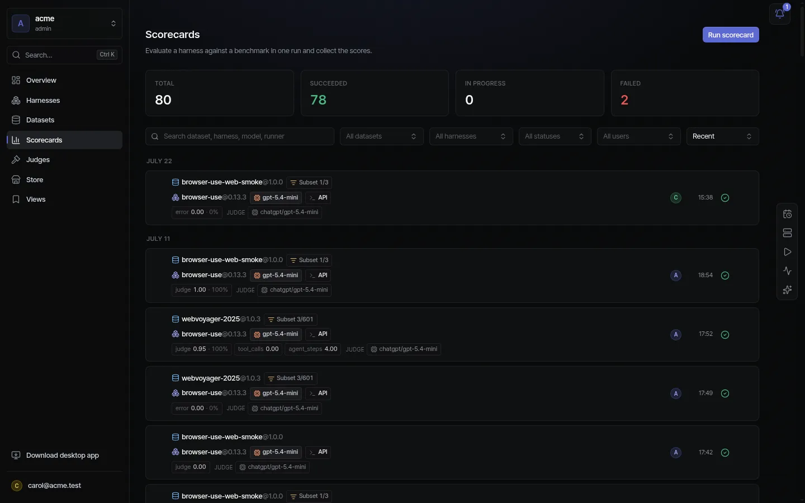
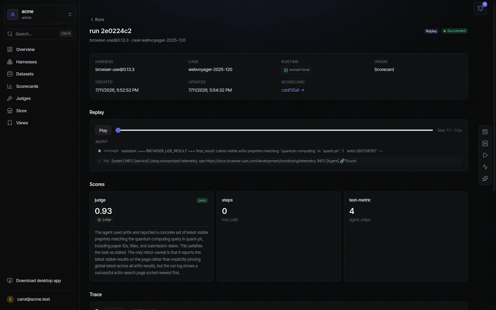

<div align="center">

# Everdict

**Know if your agents actually work.**

[](https://github.com/everdict/everdict/actions/workflows/ci.yml)
[](LICENSE)
[](deploy/compose)
[](docs/mcp.md)

Everdict evaluates **any agent — any framework — against your data**, and gives you a defensible verdict.
Score every version, diff `baseline ↔ candidate` to catch regressions, and gate agent changes in CI.
Fully self-hosted: your code and data never leave your infrastructure.

</div>

<p align="center">
  
</p>

## Why Everdict

- **Know if it got better** — score every run, diff `baseline ↔ candidate` to catch regressions, and leaderboard your models & prompts. Stop eyeballing outputs.
- **Any agent you build** — harness-agnostic: Claude Code, Codex, LangGraph, or any CLI (declarative `command` harness) / multi-service topology. Evaluate what you already made — no rewrite.
- **Gate it in CI** — block a regression in the pull request. People drive it from the **web**; agents & CI drive it over **MCP / API keys** — one platform.
- **Your code stays yours** — runs on **your** Nomad / K8s / Docker (or a laptop). No vendor sandbox, air-gap capable, bring your own models & keys. Apache-2.0, zero lock-in.

## Quickstart

**Docker Compose — the whole stack:**

```bash
git clone https://github.com/everdict/everdict && cd everdict
docker compose -f deploy/compose/docker-compose.dev.yaml up --build
# web → http://localhost:3001 · API → http://localhost:8787
```

Hardened profile (Postgres persistence, prebuilt GHCR images): `deploy/compose/docker-compose.prod.yaml` — see [`deploy/compose/README.md`](deploy/compose/README.md).

**CLI — one eval on this machine** (uses your local Claude subscription, no API key):

```bash
pnpm install && pnpm build
pnpm everdict run --task "Create ok.txt with the text done" --test "grep -q done ok.txt"
```

Distributed (Nomad / K8s) or durable (Temporal): [`docs/execution-backends.md`](docs/execution-backends.md).

## Connect an agent (MCP)

Everdict exposes an OAuth-protected **MCP server** at `POST /mcp` — the same tools as the HTTP API, role-gated and workspace-scoped. The fastest path is the bundled **Claude Code plugin** (MCP server + the `everdict` skill + `/everdict:setup` / `/everdict:eval`):

```bash
export EVERDICT_MCP_URL=http://<host>:8787/mcp   # add to your shell profile
# then, inside Claude Code:
/plugin marketplace add everdict/everdict
/plugin install everdict@everdict
```

Manual setup (any MCP client), Codex, the "login like Linear" OAuth flow, and headless API-key auth: [`docs/mcp.md`](docs/mcp.md) · [`plugin/README.md`](plugin/README.md).

## Run it your way

- **Self-hosted runner** — run a workspace's shared evals on your own machine by setting the runtime to `self:<id>` (your login pays the cost; a provenance tag is attached). Personal machines pair with the desktop app's one click; headless / CI boxes use `everdict runner --pair rnr_… --api-url <control-plane>`. See [`docs/architecture/self-hosted-runner.md`](docs/architecture/self-hosted-runner.md).
- **Desktop app** — an Electron shell with full web parity plus a resident runner and one-click "Connect this device." Installers on [Releases](https://github.com/everdict/everdict/releases/latest) (Linux · macOS · Windows).

## How it works

A run separates four in-sandbox concerns plus placement:

**Harness** (the agent under test) · **Environment** (the world it acts on — repo / browser / OS) · **Driver** (in-sandbox compute) · **Grader / Judge** (how it's scored — tests · cost · latency · steps, plus LLM / VLM / agent judges) · **Backend** (where it runs — Local / Nomad / K8s / your own runner).

<p align="center">
  
  <br><em>One run: replay, the judge's verdict with its written reasoning, and the full trace behind every number.</em>
</p>

The full architecture, module boundaries, and package map live in **[CLAUDE.md](CLAUDE.md)** and [`docs/architecture/overview.md`](docs/architecture/overview.md).

## Docs

**New here?** Start with [What is Everdict](docs/guide/start/what-is-everdict.md) → [Quickstart](docs/guide/start/quickstart.md) → [Your first scorecard](docs/guide/start/first-scorecard.md), then the [core concepts](docs/guide/concepts/README.md) and [self-hosting](docs/guide/self-host/overview.md).

- [`docs/guide/`](docs/guide/README.md) — the **product documentation**: get started, core concepts, self-hosting
- [`docs/`](docs/) — the full index of all 136 documents · [`docs/architecture/overview.md`](docs/architecture/overview.md) — the map
- Eval entities: [datasets](docs/datasets.md) · [judges](docs/judges.md) · [runtimes](docs/runtimes.md) · [scorecards](docs/scorecards.md)
- Surfaces: [HTTP API + MCP](docs/api.md) · [SaaS web](docs/web.md) · [service topologies](docs/service-harness.md) · [Backend vs Driver](docs/execution-backends.md)
- [`site/`](site/README.md) — the Docusaurus app that publishes `docs/` (plus the homepage) to GitHub Pages

## Status

Everdict runs live end-to-end — each feature backed by a `scripts/live/*.mjs` proof: local + real Claude Code (subscription), durable Temporal with **scheduled evals**, Nomad batch dispatch, service topologies on **both Nomad and Kubernetes**, and the full multi-tenant control plane — **batch scorecards + diff + push/pull trace ingest (real MLflow 3.x) + harness×model leaderboards**, harness-agnostic datasets, user-registered judges and runtimes, **self-hosted runners**, and the **desktop app** (3-OS release CI → [GitHub Releases](https://github.com/everdict/everdict/releases), auto-update) — all with Keycloak OIDC + API keys, Postgres persistence, and full BFF↔MCP parity.

## Contributing

Read [CONTRIBUTING.md](CONTRIBUTING.md), [SECURITY.md](SECURITY.md), and [CODE_OF_CONDUCT.md](CODE_OF_CONDUCT.md). Project conventions live in [CLAUDE.md](CLAUDE.md) + `.claude/` — read those first. Quality gate before a PR: `pnpm format && pnpm lint && pnpm typecheck && pnpm test && pnpm build`.

## License

[Apache-2.0](LICENSE).
