# Module collaboration diagrams

How the `packages/*` and `apps/*` modules cooperate — first at low zoom (the whole mesh),
then at high zoom (one diagram per module). Companion to
[`overview.md`](overview.md) (the narrative map). Diagrams are Mermaid; GitHub renders them inline.

## How to read these

- **Arrow = "uses / depends on / calls"**, pointing from the consumer to the provider — the same
  direction as the `import`. Reverse imports are bugs (one-way dependency rule).
- `<<interface>>` = a contract from `@assay/core` (the dependency root). Concrete classes live in
  outer packages and **realize** those contracts (`..|>`).
- Two cooperating planes share the same `(job) → CaseResult` seam:
  - **in-sandbox eval loop** — `runCase` drives Driver · Environment · Harness · Grader.
  - **placement / control plane** — Backend · Scheduler · Orchestrator · the HTTP/MCP surface dispatch
    that loop to isolated infra and persist the result.
- The pivotal data contracts that flow between *every* module: `AgentJob` (in) and `CaseResult` (out),
  with `TraceEvent[]` as the normalized currency every metric is derived from.

---

# Part 1 — Bird's-eye (low zoom)

## 1.1 The dependency spine (static, one-way)

Every module depends only inward. `core` is contracts only; the product is the *pluggable adapters*
hanging off it (many Drivers / Harnesses / Graders / Backends / Registries).

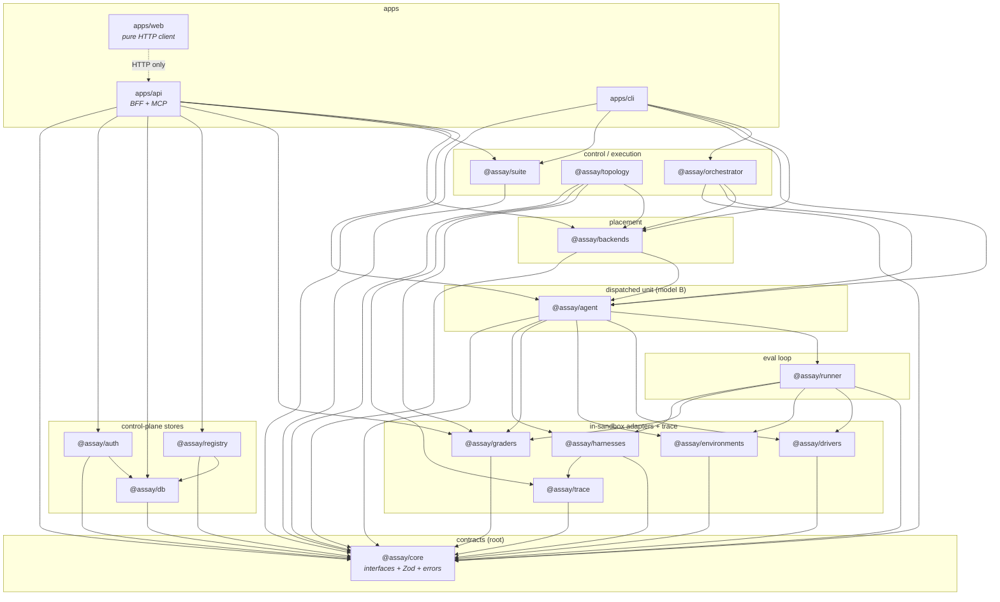

## 1.2 The eval loop (runtime collaboration, end-to-end)

The single most important sequence: one `AgentJob` → one `CaseResult`. Same loop whether dispatched
locally, to Nomad/K8s, or durably via Temporal — only the *placement* layer changes.

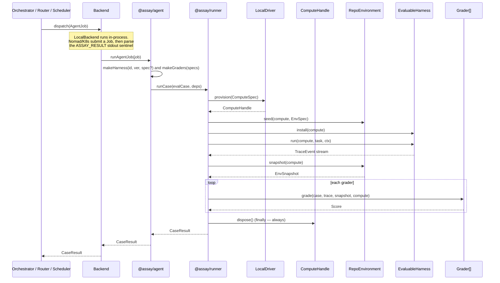

## 1.3 The control plane (multi-tenant request → result)

How `apps/api` turns "run one case / one batch" into a tenant-scoped, budgeted, isolated dispatch.
Humans reach it through `apps/web` (Keycloak token courier); agents through API keys / MCP.

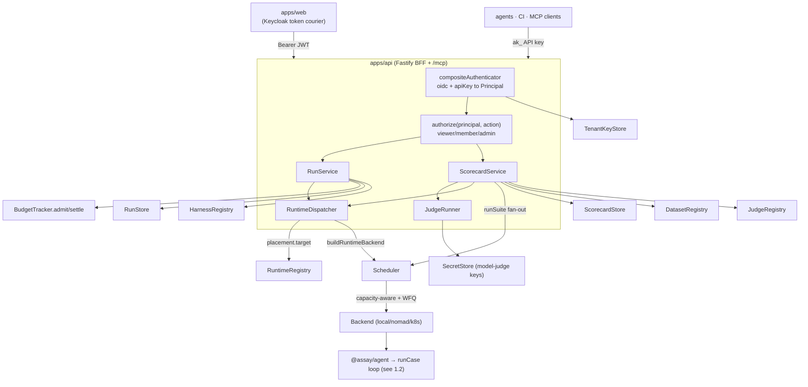

---

# Part 2 — High zoom (per-module)

Ordered inside-out along the spine. Each section: **role**, a structure/collaboration diagram, and the
in/out edges that matter.

---

## `@assay/core` — contracts (the dependency root)

**Role.** Interfaces + Zod schemas + the `AppError` hierarchy. No I/O, no SDKs. Every other module
realizes or consumes these. Schema is the source of truth; types are `z.infer`.

```mermaid
classDiagram
  class Driver {
    <<interface>>
    +provision(ComputeSpec) ComputeHandle
  }
  class ComputeHandle {
    <<interface>>
    +exec(cmd, opts) ExecResult
    +writeFile(path, data)
    +readFile(path)
    +dispose()
  }
  class Environment {
    <<interface>>
    +seed(compute, EnvSpec)
    +snapshot(compute) EnvSnapshot
  }
  class EvaluableHarness {
    <<interface>>
    +install(compute)
    +run(compute, task, ctx) TraceEvents
  }
  class Grader {
    <<interface>>
    +grade(GradeContext) Score
  }
  class Backend {
    <<interface>>
    +capacity() BackendCapacity
    +dispatch(AgentJob) CaseResult
  }
  class Dispatcher {
    <<interface>>
    +dispatch(AgentJob) CaseResult
  }
  class AgentJob {
    +evalCase
    +harness
    +harnessSpec
    +tenant
    +meterUsage
  }
  class EvalCase {
    +id
    +env
    +task
    +graders
    +placement
  }
  class CaseResult {
    +caseId
    +harness
    +trace
    +snapshot
    +scores
  }
  class TraceEvent {
    +t
    +kind
  }
  class HarnessSpec {
    +kind
  }
  Driver ..> ComputeHandle
  Environment ..> ComputeHandle
  EvaluableHarness ..> ComputeHandle
  EvaluableHarness ..> TraceEvent
  Grader ..> TraceEvent
  AgentJob *-- EvalCase
  AgentJob *-- HarnessSpec
  CaseResult *-- TraceEvent
  note for TraceEvent "kind = message · llm_call · tool_call · tool_result · env_action · error"
  note for HarnessSpec "kind = process · service · command"
```

- **Consumed by:** literally every module. `usageFromTrace(trace) → RunUsageSummary` and
  `assertHardenedIsolation(zone)` are the only behavior here; the rest is types + schemas.
- **Other contracts:** `Suite`, `Dataset`, `JudgeSpec`, `RuntimeSpec`, `Score`, `Cost`, `EnvSpec`/`EnvSnapshot`
  (repo · browser discriminated unions), `Placement`, `TrustZone`.

---

## `@assay/drivers` — in-sandbox compute

**Role.** `LocalDriver` realizes `Driver`: a `ComputeHandle` backed by a tmp dir + `child_process`.
Used by the agent *inside* an already-isolated job (isolation is the Backend's job, not the Driver's).

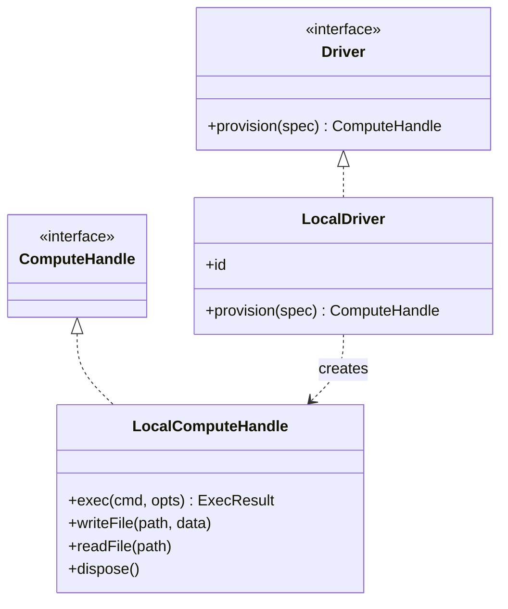

- **`provision`** → `mkdtemp(/tmp/assay-…)` → `LocalComputeHandle(root)`.
- **`exec`** runs via `child_process` (non-zero exit ≠ throw); **`dispose`** = `rm -rf root`.
- **Called by:** `@assay/runner` (`runCase`) and therefore `@assay/agent`.

---

## `@assay/environments` — the world acted on

**Role.** `RepoEnvironment` realizes `Environment<RepoSnapshot>`: seed a repo, capture the git diff.

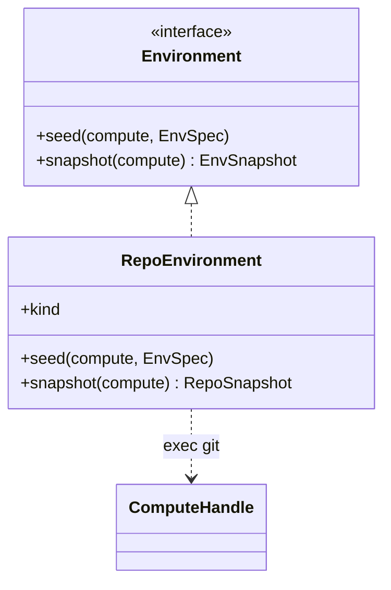

- **`seed`** — inline `files` map (`git init` + commit a baseline) **or** `git clone --depth 1` + `checkout ref` + run `setup[]`.
- **`snapshot`** — `git add -A` → `git diff --cached HEAD` (+ `--name-only`, + `rev-parse HEAD`) → `RepoSnapshot{diff, changedFiles, headSha}`.
- **Called by:** `@assay/runner`; instantiated by `@assay/agent`. Browser/os-use add a new `Environment` variant, no core rewrite.

---

## `@assay/trace` — trace ingestion + usage metering

**Role.** Pull a service harness's native trace from OTel/MLflow and normalize to `TraceEvent[]`; plus a
**usage-proxy** sidecar that recovers token usage from black-box harnesses.

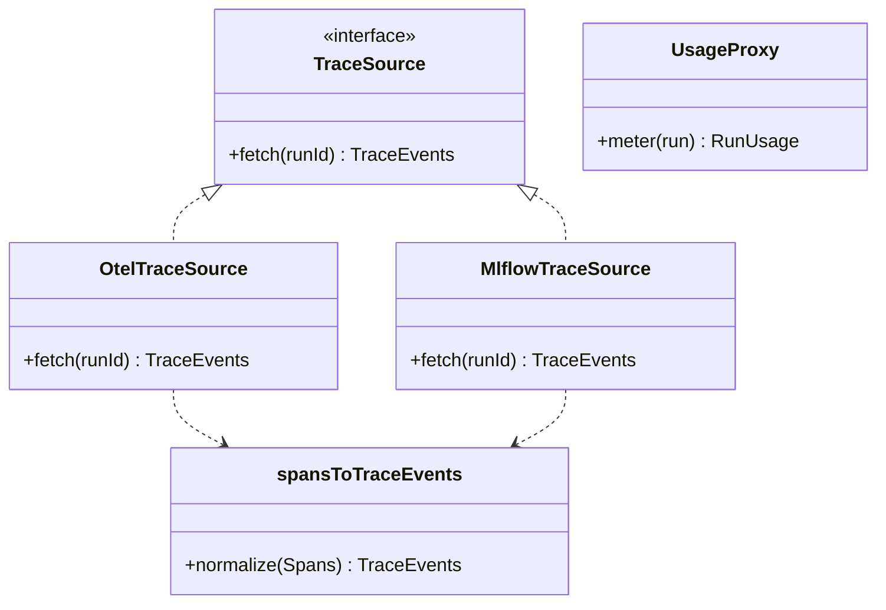

- **`spansToTraceEvents`** maps spans → `llm_call`/`tool_call`/`tool_result`/`message` using OTel GenAI
  conventions (`gen_ai.usage.*`, cost, latency). MLflow source degrades to `[]` on 404 (graders see 0 events).
- **usage-proxy** (`startUsageProxy`, `extractUsage`, `costFromHeaders`, `inMemoryUsageTally`): a reverse
  proxy in front of a BYO model gateway; reads `usage` from the response + `x-litellm-response-cost`, keyed
  by an `x-assay-run` header → per-run `RunUsage`.
- **Consumed by:** `@assay/harnesses` (`CommandHarness` for trace pull + metering) and `@assay/topology`
  (`ServiceTopologyBackend` for trace pull). See `docs/usage-metering.md`, `docs/service-harness.md`.

---

## `@assay/harnesses` — the agent under test

**Role.** Realize `EvaluableHarness` over a process boundary. Three adapters; the declarative
`CommandHarness` brings *any* CLI agent with no code.

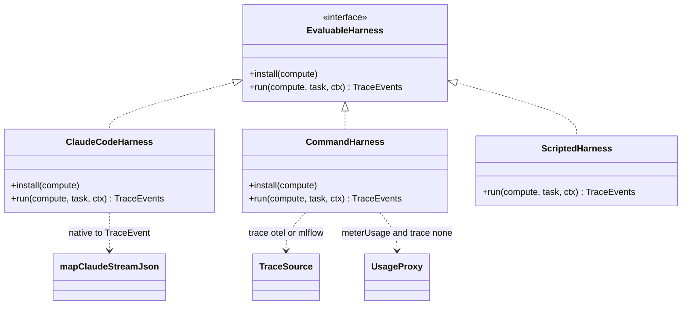

- **ClaudeCodeHarness** — runs `claude -p … --output-format stream-json`; `mapClaudeStreamJson` normalizes
  each line; cost captured from the final `result.total_cost_usd`.
- **CommandHarness** — interprets a `CommandHarnessSpec`: `setup[]` (install) → `command` template
  (`{{task}}`/`{{model}}`/`{{run_id}}`) → trace extraction (`none` · `otel` · `mlflow` via `@assay/trace`).
  When `meterUsage` and `trace.kind="none"`, it spins a usage-proxy and emits a synthetic `llm_call`
  carrying the recovered tokens/USD.
- **ScriptedHarness** — deterministic steps; lets the whole eval loop run with no LLM/key.
- **Selected by:** `@assay/agent`'s `makeHarness(id, version, spec?)`.

---

## `@assay/graders` — scoring (fully separate from the harness)

**Role.** Realize `Grader`. The same grader scores every harness identically → fair cross-harness/version
comparison. Includes the Agent Judge family. Edge labels show *what each grader reads* from `GradeContext`.

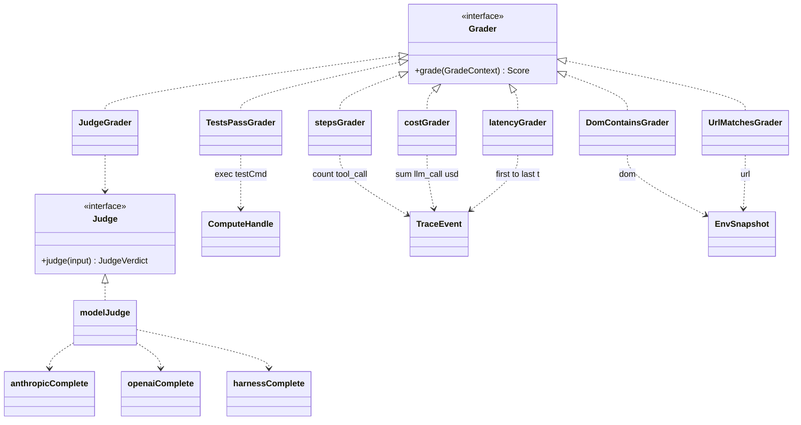

- **`GradeContext`** = `{case, trace, snapshot, compute?, baseline?}`. Each grader reads only what it needs.
- **`makeGraders(GraderSpec[]) → Grader[]`** switches on `spec.id` (`tests-pass`/`steps`/`cost`/`latency`/`dom-contains`/`url-matches`).
- **Agent Judge** — `JudgeGrader` delegates to a `Judge`; `modelJudge(JudgeCompletion)` builds the prompt +
  parses the verdict, over a pluggable transport: `anthropicComplete` / `openaiComplete` (→LiteLLM) /
  `harnessComplete` (dispatch an agent, verdict via `traceToText`). See `docs/judges.md`.

---

## `@assay/runner` — the eval loop

**Role.** `runCase(evalCase, deps) → CaseResult`. The orchestration of the four in-sandbox concerns, with
guaranteed `compute.dispose()` in `finally`. No placement, no tenancy.

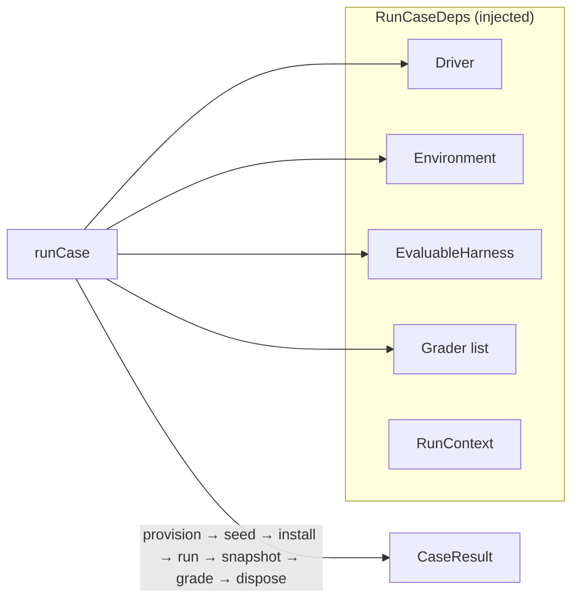

- **Imports** the `@assay/core` interfaces plus the concrete adapter *types*; the *instances* are injected
  by the caller (`@assay/agent`). This keeps the runner adapter-agnostic.
- **Becomes** a Temporal activity unchanged later (pure async, no shared state).

---

## `@assay/agent` — the dispatched unit (model B)

**Role.** `runAgentJob(AgentJob) → CaseResult`: assemble concrete adapters from the job, run `runCase`,
emit the result behind the `ASSAY_RESULT` stdout sentinel.

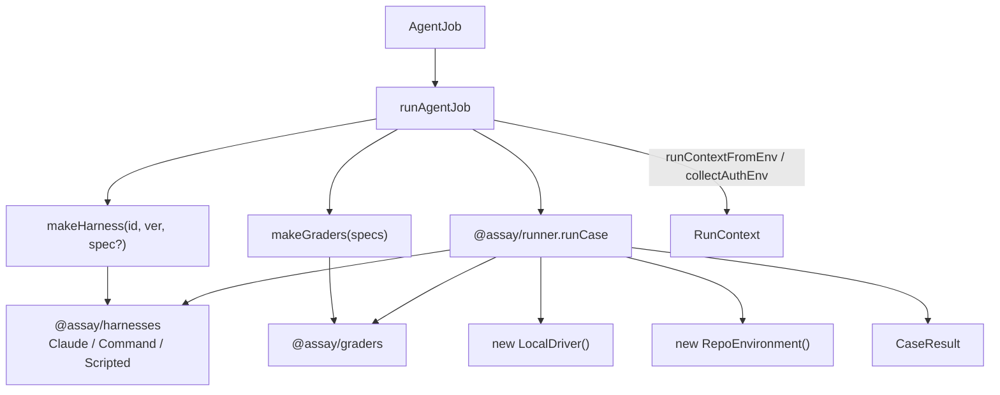

- **Registry:** `makeHarness` returns `CommandHarness` when an embedded `harnessSpec.kind==="command"`,
  else branches on built-in `id` (`claude-code`/`scripted`). `meterUsage` flows from `job.meterUsage`
  (control-plane policy) with an `ASSAY_METER_USAGE` env dev-fallback.
- **Auth env:** `collectAuthEnv` / `hasClaudeAuth` gather the machine's existing `claude` login (no API key
  for `LocalDriver`); `RESULT_SENTINEL` is the contract every non-local Backend parses.
- **Called by:** `LocalBackend` (in-process) and the Nomad/K8s images (as the job entrypoint).

---

## `@assay/backends` — placement

**Role.** Dispatch the agent job to an execution target and return `CaseResult`. Backends *never run the
harness themselves* (except `LocalBackend`, in-process) — they submit a Job and parse the sentinel.
Plus the SaaS placement machinery: scheduling, fairness, trust zones, budgets, autoscaling.

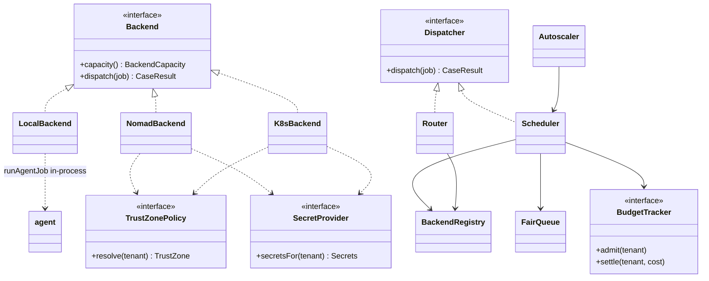

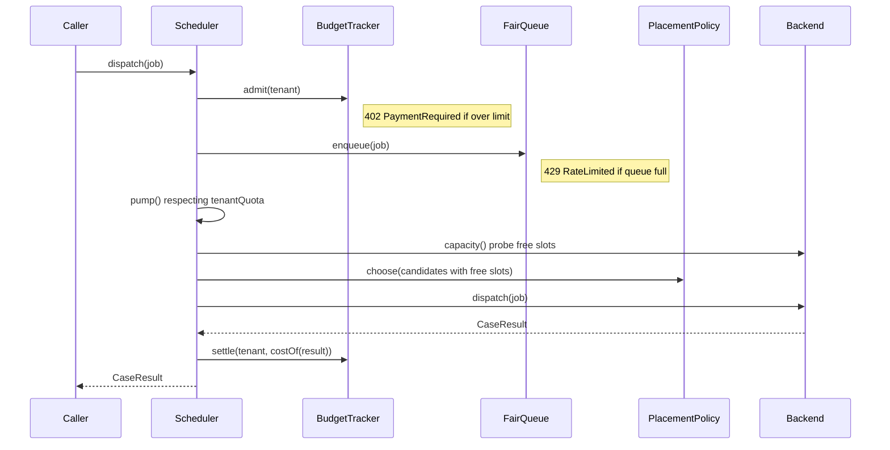

- **Scheduler** = capacity-aware + tenant-fair (`FairQueue` WFQ) `Dispatcher`; `RateLimitError` (429) on
  backpressure, `PaymentRequiredError` (402) on budget. **Router** = the simple static `placement.target` `Dispatcher`.
- **Trust zones** — `perTenantTrustZones`/`staticTrustZones` → `TrustZone`; `assertHardenedIsolation` is
  enforced inside `NomadBackend`/`K8sBackend` so untrusted tenants cannot run on a shared kernel; warm
  pools are keyed by zone and never shared across tenants.
- **`buildRuntimeBackend(RuntimeSpec, {secretEnv})`** turns a tenant-registered runtime into a live Backend
  (credentials injected via `secretEnv`, never in the spec). `buildRegistry(BackendsConfig)` builds the static set.
- **Calls:** `@assay/agent` (`LocalBackend`). **Called by:** `@assay/orchestrator`, `apps/api`, `apps/cli`.

---

## `@assay/orchestrator` — durable control plane (Temporal)

**Role.** `Orchestrator.run(job)` abstracts direct vs durable execution. The worker holds the `Dispatcher`
(usually the capacity-aware `Scheduler`) and runs the `dispatchCase` activity.

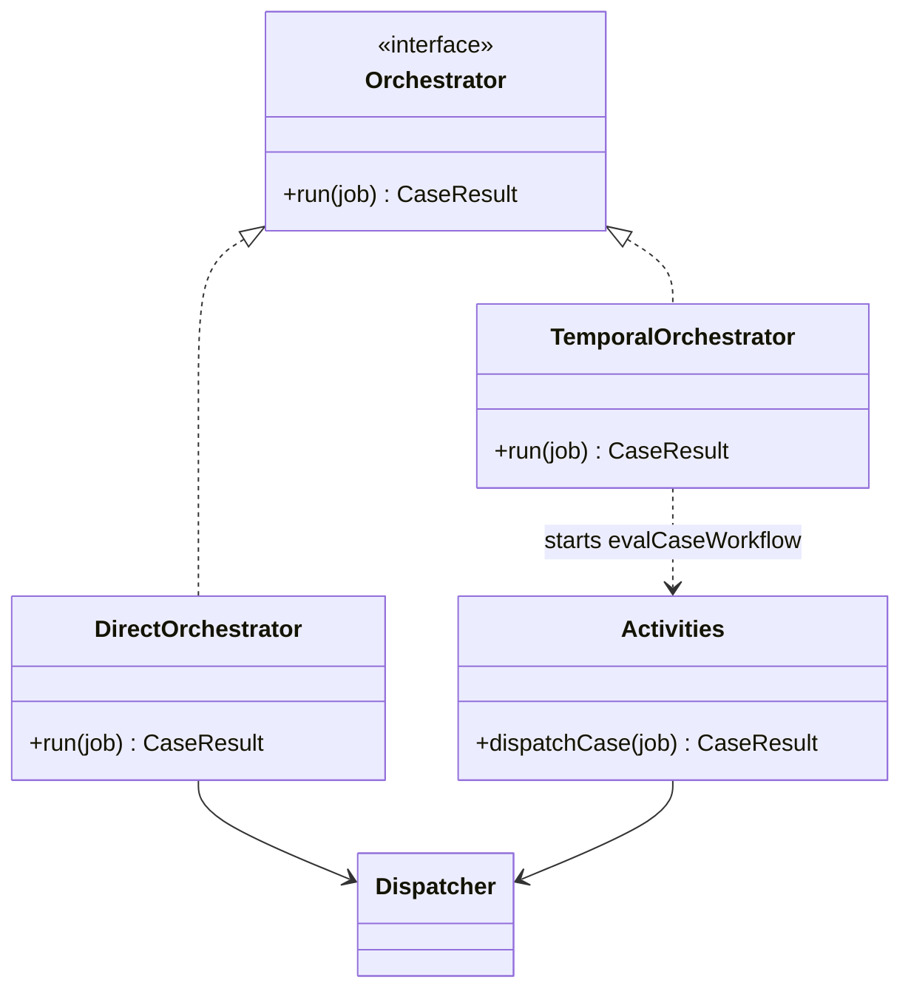

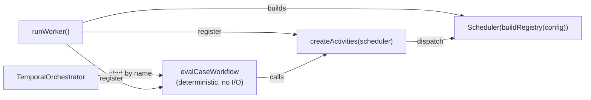

- **`DirectOrchestrator(dispatcher)`** — non-durable, in-process (dev / `apps/cli`).
- **`TemporalOrchestrator`** — client side; starts `evalCaseWorkflow` *by name* so the client never imports
  workflow sandbox code. **Workflow code must stay deterministic** — all I/O lives in the activity.
- **`runWorker(opts)`** — long-running; builds the `Scheduler` from `BackendsConfig` (auth env via
  `collectAuthEnv`), registers the workflow + `dispatchCase`. **Called by:** `apps/cli` (`assay worker`).

---

## `@assay/suite` — suites & version regression

**Role.** Fan a `Suite` out over its cases at a given harness version → `Scorecard`; summarize and diff
scorecards for regression. Depends on `@assay/core` *only* — `Dispatch` is just `(job) → CaseResult`, so any
Backend/Router/Scheduler/Orchestrator plugs in.

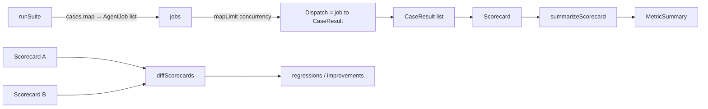

- **`runSuite(suite, version, dispatch, {concurrency})`** — bounded fan-out (`mapLimit`).
- **Called by:** `apps/cli` (`assay suite`) and `apps/api` (`ScorecardService` batch eval, with the
  Scheduler as `dispatch`).

---

## `@assay/topology` — service-topology harnesses

**Role.** `ServiceTopologyBackend` realizes `Backend` for multi-service harnesses + a browser/OS target env.
Orchestrator-agnostic: a `TopologyRuntime` (Nomad or K8s) deploys the topology; trace comes from `@assay/trace`.

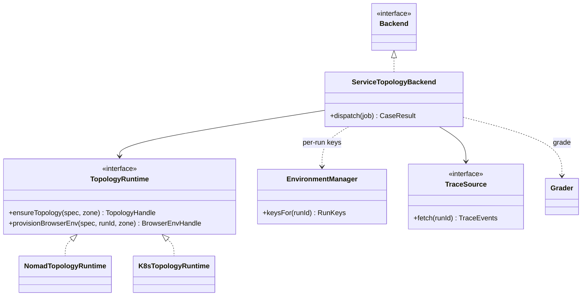

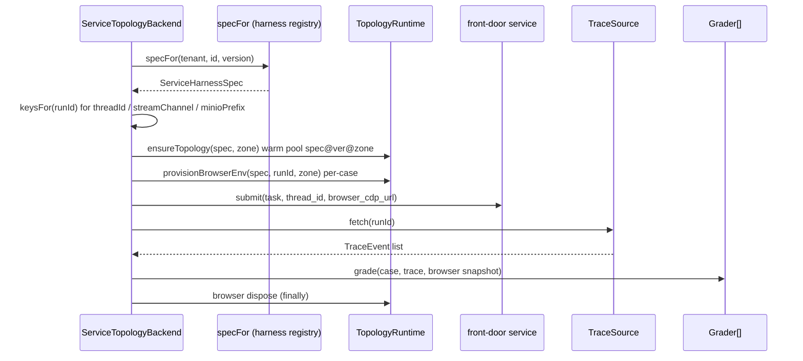

- **`TopologyRuntime`** — `NomadTopologyRuntime` / `K8sTopologyRuntime`; warm topology pool keyed by
  `spec@version@zoneId` (no cross-tenant sharing), per-case browser env (`cdpUrl` + `snapshot`/`dispose`).
- **`EnvironmentManager` / `keysFor(runId)`** — deterministic per-run isolation keys mapped onto
  `TopologyDependency.isolateBy` (`thread_id` / `key-prefix` / `object-prefix` / `schema`).
- **Builders:** `buildNomadTopologyJob` / `buildK8sManifests` (+ browser variants), `resolvePort`.
  See `docs/service-harness.md`.

---

## `@assay/db` — result & secret stores

**Role.** Persistence behind interfaces: `RunStore`, `ScorecardStore`, `TenantKeyStore`, `SecretStore`.
Each has an `InMemory*` (dev/test) and a `Pg*` (Postgres) variant over a shared `SqlClient`.

```mermaid
classDiagram
  class RunStore {
    <<interface>>
    +create(record)
    +get(id) RunRecord
    +update(id, patch) RunRecord
    +list(tenant) RunRecords
  }
  class ScorecardStore {
    <<interface>>
    +create(record)
    +get(id) ScorecardRecord
    +update(id, patch)
    +list(tenant) ScorecardRecords
  }
  class TenantKeyStore {
    <<interface>>
    +add(tenant, keyHash, meta?)
    +resolveByHash(keyHash) {tenant, scopes?}
  }
  class SecretStore {
    <<interface>>
    +set(ws, name, value)
    +list(ws) SecretMetas
    +remove(ws, name)
    +entries(ws) Secrets
  }
  class SqlClient {
    <<interface>>
    +query(text, params) Rows
  }
  class SecretCipher {
    +encrypt(plain) EncryptedSecret
    +decrypt(enc) plain
  }
  RunStore <|.. InMemoryRunStore
  RunStore <|.. PgRunStore
  ScorecardStore <|.. InMemoryScorecardStore
  ScorecardStore <|.. PgScorecardStore
  TenantKeyStore <|.. InMemoryTenantKeyStore
  TenantKeyStore <|.. PgTenantKeyStore
  SecretStore <|.. InMemorySecretStore
  SecretStore <|.. PgSecretStore
  PgRunStore --> SqlClient
  PgScorecardStore --> SqlClient
  PgTenantKeyStore --> SqlClient
  PgSecretStore --> SqlClient
  PgSecretStore --> SecretCipher
```

- **`RunRecord`** carries `status` (queued/running/succeeded/failed), the `CaseResult`, and a derived
  `RunUsageSummary`. **`ScorecardStore.list`** omits the heavy per-case `scorecard` column.
- **`TenantKeyStore`** stores only `hashKey(ak_…)`; `issueKey` returns plaintext once → backs API-key auth.
- **`SecretStore`** encrypts at rest (`aesGcmCipher`, `cipherFromEnv(ASSAY_SECRETS_KEY)`); `entries(tenant)`
  returns decrypted env for model-judge keys / runtime credentials.
- **`migrate` / `preflight`** — idempotent numbered SQL migrations (expand→contract). See `docs/migration/`.
- **Consumed by:** `@assay/registry` (Pg registries reuse `SqlClient`), `@assay/auth` (`TenantKeyStore`), `apps/api`.

---

## `@assay/registry` — versioned SSOT

**Role.** `(tenant, id, version) → spec` for four first-class entity families, immutable versions, semver
`latest`, tenant-owned with `_shared` fallback. The same shape four times.

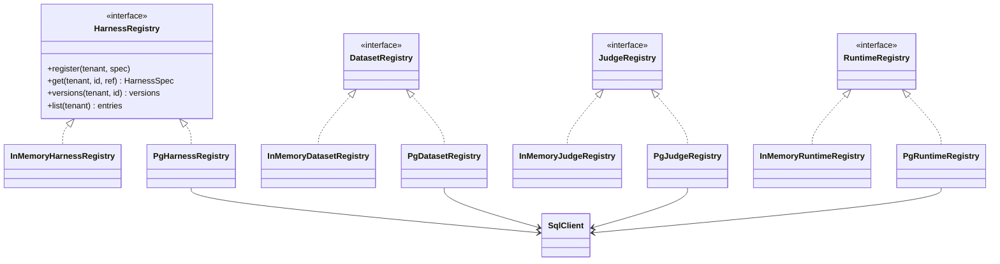

- **Version resolution** — `compareVersions` / `sortVersions`; `latest` = highest semver; `specsEqual`
  guards immutability (re-registering a version with a different spec → conflict).
- **GitOps source** — `loadHarnessDir` / `loadDatasetDir` / `loadJudgeDir` / `loadRuntimeDir` seed from files.
- **Consumed by:** `apps/api` (route + service resolution), `@assay/topology` (`ServiceTopologyBackend.specFor`
  wires to the harness registry). See `docs/registry.md`, `docs/datasets.md`, `docs/judges.md`, `docs/runtimes.md`.

---

## `@assay/auth` — control-plane auth core

**Role.** Resolve any credential to a `Principal{subject, workspace, roles, via}`, then gate actions by role.
`workspace = tenant = trust-zone`. Owned by `apps/api`; the web is a courier, not an authority.

```mermaid
classDiagram
  class Authenticator {
    <<interface>>
    +authenticate(bearer) Principal
  }
  class Principal {
    +subject
    +workspace
    +roles
    +via
  }
  class authz {
    +can(principal, action) bool
    +authorize(principal, action)
  }
  Authenticator <|.. compositeAuthenticator
  Authenticator <|.. oidcAuthenticator
  Authenticator <|.. apiKeyAuthenticator
  compositeAuthenticator o-- oidcAuthenticator
  compositeAuthenticator o-- apiKeyAuthenticator
  apiKeyAuthenticator ..> TenantKeyStore
  oidcAuthenticator ..> Principal
  authz ..> Principal
```

- **`oidcAuthenticator`** — verifies Keycloak JWT via `jose` JWKS, extracts `workspace` + roles (fail-closed → `undefined`).
- **`apiKeyAuthenticator`** — `ak_…` → `TenantKeyStore.resolveByHash(hashKey(...))` (`@assay/db`) → `{ workspace, scopes? }`.
- **`authz`** — `ASSAY_ROLES = viewer ⊂ member ⊂ admin`; `authorize` throws `ForbiddenError` (403); per-key `scopes` (`read|write|admin`) intersect the role matrix. See `docs/auth.md`.
- **Consumed by:** `apps/api` (every route guard + `/me` + MCP). See `docs/tenancy.md`.

---

## `apps/api` — control-plane HTTP surface (BFF + MCP)

**Role.** The multi-tenant Fastify control plane: it composes *all* of the above into auth → service →
dispatch → store. `RunService`, `ScorecardService`, `RuntimeDispatcher`, `JudgeRunner` are the local glue.

```mermaid
flowchart TD
  subgraph wiring["startup wiring (main.ts)"]
    persistence["Pg* or InMemory stores + registries"]
    sched["BackendRegistry → Scheduler + inMemoryBudget"]
    rtd["RuntimeDispatcher(inner=Scheduler, runtimes, secretsFor)"]
    jr["defaultJudgeRunner(secretsFor, dispatch, harnesses)"]
    runsvc["RunService(dispatch, RunStore, budget, resolveHarness)"]
    scoresvc["ScorecardService(dispatch, ScorecardStore, datasets, harnesses, judges, jr)"]
    authn["buildAuthenticator → composite(oidc, apiKey)"]
  end

  authn --> server["buildServer / buildMcpServer (parity)"]
  runsvc --> server
  scoresvc --> server
  rtd --> runsvc
  rtd --> scoresvc
  scoresvc --> jr

  server -->|"POST /runs"| runsvc
  server -->|"POST /scorecards · /scorecards/ingest"| scoresvc
  server -->|"GET/POST harnesses · datasets · judges · runtimes"| registry["@assay/registry"]
  jr -->|"model judge key"| secrets["SecretStore"]
  jr -->|"harness judge"| dispatch2["dispatch (Scheduler)"]
```

- **`POST /runs`** → `authorize(principal,'runs:submit')` → `RunService.submit`: `budget.admit` →
  `RunStore.create(queued)` → fire-and-forget `track` (resolve `HarnessSpec`, build `AgentJob`,
  `dispatch`, `budget.settle`, `RunStore.update`) → 202 + run id. Optional webhook.
- **`POST /scorecards`** → `ScorecardService`: resolve `Dataset` + harness → `runSuite(…, dispatch)` →
  `applyJudges` (per trace, via `JudgeRunner`: model judges call the provider with the tenant's
  `SecretStore` key; harness judges `dispatch` an agent) → `summarizeScorecard` → `ScorecardStore`.
  `GET /scorecards/diff` = `diffScorecards`; **`POST /scorecards/ingest`** scores externally-run
  `TraceEvent[]` with no harness run (judges-only path).
- **`RuntimeDispatcher`** — reads `placement.target`, resolves the tenant `RuntimeSpec`
  (`RuntimeRegistry`), `buildRuntimeBackend` (with tenant secrets), routes through the inner `Scheduler`.
- **`/mcp`** — Streamable HTTP, OAuth (Keycloak) + API keys; tools mirror the BFF routes 1:1, each gated by
  `authorize(principal, action)`. See `docs/api.md`, `docs/mcp.md`, `docs/scorecards.md`.

---

## `apps/cli` — dev / single-run control plane

**Role.** Thin wiring for local runs: pick an orchestrator, build a Backend set, dispatch.

```mermaid
flowchart LR
  run["assay run"] --> orch{orchestrator?}
  orch -->|direct| DO["DirectOrchestrator(Router)"]
  orch -->|temporal| TO["TemporalOrchestrator"]
  DO --> Router["Router(buildRegistry(config))"]
  Router --> B["LocalBackend / NomadBackend"]
  run --> job[AgentJob] --> DO

  worker["assay worker"] --> runWorker["@assay/orchestrator.runWorker"]
  suite["assay suite"] --> runSuite["@assay/suite.runSuite"]
  suite --> diff["diffScorecards (--baseline)"]
```

- **`assay run`** builds an `AgentJob` and an `Orchestrator` (Direct over `Router`, or Temporal), calls `run(job)`.
- **`assay worker`** → `runWorker` (the durable side). **`assay suite`** → `runSuite` (+ regression diff).
- **Depends on:** `@assay/orchestrator`, `@assay/backends`, `@assay/agent`, `@assay/suite`, `@assay/core`.

---

## `apps/web` — SaaS dashboard (pure HTTP client)

**Role.** Next.js dashboard. **No `@assay/*` dependencies** — it talks to `apps/api` over HTTP only. A
token courier: Auth.js (Keycloak) puts the access token in a server-only cookie and forwards it as `Bearer`;
`GET /me` returns workspace + roles (UI gating mirrors the control plane, which enforces).

```mermaid
flowchart LR
  user[Human] --> NextAuth["Auth.js + Keycloak"]
  NextAuth --> cookie["httpOnly access token"]
  cookie --> controlPlane["controlPlane fetch wrapper (Bearer)"]
  controlPlane -->|"GET /me"| api["apps/api"]
  controlPlane -->|"runs · harnesses · datasets · judges · runtimes · scorecards"| api
  subgraph fsd["FSD slices"]
    entities --> features --> widgets --> pages["/dashboard/*"]
  end
  pages --> controlPlane
```

- **Boundary:** humans → Keycloak; agents → API keys / MCP. The web never holds authority; it forwards.
  See `docs/web.md`, `docs/auth.md`.

---

## Where to go next

- Narrative map & extension points — [`overview.md`](overview.md)
- Backend vs Driver, scheduling, trust zones — [`../execution-backends.md`](../execution-backends.md)
- Service harnesses & trace ingestion — [`../service-harness.md`](../service-harness.md)
- HTTP API & MCP — [`../api.md`](../api.md) · [`../mcp.md`](../mcp.md)
- Conventions (SSOT) — [`../../CLAUDE.md`](../../CLAUDE.md) + `../../.claude/`
</content>
