# Module collaboration diagrams

How the `packages/*` and `apps/*` modules cooperate — first at low zoom (the whole mesh),
then at high zoom (one diagram per module). Companion to
[`overview.md`](overview.md) (the narrative map). Diagrams are Mermaid; GitHub renders them inline.

> **Re-architecture note.** The layer spine is `@everdict/contracts ← @everdict/domain ←
> @everdict/application-{execution,control}`. The pre-re-architecture packages `@everdict/core`, `@everdict/run-case`,
> `@everdict/suite` and `@everdict/billing` no longer exist: types/schemas/errors are in `@everdict/contracts`, the pure
> kernel (scorecard aggregation, placement policy, budgets, authz) in `@everdict/domain`, `runCase` in
> `@everdict/application-execution`, and `runSuite` plus the store/registry/dispatcher ports in
> `@everdict/application-control`. Every name below is a current home.

## How to read these

- **Arrow = "uses / depends on / calls"**, pointing from the consumer to the provider — the same
  direction as the `import`. Reverse imports are bugs (one-way dependency rule).
- `<<interface>>` = a contract. Most live in `@everdict/contracts` (the dependency root); ports live in
  `@everdict/application-control`, and `Backend` in `@everdict/backends`. Concrete classes **realize** them (`..|>`).
- Two cooperating planes share the same `(job) → CaseResult` seam:
  - **in-sandbox eval loop** — `runCase` drives Driver · Environment · Harness · Grader.
  - **placement / control plane** — Backend · Scheduler · Orchestrator · the HTTP/MCP surface dispatch
    that loop to isolated infra and persist the result.
- The pivotal data contracts that flow between *every* module: `CaseJob` (in) and `CaseResult` (out),
  with `TraceEvent[]` as the normalized currency every metric is derived from.

---

# Part 1 — Bird's-eye (low zoom)

## 1.1 The dependency spine (static, one-way)

Every module depends only inward. `@everdict/contracts` is interfaces + schemas + errors; `@everdict/domain` is the
pure kernel; the two application layers hold the use-cases and ports; the product is the *pluggable adapters*
hanging off them (many Drivers / Environments / Harnesses / Graders / Backends / Registries).

The edges are the runtime `dependencies` in each `package.json`. To keep the picture readable, **edges into
`@everdict/contracts` and `@everdict/domain` are drawn only for the spine** — nearly every package imports
contracts, and most import domain.

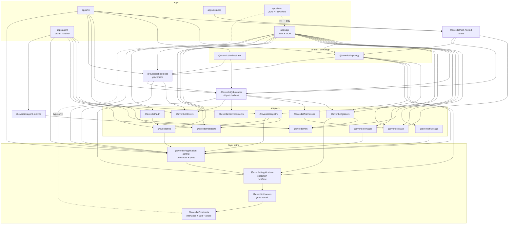
```mermaid
flowchart TD
  subgraph SPINE["layer spine"]
    contracts["@everdict/contracts<br/><i>interfaces + Zod + errors</i>"]
    domain["@everdict/domain<br/><i>pure kernel</i>"]
    appexec["@everdict/application-execution<br/><i>runCase</i>"]
    appctl["@everdict/application-control<br/><i>use-cases + ports</i>"]
  end

  subgraph ADAPTERS["adapters"]
    drivers["@everdict/drivers"]
    environments["@everdict/environments"]
    harnesses["@everdict/harnesses"]
    graders["@everdict/graders"]
    trace["@everdict/trace"]
    llm["@everdict/llm"]
    datasets["@everdict/datasets"]
    db["@everdict/db"]
    registry["@everdict/registry"]
    auth["@everdict/auth"]
    storage["@everdict/storage"]
    images["@everdict/images"]
  end

  jobrunner["@everdict/job-runner<br/><i>dispatched unit</i>"]
  backends["@everdict/backends<br/><i>placement</i>"]

  subgraph CONTROL["control / execution"]
    orchestrator["@everdict/orchestrator"]
    topology["@everdict/topology"]
  end

  shr["@everdict/self-hosted-runner"]
  agentruntime["@everdict/agent-runtime"]

  subgraph APPS["apps"]
    api["apps/api<br/><i>BFF + MCP</i>"]
    cli["apps/cli"]
    desktop["apps/desktop"]
    agentapp["apps/agent<br/><i>owner runtime</i>"]
    web["apps/web<br/><i>pure HTTP client</i>"]
  end

  domain --> contracts
  appexec --> domain
  appctl --> appexec

  harnesses --> trace
  graders --> appexec
  graders --> llm
  db --> appctl
  registry --> appctl
  registry --> db
  registry --> datasets
  auth --> db
  storage --> appctl
  images --> appctl

  jobrunner --> appexec
  jobrunner --> drivers
  jobrunner --> environments
  jobrunner --> harnesses
  jobrunner --> graders

  backends --> jobrunner
  backends --> appctl
  backends --> drivers

  orchestrator --> backends
  orchestrator --> jobrunner
  topology --> backends
  topology --> appctl
  topology --> appexec
  topology --> graders
  topology --> trace

  shr --> jobrunner
  shr --> topology
  shr --> trace
  agentruntime --> llm

  api --> appctl
  api --> auth
  api --> backends
  api --> datasets
  api --> db
  api --> drivers
  api --> graders
  api --> images
  api --> jobrunner
  api --> llm
  api --> registry
  api --> storage
  api --> topology
  api --> trace
  cli --> appctl
  cli --> backends
  cli --> datasets
  cli --> jobrunner
  cli --> orchestrator
  cli --> shr
  cli --> topology
  desktop --> shr
  agentapp --> agentruntime
  agentapp --> appctl
  agentapp --> db
  agentapp --> drivers
  agentapp --> llm
  agentapp --> registry
  web -.->|type-only| contracts
  web -.->|HTTP only| api
```

`@everdict/sdk` (HTTP client of the public routes) and `@everdict/otel` (OTLP-door helpers) are user-facing
surfaces with no runtime `@everdict/*` dependency, and nothing in the monorepo depends on them.

## 1.2 The eval loop (runtime collaboration, end-to-end)

The single most important sequence: one `CaseJob` → one `CaseResult`. Same loop whether dispatched
locally, to Nomad/K8s, or durably via Temporal — only the *placement* layer changes.

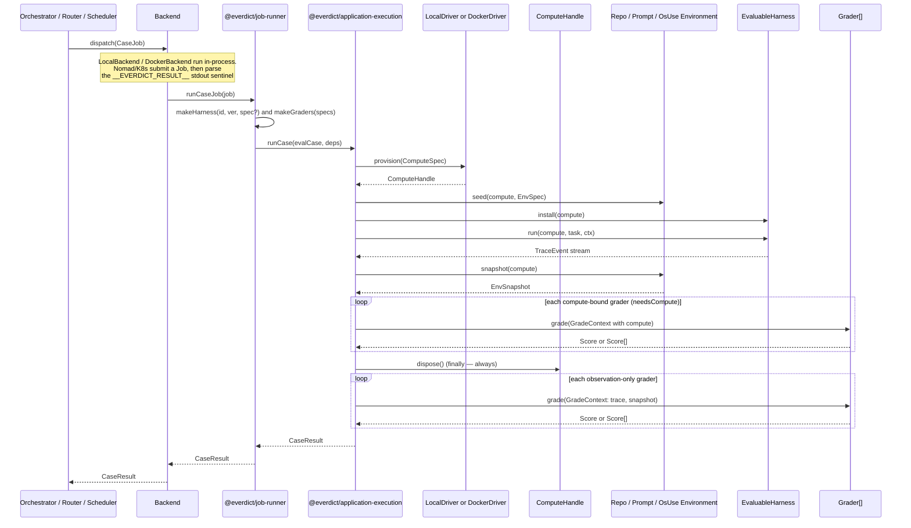
```mermaid
sequenceDiagram
  participant Caller as Orchestrator / Router / Scheduler
  participant Backend
  participant Agent as @everdict/job-runner
  participant Runner as @everdict/application-execution
  participant Driver as LocalDriver or DockerDriver
  participant Compute as ComputeHandle
  participant Env as Repo / Prompt / OsUse Environment
  participant Harness as EvaluableHarness
  participant Grader as Grader[]

  Caller->>Backend: dispatch(CaseJob)
  Note over Backend: LocalBackend / DockerBackend run in-process.<br/>Nomad/K8s submit a Job, then parse<br/>the __EVERDICT_RESULT__ stdout sentinel
  Backend->>Agent: runCaseJob(job)
  Agent->>Agent: makeHarness(id, ver, spec?) and makeGraders(specs)
  Agent->>Runner: runCase(evalCase, deps)
  Runner->>Driver: provision(ComputeSpec)
  Driver-->>Runner: ComputeHandle
  Runner->>Env: seed(compute, EnvSpec)
  Runner->>Harness: install(compute)
  Runner->>Harness: run(compute, task, ctx)
  Harness-->>Runner: TraceEvent stream
  Runner->>Env: snapshot(compute)
  Env-->>Runner: EnvSnapshot
  loop each compute-bound grader (needsCompute)
    Runner->>Grader: grade(GradeContext with compute)
    Grader-->>Runner: Score or Score[]
  end
  Runner->>Compute: dispose()  (finally — always)
  loop each observation-only grader
    Runner->>Grader: grade(GradeContext: trace, snapshot)
    Grader-->>Runner: Score or Score[]
  end
  Runner-->>Agent: CaseResult
  Agent-->>Backend: CaseResult
  Backend-->>Caller: CaseResult
```

## 1.3 The control plane (multi-tenant request → result)

How `apps/api` turns "run one case / one batch" into a tenant-scoped, budgeted, isolated dispatch.
Humans reach it through `apps/web` (Keycloak token courier); agents through API keys / MCP. `RunService` and
`ScorecardService` are use-cases from `@everdict/application-control`; `RuntimeDispatcher` and the default
`JudgeRunner` (`defaultJudgeRunner`) are `apps/api` glue.

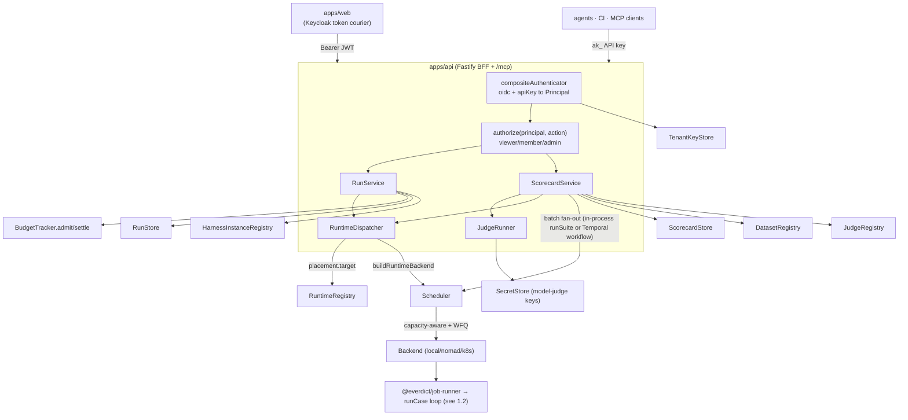
```mermaid
flowchart TD
  web["apps/web<br/>(Keycloak token courier)"] -->|Bearer JWT| api
  agentcli["agents · CI · MCP clients"] -->|ak_ API key| api

  subgraph api["apps/api (Fastify BFF + /mcp)"]
    authn["compositeAuthenticator<br/>oidc + apiKey to Principal"]
    authz["authorize(principal, action)<br/>viewer/member/admin"]
    runsvc["RunService"]
    scoresvc["ScorecardService"]
    rtd["RuntimeDispatcher"]
    jr["JudgeRunner"]
    authn --> authz
    authz --> runsvc
    authz --> scoresvc
    scoresvc --> jr
    runsvc --> rtd
    scoresvc --> rtd
  end

  rtd -->|placement.target| RuntimeReg["RuntimeRegistry"]
  rtd -->|buildRuntimeBackend| Scheduler
  Scheduler -->|capacity-aware + WFQ| Backend["Backend (local/nomad/k8s)"]
  scoresvc -->|"batch fan-out (in-process runSuite or Temporal workflow)"| Scheduler

  runsvc --> budget["BudgetTracker.admit/settle"]
  runsvc --> RunStore
  scoresvc --> ScorecardStore
  runsvc --> HarnessReg["HarnessInstanceRegistry"]
  scoresvc --> DatasetReg["DatasetRegistry"]
  scoresvc --> JudgeReg["JudgeRegistry"]
  jr --> SecretStore["SecretStore (model-judge keys)"]
  authn --> TenantKeyStore

  Backend --> agentjob["@everdict/job-runner → runCase loop (see 1.2)"]
```

---

# Part 2 — High zoom (per-module)

Ordered inside-out along the spine. Each section: **role**, a structure/collaboration diagram, and the
in/out edges that matter.

---

## `@everdict/contracts` — contracts (the dependency root)

**Role.** Interfaces + Zod schemas + the `AppError` hierarchy + the job-result wire codec. No I/O, no SDKs.
Every other module realizes or consumes these. Schema is the source of truth; types are `z.infer`.

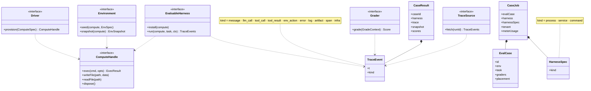
```mermaid
classDiagram
  class Driver {
    <<interface>>
    +provision(ComputeSpec) ComputeHandle
  }
  class ComputeHandle {
    <<interface>>
    +exec(cmd, opts) ExecResult
    +writeFile(path, data)
    +readFile(path)
    +dispose()
  }
  class Environment {
    <<interface>>
    +seed(compute, EnvSpec)
    +snapshot(compute) EnvSnapshot
  }
  class EvaluableHarness {
    <<interface>>
    +install(compute)
    +run(compute, task, ctx) TraceEvents
  }
  class Grader {
    <<interface>>
    +grade(GradeContext) Score
  }
  class TraceSource {
    <<interface>>
    +fetch(runId) TraceEvents
  }
  class CaseJob {
    +evalCase
    +harness
    +harnessSpec
    +tenant
    +meterUsage
  }
  class EvalCase {
    +id
    +env
    +task
    +graders
    +placement
  }
  class CaseResult {
    +caseId
    +harness
    +trace
    +snapshot
    +scores
  }
  class TraceEvent {
    +t
    +kind
  }
  class HarnessSpec {
    +kind
  }
  Driver ..> ComputeHandle
  Environment ..> ComputeHandle
  EvaluableHarness ..> ComputeHandle
  EvaluableHarness ..> TraceEvent
  Grader ..> TraceEvent
  CaseJob *-- EvalCase
  CaseJob *-- HarnessSpec
  CaseResult *-- TraceEvent
  TraceSource ..> TraceEvent
  note for TraceEvent "kind = message · llm_call · tool_call · tool_result · env_action · error · log · artifact · span · infra"
  note for HarnessSpec "kind = process · service · command"
```

- **Consumed by:** every module except `@everdict/sdk`/`@everdict/otel` at runtime (the web imports it type-only).
  Pure behavior over these types — `usageFromTrace`, `assertHardenedIsolation`, scorecard aggregation — lives in
  `@everdict/domain`.
- **Not here:** `Backend` is declared in `@everdict/backends` (`packages/backends/src/backend.ts`); the `Dispatcher`
  port and the store/registry ports in `@everdict/application-control` (`packages/application-control/src/ports/`).
- **Other contracts:** `Suite`, `Dataset`, `JudgeSpec`, `RuntimeSpec`, `Score`, `EnvSpec`/`EnvSnapshot`
  (repo · browser · prompt · os-use discriminated unions), `Placement`, `TrustZone`.

---

## `@everdict/drivers` — in-sandbox compute

**Role.** `LocalDriver` realizes `Driver`: a `ComputeHandle` backed by a tmp dir + `child_process`.
`DockerDriver` (the other realization, not drawn) backs the handle with a container of `case.image`.
Used by the job-runner *inside* an already-isolated job (isolation is the Backend's job, not the Driver's).

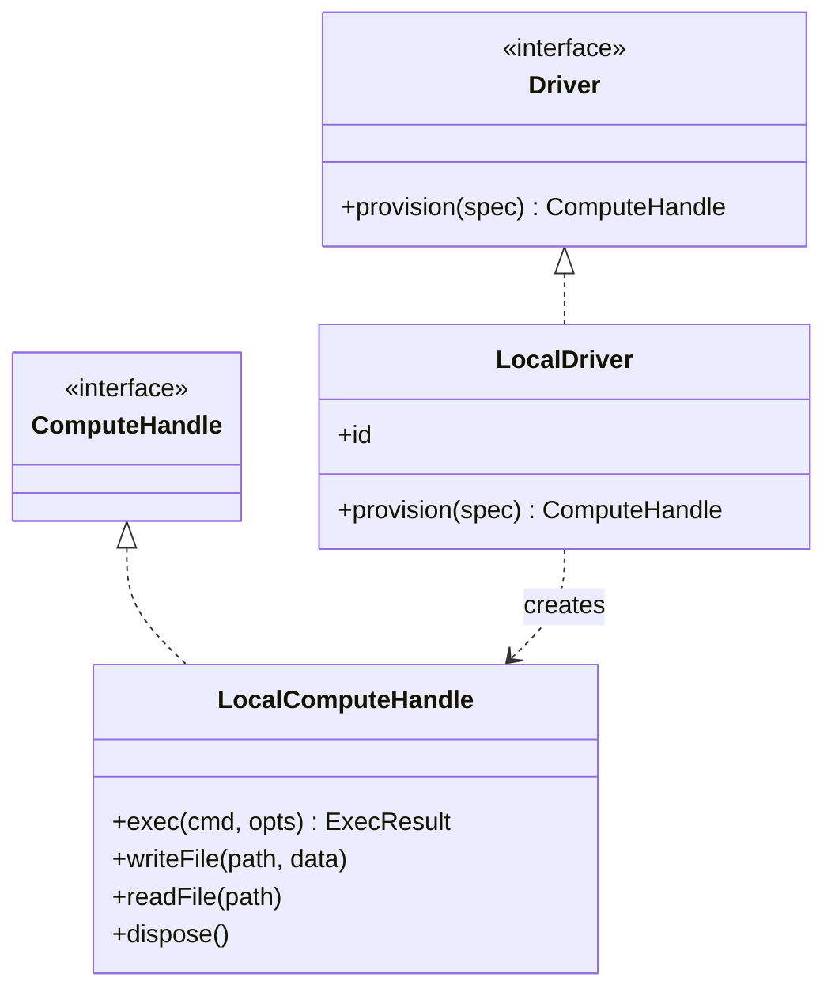
```mermaid
classDiagram
  class Driver {
    <<interface>>
    +provision(spec) ComputeHandle
  }
  class ComputeHandle {
    <<interface>>
  }
  class LocalDriver {
    +id
    +provision(spec) ComputeHandle
  }
  class LocalComputeHandle {
    +exec(cmd, opts) ExecResult
    +writeFile(path, data)
    +readFile(path)
    +dispose()
  }
  Driver <|.. LocalDriver
  ComputeHandle <|.. LocalComputeHandle
  LocalDriver ..> LocalComputeHandle : creates
```

- **`provision`** → `mkdtemp(<tmpdir>/everdict-…)` → `LocalComputeHandle(root)`.
- **`exec`** runs via `child_process` (non-zero exit ≠ throw); **`dispose`** = `rm -rf root` (when the handle owns it).
- **Called by:** `@everdict/application-execution` (`runCase`); instantiated by `@everdict/job-runner` (`DockerDriver`
  when the job is containerized, else `LocalDriver`) and by `DockerBackend`.

---

## `@everdict/environments` — the world acted on

**Role.** `RepoEnvironment` realizes `Environment<RepoSnapshot>`: seed a repo, capture the git diff.
`PromptEnvironment` (QA, `env.kind: prompt`) and `OsUseEnvironment` (desktop, `os-use`) are the other two
realizations; a `browser` env is a service-topology target, never run here.

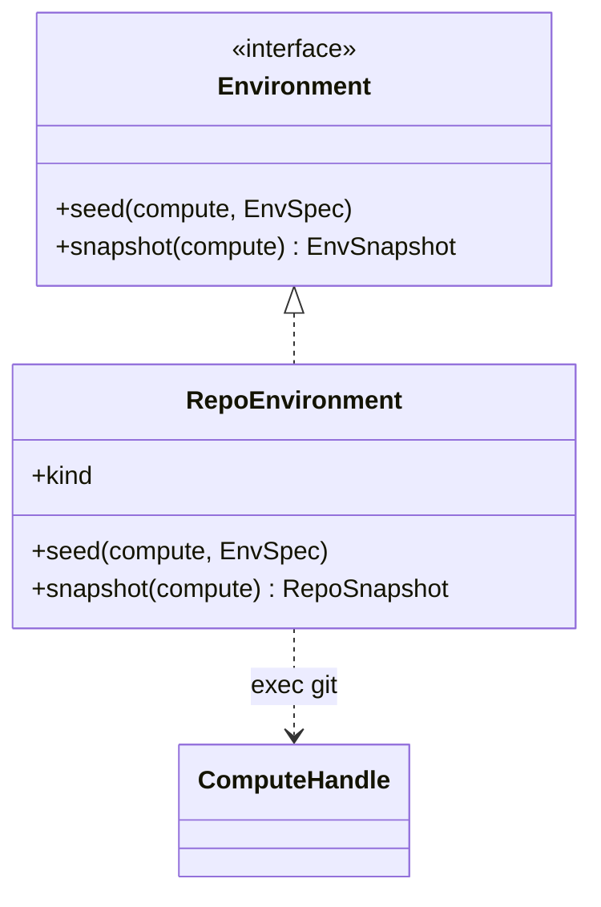
```mermaid
classDiagram
  class Environment {
    <<interface>>
    +seed(compute, EnvSpec)
    +snapshot(compute) EnvSnapshot
  }
  class RepoEnvironment {
    +kind
    +seed(compute, EnvSpec)
    +snapshot(compute) RepoSnapshot
  }
  Environment <|.. RepoEnvironment
  RepoEnvironment ..> ComputeHandle : exec git
```

- **`seed`** — a local `path` (symlinked), an inline `files` map (`git init` + commit a baseline), **or** `git clone --depth 1` + `checkout ref`; then run `setup[]`.
- **`snapshot`** — `git add -A` → `git diff --cached HEAD` (+ `--name-only`, + `rev-parse HEAD`) → `RepoSnapshot{diff, changedFiles, headSha}`.
- **Called by:** `@everdict/application-execution`; instantiated by `@everdict/job-runner` by `env.kind`. A new world kind adds an `Environment` variant, no core rewrite.

---

## `@everdict/trace` — trace ingestion + usage metering

**Role.** Pull a harness's native trace from an observability platform and normalize to `TraceEvent[]`; plus a
**usage-proxy** sidecar that recovers token usage from black-box harnesses. The `TraceSource` interface is declared
in `@everdict/contracts`; this package holds the sources (OTel, MLflow, Langfuse, LangSmith, Phoenix) and the
outbound sinks. Only the first two are drawn.

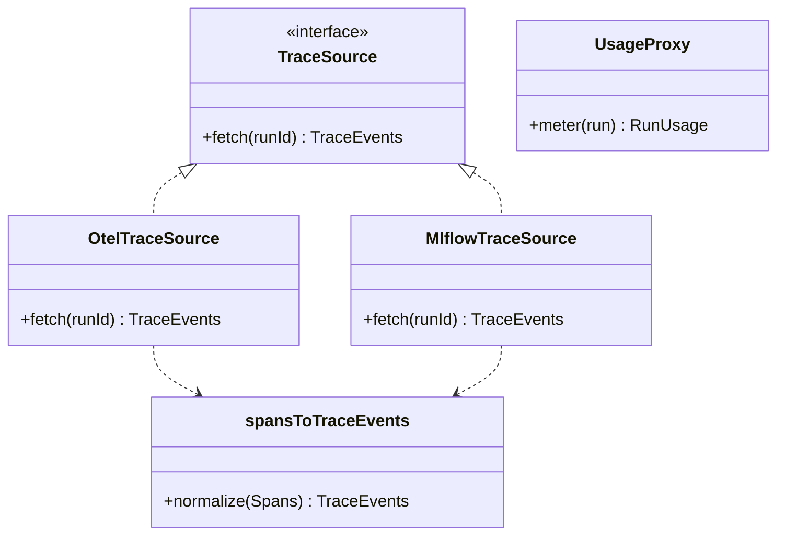
```mermaid
classDiagram
  class TraceSource {
    <<interface>>
    +fetch(runId) TraceEvents
  }
  class OtelTraceSource {
    +fetch(runId) TraceEvents
  }
  class MlflowTraceSource {
    +fetch(runId) TraceEvents
  }
  class spansToTraceEvents {
    +normalize(Spans) TraceEvents
  }
  class UsageProxy {
    +meter(run) RunUsage
  }
  TraceSource <|.. OtelTraceSource
  TraceSource <|.. MlflowTraceSource
  OtelTraceSource ..> spansToTraceEvents
  MlflowTraceSource ..> spansToTraceEvents
```

- **`spansToTraceEvents`** maps spans → `llm_call`/`tool_call`/`tool_result`/`message` using OTel GenAI
  conventions (`gen_ai.usage.*`, cost, latency). MLflow source degrades to `[]` on 404 (graders see 0 events).
- **usage-proxy** (`startUsageProxy`, `extractUsage`, `costFromHeaders`, `inMemoryUsageTally`): a reverse
  proxy in front of a BYO model gateway; reads `usage` from the response + `x-litellm-response-cost`, keyed
  by an `x-everdict-run` header → per-run `RunUsage`.
- **Consumed by:** `@everdict/harnesses` (`CommandHarness` for trace pull + metering), `@everdict/topology`
  (`ServiceTopologyBackend` for trace pull), `@everdict/self-hosted-runner` and `apps/api`. See
  `docs/usage-metering.md`, `docs/service-harness.md`.

---

## `@everdict/harnesses` — the agent under test

**Role.** Realize `EvaluableHarness` over a process boundary. Three adapters; the declarative
`CommandHarness` brings *any* CLI agent with no code.

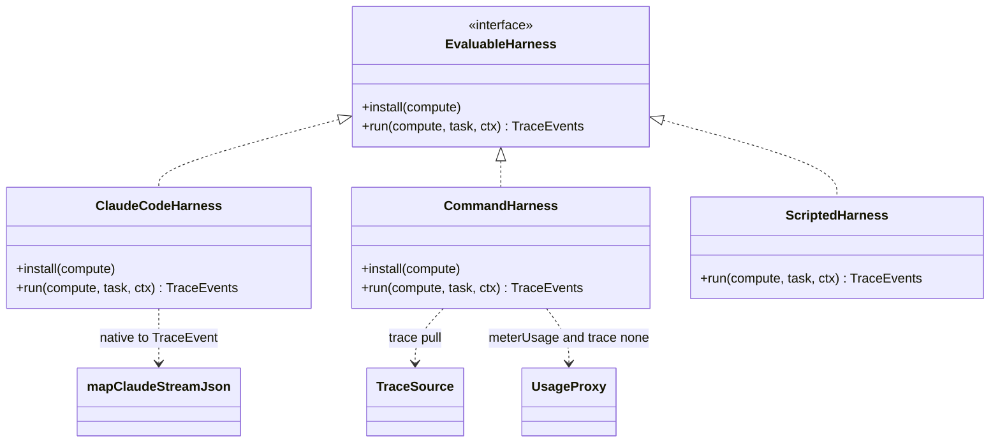
```mermaid
classDiagram
  class EvaluableHarness {
    <<interface>>
    +install(compute)
    +run(compute, task, ctx) TraceEvents
  }
  class ClaudeCodeHarness {
    +install(compute)
    +run(compute, task, ctx) TraceEvents
  }
  class CommandHarness {
    +install(compute)
    +run(compute, task, ctx) TraceEvents
  }
  class ScriptedHarness {
    +run(compute, task, ctx) TraceEvents
  }
  EvaluableHarness <|.. ClaudeCodeHarness
  EvaluableHarness <|.. CommandHarness
  EvaluableHarness <|.. ScriptedHarness
  ClaudeCodeHarness ..> mapClaudeStreamJson : native to TraceEvent
  CommandHarness ..> TraceSource : trace pull
  CommandHarness ..> UsageProxy : meterUsage and trace none
```

- **ClaudeCodeHarness** — runs `claude -p … --output-format stream-json`; `mapClaudeStreamJson` normalizes
  each line; cost captured from the final `result.total_cost_usd`.
- **CommandHarness** — interprets a `CommandHarnessSpec`: `setup[]` (install) → `command` template
  (`{{task}}`/`{{model}}`/`{{run_id}}`) → trace extraction (`none` · `file` · `otel` · `mlflow` · `langfuse` ·
  `langsmith` · `phoenix`, pulled via `@everdict/trace`).
  When `meterUsage` and `trace.kind="none"`, it spins a usage-proxy and emits a synthetic `llm_call`
  carrying the recovered tokens/USD.
- **ScriptedHarness** — deterministic steps; lets the whole eval loop run with no LLM/key.
- **Selected by:** `@everdict/job-runner`'s `makeHarness(id, version, spec?)`.

---

## `@everdict/graders` — scoring (fully separate from the harness)

**Role.** Realize `Grader`. The same grader scores every harness identically → fair cross-harness/version
comparison. Includes the Agent Judge family. Edge labels show *what each grader reads* from `GradeContext`.

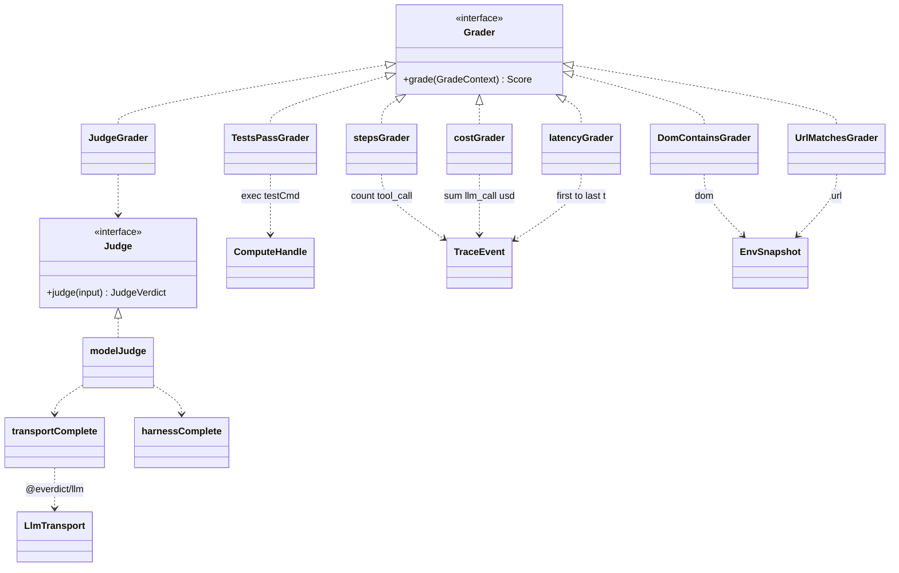
```mermaid
classDiagram
  class Grader {
    <<interface>>
    +grade(GradeContext) Score
  }
  class Judge {
    <<interface>>
    +judge(input) JudgeVerdict
  }
  Grader <|.. TestsPassGrader
  Grader <|.. stepsGrader
  Grader <|.. costGrader
  Grader <|.. latencyGrader
  Grader <|.. DomContainsGrader
  Grader <|.. UrlMatchesGrader
  Grader <|.. JudgeGrader
  TestsPassGrader ..> ComputeHandle : exec testCmd
  stepsGrader ..> TraceEvent : count tool_call
  costGrader ..> TraceEvent : sum llm_call usd
  latencyGrader ..> TraceEvent : first to last t
  DomContainsGrader ..> EnvSnapshot : dom
  UrlMatchesGrader ..> EnvSnapshot : url
  JudgeGrader ..> Judge
  Judge <|.. modelJudge
  modelJudge ..> transportComplete
  modelJudge ..> harnessComplete
  transportComplete ..> LlmTransport : @everdict/llm
```

- **`GradeContext`** = `{case, deadlineAt, trace, snapshot, observations, compute?, provision?, readStore?, evidence?, baseline?, signal?}`.
  Each grader reads only what it needs; a grader that declares `needsCompute` runs before the compute is released.
- **`makeGraders(GraderSpec[]) → Grader[]`** switches on `spec.id` — `tests-pass`, `state-check`, `command`, `script`,
  `script-score`, `reward-file`, `swe-bench`, `world-state`, `steps`, `cost`, `latency`, `dom-contains`, `url-matches`,
  `answer-match`, `store-state`, `text-metric`, `judge` (`packages/graders/src/make-graders.ts`). The diagram draws a subset.
- **Agent Judge** — `JudgeGrader` delegates to a `Judge` (declared in `@everdict/graders`); `modelJudge(JudgeCompletion)`
  builds the prompt + parses the verdict, over a pluggable completion: `transportComplete` (a provider-native
  `LlmTransport` from `@everdict/llm` — Anthropic Messages / OpenAI / OpenAI-compatible) or `harnessComplete`
  (dispatch an agent, verdict via `traceToText`). See `docs/judges.md`.

---

## `@everdict/application-execution` — the eval loop

**Role.** `runCase(evalCase, deps) → CaseResult`. The orchestration of the four in-sandbox concerns, with
guaranteed `compute.dispose()` in `finally`. No placement, no tenancy.

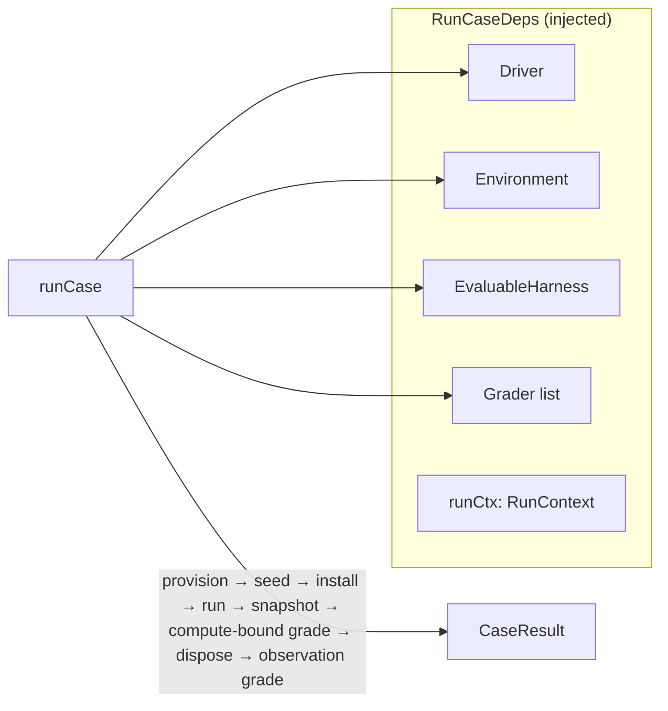
```mermaid
flowchart LR
  subgraph deps["RunCaseDeps (injected)"]
    d[Driver] & e[Environment] & h[EvaluableHarness] & g["Grader list"] & c["runCtx: RunContext"]
  end
  runCase --> d
  runCase --> e
  runCase --> h
  runCase --> g
  runCase -->|"provision → seed → install → run → snapshot → compute-bound grade → dispose → observation grade"| out[CaseResult]
```

- **Imports** only `@everdict/contracts` and `@everdict/domain`; every adapter *instance* is injected by the caller
  (`@everdict/job-runner`). This keeps the runner adapter-agnostic.

---

## `@everdict/job-runner` — the dispatched unit (self-contained worker)

**Role.** `runCaseJob(CaseJob) → CaseResult`: assemble concrete adapters from the job, run `runCase`,
emit the result behind the `__EVERDICT_RESULT__` stdout sentinel.

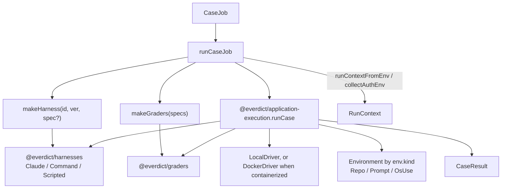
```mermaid
flowchart TD
  job[CaseJob] --> runCaseJob
  runCaseJob --> makeHarness["makeHarness(id, ver, spec?)"]
  runCaseJob --> makeGraders["makeGraders(specs)"]
  makeHarness --> H["@everdict/harnesses<br/>Claude / Command / Scripted"]
  makeGraders --> G["@everdict/graders"]
  runCaseJob --> runCase["@everdict/application-execution.runCase"]
  runCase --> LD["LocalDriver, or DockerDriver when containerized"]
  runCase --> RE["Environment by env.kind<br/>Repo / Prompt / OsUse"]
  runCase --> H
  runCase --> G
  runCaseJob -->|"runContextFromEnv / collectAuthEnv"| ctx[RunContext]
  runCase --> res[CaseResult]
```

- **Registry:** `makeHarness` returns `CommandHarness` when an embedded `harnessSpec.kind==="command"`,
  else branches on built-in `id` (`claude-code`/`scripted`). `meterUsage` flows from `job.meterUsage`
  (control-plane policy) with an `EVERDICT_METER_USAGE` env dev-fallback.
- **Auth env:** `collectAuthEnv` / `hasClaudeAuth` gather the machine's existing `claude` login (no API key
  for `LocalDriver`); `RESULT_SENTINEL` (declared in `@everdict/contracts`) is the contract every non-local Backend parses.
- **Called by:** `LocalBackend` and `DockerBackend` (in-process), `@everdict/self-hosted-runner` (a leased
  process job), and the Nomad/K8s images (`packages/job-runner/src/main.ts` as the job entrypoint).

---

## `@everdict/backends` — placement

**Role.** Dispatch the job-runner job to an execution target and return `CaseResult`. Backends *never run the
harness themselves* (except `LocalBackend` and `DockerBackend`, which call `runCaseJob` in-process) — they submit a Job
and parse the sentinel. Plus the SaaS placement machinery: scheduling, fairness, trust zones. The `Backend`
interface (`Backend extends Dispatcher`) is declared here; the `Dispatcher` port comes from
`@everdict/application-control`, and `TrustZonePolicy`, `BudgetTracker`, `FairQueue` and `Autoscaler` are pure
`@everdict/domain` types the Scheduler and backends consume. Other `Backend` realizations live outside this
package: `ServiceTopologyBackend` (`@everdict/topology`) and `SelfHostedBackend` (`apps/api`).

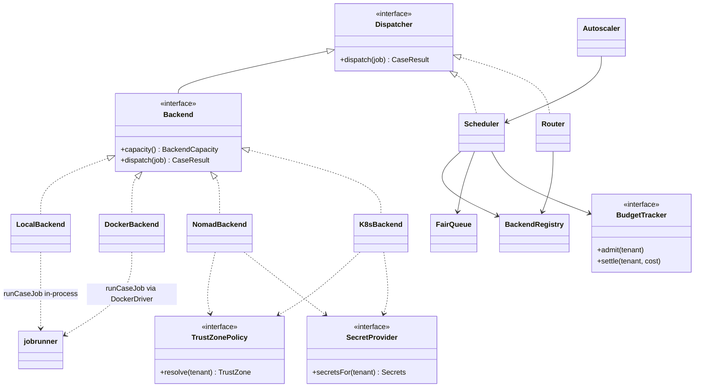
```mermaid
classDiagram
  class Backend {
    <<interface>>
    +capacity() BackendCapacity
    +dispatch(job) CaseResult
  }
  class Dispatcher {
    <<interface>>
    +dispatch(job) CaseResult
  }
  class TrustZonePolicy {
    <<interface>>
    +resolve(tenant) TrustZone
  }
  class BudgetTracker {
    <<interface>>
    +admit(tenant)
    +settle(tenant, cost)
  }
  class SecretProvider {
    <<interface>>
    +secretsFor(tenant) Secrets
  }
  Dispatcher <|-- Backend
  Backend <|.. LocalBackend
  Backend <|.. DockerBackend
  Backend <|.. NomadBackend
  Backend <|.. K8sBackend
  Dispatcher <|.. Scheduler
  Dispatcher <|.. Router
  Scheduler --> BackendRegistry
  Scheduler --> FairQueue
  Scheduler --> BudgetTracker
  Router --> BackendRegistry
  Autoscaler --> Scheduler
  LocalBackend ..> jobrunner : runCaseJob in-process
  DockerBackend ..> jobrunner : runCaseJob via DockerDriver
  NomadBackend ..> TrustZonePolicy
  NomadBackend ..> SecretProvider
  K8sBackend ..> TrustZonePolicy
  K8sBackend ..> SecretProvider
```

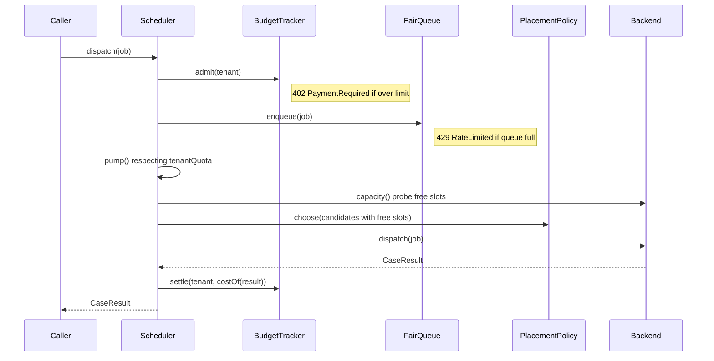
```mermaid
sequenceDiagram
  participant Caller
  participant Scheduler
  participant Budget as BudgetTracker
  participant Queue as FairQueue
  participant Policy as PlacementPolicy
  participant Backend
  Caller->>Scheduler: dispatch(job)
  Scheduler->>Budget: admit(tenant)
  Note right of Budget: 402 PaymentRequired if over limit
  Scheduler->>Queue: enqueue(job)
  Note right of Queue: 429 RateLimited if queue full
  Scheduler->>Scheduler: pump() respecting tenantQuota
  Scheduler->>Backend: capacity() probe free slots
  Scheduler->>Policy: choose(candidates with free slots)
  Scheduler->>Backend: dispatch(job)
  Backend-->>Scheduler: CaseResult
  Scheduler->>Budget: settle(tenant, costOf(result))
  Scheduler-->>Caller: CaseResult
```

- **Scheduler** = capacity-aware + tenant-fair (`FairQueue` WFQ) `Dispatcher`; `RateLimitError` (429) on
  backpressure, `PaymentRequiredError` (402) on budget. **Router** = the simple static `placement.target` `Dispatcher`.
- **Trust zones** — `perTenantTrustZones`/`staticTrustZones` → `TrustZone`; `assertHardenedIsolation` is
  enforced inside `NomadBackend`/`K8sBackend` so untrusted tenants cannot run on a shared kernel; warm
  pools are keyed by zone and never shared across tenants.
- **`buildRuntimeBackend(RuntimeSpec, {secretEnv})`** turns a tenant-registered runtime into a live Backend
  (credentials injected via `secretEnv`, never in the spec). `buildRegistry(BackendsConfig)` builds the static set.
- **Calls:** `@everdict/job-runner` (`LocalBackend`, `DockerBackend`). **Called by:** `@everdict/orchestrator`,
  `@everdict/topology`, `apps/api`, `apps/cli`.

---

## `@everdict/orchestrator` — durable control plane (Temporal)

**Role.** `Orchestrator.run(job)` abstracts direct vs durable execution. The worker holds the `Dispatcher`
(usually the capacity-aware `Scheduler`) and runs the `dispatchCase` activity.

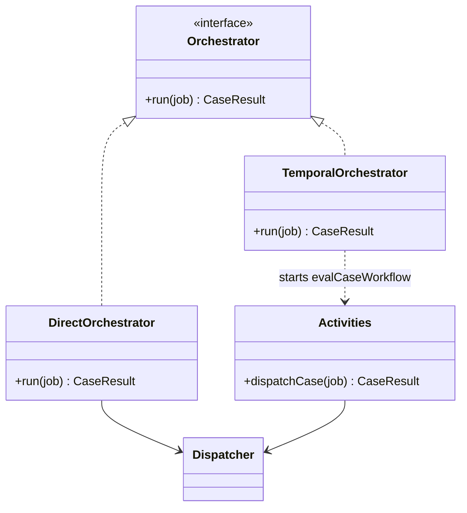
```mermaid
classDiagram
  class Orchestrator {
    <<interface>>
    +run(job) CaseResult
  }
  class DirectOrchestrator {
    +run(job) CaseResult
  }
  class TemporalOrchestrator {
    +run(job) CaseResult
  }
  class Activities {
    +dispatchCase(job) CaseResult
  }
  Orchestrator <|.. DirectOrchestrator
  Orchestrator <|.. TemporalOrchestrator
  DirectOrchestrator --> Dispatcher
  Activities --> Dispatcher
  TemporalOrchestrator ..> Activities : starts evalCaseWorkflow
```

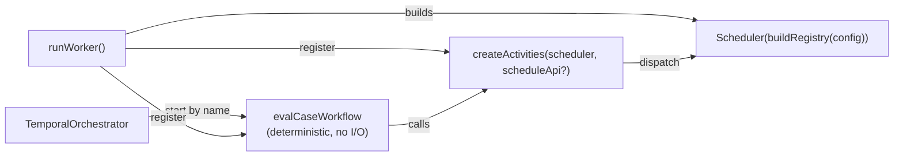
```mermaid
flowchart LR
  TemporalOrchestrator -->|"start by name"| WF["evalCaseWorkflow<br/>(deterministic, no I/O)"]
  Worker["runWorker()"] -->|builds| Scheduler["Scheduler(buildRegistry(config))"]
  Worker -->|register| WF
  Worker -->|register| Act["createActivities(scheduler, scheduleApi?)"]
  WF -->|calls| Act
  Act -->|dispatch| Scheduler
```

- **`DirectOrchestrator(dispatcher)`** — non-durable, in-process (dev / `apps/cli`).
- **`TemporalOrchestrator`** — client side; starts `evalCaseWorkflow` *by name* so the client never imports
  workflow sandbox code. **Workflow code must stay deterministic** — all I/O lives in the activity.
- **`runWorker(opts)`** — long-running; builds the `Scheduler` from `BackendsConfig` (auth env via
  `collectAuthEnv`), registers every workflow in `packages/orchestrator/src/workflows.ts` (`evalCaseWorkflow`,
  `scorecardBatchWorkflow`, `scheduledScorecardWorkflow`, …) and the activities (`dispatchCase`,
  `runBatchCase`, …). **Called by:** `apps/cli` (`everdict worker`).

---

## `@everdict/application-control` + `@everdict/domain` — suites & version regression

**Role.** Fan a `Suite` out over its cases at a given harness version → `Scorecard`; summarize and diff
scorecards for regression. The fan-out, `runSuite`, is a use-case in `@everdict/application-control`
(`packages/application-control/src/run-suite.ts`); the aggregation — `summarizeScorecard`, `diffScorecards`,
`caseVerdict`, `leaderboard` — is pure `@everdict/domain` (`packages/domain/src/scorecard/`). `Dispatch` is just
`(job) → CaseResult`, so any Backend/Router/Scheduler/Orchestrator plugs in.

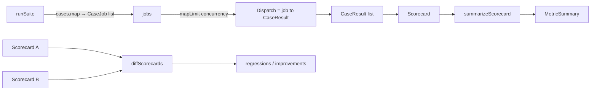
```mermaid
flowchart LR
  runSuite -->|"cases.map → CaseJob list"| jobs
  jobs -->|mapLimit concurrency| Dispatch["Dispatch = job to CaseResult"]
  Dispatch --> results["CaseResult list"]
  results --> Scorecard
  Scorecard --> summarizeScorecard --> MetricSummary
  baseline["Scorecard A"] --> diffScorecards
  candidate["Scorecard B"] --> diffScorecards
  diffScorecards --> ScorecardDiff["regressions / improvements"]
```

- **`runSuite(suite, version, dispatch, {concurrency, onResult, signal, retries})`** — bounded fan-out (`mapLimit`).
- **Called by:** `apps/cli` (`everdict suite`) and the in-process scorecard batch driver
  (`InProcessBatchDriver`, behind `ScorecardService`). The durable batch path runs the same per-case dispatch
  as the Temporal `scorecardBatchWorkflow` instead. `diffScorecards` also backs `GET /scorecards/diff`.

---

## `@everdict/topology` — service-topology harnesses

**Role.** `ServiceTopologyBackend` realizes `Backend` for multi-service harnesses + a browser/OS target env.
Orchestrator-agnostic: a `TopologyRuntime` (Nomad, K8s, or Docker for a self-hosted runner) deploys the topology;
trace comes from `@everdict/trace`.

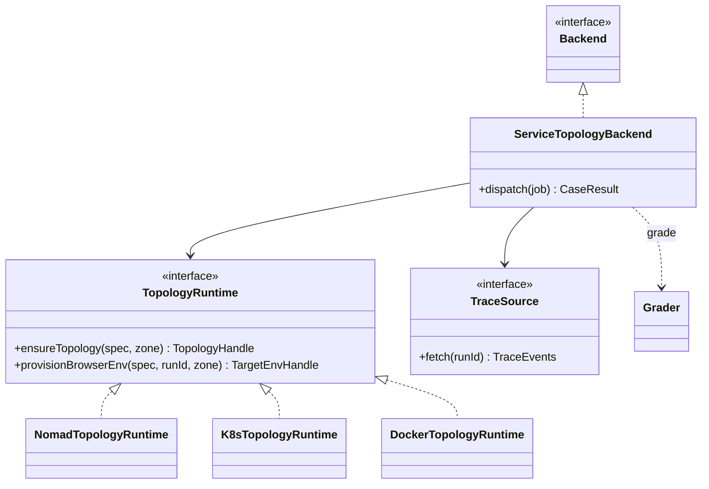
```mermaid
classDiagram
  class Backend {
    <<interface>>
  }
  class TopologyRuntime {
    <<interface>>
    +ensureTopology(spec, zone) TopologyHandle
    +provisionBrowserEnv(spec, runId, zone) TargetEnvHandle
  }
  class ServiceTopologyBackend {
    +dispatch(job) CaseResult
  }
  class TraceSource {
    <<interface>>
    +fetch(runId) TraceEvents
  }
  Backend <|.. ServiceTopologyBackend
  TopologyRuntime <|.. NomadTopologyRuntime
  TopologyRuntime <|.. K8sTopologyRuntime
  TopologyRuntime <|.. DockerTopologyRuntime
  ServiceTopologyBackend --> TopologyRuntime
  ServiceTopologyBackend --> TraceSource
  ServiceTopologyBackend ..> Grader : grade
```

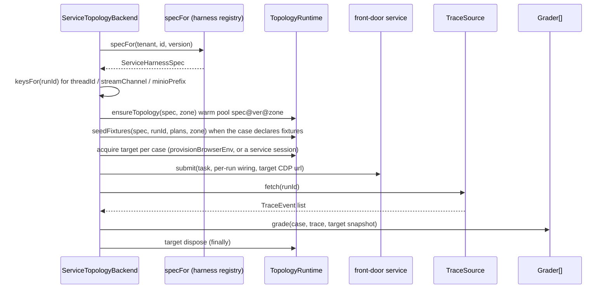
```mermaid
sequenceDiagram
  participant STB as ServiceTopologyBackend
  participant Reg as specFor (harness registry)
  participant RT as TopologyRuntime
  participant FD as front-door service
  participant TS as TraceSource
  participant Gr as Grader[]
  STB->>Reg: specFor(tenant, id, version)
  Reg-->>STB: ServiceHarnessSpec
  STB->>STB: keysFor(runId) for threadId / streamChannel / minioPrefix
  STB->>RT: ensureTopology(spec, zone) warm pool spec@ver@zone
  STB->>RT: seedFixtures(spec, runId, plans, zone) when the case declares fixtures
  STB->>RT: acquire target per case (provisionBrowserEnv, or a service session)
  STB->>FD: submit(task, per-run wiring, target CDP url)
  STB->>TS: fetch(runId)
  TS-->>STB: TraceEvent list
  STB->>Gr: grade(case, trace, target snapshot)
  STB->>RT: target dispose (finally)
```

- **`TopologyRuntime`** — `NomadTopologyRuntime` / `K8sTopologyRuntime` / `DockerTopologyRuntime`; warm topology pool
  keyed by `spec@version@zoneId` (no cross-tenant sharing), per-case target env (`TargetEnvHandle`: `cdpBase?` +
  `snapshot`/`dispose`), acquired through `targetAcquirerFor`.
- **`keysFor(runId)` / `wiringVars`** — deterministic per-run isolation keys mapped onto
  `TopologyDependency.isolateBy` (`thread_id` / `key-prefix` / `object-prefix` / `schema` / `external`).
- **Builders:** `buildNomadTopologyJob` / `buildK8sManifests` (+ browser variants such as `buildBrowserJob`), `resolvePort`.
  See `docs/service-harness.md`.

---

## `@everdict/db` — result & secret stores

**Role.** Persistence behind ports: `RunStore`, `ScorecardStore`, `TenantKeyStore`, `SecretStore` (and many more
stores not drawn). The port interfaces are declared in `@everdict/application-control` (`packages/application-control/src/ports/`)
and re-exported here beside the implementations. Each has an `InMemory*` (dev/test) and a `Pg*` (Postgres) variant
over a shared `SqlClient`.

```mermaid
classDiagram
  class RunStore {
    <<interface>>
    +create(record)
    +get(id) RunRecord
    +update(id, patch) RunRecord
    +list(tenant) RunRecords
  }
  class ScorecardStore {
    <<interface>>
    +create(record)
    +get(id) ScorecardRecord
    +update(id, patch)
    +list(tenant) ScorecardRecords
  }
  class TenantKeyStore {
    <<interface>>
    +add(tenant, keyHash, meta?)
    +resolveByHash(keyHash) {tenant, scopes?}
  }
  class SecretStore {
    <<interface>>
    +set(ws, name, value)
    +list(ws) SecretMetas
    +remove(ws, name)
    +entries(ws) Secrets
  }
  class SqlClient {
    <<interface>>
    +query(text, params) Rows
  }
  class SecretCipher {
    +encrypt(plain) EncryptedSecret
    +decrypt(enc) plain
  }
  RunStore <|.. InMemoryRunStore
  RunStore <|.. PgRunStore
  ScorecardStore <|.. InMemoryScorecardStore
  ScorecardStore <|.. PgScorecardStore
  TenantKeyStore <|.. InMemoryTenantKeyStore
  TenantKeyStore <|.. PgTenantKeyStore
  SecretStore <|.. InMemorySecretStore
  SecretStore <|.. PgSecretStore
  PgRunStore --> SqlClient
  PgScorecardStore --> SqlClient
  PgTenantKeyStore --> SqlClient
  PgSecretStore --> SqlClient
  PgSecretStore --> SecretCipher
```

- **`RunRecord`** carries `status` (queued/running/suspended/succeeded/failed), the `CaseResult` (`result`), and a derived
  `RunUsageSummary` (`usage`). **`ScorecardStore.list`** omits the heavy per-case `scorecard` column.
- **`TenantKeyStore`** stores only `hashKey(ak_…)`; `issueKey` returns plaintext once → backs API-key auth.
- **`SecretStore`** encrypts at rest (`aesGcmCipher`, `cipherFromEnv(EVERDICT_SECRETS_KEY)`); `entries(tenant)`
  returns decrypted env for model-judge keys / runtime credentials.
- **`migrate` / `preflight`** — idempotent numbered SQL migrations (expand→contract). See `docs/migration/`.
- **Consumed by:** `@everdict/registry` (Pg registries reuse `SqlClient`), `@everdict/auth` (`TenantKeyStore`), `apps/api`, `apps/agent`.

---

## `@everdict/registry` — versioned SSOT

**Role.** `(tenant, id, version) → spec` for every versioned entity family — harness templates and instances,
datasets, judges, rubrics, models, agents, runtimes, environments, benchmarks — with immutable versions, semver
`latest`, tenant-owned with `_shared` fallback. The same shape each time; the diagram draws four. The registry
port interfaces are declared in `@everdict/application-control` and re-exported here beside the implementations.
The harness split into template + instance is [harness-taxonomy.md](harness-taxonomy.md).

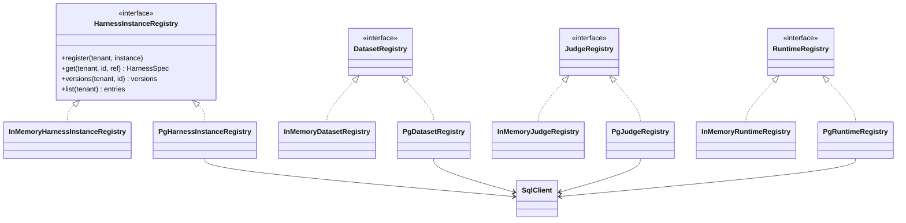
```mermaid
classDiagram
  class HarnessInstanceRegistry {
    <<interface>>
    +register(tenant, instance)
    +get(tenant, id, ref) HarnessSpec
    +versions(tenant, id) versions
    +list(tenant) entries
  }
  class DatasetRegistry {
    <<interface>>
  }
  class JudgeRegistry {
    <<interface>>
  }
  class RuntimeRegistry {
    <<interface>>
  }
  HarnessInstanceRegistry <|.. InMemoryHarnessInstanceRegistry
  HarnessInstanceRegistry <|.. PgHarnessInstanceRegistry
  DatasetRegistry <|.. InMemoryDatasetRegistry
  DatasetRegistry <|.. PgDatasetRegistry
  JudgeRegistry <|.. InMemoryJudgeRegistry
  JudgeRegistry <|.. PgJudgeRegistry
  RuntimeRegistry <|.. InMemoryRuntimeRegistry
  RuntimeRegistry <|.. PgRuntimeRegistry
  PgHarnessInstanceRegistry --> SqlClient
  PgDatasetRegistry --> SqlClient
  PgJudgeRegistry --> SqlClient
  PgRuntimeRegistry --> SqlClient
```

- **Version resolution** — `compareVersions` / `sortVersions` (the version algebra is `@everdict/domain`); `latest` =
  highest semver; `specsEqual` guards immutability (re-registering a version with a different spec → conflict).
- **GitOps source** — `loadHarnessTaxonomyDir` seeds the harness template and instance registries from files.
- **Consumed by:** `apps/api` (route + service resolution; it also wires `ServiceTopologyBackend.specFor` to the
  harness instance registry — `@everdict/topology` never imports the registry) and `apps/agent`. See `docs/registry.md`, `docs/datasets.md`, `docs/judges.md`, `docs/runtimes.md`.

---

## `@everdict/auth` — control-plane auth core

**Role.** Resolve any credential to a `Principal{subject, workspace, roles, via}`, then gate actions by role.
`workspace = tenant = trust-zone`. Consumed by `apps/api`; the web is a courier, not an authority. `Principal` and the
role→action matrix are `@everdict/domain` (`packages/domain/src/auth/`); this package holds the authenticators and
re-exports `can`/`authorize` beside them.

```mermaid
classDiagram
  class Authenticator {
    <<interface>>
    +authenticate(bearer) Principal
  }
  class Principal {
    +subject
    +workspace
    +roles
    +via
  }
  class authz {
    +can(principal, action) bool
    +authorize(principal, action)
  }
  Authenticator <|.. compositeAuthenticator
  Authenticator <|.. oidcAuthenticator
  Authenticator <|.. apiKeyAuthenticator
  Authenticator <|.. runnerAuthenticator
  Authenticator <|.. githubActionsAuthenticator
  Authenticator <|.. agentTokenAuthenticator
  compositeAuthenticator o-- oidcAuthenticator
  compositeAuthenticator o-- apiKeyAuthenticator
  apiKeyAuthenticator ..> TenantKeyStore
  oidcAuthenticator ..> Principal
  authz ..> Principal
```

- **`oidcAuthenticator`** — verifies Keycloak JWT via `jose` JWKS, extracts `workspace` + roles (fail-closed → `undefined`).
- **`apiKeyAuthenticator`** — `ak_…` → `TenantKeyStore.resolveByHash(hashKey(...))` (`@everdict/db`) → `{ workspace, scopes? }`.
- **`runnerAuthenticator` / `githubActionsAuthenticator` / `agentTokenAuthenticator`** — self-hosted runner tokens,
  GitHub Actions OIDC and agent tokens; `buildAuthenticator` (`apps/api`) composes them, OIDC only when it is configured.
- **`authz`** — `EVERDICT_ROLES = viewer ⊂ member ⊂ admin`; `authorize` throws `ForbiddenError` (403); per-key `scopes` (`read|write|admin`) intersect the role matrix. See `docs/auth.md`.
- **Consumed by:** `apps/api` (every route guard + `/me` + MCP). See `docs/tenancy.md`.

---

## `apps/api` — control-plane HTTP surface (BFF + MCP)

**Role.** The multi-tenant Fastify control plane: it composes *all* of the above into auth → service →
dispatch → store. `RunService` and `ScorecardService` come from `@everdict/application-control`;
`RuntimeDispatcher` and `defaultJudgeRunner` are the local glue (`apps/api/src/core/execution/`).

```mermaid
flowchart TD
  subgraph wiring["startup wiring (main.ts → composition/*)"]
    persistence["Pg* or InMemory stores + registries"]
    sched["BackendRegistry → Scheduler + persistentBudget"]
    rtd["RuntimeDispatcher {inner: Scheduler, backends, runtimes, secretsFor}"]
    jr["defaultJudgeRunner {secretsFor, dispatch, harnesses, models, rubrics}"]
    runsvc["RunService {dispatcher, store, budget, resolveHarness}"]
    scoresvc["ScorecardService {dispatcher, stores, registries, judge runner}"]
    authn["buildAuthenticator → composite(github-actions, oidc, apiKey, agent token, runner)"]
  end

  authn --> server["buildServer / buildMcpServer (parity)"]
  runsvc --> server
  scoresvc --> server
  rtd --> runsvc
  rtd --> scoresvc
  scoresvc --> jr

  server -->|"POST /runs"| runsvc
  server -->|"POST /scorecards · /scorecards/ingest"| scoresvc
  server -->|"GET/POST harnesses · datasets · judges · runtimes"| registry["@everdict/registry"]
  jr -->|"model judge key"| secrets["SecretStore"]
  jr -->|"harness judge"| dispatch2["dispatch (Scheduler)"]
```

- **`POST /runs`** → gated by `runs:submit` → `RunService.submit`: `budget.admit` →
  `RunStore.create(queued)` → fire-and-forget `track` (resolve `HarnessSpec`, build `CaseJob`,
  `dispatch`, `budget.settle`, `RunStore.update`) → 202 + run id. Optional webhook.
- **`POST /scorecards`** → `ScorecardService.submit` (202) → `ScorecardBatchService` tracks the batch through the
  `InProcessBatchDriver` (`runSuite(…, dispatch)`) or the `WorkflowBatchDriver` (Temporal) → `ScoringService.applyJudges`
  (per case, via `JudgeRunner`: model judges call the provider with the tenant's `SecretStore` key; harness judges
  `dispatch` an agent) → `ScorecardStore`. `GET /scorecards/diff` = `diffScorecards`; **`POST /scorecards/ingest`**
  scores externally-run `TraceEvent[]` with no harness run (judges-only path), and `POST /scorecards/ingest/pull`
  pulls them from a trace source first.
- **`RuntimeDispatcher`** — reads `placement.target`, resolves the tenant `RuntimeSpec`
  (`RuntimeRegistry`), `buildRuntimeBackend` (with tenant secrets), routes through the inner `Scheduler`.
- **`/mcp`** — Streamable HTTP (`apps/api/src/mcp.routes.ts`), OAuth (Keycloak) + API keys; tools mirror the BFF
  routes, each gated by the same role→action matrix. See `docs/api.md`, `docs/mcp.md`, `docs/scorecards.md`.

---

## `apps/cli` — dev / single-run control plane

**Role.** Thin wiring for local runs: pick an orchestrator, build a Backend set, dispatch. It also carries the
self-hosted runner (`everdict runner`, over `@everdict/self-hosted-runner`) and image/task-set helpers
(`everdict image push|bake`, `everdict tasks prebuild`), not drawn.

```mermaid
flowchart LR
  run["everdict run"] --> orch{orchestrator?}
  orch -->|direct| DO["DirectOrchestrator(Router)"]
  orch -->|temporal| TO["TemporalOrchestrator"]
  DO --> Router["Router(buildRegistry(config))"]
  Router --> B["LocalBackend / NomadBackend"]
  run --> job[CaseJob] --> DO

  worker["everdict worker"] --> runWorker["@everdict/orchestrator.runWorker"]
  suite["everdict suite"] --> runSuite["@everdict/application-control.runSuite"]
  suite --> diff["diffScorecards (--baseline)"]
```

- **`everdict run`** builds an `CaseJob` and an `Orchestrator` (Direct over `Router`, or Temporal), calls `run(job)`.
- **`everdict worker`** → `runWorker` (the durable side). **`everdict suite`** → `runSuite` (+ regression diff).
- **Depends on:** `@everdict/orchestrator`, `@everdict/backends`, `@everdict/job-runner`, `@everdict/application-control`,
  `@everdict/domain`, `@everdict/contracts`, `@everdict/self-hosted-runner`, `@everdict/topology`, `@everdict/datasets`.

---

## `apps/web` — SaaS dashboard (pure HTTP client)

**Role.** Next.js dashboard. Its only `@everdict/*` dependency is **type-only** `@everdict/contracts` (enforced by
`pnpm web-imports`, `scripts/check-web-imports.mjs`) — it talks to `apps/api` over HTTP only. A token courier: Auth.js (Keycloak) puts the access token in a server-only cookie and forwards it as `Bearer`;
`GET /me` returns workspace + roles (UI gating mirrors the control plane, which enforces).

```mermaid
flowchart LR
  user[Human] --> NextAuth["Auth.js + Keycloak"]
  NextAuth --> cookie["httpOnly access token"]
  cookie --> controlPlane["controlPlane fetch wrapper (Bearer)"]
  controlPlane -->|"GET /me"| api["apps/api"]
  controlPlane -->|"runs · harnesses · datasets · judges · runtimes · scorecards"| api
  subgraph fsd["FSD layers"]
    pages["app/[workspace]/*"] --> widgets --> features --> entities
  end
  pages --> controlPlane
```

- **Boundary:** humans → Keycloak; agents → API keys / MCP. The web never holds authority; it forwards.
  See `docs/web.md`, `docs/auth.md`.

---

## Not zoomed here

These modules appear in 1.1 but have no high-zoom section on this page:
`@everdict/application-control` beyond `runSuite` (use-cases + ports), `@everdict/llm` (provider-native transports),
`@everdict/datasets` (task-format on-ramps), `@everdict/storage` (`ArtifactStore` impls), `@everdict/images`
(managed image store adapters), `@everdict/self-hosted-runner` and `apps/desktop` ([self-hosted-runner.md](self-hosted-runner.md),
[desktop-app.md](desktop-app.md)), `@everdict/agent-runtime` and `apps/agent` (skill `agent-runtime`), and the user-facing
`@everdict/sdk` ([one-call-sdk.md](one-call-sdk.md)) and `@everdict/otel`. The per-package role table is
`.claude/skills/foundation/references/architecture.md`.

## Where to go next

- Narrative map & extension points — [`overview.md`](overview.md)
- Backend vs Driver, scheduling, trust zones — [`../execution-backends.md`](../execution-backends.md)
- Service harnesses & trace ingestion — [`../service-harness.md`](../service-harness.md)
- HTTP API & MCP — [`../api.md`](../api.md) · [`../mcp.md`](../mcp.md)
- Conventions (SSOT) — [`CLAUDE.md`](https://github.com/everdict/everdict/blob/main/CLAUDE.md) + `../../.claude/`
</content>
