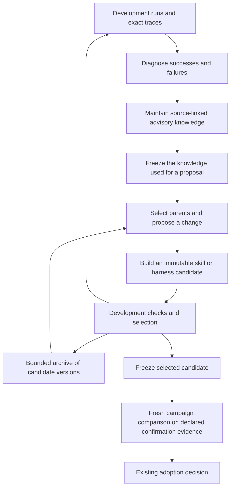

# Evolution research directions

The proposed direction is to make Everdict learn from development experience and produce better reusable
skills and harnesses per unit of search cost. Prioritize a persistent advisory knowledge layer, explicit
candidate proposals, and a bounded archive of alternative candidates. Then expand into routing, structural
harness edits, and evolution of the learning procedure itself. This is a proposed engineering direction,
not a shipped implementation or an accepted performance claim.

The [literature review](evolution-literature-review.md) inventories WikiSkill, all 46 of its direct
references, and 13 complementary papers. Paper IDs below refer to that catalogue. Source observations use
main at `42f5c7abc724b2e914b4efee9666cf68794f6748`; measurements proposed below have not been run.

## The choice and the alternatives

The campaign already records a comparison and derives its settlement. Candidate generation is driven by
the owner agent and its procedures, including the examples in
[first-party capabilities](https://github.com/everdict/everdict/blob/42f5c7abc724b2e914b4efee9666cf68794f6748/packages/application-control/src/capability/first-party.ts).
The research should strengthen that generation loop without making the campaign record responsible for
search scheduling. A driver remains replaceable and can evolve independently of the evidence and adoption
rules it consumes.

The alternative of only adding more evaluation checks would leave proposal quality mostly dependent on
unstructured agent judgment. The alternative of putting the entire search algorithm into the campaign
service would couple a stable comparison contract to changing research methods. A third alternative,
automatically adopting whichever candidate has the best recent scalar score, would discard useful
specialists and blur development selection with confirmation. The proposed split supports controlled
experiments with several search methods while retaining the existing settlement boundary.

The concrete missing connection is between an observed outcome and a reusable improvement mechanism.
Current rounds carry `hypothesis`, `learned`, and `informedBy`, and briefs assemble earlier findings. Those
are valuable provenance and advice channels, but they do not by themselves curate contradictory lessons,
select complementary parents, or measure whether a generated skill is discovered in production. The next
changes should supply those behaviors and demonstrate their benefit.

## Proposed loop

The diagram is a proposed driver procedure, not a new campaign state machine. Rejected development
proposals still contribute observations; retaining a candidate for search does not qualify it for adoption.
Confirmation evidence follows the declared access and attempt budget, with no implicit path back into
development knowledge. Runtime memory is a separate candidate feature when the intended deployed agent
uses it, and its evaluated state must be identified accordingly.

## C1 — Maintain reusable knowledge from development experience

**Decision proposed.** Add a curator procedure that consumes completed development traces, candidate diffs,
and outcomes, then updates small source-linked lessons. Each lesson should identify the observed condition,
proposed mechanism, supporting and contradicting evidence, applicable entity versions, and current
confidence or unresolved questions. Preserve the raw observation when a lesson is revised or discarded.
WikiSkill motivates persistence, Trace2Skill supports trajectory-grounded diagnosis, and ACE and
ReasoningBank supply alternative maintenance and extraction approaches.[^1][^2]

Reuse [knowledge entries](https://github.com/everdict/everdict/blob/42f5c7abc724b2e914b4efee9666cf68794f6748/packages/contracts/src/records/knowledge-entry.ts) and the existing graph
for claim provenance, subject pins, and superseding relationships. The current
[knowledge-entry service](https://github.com/everdict/everdict/blob/42f5c7abc724b2e914b4efee9666cf68794f6748/packages/application-control/src/knowledge/knowledge-entry-service.ts)
treats extraction proposals as awaiting review; automatic curation must not silently promote machine advice
into reviewed workspace knowledge. Begin with a driver-owned derived advisory view over source references,
and offer useful claims through the existing proposal path. This avoids introducing another authoritative
knowledge registry or changing the meaning of `active` as a side effect of the experiment.

Freeze the exact advisory content and source references used by each proposal. Subject version pins and
entry IDs alone cannot reproduce a proposal if the entry body later changes. A snapshot is derived input,
not a new verdict source; an unavailable required input must fail or be explicitly omitted by a recorded
driver policy. Development runs may compare memory policies, but a campaign must not silently substitute
whatever memory is current at evaluation time.

**First experiment.** Compare existing accumulated round notes, a same-budget flat history, and a curated
projection using identical candidate and executor budgets. Count repeated failed proposals, usable
source-supported lessons, proposal success on new development cases, and later confirmation performance.
The curated version should survive only if future-task benefit justifies its curation and retrieval cost.
Persistent storage volume or the number of written lessons is not a success metric.

## C2 — Make candidate changes explicit and focused

**Decision proposed.** The driver should record a structured proposal before it edits an artifact: parent
versions, development evidence references, chosen mutation surface, expected behavioral change, protected
successful behavior, and an edit budget. Keep the human-readable hypothesis, with the structured record
linking it to the actual built diff and resulting candidate identity. Start as a driver artifact; add shared
contract fields only when a real consumer needs to query or enforce them.

The proposer can use a trajectory analyst, a patch builder, and a consolidation pass as logical roles;
they need not be separate models or concurrently executing agents. A failure with no supported explanation
should remain unresolved. For a repeated known failure, edit the smallest component likely to change it:
activation metadata, skill instructions, executable helper, tool interface, memory policy, or workflow.
SkillOpt and SkillGrad motivate bounded updates; AHE motivates recording a prediction before observing the
result.[^3]

For example, a spreadsheet agent that overwrites formulas while changing values should produce a proposal
to preserve formula cells, with development trace links and a prediction about affected task families.
If the problem is that the relevant spreadsheet skill never loads, editing its body alone is a weak
hypothesis; test routing instead. These are illustrative experiments, not defects established in Everdict.
Compare predicted effects with per-case outcomes and use targeted ablations before making causal claims.

**First experiment.** Compare unrestricted rewrites with bounded, diagnosed edits under the same total
budget. Measure duplicate candidate digests, invalid builds, regression frequency, and new-case gains.
When a local search stalls, allow a separately accounted structural proposal instead of repeatedly
paraphrasing the same instructions. Record rejected and failed attempts so “sample efficiency” includes
the work that never produced an evaluable candidate.

## C3 — Retain alternative parents in a bounded search archive

**Decision proposed.** Add a reference search driver with an archive of immutable candidate versions and
development results. Start by comparing a greedy current-best baseline with a GEPA-inspired per-case
specialist selector. A later variant can preserve behavioral niches or mix score-based and exploratory
selection, drawing on DGM, AFlow, and MAP-Elites. Do not call top-k aggregate selection a diverse frontier
unless the retained candidates actually cover different measured capabilities.[^4]

Archive admission and adoption must have different meanings. A viable neutral candidate may be worth
keeping because it solves an otherwise unsolved development case or supplies a new reusable mechanism.
Limit archive size, inactive-parent retention, branch count, and total rollout spend; store the selection
reason and policy version. Preserve source evidence even if an artifact leaves the active archive, and
make artifact retention consistent with whatever references remain live.

The existing [parallel evolution model](parallel-evolution.md) distinguishes campaign continuation from
advice shared through `informedBy`. Reuse those meanings. Candidate construction can draw actual bytes from
multiple parents, requiring explicit parent-version provenance for the resulting artifact; that is separate
from the tree of campaign settlements. Any adopted descendant still needs fresh comparison with its
campaign’s fixed baseline, including a merged descendant of previously successful branches.

**First experiment.** Give greedy search and specialist selection the same complete compute budget, then
measure final confirmation quality and the capability coverage of the active archive. Include a case where
a neutral intermediate variant enables a later gain. A better archive is one that produces better future
candidates, not one that preserves more variants indefinitely.

## C4 — Evolve skill discovery and use together

**Decision proposed.** Measure the path from a task request to a skill being found, loaded, observably used,
and useful. [Knowledge context assembly](https://github.com/everdict/everdict/blob/42f5c7abc724b2e914b4efee9666cf68794f6748/packages/application-control/src/knowledge/knowledge-service.ts)
already exposes listing-level skill information, and
[skill service](https://github.com/everdict/everdict/blob/42f5c7abc724b2e914b4efee9666cf68794f6748/packages/application-control/src/skill/skill-service.ts) manages versions. Extend the
appropriate execution instrumentation to bind retrieval and load events to those exact versions. Confirm
which adapters can emit each event before treating missing telemetry as a failure to use a skill.

SkillsBench supplies a useful supplied-skill control; SkillRouter, SkillRet, and Skill Retrieval Augmentation
show why retrieval and application need their own measurements.[^5] Compare no-skill execution, a relevant
skill supplied by the experiment designer, and normal production selection. The supplied condition is an
experimental upper-bound diagnostic only. Use distractor skills and tasks that need no skill to identify
over-eager loading and interference.

A load event proves access, not application. Observable tool behavior or artifacts can support application
claims; inferred use should remain explicitly uncertain. Measure downstream success and latency with and
without the skill to estimate utility. Evolve descriptions and routing policy alongside bodies only after
the measurements identify which stage loses the potential benefit.

**First experiment.** Use a small pinned library with confusable skills, then vary only the selector or
activation metadata. Measure task success, irrelevant loads, missed useful skills, and additional inference
cost. Recheck a new skill on production selection before declaring that skill evolution improved the
deployed agent.

## C5 — Use development cascades and reserve confirmation

**Decision proposed.** Make three roles explicit in the experiment manifest: development feedback for
diagnosis, selection evidence for choosing among candidates, and confirmation for the final comparison.
This is a proposed experiment discipline; the current frame’s `heldOut` flag is not an implemented
three-part split. Use separately identified development scorecards and a predeclared confirmation campaign
first, without pretending that old development runs can become adoption evidence retroactively.

Cheap checks can reject invalid bundles, syntax errors, impossible tool calls, and deterministic development
regressions before an expensive selection run. AlphaEvolve motivates evaluation cascades, while CoEvoSkills
motivates generating useful counterexamples during development.[^6] Adaptive selection data is still
development knowledge for statistical purposes. Neither a surrogate judge’s approval nor repeated binary
confirmation feedback establishes fresh generalization evidence.

Preserve the existing family attempt accounting and adoption predicate; do not use a separate driver
budget to evade either. Freeze the candidate before its confirmation comparison and predeclare how many
such comparisons can be requested. If confirmation results influence subsequent proposals, treat that
access as part of the adaptive family and reserve new untouched evidence for a later independent claim.
Masking case identifiers alone cannot prevent lessons from encoding case-specific information.

**First experiment.** Compare full-cost evaluation of every proposal with a development cascade at the same
total spend. Measure invalid candidates filtered, strong candidates mistakenly filtered, and final
confirmation outcomes. The cascade is useful only if its savings lead to more effective search without
silently changing the claimed benchmark population.

## C6 — Broaden evolution from prompt text to harness components

**Decision proposed.** Offer a small explicit set of mutation operators for tools, memory selection,
context compression, recovery behavior, and workflow structure. These are driver capabilities that produce
ordinary versioned harness candidates, including multi-slot build sets when a hypothesis changes several
components. Start with interfaces and deterministic checks for each operator rather than a new universal
workflow language.

Meta-Harness, HarnessX, AHE, ADAS, and AFlow motivate this larger search space.[^7] An operator could extract
a repeated tool sequence into a reusable executable skill, add state validation before an action, or change
when the agent escalates. Test the component boundary and the full task behavior; improving an intermediate
counter while degrading the end result is a failed candidate. When two components change together, an
ablation is needed to distinguish individual benefit from interaction.

**First experiment.** Choose a failure family with a concrete structural diagnosis and compare a text-only
edit against an executable helper or workflow edit. Reuse existing build and evidence paths described in
[code evolution](code-evolution-loop.md) and [evolution routing](evolution-routing-spec.md).
Do not edit the benchmark oracle as an agent-improvement operator. The existing merge-base check that
closed the [September 10 review finding](evolution-review-2026-09-10.md) remains a prerequisite.

## C7 — Evaluate transfer and then evolve the optimizer

**Decision proposed.** Treat proposer, executor, and curator configurations as independently identified
experimental inputs. Compare a small proposer × executor matrix instead of choosing a proposer solely by
its own task score. Track skill applicability across models, harness versions, and task families, and
re-evaluate when any of those boundaries changes. Development transfer is a hypothesis until the receiving
configuration is tested.

Once a basic loop demonstrates repeatable gains, compare two versions of the evolution procedure itself.
Meta Context Engineering provides a direct precedent for evolving the context-engineering skill, while
SkillOS motivates evaluating curation by delayed utility.[^8] Freeze a sequence of development tasks and
the available budget for each optimizer version. Judge it by the independently confirmed quality and cost
of the downstream artifacts it produces, including later tasks that were not used to write its procedure.

**First experiment.** Compare a fixed proposer procedure with one learned on separate development campaigns,
using fresh task families and the same total budget. Require downstream improvement rather than a better
self-evaluation or longer generated plan. Keep the experiment bounded: this proposal does not ask the
driver to mutate its own adoption authority, budget accounting, or evaluation access policy.

## C8 — Explore curricula and weight adaptation after the first loop works

**Decision proposed.** Add generated development challenges and skill-composition tasks only after the
experience-to-candidate loop has demonstrated transfer. Voyager, SkillCraft, and POET suggest measuring
new reusable behaviors and transferring skills between task families.[^9] Keep generated tasks in a
separate, versioned development collection. Periodically compare against a fixed external task population
so a moving curriculum cannot redefine success.

The weight-adaptation family—SKILL0, Skill1, SkillRL, and MetaClaw—can become a later model-evolution
experiment. These methods change learned policy or model parameters as well as skills, so a markdown-only
candidate identity is insufficient.[^10] Capture model checkpoints, training data provenance, adaptation
windows, and full compute cost before comparing with frozen-model skill search. Start this branch only if
measured bottlenecks justify training infrastructure and the result has a deployable, identifiable artifact.

## Experiment sequence and acceptance evidence

Begin with a pilot on imported Terminal-Bench tasks; the existing
[Terminal-Bench importer](https://github.com/everdict/everdict/blob/42f5c7abc724b2e914b4efee9666cf68794f6748/packages/datasets/src/terminal-bench.ts) is a concrete integration point.
Use a second artifact or tool-composition family to test transfer. SpreadsheetBench is a useful candidate,
but verify its task assets, grader, and execution adapter in the intended deployment before naming it a
ready-to-run integration. ALFWorld and SkillCraft require equivalent integration work if selected.

Choose tasks with headroom before starting, then freeze assignments and trial seeds. A small development
pilot can tune the procedure; it cannot also serve as the final evidence for that tuned procedure. Fix an
overall resource budget covering proposer, curator, builder, executor, and judge work, including retries and
failed submissions. If all search overhead cannot yet be attributed, report that missing accounting instead
of claiming equal-cost superiority.

| Stage | Comparison | Primary question | Evidence required before expanding |
|---|---|---|---|
| 1: Knowledge, C1–C2 | Current notes vs equal-budget flat history vs curated lessons | Does experience improve later proposals? | Source-faithful lessons, fewer repeated mistakes, future-case utility and complete cost |
| 2: Search, C3–C5 | Greedy parent choice vs specialist archive; with/without cascade | Does search find better candidates per budget? | Independent confirmation, archive coverage, filter misses, all attempts counted |
| 3: Deployed skills, C4 | No skills vs supplied relevant skills vs actual retrieval | Does the agent realize the generated skill’s benefit? | Version-bound loads, observable use, task success, irrelevant-load and latency costs |
| 4: Structure, C6 | Text change vs component change and targeted ablations | Is the failure better addressed in code or workflow? | Full-task gains, preserved successful behavior, verified executable artifacts |
| 5: Transfer, C7 | Different proposer/executor pairs and optimizer versions | Does learning transfer, including how to learn? | Fresh receiving configurations and task families; downstream gains at equal total cost |
| 6: Expansion, C8 | Fixed tasks vs generated curriculum; frozen model vs trained model | Does a larger adaptation space justify its cost? | Fixed external reference population and complete model/data identities |

Use a vector of measurements: final task success, regressions by capability, monetary cost, latency,
invalid-candidate rate, repeated-proposal rate, and benefit on later tasks. Report learning curves against
total spend, with intervals or replicate variation appropriate to the available task families; do not
collapse stochastic search into the best seed. Archive diversity, lesson counts, and skill load rates are
diagnostics that explain outcomes, not substitutes for them.

Set numerical acceptance thresholds and sample sizes before each confirmation experiment, using pilot
variance and the existing campaign’s attainable significance constraints. No universal “+5%” threshold or
paper-reported gain is assumed here. Prefer the smallest mechanism whose confirmed benefit exceeds its
measured cost and complexity. An inconclusive pilot is a reason to change the experiment or stop a branch,
not to relax adoption after seeing the result.

## Delivery order and reopening conditions

The first implementation should combine **C1 and C2** in one reference driver experiment over existing
records. It should produce linked knowledge snapshots, pre-edit proposals, immutable candidates, and a
learning curve against the current procedure. Follow with **C3 and C5**, then **C4 and C6** as failures reveal
whether search, discovery, or executable behavior is limiting progress. C7 and C8 depend on measured
benefits in those earlier stages; they are separate research branches rather than prerequisites.

Before implementation, use the repository’s [intent process](https://github.com/everdict/everdict/blob/42f5c7abc724b2e914b4efee9666cf68794f6748/intent/README.md) to turn the selected
experiment into an intent and scoped design. Any new effect path must name the durable operation before
dispatch, preserve source identity, handle unknown reads explicitly, and verify completion through the
existing execution mechanisms. This document adds no effect path or adoption reader; it records the choice
and its tests so the eventual implementation can be reviewed against them.

Reopen the knowledge-layer choice if same-budget flat history matches or beats curation; reopen the archive
choice if it costs more without producing better descendants; reopen routing work if supplied skills have
no benefit even under ideal selection. Reopen the driver/platform boundary only when multiple independent
drivers need a shared enforced contract. The evidence for any reversal should update this proposed decision
before acceptance, or supersede it after acceptance.

## Primary research behind the choices

[^1]: Tang et al., [WikiSkill, v1](https://arxiv.org/abs/2608.27454v1), and Ni et al., [Trace2Skill, v5](https://arxiv.org/abs/2603.25158v5). S00 and R23 in the catalogue.
[^2]: Zhang et al., [ACE, v3](https://arxiv.org/abs/2510.04618v3), and Ouyang et al., [ReasoningBank, v2](https://arxiv.org/abs/2509.25140v2). E08–E09.
[^3]: Yang et al., [SkillOpt, v2](https://arxiv.org/abs/2605.23904v2); Wang et al., [SkillGrad, v1](https://arxiv.org/abs/2605.27760v1); Lin et al., [Agentic Harness Engineering, v4](https://arxiv.org/abs/2604.25850v4). R38, R34, R17.
[^4]: Agrawal et al., [GEPA, v2](https://arxiv.org/abs/2507.19457v2); Zhang et al., [DGM, v3](https://arxiv.org/abs/2505.22954v3) and [AFlow, v4](https://arxiv.org/abs/2410.10762v4); Mouret and Clune, [MAP-Elites](https://arxiv.org/abs/1504.04909v1). R01, E06, E05, E10.
[^5]: Li et al., [SkillsBench, v4](https://arxiv.org/abs/2602.12670v4); Zheng et al., [SkillRouter, v5](https://arxiv.org/abs/2603.22455v5); Cho et al., [SkillRet, v3](https://arxiv.org/abs/2605.05726v3); Su et al., [Skill Retrieval Augmentation, v3](https://arxiv.org/abs/2604.24594v3). R15, R45, R06, R33.
[^6]: Novikov et al., [AlphaEvolve](https://arxiv.org/abs/2506.13131v1), and Zhang et al., [CoEvoSkills, v3](https://arxiv.org/abs/2604.01687v3). E07, R44.
[^7]: Lee et al., [Meta-Harness](https://arxiv.org/abs/2603.28052v1); Chen et al., [HarnessX, v3](https://arxiv.org/abs/2606.14249v3); Hu et al., [ADAS, v2](https://arxiv.org/abs/2408.08435v2); AHE and AFlow above. R14, R05, E04.
[^8]: Ye et al., [Meta Context Engineering, v2](https://arxiv.org/abs/2601.21557v2), and Ouyang et al., [SkillOS](https://arxiv.org/abs/2605.06614v1). R40, R24.
[^9]: Wang et al., [Voyager, v2](https://arxiv.org/abs/2305.16291v2) and [POET, v3](https://arxiv.org/abs/1901.01753v3); Chen et al., [SkillCraft, v2](https://arxiv.org/abs/2603.00718v2). E03, E11, R04.
[^10]: Lu et al., [SKILL0, v2](https://arxiv.org/abs/2604.02268v2); Shi et al., [Skill1, v3](https://arxiv.org/abs/2605.06130v3); Xia et al., [SkillRL](https://arxiv.org/abs/2602.08234v1) and [MetaClaw](https://arxiv.org/abs/2603.17187v1). R20, R30, R35, R36.
