# Auth — collaboration model

> Principal + role/scope matrix + authenticator adapters + active-workspace resolution. Companion
> to `../00-target-architecture.md` (§4 `domain/auth`, §9). Status: PROPOSED — review artifact, no
> code moves.

## Purpose & language

Every credential resolves to the ONE identity type — **`Principal{subject, workspace, roles, via,
email?, scopes?, runnerId?}`** — and every mutating operation is gated by the flat **role→action
matrix** (`packages/auth/src/authz.ts` — the domain SSOT). `workspace = tenant = trust-zone key`:
there is exactly one tenancy axis, and it feeds isolation (trust zones), fairness (WFQ), budget,
stores, and registries alike. Four authenticator adapters (GitHub-Actions OIDC federation,
Keycloak OIDC, API key, runner token) compose behind one `Authenticator` interface; the
**active workspace** is resolved per request afterwards (`applyActiveWorkspace`).

Language rules worth pinning:
- *via* — the credential kind (`oidc | api-key | runner | github-actions`). Some rules key off it:
  machine credentials (`runner`, `github-actions`) never bootstrap membership; invite acceptance is
  OIDC-only.
- *role vs scope* — roles come from **membership** (per workspace, cumulative
  `viewer ⊂ member ⊂ admin`); an API key's `scopes` (`read|write|admin`) **narrow by
  intersection** — a scoped key never exceeds its issuer's role.
- *fail-closed* — any unverifiable credential ⇒ `authenticate` returns `undefined` ⇒ 401. Never
  decode-without-verify.
- *workspaceHint* — the `x-everdict-workspace` header, carried INTO authentication (the GitHub
  federation matches the verified `repository` claim against that workspace's CI links) and used
  again for the active-workspace switch.
- *bootstrap* — lazily promoting the token/dev default workspace into a membership row; a human
  (OIDC) joining an **existing** workspace this way is capped to `member`.
- *creator-override* — "admin **or** creator" actions keep only the admin half in the matrix; the
  creator half lives in services. Purely owner-gated actions (workspace delete) have **no** matrix
  action at all.

## Aggregates & policies

```mermaid
classDiagram
    class Principal {
        <<exists today - contract>>
        +subject identity key
        +workspace = tenant = trust zone
        +roles from membership
        +via oidc api-key runner github-actions
        +email display only, never authz
        +scopes api-key narrowing
        +runnerId via runner only
    }
    class AuthzMatrix {
        <<exists today - pure domain SSOT>>
        +Action 24-action union
        +ROLE_PERMISSIONS viewer member admin + ci row
        +SCOPE_PERMISSIONS read write admin
        +can(principal, action) role AND scope intersection
        +authorize throws ForbiddenError 403
    }
    class Authenticator {
        <<exists today - port>>
        +authenticate(bearer, ctx) Principal or undefined
    }
    class CompositeAuthenticator {
        <<exists today>>
        +first-success chain, GitHub first (silent iss pre-check)
    }
    class OidcAuthenticator {
        <<exists today - adapter>>
        +jose jwtVerify vs JWKS, issuer + audience
        +roles ALWAYS empty - membership is the role SSOT
        +workspace claim or group fallback
    }
    class ApiKeyAuthenticator {
        <<exists today - adapter>>
        +ak_ prefix, hash lookup
        +personal key: subject=owner, roles viewer, scopes
        +machine key: subject=key:ws, roles admin (legacy)
    }
    class RunnerAuthenticator {
        <<exists today - adapter>>
        +rnr_ prefix, RunnerStore resolve
        +roles runner + runnerId, least privilege
    }
    class GithubActionsAuthenticator {
        <<exists today - adapter>>
        +issuer pre-check via decode, silent pass
        +GHES dynamic issuer trust per workspaceHint
        +resolveTrust injected - CI links = trust policy
        +roles ci, subject gha:repo
    }
    class ActiveWorkspaceResolver {
        <<exists today in route-context - proposed extraction>>
        +applyActiveWorkspace(base, hint)
        +runner + github-actions short-circuit
        +bootstrap with member cap
        +header switch if member, else fallback
    }
    class CredentialRolePolicy {
        <<proposed - today scattered in 4 adapters>>
        +credential kind to initial roles table
    }
    CompositeAuthenticator --> Authenticator : chains 4
    OidcAuthenticator ..|> Authenticator
    ApiKeyAuthenticator ..|> Authenticator
    RunnerAuthenticator ..|> Authenticator
    GithubActionsAuthenticator ..|> Authenticator
    ActiveWorkspaceResolver --> Principal : rewrites workspace + roles
    AuthzMatrix --> Principal : gates
    CredentialRolePolicy ..> OidcAuthenticator : extracts defaults
    note for AuthzMatrix "ci is in the matrix but not EVERDICT_ROLES;\nrunner has a Principal role but NO matrix row\n(runner tools gate by via) - the role vocabulary\nlives in three places today."
```



Target placement (00 §4): `authz.ts` moves verbatim to `@everdict/domain` `auth/` (it is already
pure, zero-I/O); the four authenticators go to `infrastructure/identity` with the
credential→initial-role defaults extracted into ONE `domain/auth` policy table; the ports they
consume (`TenantKeyStore`, `RunnerStore` — today DEFINED in `@everdict/db`, an inverted ownership)
are repatriated to `application/control`; `applyActiveWorkspace` becomes an `application/control`
request-context resolver shared by HTTP + MCP (its member-cap rule is `domain/member` policy — see
`member.md`).

## Lifecycle

No entity lifecycle lives here: a `Principal` is per-request and never stored. Credential
lifecycles belong to their owning domains — API keys (issue/revoke, immutable, secret+api-key
domain), invites (`member.md`), runner tokens (`runner.md`). The only stateful thing in this
domain is the per-issuer JWKS cache (infrastructure detail).

## Key collaborations

### Request → composite authenticate → applyActiveWorkspace → gate (the mandated sequence)

```mermaid
sequenceDiagram
    participant R as HTTP route / MCP tool
    participant RC as route-context (resolvePrincipal)
    participant CA as compositeAuthenticator
    participant WS as WorkspaceStore
    participant AZ as authz (domain)

    R->>RC: request (Authorization: Bearer …, x-everdict-workspace?)
    RC->>CA: authenticate(bearer, {workspaceHint})
    alt GitHub Actions OIDC (iss pre-check matches)
        CA->>CA: verify vs GitHub/GHES JWKS (issuer trust from workspaceHint via enterprise.hostsFor)
        CA->>CA: resolveTrust(claims, hint) — workspace CI links = trust policy (injected port)
        CA-->>RC: {subject: "gha:repo", roles: ["ci"], via: "github-actions"}
    else Keycloak OIDC JWT
        CA->>CA: jose jwtVerify vs realm JWKS (issuer + audience)
        CA-->>RC: {subject: sub, workspace: claim|group, roles: [], via: "oidc", email}
    else API key ak_…
        CA->>CA: keyStore.resolveByHash(hashKey(bearer))
        CA-->>RC: personal → {subject: owner, roles: ["viewer"], scopes} · machine → {subject: "key:ws", roles: ["admin"]}
    else runner token rnr_…
        CA-->>RC: {subject: owner, roles: ["runner"], runnerId, via: "runner"}
    else nothing verifies
        CA-->>RC: undefined
        RC-->>R: 401 UNAUTHENTICATED (fail-closed; dev x-everdict-tenant fallback ONLY when requireAuth unset)
    end
    RC->>RC: applyActiveWorkspace(base, req)
    alt via runner or github-actions
        RC->>RC: return base unchanged — a device/CI repo must never gain a member row or role promotion
    else human / api-key
        RC->>WS: roleFor(base.workspace, subject)
        alt not a member yet
            RC->>WS: ensureMembership — fresh ws or api-key keeps token role; OIDC joining an EXISTING ws is capped to member
        else member
            RC->>WS: ensureMembership refreshes email only (role preserved)
        end
        RC->>WS: header workspace ≠ default? roleFor(requested) — member → switch {workspace, roles:[role]}
        RC->>RC: non-member selection falls back to default (never 403); no workspace at all → workspace:"" (onboarding)
    end
    RC-->>R: Principal (active workspace + membership roles)
    R->>AZ: gate(principal, action) → can = role ∧ (no scopes ∨ scope intersection)
    alt denied
        AZ-->>R: ForbiddenError 403
    else allowed
        R->>R: delegate to the use-case with {tenant: principal.workspace, createdBy: principal.subject, …}
    end
    Note over R: cross-workspace resource reads return 404 (no existence leak), never 403 — enforced per read path today (route/service/store, inconsistent — survey §4), one context rule in the target
```

## Inbound use-cases

Auth is mostly a per-request decorator rather than a resource; its owned surfaces (apps-api survey
§1.10, §1.16):

| # | Operation | Transport | Implementation | Notes |
|---|---|---|---|---|
| — | Identity resolution | every request | `resolveIdentity` → compositeAuthenticator | 401 fail-closed; dev fallback gated by `requireAuth` |
| — | Active-workspace resolution | every request | `applyActiveWorkspace` (`route-context.ts:201-237`) | bootstrap + cap + switch + fallback |
| — | Authorization gate | every mutating route/tool | `gate` → `authorize` (domain) | 403; creator-override in services |
| 95 | Who am I | `GET /me` · `get_profile` | composes memberships + profile | the web's role source (token courier) |
| 101 | API keys CRUD | `GET/POST/DELETE /keys` · `list/create/revoke_api_key` | TenantKeyStore + `issueKey` | personal, self-scoped, plaintext once, per-key scopes |
| 102 | Machine tenant key | `[I] POST /internal/tenant-keys` | `issueKey` (owner="") | legacy workspace-admin semantics |
| 133 | MCP OAuth discovery + session auth | `GET /.well-known/oauth-protected-resource(/mcp)` + `/mcp` | `resolveBearerPrincipal` (no dev fallback) + RFC 9728 challenge | same activeworkspace path |
| — | Internal-route guard | `/internal/**` | `x-internal-token` constant-time compare | copy-pasted 9× today |

## Outbound ports

| Port | Today | Target owner |
|---|---|---|
| `TenantKeyStore.resolveByHash` | interface DEFINED in `@everdict/db`, consumed by auth (+ `hashKey` value) — inverted ownership (data-infra survey §3 smell 1) | port owned by `application/control`; `persistence-pg` implements; hash primitive in `contracts` |
| `RunnerStore.resolveByToken` | same inversion | same repatriation |
| `WorkspaceStore.roleFor` / `ensureMembership` | consumed by `applyActiveWorkspace` (apps/api) | member-domain port, used by the context resolver |
| Remote JWKS (`jose` `createRemoteJWKSet`, injectable `keySet`) | `packages/auth/src/oidc.ts` | `infrastructure/identity` |
| `resolveTrust(claims, hint)` + `enterprise.hostsFor(hint)` | injected into `githubActionsAuthenticator` from CI-link settings (good port discipline already) | stays injected; trust policy owned by the integrations domain |
| GHES per-issuer JWKS cache | inside the GitHub adapter | infrastructure detail, stays |

## Rules: today → target

| Rule | Today (evidence) | Target |
|---|---|---|
| Role→action matrix (incl. the `ci` row and the deliberate viewer+ grants for collaborative eval content) | `packages/auth/src/authz.ts:9-120` | moves verbatim to `domain/auth` — already pure and unit-tested |
| Scope intersection (`can` = role ∧ scope; no scopes = unlimited) | `authz.ts:126-172` | `domain/auth` verbatim |
| Credential kind → initial roles (`admin` machine key / `viewer` personal key / `runner` / `ci` / `[]` OIDC) | scattered constants across the four adapters (`api-key.ts`, `runner.ts`, `github-actions.ts`, `oidc.ts`) — data-infra survey smell 4 | ONE `domain/auth` credential-policy table; adapters only verify and look up |
| OIDC roles are ALWAYS `[]`; membership store is the role SSOT | `packages/auth/src/oidc.ts` (deliberate — Keycloak = authentication only) | stays; declared next to the credential-policy table |
| Fail-closed authentication | every adapter returns `undefined` on any verification failure; `route-context.ts:162-167` maps to 401 | contract test per adapter (locally-minted JWTs, no live Keycloak) |
| GitHub federation trust = workspace CI links; hint-scoped issuer trust (GHES) | `packages/auth/src/github-actions.ts` (issuer pre-check by decode → silent pass keeps the chain quiet; `repository` claim matched via injected `resolveTrust`) | adapter stays in `infrastructure/identity`; "link = trust policy" is the integrations domain's rule |
| Membership bootstrap + member cap + header switch + non-member fallback | `apps/api/src/api/route-context.ts:201-237` (`applyActiveWorkspace` — the rule-sanctioned single owner, in a transport-shared module) | `application/control` context resolver consumed identically by HTTP + MCP; the OIDC-join-cap (`:221`) is `domain/member` policy (member.md rules row) |
| `via ∈ {runner, github-actions}` excluded from bootstrap/promotion | `route-context.ts:206` | stays the resolver's first rule; pinned by the auth suite |
| Dev fallback (header tenant → admin) only when `requireAuth` unset | `route-context.ts:174-186` + `.claude/rules/auth.md` (`EVERDICT_REQUIRE_AUTH`) | composition-root policy (main.ts); never reachable in deployed config |
| Creator-override lives in services; owner-only actions have no matrix entry | `.claude/rules/auth.md` + `dataset-service.ts`/`harness-service.ts`/`workspace-service.ts` | `domain` resource-ownership policies (shared `OwnedVersionPolicy`); matrix stays flat |
| Role vocabulary split (`EVERDICT_ROLES` w/o `ci`; `runner` role with no matrix row — runner tools gate by `via`) | `authz.ts:43,87` + `principal.ts:6-9` + MCP runner-tool gates | one role vocabulary in `domain/auth`; decide whether `runner` gets a matrix row (open Q3) |
| Web re-types actions/roles for UI gating | `apps/web/src/shared/auth/can.ts` mirror (drift absorbed only by tests) | web imports `contracts/wire` types; per-resource `allowedActions` served in DTOs (same deletion as member.md) |
| Internal-route guard | `x-internal-token` constant-time compare copy-pasted 9× (apps-api survey §4) | one transport middleware in interface-kit |
| `workspace = tenant = trust-zone` | `principal.ts:2-6`; consumed by TrustZonePolicy (`runtime.md`), stores, WFQ, budget | stays THE contract comment; the single-tenancy-axis rule is pinned by review |

## Invariants

| Invariant | Owner | Pinned how |
|---|---|---|
| Every request resolves to a full `Principal` or a 401 — no partial identity ever reaches a handler | **application** — `resolvePrincipal` short-circuit | route tests |
| An unverifiable token NEVER authenticates (bad sig / wrong iss / expired / unknown hash) | **infrastructure adapters, fail-closed** | adapter tests with locally-minted JWTs |
| `runner` / `github-actions` principals never gain a member row and never role-promote | **application** — resolver short-circuit (`route-context.ts:206`) | auth suite (shared with member.md) |
| An OIDC subject bootstrapping into an existing workspace is capped to `member` | **domain/member policy** applied by the resolver (`:221`) | resolver tests |
| A stale/non-member workspace selection falls back to the default — never a 403 | **application** — resolver fallback | resolver tests |
| A scoped API key never exceeds its issuer's membership role | **domain** — `can` intersection | authz unit tests |
| Machine credentials cannot redeem invites (`via !== "oidc"` rejected) | **member domain** (member.md) | membership tests |
| Cross-workspace resource reads are 404, never 403 | **per-read-path today (inconsistent: route vs service vs store)** → one context rule in target | route tests per resource |
| Plaintext credentials are never stored or listed (`ak_`/`rnr_`/`inv_` hash-only) | **store discipline** + ONE issuance recipe (target) | store tests |
| `email` never participates in authz or identity (display only) | **contract** — `Principal` doc + matrix ignores it | review + type shape |
| Dev fallback is unreachable when `requireAuth` is set | **composition root** | boot-contract test (public CI's empty-env boot) |

## Open questions

1. `applyActiveWorkspace` mixes identity (auth) with membership (member) — same as member.md open
   Q2. Proposed: an `application/control` context resolver owned by auth, delegating the cap rule
   to `domain/member`. Confirm the ownership arrow.
2. `AppError.status` puts HTTP knowledge in the dependency root (engine survey, core §layer
   verdict). Does the 401/403 mapping move to interface-kit in the target, or stay the deliberate
   root idiom? (Affects `ForbiddenError` thrown by `domain/auth`.)
3. Should `runner` become a real matrix row (runner tools currently gate by `via` + tool
   registration), unifying the role vocabulary — or is "runner is not a role, it is a via" the
   cleaner target statement (drop it from `Principal.roles`)?
4. Machine tenant keys (`owner=""` → `subject: "key:<ws>"`, blanket admin) are legacy. Sunset them
   in the target (scoped personal keys + `ci` federation cover the use cases) or keep for
   operator tooling?
5. Per-resource `allowedActions` served in DTOs (deletes the web `can.ts` mirror) vs serving the
   whole matrix once at `GET /me` — which wire shape? (member.md proposes per-resource; cheaper is
   per-login.)
6. The `x-everdict-workspace` header does double duty (federation trust hint + active-workspace
   switch). Split into two named headers in the wire contract, or pin the dual role?
