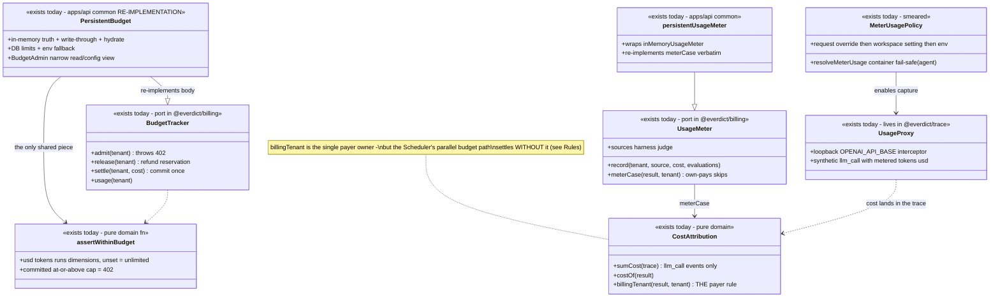
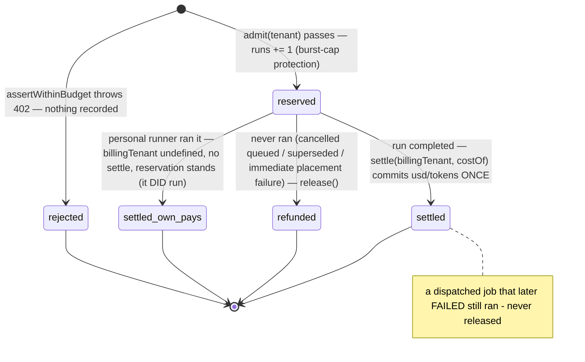

# Billing — collaboration model

> Payer attribution, enforcement budget (402), and meter-only usage. Companion to
> `../00-target-architecture.md` (§4 `domain/billing`, §9). Status: PROPOSED — review artifact,
> no code moves.

## Purpose & language

Billing has two deliberately distinct halves plus one shared vocabulary. The **enforcement
budget** blocks: `admit()` throws `PaymentRequiredError` (402, `BUDGET_EXCEEDED`) before a run is
accepted, reserving one run so bursts can't exceed the cap; `settle()` commits actual cost after
completion. The **usage meter** never blocks: it records the billable surface — orchestration +
verdict LLM cost (the harness under test and the judge model), **not resold compute** (compute is
BYO / own-pays). Both halves share the **payer rule** `billingTenant(result, originalTenant)`:
managed runs bill the job's tenant; workspace-shared runner runs (`provenance.by = "ws:<ws>"`)
bill that workspace (team resource); personal-runner runs return `undefined` — own-pays, neither
settled nor metered. `@everdict/billing` is clean and pure; the duplication problem is that
`apps/api/src/common/{budget-tracker,usage-meter}.ts` **re-implement its composition** instead of
wrapping it, and a parallel budget path inside the Scheduler applies cost **without** the payer
rule.

Language rules worth pinning:
- *admit / reserve* — the synchronous pre-acceptance check; passing immediately reserves one run.
- *settle* — committing actual usd/tokens once, after completion; the last run that slightly
  exceeds the cap is allowed (cost isn't known pre-run — standard cost-budget behavior).
- *release* — refunding a reservation for a job that was admitted but never ran (cancelled while
  queued, superseded, immediate placement failure). Never touches usd/tokens.
- *own-pays* — the personal runner's machine login pays the provider directly; the workspace
  budget is untouched and nothing is metered.
- *meter-only vs enforcement* — `UsageMeter` is the pricing surface (read via `GET /usage`);
  `BudgetTracker` is the cap (`GET/PUT /budget`). Distinct on purpose; never conflate.

## Aggregates & policies



Target placement (00 §4): the ports + `assertWithinBudget` + `billingTenant`/`costOf` stay
`domain/billing`; the persistence composition (`persistentBudget`/`persistentUsageMeter`) is
absorbed as `application/control` port wiring over `BudgetStore`/`UsageStore` (the api/common
re-implementation is deleted); the usage proxy moves out of `packages/trace` to the metering
adapter; the meter-usage policy chain becomes one domain function.

## Lifecycle

The budget reservation is the domain's only state machine:



## Key collaborations

### Admission → execution → payer-attributed settle (run path; batch is per-case identical)

```mermaid
sequenceDiagram
    participant T as route / tool
    participant S as RunService / ScorecardBatchService
    participant B as BudgetTracker (persistentBudget)
    participant E as executeCase → Dispatcher
    participant P as billingTenant (domain)
    participant U as UsageMeter

    T->>S: submit(input)
    S->>B: admit(tenant) — assertWithinBudget; 402 ⇒ NO record created
    B->>B: reserve one run; best-effort write-through (never blocks admission)
    S->>E: dispatch (budget is the caller's concern — executeCase never admits/settles)
    E-->>S: CaseResult{provenance?}
    S->>P: billingTenant(result, tenant)
    alt managed run
        P-->>S: tenant — the job's tenant pays
    else workspace-shared runner (provenance.by = ws:…)
        P-->>S: that workspace — team resource pays
    else personal runner
        P-->>S: undefined — own-pays: no settle, no meter
    end
    S->>B: settle(bill, costOf(result)) — llm_call cost sum, committed once
    S->>U: meterCase(result, tenant) — meter-only, harness source, +1 evaluation
    Note over S,U: batch path: admit per case before dispatch (scorecard-batch-service.ts:427,899), settle+meter per settled case (:531-532, :978-979)
```

### BYO usage capture (metering a harness that calls an OpenAI-compatible API)

```mermaid
sequenceDiagram
    participant CP as control plane
    participant AG as agent (runAgentJob)
    participant H as CommandHarness
    participant PX as usage proxy (loopback, in @everdict/trace)
    participant M as UsageMeter (CP, after result returns)

    CP->>AG: AgentJob.meterUsage — request override ?? workspace policy ?? off
    AG->>AG: resolveMeterUsage — fail-safe OFF when containerized (loopback unreachable from the container; warns loudly)
    AG->>H: makeHarness(…, {meterUsage})
    H->>PX: startUsageProxy — ephemeral 127.0.0.1 port; child's OPENAI_API_BASE rewritten
    H->>H: agent-under-test calls the provider THROUGH the proxy — tokens/usd tallied
    H-->>AG: synthetic llm_call TraceEvent with metered cost appended to the trace
    AG-->>CP: CaseResult — costOf sums llm_call events (harness-reported costs e.g. Claude total_cost_usd flow the same way)
    CP->>M: settle + meterCase read the SAME trace-derived cost — one cost vocabulary
```

## Inbound use-cases

From the apps-api survey catalog (§1.10, §1.16):

| # | Operation | Transport | Implementation | Notes |
|---|---|---|---|---|
| 129 | Usage (meter-only) | `GET /usage` · `get_usage` | `UsageMeter.usage` | persistent write-through + boot hydrate |
| 130 | Get / Set budget | `GET+PUT /budget` · `get_budget`/`set_budget_limit` | `BudgetAdmin.usage/limitOf/setLimit` | read = viewer+, write = admin; 402 at admit |
| 97 | Workspace settings (`meterUsage` policy) | `GET+PUT /workspace/settings` | `WorkspaceSettingsStore` direct | per-workspace metering default |
| 1/12 | Admission on submit | inside `POST /runs` / `POST /scorecards` | `budget.admit` before record creation / per case | see sequences |
| — | Settle + meter on completion | boot/async | `billingTenant` + `costOf` + `meterCase` | run + batch trackers |
| — | Scheduler budget option | (not wired in apps/api) | `Scheduler{budget}` admit/release/settle | see Rules — the parallel path |

## Outbound ports

| Port | Why needed | Today's adapter |
|---|---|---|
| `BudgetStore` (usage + limits) | durable caps/counters across restarts | `@everdict/db` InMemory/Pg (`budget-store.ts`) |
| `UsageStore` | durable metered usage | `@everdict/db` InMemory/Pg |
| `meterUsageFor(tenant)` | workspace metering policy | lambda: settings store → `envMeterPolicy` fallback (main.ts) |
| `limitFor` fallback | env-configured caps for tenants without a stored limit | `budgetFromEnv()` (main.ts:1342) |
| usage proxy | capture BYO provider calls in-job | `packages/trace/src/usage-proxy.ts` (loopback HTTP) |

## Rules: today → target

| Rule | Today (evidence) | Target |
|---|---|---|
| **Budget tracker composition re-implemented** | `apps/api/src/common/budget-tracker.ts:36-64` (`persistentBudget`) duplicates the `inMemoryBudget` bodies from `packages/billing/src/budget.ts:57-85` — same lazy `get()` map, same `runs += 1` reserve, same `Math.max(0, …)` release floor — instead of wrapping it; only `assertWithinBudget` is shared | `domain/billing` keeps the tracker; `application/control` composes persistence (write-through decorator over the ONE in-memory impl); api/common file deleted (00 §4 billing row) |
| **`meterCase` duplicated verbatim** | `packages/billing/src/usage.ts:59-63` vs `apps/api/src/common/usage-meter.ts:16-21` — the `billingTenant` guard + `record(tenant, "harness", costOf, 1)` copied because the wrapper re-declares the method | same absorption — the persistent meter becomes a store-decorator, not a re-declaration |
| Payer rule (`billingTenant`) | ONE domain owner: `packages/billing/src/cost.ts:29-34`; applied at `apps/api/src/core/run/run-service.ts:306-307` and `scorecard-batch-service.ts:531,978` and both `meterCase` copies | stays the single owner; every settle path MUST route through it (next row is the violation) |
| **Parallel budget path without the payer rule** | `packages/backends/src/scheduling/scheduler.ts:73-74,155-183,362-372`: the Scheduler's optional budget does admit-at-enqueue (backpressure-before-admit anti-leak ordering `:159-161`), `releaseBudget` on cancel/never-dispatched (`:197,223,321`), and settles with `settle(tenantOf(job), costOf(result))` — **no `billingTenant`**, so a self-hosted own-pays run would bill the tenant on this path. apps/api does NOT wire it (`main.ts:630-636` passes no budget), so the two homes currently cannot double-admit — by wiring luck, not by design | ONE admission/settle owner in `application/control`; either the Scheduler loses its budget option or it becomes the sole owner and adopts `billingTenant` — decide in review |
| Reservation-leak protection | scheduler-side: documented ordering (`scheduler.ts:159-161`) + 3 `releaseBudget` call sites; service-side: `admit` before `store.create` and the comment "admit was already counted synchronously in submit, so don't double-count" (`run-service.ts:302-304`) — but **no `release()` call exists anywhere in apps/api** (grep) — a superseded batch's never-run cases keep their per-case reservations only because the batch path admits per case at dispatch time | pin the invariant per path: admit-at-dispatch (batch) needs no release; admit-at-submit (run) leaks one reservation if the track never dispatches — target makes the reservation lifecycle explicit |
| Metering policy chain (request override → workspace setting → env → off) | `run-service.ts:279-280` (`meterUsageFor`), scorecard path equivalent, `envMeterPolicy` fallback in main.ts — the chain is re-stated per service | one `domain/billing` policy function over a settings port |
| Container metering fail-safe | `packages/agent/src/run.ts:25` (`resolveMeterUsage`) — disables metering when containerized (loopback proxy unreachable) using `instanceof DockerDriver` (engine survey §7 smell 4: policy reaching into a concrete adapter) | the Driver port advertises `containerized`; the policy moves to `domain/billing` |
| Usage capture lives in the wrong packages | the proxy is in `packages/trace/src/usage-proxy.ts` and its lifecycle is embedded in `CommandHarness` (`packages/harnesses/src/command.ts` — engine survey §4 smell 2 "billing inside the harness"), dragging the proxy into the agent image for every job | metering capture becomes an `infrastructure/compute` concern composed by `application/execution`; policy in `domain/billing` |
| Billable surface = harness + judge; only harness is metered | `UsageSource = "harness" \| "judge"` (`packages/billing/src/usage.ts:11-12`) but **no `record(tenant, "judge", …)` call exists in apps/api** (grep) — CP model-judge provider calls (tenant key, `judge-runner.ts`) are unmetered | wire judge metering in the scoring use-case, or drop the `judge` source; align with `judge.md` open question 2 |
| Cost comes from the harness's own trace | `sumCost` over `llm_call` events (`cost.ts:6-16`); Claude's `total_cost_usd` mapped in `mapClaudeStreamJson`; proxy emits synthetic `llm_call` — one vocabulary, already unified | keep; document as the pinned cost contract |

## Invariants

| Invariant | Owner | Pinned how |
|---|---|---|
| 402 at admit ⇒ nothing was created or reserved | **domain** — `assertWithinBudget` before reserve; **application** — admit before `store.create` | budget unit tests + submit tests |
| Settle commits exactly once per completed case, against the payer (`billingTenant`) | **application** — single settle site per tracker path; **domain** — payer rule | service tests; target: the Scheduler-path divergence resolved |
| Own-pays runs are neither settled nor metered; their reservation stands (they ran) | **domain** — `billingTenant → undefined`; `meterCase` guard | billing unit tests + self-hosted live e2e (workspace-pays `c6e5c15` lineage) |
| A reservation is released ONLY for never-ran jobs; a dispatched-but-failed job still ran | **application** — scheduler `releaseBudget` sites + comment `scheduler.ts:362` | scheduler tests |
| Backpressure/quota rejection precedes admit (no leaked reservations) | **application** — `scheduler.ts:159-183` ordering | scheduler tests pin the order |
| Meter-only never blocks; a failed persist never blocks admission or metering | **application** — best-effort write-through (`.catch(() => {})`) in both persistent wrappers | common tests |
| Budget/usage survive a control-plane restart | **application** — `hydrate()` at boot for both | boot tests |
| The last run that slightly exceeds the cap is allowed (cost unknown pre-run) | **domain** — `assertWithinBudget` checks committed usage only | documented + unit tests |
| Budget read = viewer+, write = admin | **interface** — route gates (`budget` routes) | transport tests |
| Cost is derived from the trace (`llm_call`), never re-priced control-plane-side | **domain** — `sumCost`/`costOf` are the only cost math | unit tests; CLAUDE.md critical rule |

## Open questions

1. Multi-process: both persistent wrappers declare "in-memory truth, single-process read model".
   Does the target move enforcement to store-atomic increments (`UPDATE … RETURNING` admission,
   like the invite CTE) or accept per-replica budget skew initially?
2. Who owns admission in the target — the submit use-case (today's apps/api posture, payer-aware)
   or the Scheduler (placement-adjacent, currently payer-blind)? Keeping both implementations is
   the one option the review should exclude.
3. `release()` is unreachable from apps/api today (standalone-run reservations are never refunded
   if tracking dies before dispatch). Wire it into supersede/cancel/boot-tombstone paths, or
   document the leak as acceptable noise in the `runs` dimension?
4. Meter the CP-side judge provider calls as `source: "judge"` (closing the declared-but-unused
   source), and should judge cost also count against the enforcement budget?
5. The `evaluations` counter meters cases × trials that ran and were billable — is that the
   pricing unit for the managed offer, and does it need its own budget dimension (`evaluations`
   cap) beyond `runs`?
