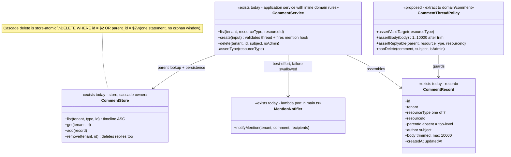
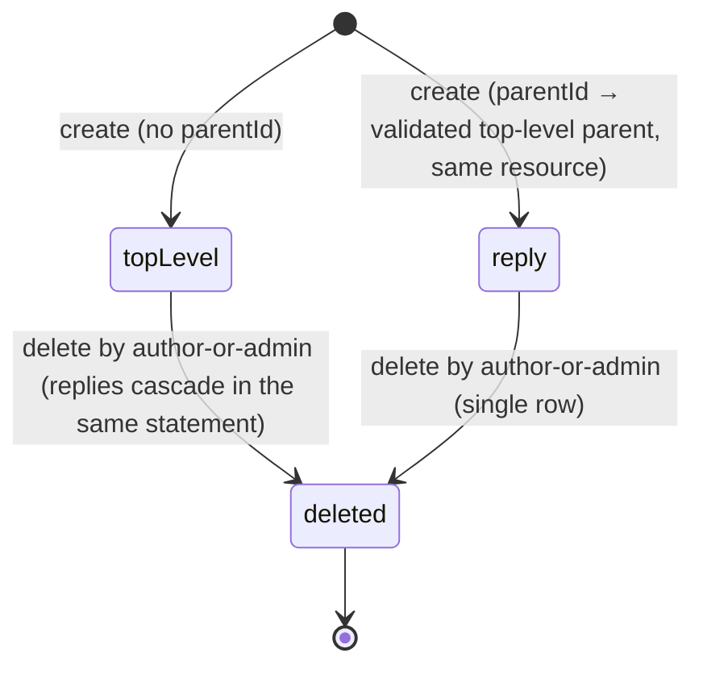
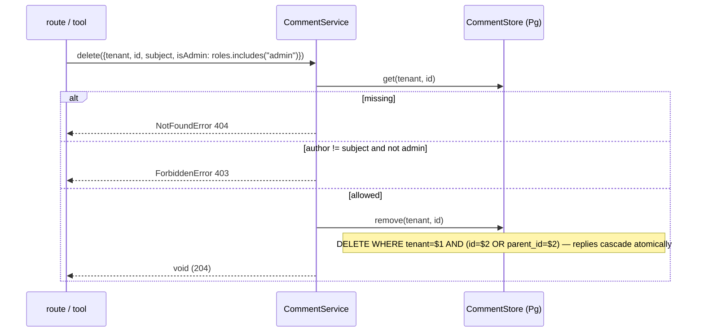

# Comment — collaboration model

> Threaded discussion on workspace resources. Companion to `../00-target-architecture.md` (§4
> `domain/comment`, §9). Status: PROPOSED — review artifact, no code moves.

## Purpose & language

Linear-style collaborative discussion attached to any of **seven resource types** (`dataset`,
`harness`, `scorecard`, `view`, `schedule`, `run`, `runtime`). A **Comment** is workspace-scoped,
authored, and optionally a **reply**: threading is deliberately **single-level** — a reply's parent
must be a top-level comment on the *same* resource; replying to a reply is a 400. Comments feed the
resource detail pages' activity timelines and are the trigger for **@mention** notifications
(feed-only, low-noise — see `notification.md`).

Language rules worth pinning:
- *top-level comment* — `parentId` absent; the only legal reply target.
- *cascade delete* — removing a top-level comment removes its replies in the same statement
  (no orphaned replies).
- *author-or-admin* — the delete permission: creator-override authz that deliberately lives
  outside the role matrix (same pattern as `datasets:delete` version creators).
- *mention* — an `@subject` reference in the body; recipients are caller-supplied subjects,
  deduped, author excluded, notified best-effort.

## Aggregates & policies



Target placement (00 §4): the threading/body/target rules move to `@everdict/domain` `comment/` as
a guard set (`CommentThreadPolicy`); `CommentService` becomes an `application/control` use-case
that composes the policy, the store port, and a typed `MentionRaised` event port (today a
`main.ts` closure). The cascade delete stays with `infrastructure/persistence-pg` as a
store-atomic invariant.

## Lifecycle

No state machine — a comment is immutable content after creation (`updatedAt` exists on the
record but no update operation is exposed; "no hypothetical surface"). The only transitions:



## Key collaborations

### Create a reply with mentions (threading guards + mention fan-out)

```mermaid
sequenceDiagram
    participant T as HTTP route / MCP tool
    participant S as CommentService
    participant ST as CommentStore
    participant N as notifyMention hook (main.ts)
    participant NS as NotificationService

    T->>T: gate(principal, "comments:write")
    T->>S: create({tenant, resourceType, resourceId, author, body, parentId, mentions})
    S->>S: assertType(resourceType) — 7-type whitelist, else 400
    S->>S: trim body; empty → 400; > 10000 → 400
    S->>ST: get(tenant, parentId)
    Note over S,ST: parent must exist, same resourceType+resourceId → else 400 "Parent comment not found."
    S->>S: parent.parentId set → 400 "Cannot reply to a reply."
    S->>ST: add(record)
    S->>S: recipients = dedupe(mentions) minus author
    S->>N: notifyMention({tenant, comment, recipients}) — try/catch
    N->>NS: notifyMention(tenant, {recipients, actorName, resourceType, resourceId, commentId, preview})
    Note over S,N: hook failure swallowed — the comment is already saved
    S-->>T: CommentRecord
    Note over T: target: reply = CommentResponse.from(record) (contracts/wire); today the route sends the record verbatim
```

### Delete with creator-override + cascade



## Inbound use-cases

From the apps-api survey catalog (§1.13, #120–122):

| # | Operation | Transport | Implementation | Notes |
|---|---|---|---|---|
| 120 | List comments | `GET /comments?resourceType&resourceId` · `list_comments` | `CommentService.list` | timeline order (created ASC); `comments:read` |
| 121 | Create comment / reply | `POST /comments` · `create_comment` | `create` | `comments:write`; threading guards; mention → feed notification |
| 122 | Delete comment | `DELETE /comments/:id` · `delete_comment` | `delete` | author-or-admin decided in the service; route only authenticates |

Consumed by the web `features/discuss` slice (`CommentsSection` server component wired on 7 detail
screens) and the dataset activity timeline (`discuss-dataset`).

## Outbound ports

| Port | Today | Target owner |
|---|---|---|
| `CommentStore` (list/get/add/remove-with-cascade) | `@everdict/db` interface (`packages/db/src/activity/comment-store.ts`) | `application/control` port; Pg impl (cascade) in `persistence-pg` |
| `notifyMention` hook (actor-name resolution + feed write) | late-bound closure in `apps/api/src/main.ts:884` (joins `UserProfileStore` for actor display name, then calls `NotificationService.notifyMention`) | typed domain-event port (`MentionRaised`) consumed by the notification domain |
| id / clock | `crypto.randomUUID` / `new Date()` defaults in the service ctor | `clock/id` port (00 §4 port bag) |

## Rules: today → target

| Rule | Today (evidence) | Target |
|---|---|---|
| Resource-type whitelist (7 kinds) | `COMMENT_RESOURCE_TYPES` + `assertType`, `apps/api/src/core/comment/comment-service.ts:6-15,37-41`; the notification link carries `resourceType` as a free string (`packages/db/src/activity/notification-store.ts:26-33`); web maps type→path per entity | ONE `CommentableResource` vocabulary in `contracts` shared by comment + notification link + web deep-link mapper |
| Single-level threading + same-resource parent | inline in `CommentService.create`, `comment-service.ts:65-71` (parent exists, same `resourceType`+`resourceId`, `parent.parentId` → 400) | `domain/comment` `CommentThreadPolicy.assertReplyable` — moves verbatim; service keeps only orchestration |
| Body discipline (trim, 1..10 000) | `comment-service.ts:17,61-64` (`MAX_BODY`) | `domain/comment` guard (`assertBody`) |
| Cascade delete of replies | store-atomic: `packages/db/src/activity/comment-store.ts:119-125` (Pg single `DELETE … id = $2 OR parent_id = $2`) and re-implemented in TS in `InMemoryCommentStore.remove` (:44-49) | store stays the invariant owner; InMemory copy pinned by a shared contract test |
| Author-or-admin delete | `comment-service.ts:98-105`; route passes `isAdmin: principal.roles.includes("admin")` (`apps/api/src/api/comment/comment.routes.ts:60`) — deliberately NOT in the role matrix | `domain/comment` policy (`canDelete`); candidate for a shared `ResourceOwnershipPolicy` with view/schedule/harness-version/dataset-version creator-override (the same rule exists ≥5×) |
| Mention fan-out is best-effort | `comment-service.ts:86-93` (dedupe, author excluded, try/catch swallow) | recipient shaping = `domain/comment` rule; delivery = notification domain via the `MentionRaised` event port |
| Mention actor-name resolution | `main.ts:884` closure joins profile store before calling `NotificationService.notifyMention` | application read-model concern inside the notification use-case, not composition-root code |
| Tenant scoping | store `WHERE tenant = $1` on every query; route supplies `principal.workspace` | unchanged; workspace scoping becomes a property of the use-case context (survey cross-cutting smell 2) |

## Invariants

| Invariant | Owner | Pinned how |
|---|---|---|
| A reply's parent is a live top-level comment on the same resource | **domain** — threading guards (today inline in `CommentService.create`) | unit tests pin the two 400 messages ("Parent comment not found." / "Cannot reply to a reply.") |
| Threads never exceed one level | **domain** — `parent.parentId` check | same tests; store schema has no depth field to drift |
| Deleting a top-level comment leaves no orphan replies | **store-atomic SQL** — single `DELETE (id OR parent_id)` | contract test: delete parent → replies gone; InMemory double must match |
| Only the author or a workspace admin deletes | **domain** — author-or-admin policy | service tests pin 403/404 |
| Body is non-empty and ≤ 10 000 chars after trim | **domain** | unit tests |
| Mention failure never fails the comment | **application** — try/catch around the hook | service test with a throwing hook |
| Comments are tenant-scoped; cross-tenant read/delete is 404 | **store** — tenant in every WHERE | route tests |
| The author never receives their own mention notification | **domain** — recipient filter (`s !== input.author`) | unit test |

## Open questions

1. Resource existence is never verified — a comment can attach to a deleted or nonexistent
   `resourceId` (the timeline simply never renders it). Should the target validate existence at
   create (cross-domain read) or pin "dangling comments are tolerated" as a semantic?
2. Mentions are caller-supplied subjects with no membership validation — a mention of a
   non-member writes a feed row nobody can read. Validate against `WorkspaceStore` in the target?
3. `updatedAt` exists on the record but editing is not exposed. Add edit (author-only, with an
   edited marker) or drop the field per "no hypothetical surface"?
4. Should the creator-override rule (author-or-admin) be generalized into one shared
   `ResourceOwnershipPolicy` in `domain` (used by comment, view, schedule, harness/dataset version
   delete), or stay per-domain to keep guard messages local?
5. Workspace hard-delete does not cascade comments today (member.md open question 4 — the
   17-store cleanup contract). Include `everdict_comments` in the per-store `deleteTenant`
   contract if adopted.
