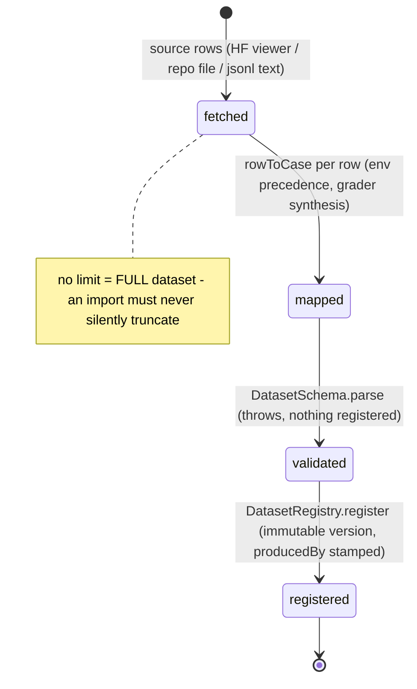
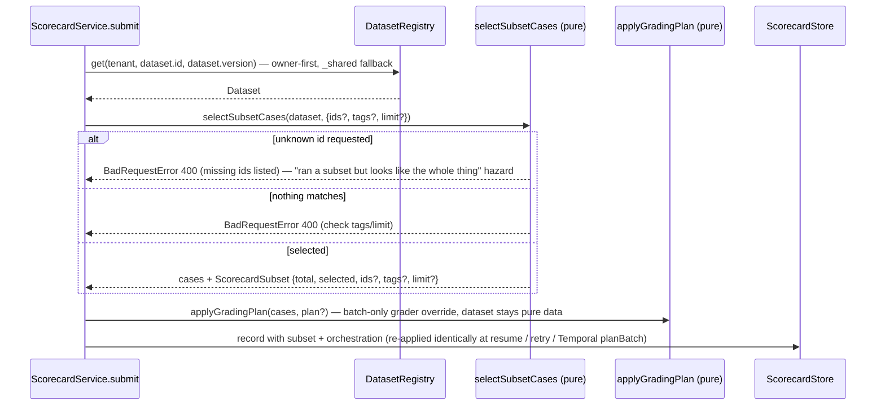

# Dataset — collaboration model

> Versioned harness-agnostic case bundles + benchmark import + subset selection + diff. Companion to
> `../00-target-architecture.md` (§4 `domain/dataset`, §9). Status: PROPOSED — review artifact, no
> code moves.

## Purpose & language

A **Dataset** is a versioned, tenant-owned (or `_shared`) bundle of **EvalCase**s that never knows
which harness runs it. Content enters through three on-ramps: **mapping** (row-based sources —
HF/jsonl/csv → `CaseMapping` rules), **standard task formats** (Terminal-Bench / Harbor directory
tasks → dedicated pure mappers), and direct registration (`DatasetSchema`-validated JSON). Datasets
are compared version-to-version (**diff**) and consumed at submit time through **subset selection**
(partial runs stamped as such).

Language rules worth pinning:
- *mapping* — data-driven row→case rules (`CaseMapping`): env-kind precedence, grader synthesis,
  image assignment. Exists twice today: as a TS interface (code) and a Zod schema (recipe data).
- *recipe* — a registrable, versioned `BenchmarkAdapterSpec` (pure data; `graderTemplates` replace
  code `graderBuilder`). The first-party **catalog** is the code-flavored sibling.
- *on-ramp* — a converter from an external format into `Dataset` (never the reverse).
- *subset* — the `{ids → tags → limit}` selection applied at scorecard submit; the record carries
  `subset{total,selected,…}` so a partial run can never masquerade as the whole benchmark.
- *producedBy* — import provenance stamped on the dataset (which recipe/source made it).
- *reference, never build* — `case.image` names a prebuilt image; the platform never builds one.

## Aggregates & policies

```mermaid
classDiagram
    class Dataset {
        <<exists today - contract>>
        +id version immutable content
        +cases EvalCase array
        +description tags
        +producedBy import provenance
    }
    class CaseMapping {
        <<exists today - DUAL code+Zod>>
        +idField taskField taskTemplate
        +env precedence repoPath gt git gt osUse gt prompt gt browser
        +answerField to answer-match grader
        +testCmdField to tests-pass grader
        +imageField wins over image
    }
    class RowMapper {
        <<exists today - pure domain>>
        +rowToCase(row, i, meta, mapping)
        +rowsToDataset(...) DatasetSchema.parse
        +interpolateFields(tpl, row)
    }
    class BenchmarkAdapterSpec {
        <<exists today - data recipe>>
        +source huggingface or jsonl
        +mapping CaseMappingSchema
        +graderTemplates interpolated
        +origin citation metadata
    }
    class StandardTaskMappers {
        <<exists today - pure domain>>
        +terminalBenchTaskToCase image required
        +harborTaskToCase near-identical twin
    }
    class SubsetSelector {
        <<exists today - pure fn in apps-api scorecard>>
        +selectSubsetCases(dataset, sel)
        +unknown id 400, empty result 400
        +stamps ScorecardSubset
    }
    class DatasetDiffer {
        <<exists today - pure domain>>
        +diffDatasets(base, candidate)
        +canonical key-sorted compare
        +added removed changed unchanged
    }
    class DatasetRegistry {
        <<exists today - port, HAND-ROLLED invariants>>
        +register(tenant, dataset, createdBy)
        +get versions list creatorOf softDelete setVersionTags
        +immutability tombstone _shared fallback
    }
    class BenchmarkService {
        <<exists today - application>>
        +import spec or catalog or recipe
        +searchHf hfSplits hfFiles previewSource
        +registerRecipe
    }
    BenchmarkService --> BenchmarkAdapterSpec : specToAdapter
    BenchmarkService --> RowMapper : importFromSpec
    BenchmarkService --> DatasetRegistry : register with producedBy
    RowMapper --> CaseMapping : interprets
    StandardTaskMappers --> Dataset : builds
    SubsetSelector --> Dataset : reads at submit
    DatasetDiffer --> Dataset : compares versions
    note for CaseMapping "HAZARD: mapping.ts interface and spec.ts Zod schema\nmust be kept isomorphic BY HAND - a missing schema key\nsilently downgrades user recipes to browser envs\n(Zod strips unknown keys)."
```



Target placement (00 §4): `RowMapper` + standard-task mappers + `diffDatasets` + subset selection
move to `@everdict/domain` `dataset/` (subset selection leaves `apps/api/src/core/scorecard/`);
HF/file connectors go to `infrastructure/integrations`; the first-party catalog becomes bundle
content, not architecture; `DatasetRegistry` invariants ride the generic VersionedStore (P3);
`CaseMapping` collapses to ONE Zod schema with `z.infer` as the only type.

## Lifecycle

Dataset versions follow the shared registry version lifecycle (see `harness.md` — live / tombstoned
/ revived, immutable content, mutable version tags). Worth stating separately: the **import
pipeline** is not a state machine but a validation gauntlet — every path ends in
`DatasetSchema.parse` before `register`, so an invalid case can never be stored.



## Key collaborations

### Benchmark import (wizard: preview → import → register)

```mermaid
sequenceDiagram
    participant T as POST /benchmarks/import · import_benchmark
    participant B as BenchmarkService
    participant R as BenchmarkRegistry (recipes)
    participant F as HF connectors (fetchHfRows / fetchHfFileRows)
    participant M as rowsToDataset (domain)
    participant D as DatasetRegistry

    T->>B: import(tenant, ref = inline spec | catalog id | registered recipe)
    alt registered recipe
        B->>R: get(tenant, recipeId, version)
        R-->>B: BenchmarkAdapterSpec (data)
    end
    B->>B: specToAdapter(spec) — graderTemplates → per-row interpolated graderBuilder
    B->>F: fetch rows (gated token from SecretStore HF_TOKEN, personal-first)
    Note over F: no limit = full dataset (100-row paging); non-2xx → UpstreamError with gated-access guidance
    F-->>B: rows[]
    B->>M: rowsToDataset(rows, meta, mapping)
    Note over M: env precedence repoPath > git > os-use > prompt > browser; imageField wins over image; DatasetSchema.parse
    M-->>B: Dataset (+ producedBy provenance)
    B->>D: register(tenant, dataset, createdBy) — immutable version
    B-->>T: registered meta (today verbatim; target: DatasetResponse.from with caseCount/provenance served)
```

### Subset selection at scorecard submit (partial run, honestly stamped)



## Inbound use-cases

From the apps-api survey catalog (§1.5, #47–63):

| # | Operation | Transport | Implementation | Notes |
|---|---|---|---|---|
| 47 | Register dataset | `POST /datasets` · `create_dataset` | DatasetRegistry.register | `DatasetSchema`-validated |
| 48 | Import terminal-bench | `POST /datasets/terminal-bench` · `import_terminal_bench` | route calls `terminalBenchToDataset` | image required (reference, not build) |
| 49 | Import harbor | `POST /datasets/harbor` · `import_harbor` | `harborToDataset` | twin of #48 |
| 50 | Validate dataset | `POST /datasets/validate` · `validate_dataset` | schema + would-conflict dry-run | |
| 51 | List datasets | `GET /datasets` · `list_datasets` | registry.list | caseCount/tags/producedBy projection |
| 52 | Get version | `GET /datasets/:id/versions/:version` · `get_dataset` | registry.get | |
| 53 | Delete version | `DELETE /datasets/:id/versions/:version` · `delete_dataset` | `deleteDatasetVersion` | creator-or-admin; tombstone |
| 54 | Version tags | `PUT /datasets/:id/versions/:version/tags` · `set_dataset_version_tags` | common setVersionTags | |
| 55 | Dataset diff | `GET /datasets/:id/diff` · `diff_datasets` | route calls `diffDatasets` directly | domain call in transport |
| 56 | Benchmark catalog | `GET /benchmarks` | `BenchmarkService.list` | first-party code adapters |
| 57–59 | HF search / splits / files | `GET /benchmarks/hf/*` · `search_hf_datasets` etc. | `BenchmarkService` → HF Hub | HF_TOKEN personal-first |
| 60 | Preview source rows | `POST /benchmarks/preview` · `preview_benchmark_source` | `fetchSourceRows` | wizard field auto-detection |
| 61 | Import benchmark | `POST /benchmarks/import` · `import_benchmark` | `BenchmarkService.import` | spec / catalog / recipe |
| 62–63 | Recipe register / validate / list / get | `POST /benchmark-recipes` etc. | BenchmarkRegistry | recipes = versioned data |
| — | Subset selection | inside `POST /scorecards` | `selectSubsetCases` + `applyGradingPlan` | stamped on the record |

## Outbound ports

| Port | Today | Target owner |
|---|---|---|
| `DatasetRegistry` (versioned SSOT) | `@everdict/registry` — hand-rolled InMemory + `PgDatasetRegistry` (mig 0005+0018) | `application/control` port; generic VersionedStore in `persistence-pg` |
| `BenchmarkRegistry` (recipes) | `@everdict/registry` (no tombstone/creator — feature drift vs datasets) | same generic store; drift resolved by config |
| HF connectors (`fetchHfRows`/`fetchHfSplits`/`fetchHfFileRows`/`searchHfDatasets`) | `@everdict/datasets` `sources.ts` (injectable `FetchLike`) | `infrastructure/integrations` |
| HF gated token | `SecretStore` `HF_TOKEN` (personal-first) via BenchmarkService | secrets port |
| First-party catalog (`BENCHMARK_CATALOG`) | `@everdict/datasets` `catalog.ts` (code) | content → `examples/bundles/*` (memory: "codex/pinch are bundles, not core") |

## Rules: today → target

| Rule | Today (evidence) | Target |
|---|---|---|
| Row→case mapping (env precedence, grader synthesis, `imageField` wins) | `packages/datasets/src/mapping.ts:49-96` (`rowToCase`) — pure, well-tested | moves verbatim to `domain/dataset/mapping.ts` |
| **CaseMapping code↔Zod dual maintenance** | `mapping.ts:10-31` (interface) vs `spec.ts:13-35` (`CaseMappingSchema`) — spec.ts's own comment: a too-narrow schema silently downgrades user recipes to browser envs because Zod strips unknown keys | ONE Zod schema in `contracts`, `type CaseMapping = z.infer<…>`; the interface is deleted; a drift test is impossible to need |
| Import never silently truncates | `packages/datasets/src/sources.ts` (`fetchHfRows` — no limit = full dataset, 100-row paging) — policy enforced only by connector defaults | named `domain/dataset` import policy; connectors take an explicit `all | limit(n)` argument |
| Reference images, never build | `packages/datasets/src/terminal-bench.ts:26-37` (`resolveImage` throws) + harbor twin + `.claude/rules/datasets.md` | `domain/dataset` rule shared by a unified container-task mapper |
| Terminal-Bench / Harbor near-identical mappers | `terminal-bench.ts` vs `harbor.ts` (field names differ: `testCommand` vs `verifierCommand`) — a third format would clone again | one `domain/dataset` container-task mapper + per-format thin field adapters |
| Subset selection (ids→tags→limit; unknown id 400; empty 400; stamped) | `apps/api/src/core/scorecard/scorecard-shared.ts:114-153` (`selectSubsetCases`) — a dataset-domain rule living in the scorecard folder | `domain/dataset/subset.ts`; the scorecard use-case consumes it |
| Grading-plan overlay (dataset stays pure data) | `scorecard-shared.ts:158-161` (`applyGradingPlan`) — applied identically at submit / resume / retry / Temporal planBatch | `domain/scorecard` (it is a batch rule, not dataset content) — split confirmed in review |
| Diff canonicalization (no false changes from key order) | `packages/datasets/src/diff.ts:4-13` (`canonical`), field set `:23-33` | `domain/dataset/diff.ts` verbatim |
| Diff carries display strings in the contract | `diff.ts:16-20` (`repr` → `DatasetFieldChange.before/after` are strings; core survey smell 5: presentation frozen in the root) | structured before/after in domain output; the string repr moves to `DatasetDiffResponse.from` (interface-kit) |
| Version immutability / tombstone / `_shared` / creator | `@everdict/registry` dataset pair — one of the **6 hand-rolled** duplications (registry survey smell 1) | generic VersionedStore ×1 + per-entity config; golden contract tests first (00 §7) |
| Creator-or-admin delete | `apps/api/src/core/dataset/dataset-service.ts:8-27` (`deleteDatasetVersion`) — same shape as harness | shared `OwnedVersionPolicy` in `domain` |
| Raw `Error` at package boundary | `spec.ts:150` ("The jsonl source requires text"), similar in `sources.ts`/`catalog.ts` guards — violates the AppError rule | remap to `BadRequestError` when the code moves |
| Category vocabulary drift | `spec.ts:77` recipe `category: browser|qa|coding|tool` vs catalog adapters also using `desktop` | one category union in `contracts`; recipe schema regenerated from it |
| Import/diff called from the ROUTE | `apps/api/src/api/dataset/dataset.routes.ts` (terminal-bench/harbor/diff call package functions in the transport) | `application/control` dataset use-cases; routes become drivers |

## Invariants

| Invariant | Owner | Pinned how |
|---|---|---|
| A dataset version's content never changes; tombstone hides but preserves | **store** — DatasetRegistry invariants (target: generic VersionedStore) | registry contract tests; scorecard reproducibility depends on it |
| No case enters storage without passing `DatasetSchema.parse` | **domain boundary** — every on-ramp ends in `rowsToDataset` / mapper parse | unit tests per on-ramp |
| An import is the FULL source unless the caller passed an explicit limit | **connector default today; named domain policy target** | connector tests (paging to exhaustion) |
| A subset run is always stamped `subset{total,selected}`; unknown ids and empty selections are 400 | **domain** — `selectSubsetCases` | unit tests pin both 400s + stamp shape |
| A container-task case always names a prebuilt image | **domain** — `resolveImage` throw | mapper tests |
| `imageField` (per-row) wins over `image` (dataset-common) | **domain** — `rowToCase:84` | mapper tests; the per-case portability contract |
| Cases never encode harness/model assumptions | **review rule** (`.claude/rules/datasets.md`) — not machine-enforced | review + the harness-agnostic Dataset schema shape |
| Diff never reports a change for key-order/array-identity noise | **domain** — `canonical` | diff tests with shuffled keys |
| Recipe mapping expressiveness ≡ code mapping expressiveness | **nobody today (the hazard)** — hand-kept isomorphism | target: single Zod SSOT makes it structural |

## Open questions

1. Which direction does the `CaseMapping` unification go — Zod schema as SSOT with `z.infer`
   (proposed; recipes are the public surface) — and does the schema then live in `contracts`
   (recipes are wire data) or `domain/dataset`?
2. `selectSubsetCases` is proposed for `domain/dataset`, but `applyGradingPlan` for
   `domain/scorecard` — both live in `scorecard-shared.ts` today. Confirm the split, or keep both
   under scorecard as "batch composition over dataset data"?
3. `DatasetFieldChange` display strings: is changing the wire shape to structured before/after
   worth the web migration, or do we keep strings as the v1 wire contract and only move the
   `repr` into the DTO mapper?
4. The first-party catalog (`BENCHMARK_CATALOG` + per-benchmark normalizer code like
   `sweBenchRow`'s `__`→`_1776_` Docker Hub convention) — bundle data cannot express code
   normalizers. Do we extend `GraderTemplateSchema`/rowTransform-as-data, or accept a small
   permanent code catalog in `infrastructure/integrations`?
5. BenchmarkRegistry has no tombstone/creator (feature drift). Does the generic-VersionedStore
   migration level everything up (recipes become deletable/taggable), and is that wanted?
6. Should dataset **content** dedupe across versions (today each version stores the full case
   array as jsonb) become a persistence-layer concern in `persistence-pg`, given SWE-bench-scale
   datasets?
