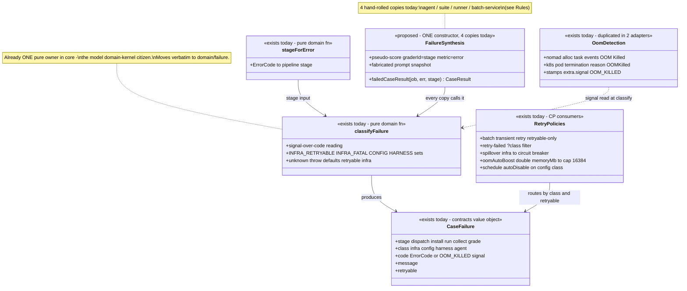

# Failure — collaboration model

> The case-failure taxonomy: WHERE a case died × WHOSE fault it was × whether retrying helps.
> Companion to `../00-target-architecture.md` (§4 `domain/failure`, §9). Status: PROPOSED — review
> artifact, no code moves.

## Purpose & language

At team scale most "failures" are not the agent's: a starved store, an OOM-killed alloc, a
placement blip, a missing secret. The **`CaseFailure`** value object
(`packages/core/src/execution/case-failure.ts`) classifies every case death as
`stage` (dispatch | install | run | collect | grade) × `class` (infra | config | harness | agent)
× `retryable`, and rides on the `CaseResult` so recovery can act by class instead of log
archaeology. `classifyFailure`/`stageForError` are already a **single pure owner** — the model
domain-kernel citizen — but the *synthesis* of a classified failure into a `CaseResult` is
hand-rolled **four times**, and OOM detection is copy-adapted across two backend adapters. The
taxonomy has consumers on BOTH sides of the process boundary: the agent/runner synthesize
classified results; the control plane routes retries, spillover, OOM boosts, and schedule
auto-disable off the class.

Language rules worth pinning:
- *infra* — the platform failed the case; retry-worthy (unless fatal: OOM, misconfigured upstream).
- *config* — the workspace setup is wrong (missing secret, bad pin, budget, authz); retrying
  changes nothing.
- *harness* — the harness itself broke (install/run/exec/grader); same input → same failure.
- *agent* — the agent ran and did not accomplish the task. **A legitimate eval outcome, not an
  error** — never auto-retried, and it carries NO `failure` field (its absence IS the class).
- *OOM as signal* — backends stamp `extra.signal = OOM_KILLED` while the error code stays
  `UPSTREAM_ERROR` (the HTTP envelope is untouched); `classifyFailure` reads `signal ?? code`.
- *stage-aware retry* — a `collect`-stage failure re-pulls the trace only; the agent is never
  re-run (execution output is preserved on the result).

## Aggregates & policies



Target placement (00 §4): `classifyFailure` + `stageForError` + the code→class sets + `OOM_KILLED`
move verbatim to `domain/failure` (single owner named explicitly); the failure→`CaseResult`
synthesizer becomes ONE domain constructor; OOM *detection* stays in the placement adapters (it is
orchestrator-specific evidence gathering) but the *decision* ("OOM = fatal infra, never agent") is
already the domain's — adapters only stamp the signal.

## Lifecycle

No state machine — `CaseFailure` is an immutable value stamped once per attempt. The temporal
behavior lives in its consumers (retry loops, stage-aware collect recovery in `trace.md`,
boot-recovery tombstones in `run.md`).

## Key collaborations

### Classified failure through the process boundary (agent → backend → batch retry)

```mermaid
sequenceDiagram
    participant AG as agent main.ts (job process)
    participant D as domain (classifyFailure + stageForError)
    participant BE as backend adapter (nomad/k8s)
    participant B as ScorecardBatchService (CP)
    participant ST as RunStore / ScorecardStore

    AG->>AG: runCaseJob throws (install failed, exec crash, …)
    AG->>D: failureResult(err, job) — stage = stageForError(err); dispatch when the job never decoded
    D-->>AG: CaseResult{failure, pseudo-score [class] message, fabricated prompt snapshot}
    AG->>BE: sentinel line ALWAYS emitted (even on crash) — __EVERDICT_RESULT__
    BE->>BE: parseResult — the classified result flows through untouched
    BE-->>B: CaseResult{failure}
    alt failure.retryable and attempts remain
        B->>B: transient re-dispatch (CP owns eval-semantic retry; Temporal retries transport only)
    else not retryable or attempts exhausted
        B->>ST: settle child run with failure intact — stage/class visible per case
    end
    Note over B: later: POST /scorecards/:id/retry?class=infra re-runs ONLY that class; agent-class cases are legitimate outcomes and are not failures
```

### OOM: detection (adapter) → decision (domain) → escalation (CP policy)

```mermaid
sequenceDiagram
    participant BE as NomadBackend / K8sBackend
    participant D as domain (classifyFailure)
    participant OB as executeWithOomBoost (CP ops)
    participant RF as retryFailed (CP)

    BE->>BE: alloc failed → scan task events "OOM Killed" / pod reason "OOMKilled"
    BE->>OB: throw UpstreamError{code: UPSTREAM_ERROR, extra.signal: OOM_KILLED}
    OB->>D: classifyFailure(err, "dispatch") — signal ?? code → {infra, OOM_KILLED, retryable: false}
    Note over D: fatal infra — an as-is retry dies the same way, so NOT retryable
    alt batch opted into oomAutoBoost
        OB->>OB: double harnessSpec.resources.memoryMb (job-only, registry spec never mutated)
        OB->>BE: re-dispatch, repeat to cap 16384 MB — past it the fix is a spec change
    else no auto-boost
        OB-->>RF: case settles OOM-failed; retry-failed later re-runs with compounded memory boost
    end
```

## Inbound use-cases

The failure domain has no transport of its own — it rides other domains' use-cases (survey refs):

| Survey # | Operation | Failure-domain role |
|---|---|---|
| 15 | Retry failed cases (`?class=infra\|config\|harness\|agent`) | class filter over `r.failure?.class ?? "agent"`; 400 when nothing matches |
| 13 | Batch track loop | retryable-gated transient retry; classified failed-score synthesis |
| 25 | Batch/run boot recovery | tombstone `INTERRUPTED` (note: bypasses the taxonomy — see Open questions) |
| 31 | Schedule fire | `config`-class failure → `Schedule.autoDisable` (don't re-fire a broken setup) |
| — | Runtime spillover / circuit breaker | `infra`-class failures feed the breaker; spillover only when `retryable && infra` |
| — | OOM auto-boost / retry-failed boost | `OOM_KILLED` code detection, doubling to `OOM_ESCALATION_CAP_MB` |
| — | Collect recovery (`executeCase`) | `TRACE_COLLECT_FAILED` stage=collect kept/cleared (see `trace.md`) |
| 127 | Queue/ops views + metrics | failure-class slices in dispatch counters |

## Outbound ports

| Port | Why needed | Today's adapter |
|---|---|---|
| — (pure domain) | `classifyFailure`/`stageForError` are dependency-free functions | n/a — that purity is exactly why the move to `domain/failure` is mechanical |
| Backend adapters (evidence) | OOM signal stamping needs orchestrator APIs | `nomad.ts` alloc task events; `k8s.ts` pod termination reason |
| `CircuitBreaker` | infra-failure health memory | `@everdict/backends` (consumer, not dependency) |

## Rules: today → target

| Rule | Today (evidence) | Target |
|---|---|---|
| Failure classification (code→class×retryable) | ONE owner already: `packages/core/src/execution/case-failure.ts:28-69` (`INFRA_RETRYABLE`/`INFRA_FATAL`/`CONFIG`/`HARNESS` sets, signal-over-code, unknown→retryable infra) | moves verbatim to `domain/failure` — named as the kernel it already is |
| Stage mapping | ONE owner: `case-failure.ts:35-52` (`stageForError`) | moves verbatim |
| **Failure → `CaseResult` synthesis** | **4 hand-rolled copies**, each fabricating `snapshot: {kind:"prompt", output:""}` + a pseudo-score `{graderId: <stage>, metric:"error", detail:"[class] message"}`: ① agent process boundary `packages/job-runner/src/run.ts:60-77` (`failureResult`); ② suite batch isolation `packages/suite/src/run-suite.ts:10-23` (`failedCaseResult`, carries `trial`); ③ runner lease loop `packages/self-hosted-runner/src/runner-loop.ts:75-92` (inline object, comment: "parity with the agent sentinel"); ④ CP batch retry exhaustion `apps/api/src/core/scorecard/scorecard-batch-service.ts:512-521` (inline synthesis inside `runBatchCase`) | ONE `domain/failure` constructor (`failedCaseResult(identity, err, stage)`); all four sites call it — parity by construction, not by comment |
| OOM detection + stamping | 2 copy-adapted implementations: `packages/backends/src/orchestrators/nomad.ts:529-586` (`allocWasOomKilled` scanning task events; throw with `extra.signal: OOM_KILLED` `:577-584`) and `k8s.ts:571-577` (`podFailureReason === "OOMKilled"` → same throw shape) — the throw message duplicated verbatim | detection stays per-adapter (orchestrator evidence differs); the throw shape becomes a `domain/failure` helper (`oomKilledError(extra)`) so the signal contract has one definition |
| Retryable gate for transient retry | 3 sites apply it: suite `run-suite.ts:85-93` (backoff loop), CP `scorecard-batch-service.ts:512-513` (attempts × retryable), Temporal activities (transport-only retries by design — `packages/orchestrator/src/activities.ts`) | one application retry policy stratification documented in `domain/failure`; suite's loop is subsumed (see `scorecard.md` Rules) |
| Retry-class filter semantics (`classOf = failure?.class ?? "agent"`, incomplete counts as retryable) | `apps/api/src/core/scorecard/scorecard-batch-service.ts:645-657` — the "absence of failure = agent class" rule is implicit in one service | `domain/failure` function (`failureClassOf(result)`); the implicit rule becomes explicit and unit-pinned |
| Config-class schedule auto-disable | `apps/api/src/core/schedule/schedule-service.ts:213-214` — class check inline in the fire path | stays application, but calls the domain (`isConfigFailure`) — the schedule domain doc owns the transition |
| Spillover/breaker feeding | `apps/api/src/core/ops/runtime-spillover.ts:56-63` — `infra` → breaker, spillover iff `retryable && infra` | pure policy already; moves with placement policies (00 §4 `domain/placement`), consuming `domain/failure` |
| OOM escalation ceiling | `apps/api/src/core/ops/oom-boost.ts:1-40` (`OOM_ESCALATION_CAP_MB = 16_384`, job-only doubling, command-harness-only) — shared by auto-boost and retry-failed compounding | one policy module; the cap is a domain constant |
| Failure shoehorned into the success shape | all four synthesis copies fabricate sentinel-meaning snapshot/score values consumers must know to ignore (engine survey §7 smell 3) | review decision: keep the shape (wire compatibility) but mark derived fields in the wire DTO, or introduce an explicit failed-result variant in `contracts` |

## Invariants

| Invariant | Owner | Pinned how |
|---|---|---|
| OOM classifies as **fatal infra**, never agent, never as-is-retryable | **domain** — `INFRA_FATAL` set + signal reading; adapters only stamp | `case-failure` unit tests + live OOM classification e2e (batch-resilience 2R) |
| `agent`-class results carry NO `failure` field (absence IS the class) | **domain convention** — synthesis only fires on throws; graders produce scores, not failures | `retryFailed` tests (`classOf` fallback); target: explicit `failureClassOf` unit tests |
| An unknown throw defaults to retryable infra (safe reading) | **domain** — `classifyFailure` fallback `case-failure.ts:66-68` | unit tests |
| The classification survives every process boundary (sentinel, MCP lease reply, HTTP bridge) | **application** — agent always emits a sentinel (even on crash); runner submits a classified result, `fail_job` only for unparseable jobs | agent main tests; runner-loop tests; live "stage 관통" scenario |
| The HTTP error envelope is never polluted by the signal (`code` stays `UPSTREAM_ERROR`, signal in `extra`) | **domain** — signal-over-code split | unit tests |
| Stage-aware retry never re-runs the agent for a `collect` failure | **application** — collect phases preserve execution output (see `trace.md`) | collect tests + live retry e2e |
| OOM boost mutates the JOB only — the registry spec is never touched | **application** — `oom-boost.ts:38-40` | boost tests |
| Retrying `config`-class burns nothing (excluded from transient retry; schedules auto-disable) | **application** consumers of `retryable=false` | spillover/schedule tests |

## Open questions

1. Boot-recovery tombstones (`INTERRUPTED`, `startup-recovery.ts:15-18`) write a bare
   `{code, message}` error and **no `CaseFailure`** — the one death path outside the taxonomy.
   Should interruption become a classified failure (`{stage: dispatch, class: infra,
   retryable: true}`) so retry-class filters see it?
2. The code→class sets are hardcoded in core. When a new adapter introduces a failure mode (e.g.
   a runner-lease timeout), it must edit the kernel. Acceptable (single SSOT) or should adapters
   register codes against classes via contracts?
3. Should `CaseResult` grow an explicit failed variant (discriminated union) instead of the
   fabricated snapshot + pseudo-score? Wire compatibility says keep; every consumer that must
   "know to ignore" the pseudo-score says change. P0 wire-DTO work is the natural decision point.
4. `GRADER_FAILED` maps to class `harness` — but a grader is the *evaluator's* code, not the
   harness-under-test. Is a fifth class (`grader`/`eval`) warranted, or is folding it into
   `harness` a deliberate simplification to keep?
5. `speculation`/`adaptive-concurrency` react to latency, not failure — confirm they stay outside
   this domain (placement policies) even though they live in the same `ops/` folder today.
