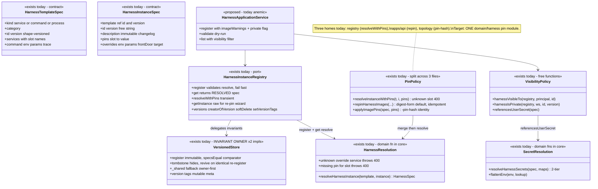
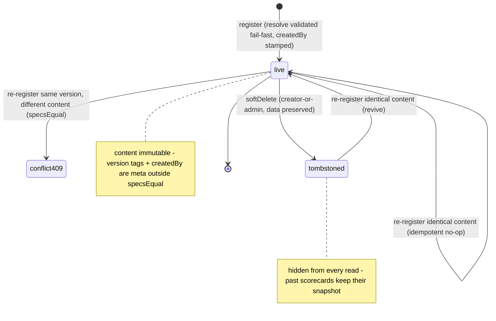
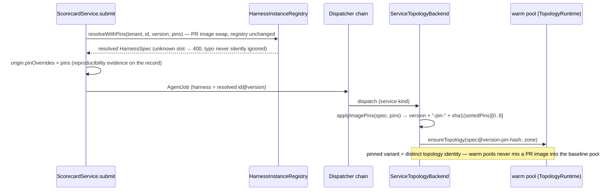

# Harness — collaboration model

> Template + instance + pins + resolution + visibility. Companion to `../00-target-architecture.md`
> (§4 `domain/harness`, §9). Status: PROPOSED — review artifact, no code moves.

## Purpose & language

The agent under test, modeled as a two-level taxonomy: **HarnessTemplate** (the structural skeleton —
`service | command | process`, a `category` label, versioned only when the *shape* changes) and
**HarnessInstance** (a template reference + **pins** + optional **overrides**; conventionally one per
PR/SHA). The engine never sees either — it consumes the **resolved `HarnessSpec`**, produced by
`resolveHarnessInstance(template, instance)`.

Language rules worth pinning:
- *slot* — the pinnable key a template exposes: service templates `slot ?? name` per service;
  command templates exactly `image` / `model`; process templates none.
- *pin* — slot → concrete value (image ref / model). The delta that makes an instance.
- *ephemeral pins* — submit-time transient overrides (`resolveWithPins`): registry untouched,
  recorded in `ScorecardOrigin.pinOverrides` as reproducibility evidence. The CI-PR path.
- *re-pin* — durable pin merge → a **new immutable instance version** (the CI-merge path).
- *overrides* — structure-invariant behavior delta (env/params/front-door body/target extension),
  deep-merged at resolve; distinct from pins.
- *private harness* — a spec referencing a **user-scoped** secret; visible only to the creator of
  the version that makes it private.
- *pin-hash identity* — per-dispatch image pins append a deterministic `-pin-<hash>` version suffix
  so a pinned variant is a distinct warm-pool identity.

## Aggregates & policies



Target placement (00 §4): `resolveHarnessInstance` + secret-reference algebra + visibility policy +
pin identity move to `@everdict/domain` `harness/` (schemas stay in `contracts`); the anemic route
compositions (imageWarnings, private flag, validate) become an `application/control` HarnessService;
the immutability/tombstone/`_shared` invariants stay store-side, deduped through the generic
`VersionedStore` (00 §4 registry row); `PgVersionedStore` keeps the PK-backed conflict check.

## Lifecycle

Instance-version lifecycle (versions, not the id, carry state):



Templates share the same store engine but today expose no delete surface (structure is meant to
outlive instances). Ephemeral pins never enter this lifecycle; re-pin appends a new `live` version.

## Key collaborations

### CI merge → durable re-pin (the headless new-version path)

```mermaid
sequenceDiagram
    participant CI as GitHub Actions (merge to main)
    participant T as POST /harnesses/:id/pins · pin_harness_images
    participant P as repinHarnessImages (harness-pin-service)
    participant R as HarnessInstanceRegistry
    participant V as VersionedStore

    CI->>T: pins {slot: image@sha256:…} (OIDC → ci role)
    T->>P: RepinBodySchema.safeParse → repin(tenant, subject, id, body)
    P->>P: digest-form gate (tag pin → 400 unless allowTags)
    P->>R: getInstance(tenant, id, base ?? "latest")
    P->>R: resolveWithPins(tenant, id, base.version, pins)
    Note over P,R: verify the merge resolves BEFORE registering — unknown slot / missing pin → 400, nothing written
    P->>P: merged = {...base.pins, ...pins}
    alt merge equals base and no explicit version
        P-->>T: unchanged:true, version = base.version (idempotent — no version spam on re-fired commits)
    else changed
        P->>P: nextVersion(base, taken) — semver patch bump or -r&lt;n&gt;
        P->>R: register(tenant, {...base, version, pins: merged}, subject)
        R->>V: immutability check (409 on different content at same version)
        P-->>T: RepinResult {version, base, unchanged:false, pins}
    end
    Note over T: today the route sends RepinResult verbatim; target: RepinResponse.from(result) (contracts/wire)
```

### Submit-time resolution with ephemeral pins → warm-pool identity



DTO mapping at the edge today: register/validate routes compute `imageWarnings`
(`collectHarnessImages` + workspace registry coordinates) and the `private` flag **inside the route**
(`apps/api/src/api/harness/harness.routes.ts:254`, `:75`) and return registry output verbatim.
Target: `HarnessResponse.from(resolved)` carries `imageWarnings`, `private`, `subtitle` as served
fields; the web mirror of the subtitle/visibility derivation is deleted.

## Inbound use-cases

From the apps-api survey catalog (§1.4, #35–46):

| # | Operation | Transport | Implementation | Notes |
|---|---|---|---|---|
| 35 | Register instance | `POST /harnesses` · `register_harness` | registry.register + route-side warnings/private | fail-fast resolve; response teaches visibility tradeoff |
| 36 | Validate instance | `POST /harnesses/validate` | route calls `resolveHarnessInstance` directly | dry-run 404/400 + imageWarnings |
| 37 | List harnesses | `GET /harnesses` · `list_harnesses` | registry.list + `harnessVisibleTo` filter | enriched meta (category/kind/subtitle/private) |
| 38 | Get resolved | `GET /harnesses/:id(/:version)` | registry.get + `harnessVisibleTo` | private → 404 for non-creator |
| 39 | Get raw instance | `GET /harnesses/:id/:version/instance` · `get_harness_instance` | registry.getInstance/versions | re-pin wizard source |
| 40 | Delete version | `DELETE /harnesses/:id/versions/:version` · `delete_harness` | `deleteHarnessVersion` | creator-or-admin; tombstone |
| 41 | Version tags | `PUT /harnesses/:id/versions/:version/tags` · `set_harness_version_tags` | common `setVersionTags` | mutable meta, outside immutability |
| 42 | Durable re-pin | `POST /harnesses/:id/pins` · `pin_harness_images` | `repinHarnessImages` | digest-gated, idempotent, new version |
| 43 | Assign trace sink | `PUT /harnesses/:id/trace-sink` · `assign_harness_trace_sink` | `TraceSinkService.assign` | per-harness export opt-in (member+) |
| 44 | Register template | `POST /harness-templates` · `register_harness_template` | HarnessTemplateRegistry.register | shape-versioned |
| 45 | Validate template | `POST /harness-templates/validate` | schema dry-run in route | |
| 46 | List / get templates | `GET /harness-templates(…)` · `list_harness_templates` / `get_harness_template` | template registry | raw read for "new version from structure" |
| — | Ephemeral pins at submit | inside `POST /scorecards` | `resolveWithPins` + `origin.pinOverrides` | CI-PR trigger path |

## Outbound ports

| Port | Today | Target owner |
|---|---|---|
| `HarnessInstanceRegistry` / `HarnessTemplateRegistry` | `@everdict/registry` interfaces (InMemory + Pg + file loader) | `application/control` ports; generic VersionedStore impl in `persistence-pg` |
| `resolveHarnessInstance` / `resolveInstanceWithPins` | `@everdict/core` fn + registry helper | `domain/harness` (pure) |
| Secret lookup (`scopedSecretsFor` 2-tier) | main.ts closure over `SecretStore` | typed port; `resolveHarnessSecrets` stays `domain/harness` |
| Image-registry coordinates (for warnings) | `ImageRegistryService.coordinates` (apps/api) | `application/control` collaborator over `domain/image` |
| Warm-pool identity (`applyImagePins`) | `@everdict/topology` | `domain/harness` pin identity fn; topology runtimes consume it |
| Trace-sink assignment persistence | `WorkspaceSettingsStore` jsonb (`traceSinkByHarness`) | settings port (see integrations domain) |

## Rules: today → target

| Rule | Today (evidence) | Target |
|---|---|---|
| Template+pins+overrides resolution (deep-merge, exhaustive by kind) | `packages/core/src/harness/harness-template.ts:129-254` (`resolveHarnessInstance`, ~130 lines — the survey's "application-grade resolver in the contracts package") | `domain/harness/resolution.ts`; schemas stay in `contracts` |
| Unknown pin slot / unknown override service → 400 | `packages/registry/src/harness/harness-instance-registry.ts:69-85` (`resolveInstanceWithPins` — "silently ignoring a typo causes the accident where the eval passes without the PR image swapped in") + `harness-template.ts:145-154` | same guard, one home in `domain/harness`; registry calls it |
| Register validates resolution fail-fast | `harness-instance-registry.ts:122-126` (register resolves before store) + Pg twin | keep; becomes a domain precondition invoked by the application register use-case |
| Version immutability (`specsEqual`, jsonb key-order-safe) | `packages/registry/src/versioned-store.ts:59-70` + `pg-versioned-store.ts` (PK-backed) — invariants ×2 impls, ×6 entities hand-rolled elsewhere | store-atomic conflict stays SQL/PK; comparator `specsEqual` → `domain` version algebra; ONE generic VersionedStore (00 §6 P3, golden contract tests per entity) |
| Tombstone + revive | `versioned-store.ts:85-116` (`ownLiveEntry`, `softDelete`, revive on identical re-register); no `_shared` delete | semantics declared in `domain/harness`; enforcement stays with the store engine |
| Digest-form pins by default | `apps/api/src/core/harness/harness-pin-service.ts:29,51-61` (`DIGEST_RE`, `allowTags` opt-out) | `domain/harness` pin policy (pure predicate); use-case applies it |
| Re-pin idempotency + auto version | `harness-pin-service.ts:32-42,67-77` (`nextVersion` semver bump / `-r<n>`; unchanged → skip) | `domain/harness` (pure `nextVersion` + merge), `application/control` use-case does registry I/O |
| Private-harness visibility (owner = creator of the version that makes it private) | `apps/api/src/core/harness/harness-service.ts:11-41` (`harnessVisibleTo`/`harnessIsPrivate`; resolve-failure → visible) + `packages/core/src/harness/harness-secrets.ts:81-87` (`referencesUserSecret`) | `domain/harness` visibility policy; served as a `private` DTO field (deletes list re-derivation) |
| Creator-or-admin delete (out of the role matrix) | `harness-service.ts:49-68` (`deleteHarnessVersion`) — same pattern as datasets | stays a domain resource-ownership policy; shared shape with dataset/judge deletes (one `OwnedVersionPolicy`) |
| Pin-hash warm-pool identity | `packages/topology/src/image-pins.ts:13-31` (`applyImagePins`, sorted-key sha1 suffix) | `domain/harness` pin identity; `infrastructure/topology-runtimes` consumes |
| imageWarnings + private computed in the ROUTE | `apps/api/src/api/harness/harness.routes.ts:32-44,75-81,254-265` — transport carrying composition (survey §5 "thin-service anemic") | `application/control` HarnessService owns register/validate composition; route becomes a ≤10-line driver |
| Secret resolution at dispatch (2-tier, missing → 400, trace.authSecret → transient auth) | `packages/core/src/harness/harness-secrets.ts:30-77` | `domain/harness` secret algebra over a secrets port; values injected by the use-case |
| List enrichment (category/kind/subtitle/private) | `packages/registry/src/harness/harness-instance-registry.ts:16-58` (`enrichHarnessList` — read-model projection inside the SSOT package) | `application/control` read model → `HarnessListResponse.from`; web subtitle mirror deleted |
| Resolved `id@version` on results (never `"latest"`) | `.claude/rules/registry.md` (convention) + `CaseResult.harness` stamping in services | pinned by a `domain` invariant test on the submit use-case |

## Invariants

| Invariant | Owner | Pinned how |
|---|---|---|
| A version's content never changes after registration (different content → 409; identical → no-op) | **store-atomic** — VersionedStore/PgVersionedStore with `specsEqual` (domain comparator) | contract tests per entity; PK backs concurrent register |
| Tombstoned versions are invisible to every read but preserved; identical re-register revives | **store engine** — `ownLiveEntry` filter | registry contract tests; scorecard reproducibility depends on it |
| An instance that cannot resolve is never registered | **domain precondition** — register calls `resolveHarnessInstance` first | registry tests (missing pin / template mismatch → 400, nothing written) |
| Unknown pin slot or override service is always a 400, never ignored | **domain** — `resolveInstanceWithPins` / resolution guards | unit tests pin messages; the CI-PR safety rule |
| Re-pin with tag-form image refs is rejected unless explicitly allowed | **domain** — digest gate in pin policy | unit test on `DIGEST_RE` + allowTags |
| Ephemeral pins never mutate the registry and are always recorded in `origin.pinOverrides` | **application** — ScorecardService.submit | service tests + record assertions |
| A pinned dispatch never shares a warm pool with the unpinned baseline | **domain** — deterministic `-pin-<hash>` version suffix | `applyImagePins` unit tests (same pins → same hash) |
| A private harness is never listed/resolved for a non-creator (404, no existence leak) | **application** filter over **domain** predicate | route tests (list + get) |
| `_shared` harnesses cannot be deleted or tagged by tenants | **store engine** — own-live-only writes | contract tests (NotFound) |

## Open questions

1. `resolveHarnessInstance` currently `.parse()`s the resolved spec against contracts schemas —
   after the contracts/domain split, does `domain/harness` keep a value-dependency on `contracts`
   Zod schemas (proposed: yes, contracts is L0) or return unparsed shapes?
2. Visibility owner is the creator of the **latest** version (`harness-service.ts:19-21`). A later
   non-private version flips the whole id public again. Is id-level visibility-by-latest the target
   rule, or should privacy be evaluated per requested version?
3. The `-pin-<hash>` suffix mutates `spec.version` inside the topology path — does that suffixed
   version ever leak into `CaseResult.harness` (violating "resolved id@version names a registry
   version")? Decide: strip at result assembly, or record `pinOverrides` alongside instead.
4. Templates have no delete/tombstone surface. Intentional (instances depend on them) or a gap once
   member-registered templates proliferate?
5. `harnessVisibleTo` swallows every resolve failure as "visible" (`harness-service.ts:22-24`) —
   safe today because the 404 path follows, but should the target policy distinguish "cannot
   determine" from "public"?
6. Should the re-pin use-case and the ephemeral-pin path share one `PinMerge` domain object so the
   digest gate can (optionally) also apply to CI ephemeral pins?
