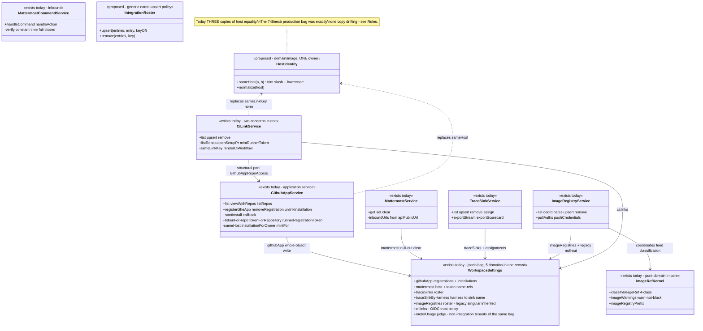
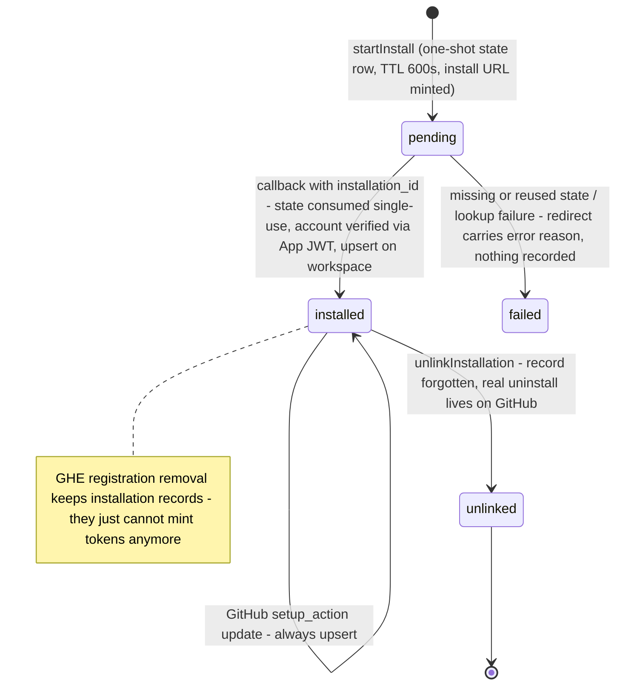
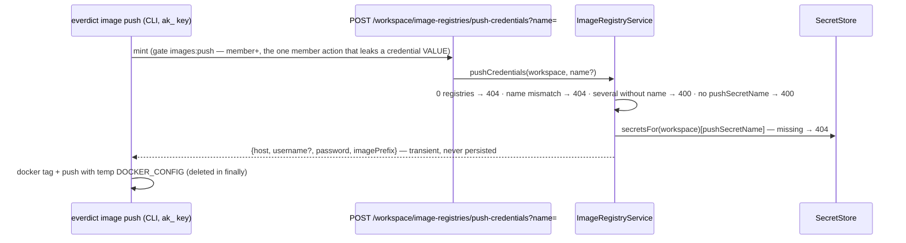

# Integrations — collaboration model

> The five workspace-owned outbound/inbound integrations: **github-app · mattermost ·
> trace-sink · image-registry · ci-link**. Companion to `../00-target-architecture.md` (§4
> `infrastructure/integrations` + `domain/image`/`domain/trace`, §9). Design SSOTs today:
> `docs/architecture/workspace-scoped-integrations.md`, `docs/architecture/trace-sink.md`,
> `docs/architecture/workspace-image-registry.md`, `docs/architecture/github-actions-trigger.md`.
> Status: PROPOSED — review artifact, no code moves.

## Purpose & language

Everything a workspace connects to the outside world is **workspace-owned** (admin registers
once, members use — the Linear model; personal connected accounts were deliberately removed).
All five share three patterns:

1. **Name-keyed upsert rosters** — plural entries keyed by a natural identity (`traceSinks[]` by
   `name`, `imageRegistries[]` by `name`, GHE App `registrations[]` by `host`, `ci.links[]` by
   `(host, repository)`), upsert = filter-out + append, declarative full replace.
2. **SecretStore name-refs** — configs store secret *names* (`privateKeySecretName`,
   `botTokenSecretName`, `commandTokenSecretName`, `authSecretName`, `pullSecretName`,
   `pushSecretName`); values resolve only at use time and never appear in any view.
3. **One settings bag** — all five persist into the `WorkspaceSettings` jsonb record via
   shallow merge (`settings.set`), with a `null`-to-delete convention (jsonb `||` cannot remove
   keys).

Per-integration language:
- **github-app** — *registration* (a GHE App's credentials: host+appId+slug+PEM name-ref;
  github.com App = operator env) vs *installation* (GitHub's grant of the App onto an org with
  chosen repos). Tokens are minted short-lived per call, scoped to repos+permissions, never stored.
- **mattermost** — bot token (outbound posts) + optional command token (inbound slash-command /
  button verification); inbound URLs are derived from `API_PUBLIC_URL` for the admin to register
  on the MM side.
- **trace-sink** — export destination roster + **per-harness selection** (`traceSinkByHarness`:
  harness id → sink name). No selection = no export (**opt-in**). *Attach mode*: when a
  pull-ingest's source kind equals the sink kind, scores attach to the original traces instead
  of duplicating.
- **image-registry** — BYO registries = the image-provenance baseline for the 4-class
  `classifyImageRef` (`workspace|external|local|unqualified`), pull-auth enrichment at dispatch,
  and push-credential minting (`images:push`).
- **ci-link** — a link **is** the GitHub Actions OIDC **trust grant**: `(host, repository)` →
  harness/slots/runtime; saving a link means "JWTs from this repo may act as the `ci` role here".

## Aggregates & policies



Target placement (00 §4): host normalization + `classifyImageRef` → `domain/image` (single
owner); the trace-coordinates/kind vocabulary → `domain/trace`; the five services become
`application/control` use-cases; GitHub REST / Mattermost HTTP / sink adapters →
`infrastructure/integrations` (`infrastructure/oauth/github-app.ts` already is); the roster
upsert becomes one generic policy. CI-link trust *semantics* (what a link grants) sit with
`domain/auth` federation policy; workflow YAML codegen is an interface-kit concern.

## Lifecycle

GitHub App installation (the only real state machine among the five):



Sinks/registries/links/mattermost have CRUD-only lifecycles; the interesting transitions are
referential: removing a sink **cleans dangling harness assignments**; removing a GHE
registration **strands** its installations (deliberate — see open questions).

## Key collaborations

### CI OIDC trust resolution (ci-link as trust policy; host identity at three sites)

```mermaid
sequenceDiagram
    participant GH as GitHub Actions job (OIDC JWT)
    participant A as githubActionsAuthenticator (auth pkg)
    participant M as main.ts resolveTrust / hostsFor closures
    participant WS as WorkspaceSettings ci.links
    participant Z as authz

    GH->>A: Bearer JWT + x-everdict-workspace hint
    A->>M: hostsFor(workspaceHint) — which GHES issuers to trust
    M->>WS: links of the hinted workspace → distinct hosts (normHost, copy #3)
    A->>A: verify vs github.com or GHES issuer JWKS, audience "everdict"
    A->>M: resolveTrust(claims{repository, host}, hint)
    M->>WS: find link — repository matches case-insensitively AND normHost(link.host) == normHost(claims.host)
    Note over M,WS: a matching link IS the trust grant — no link, no identity (fail-closed 401, no leak)
    M-->>A: {workspace, roles: ["ci"]}
    A-->>Z: Principal{subject: "gha:owner/repo", via: "github-actions", roles: ["ci"]}
    Note over Z: ci role: scorecards run/read + harness read/register only; excluded from membership bootstrap
```

### Per-harness sink selection → case-streaming export (opt-in, isolated)

```mermaid
sequenceDiagram
    participant B as ScorecardBatchService (judged case stream)
    participant TS as TraceSinkService
    participant SS as SecretStore
    participant SK as buildTraceSink adapter (trace pkg)
    participant R as ScorecardRecord.export

    B->>TS: exportStream(tenant, {scorecardId, dataset, harness "id@version", sinkOverride?}, attach?)
    TS->>TS: override "none" → undefined; else sink = override ?? traceSinkByHarness[harness id]
    Note over TS: no selection or no builder → undefined (opt-in: silence is the default)
    TS->>SS: secretsFor(tenant)[authSecretName]
    TS->>SK: buildSink({kind, endpoint, auth, project, webUrl})
    Note over TS,SK: setup failure → failure-outcome-only stream (pushes ignored, settle carries the reason)
    loop each judged case
        B->>TS: push(caseResult)
        TS->>SK: export(ctx, [case]) — attach mode: externalId when attach.sourceKind == sink.kind
        Note over TS,SK: per-case try/catch → outcomes[slot]; concurrency-capped (default 2)
    end
    B->>TS: settle()
    TS-->>R: {sink, name, status succeeded|partial|failed, url?, message?, cases[]}
    Note over B,R: export outcome is recorded on the scorecard, NEVER fails it
```

### Push-credential mint (image-registry; the honest `images:push` action)



## Inbound use-cases

From the apps-api survey catalog (§1.11, #103–118):

| # | Operation | Transport | Implementation | Notes |
|---|---|---|---|---|
| 103 | GitHub App status (+repos) | `GET /workspace/github-app` · `list_workspace_github_app` | `GithubAppService.list`/`viewWithRepos` | per-install repo lookup soft-fails (`reposError`) |
| 104 | Installation repos picker | `GET /workspace/github-app/repos` · `list_github_app_repos` | `listRepos` | only install-time-chosen repos appear |
| 105 | Start install | `POST /workspace/github-app/install/start` · `start_workspace_github_app_install` | `startInstall` | one-shot OAuth state, TTL 600s |
| 106 | Install callback | `GET /workspace/github-app/callback` | `callback` | state take single-use; success/error redirect callouts |
| 107 | Register GHE App | `POST /workspace/github-app/registrations` · `register_workspace_github_app` | `registerGheApp` | host-upsert via `sameHost`; PEM = SecretStore name-ref; `settings:write` |
| 108 | Remove registration / unlink installation | `DELETE …/registrations` · `…/installations/:id` (+MCP) | `removeRegistration`/`unlinkInstallation` | idempotent; installs survive registration removal |
| 109 | Get / Set / Clear Mattermost | `GET/PUT/DELETE /workspace/mattermost` (+MCP ×3) | `MattermostService` | token name-refs; clear = `mattermost: null` |
| 110 | Mattermost slash command | `POST /integrations/mattermost/command?ws=` | `MattermostCommandService.handleCommand` | constant-time token verify, fail-closed; `/everdict run\|leaderboard\|status` |
| 111 | Mattermost interactive action | `POST /integrations/mattermost/action?ws=` | `handleAction` | Rerun button post-back |
| 112 | List / Upsert / Remove trace sinks | `GET/PUT /workspace/trace-sinks` · `DELETE …/:name` (+MCP ×3) | `TraceSinkService.list/upsert/remove` | remove cleans dangling assignments; admin |
| — | Assign sink to harness | `PUT /harnesses/:id/trace-sink` · `assign_harness_trace_sink` | `TraceSinkService.assign` | member+ (harness-config concern); unknown sink 400; null clears |
| 113 | Export scorecard to sink | `[B]` | `exportStream`/`exportScorecard` | see sequence; outcome on `record.export` |
| 114 | List / Upsert / Remove image registries | `GET/PUT /workspace/image-registries` · `DELETE …/:name` (+MCP ×3) | `ImageRegistryService` | legacy singular inherited as `default`; `missingSecrets` warning |
| 115 | Mint push credentials | `POST …/push-credentials?name=` · `get_image_push_credentials` | `pushCredentials` | `images:push` member+; name required if multiple |
| 116 | Pull-auth enrichment | `[B]` | `pullAuths` | best-effort at dispatch; missing secret silently skipped |
| 117 | List / Upsert / Remove CI links | `GET/PUT/DELETE /workspace/ci/links` (+MCP ×3) | `CiLinkService` | link = trust grant (`settings:write`); personal-runner runtime rejected at save |
| 118 | Open CI setup PR | `POST /workspace/ci/links/setup-pr` · `open_ci_setup_pr` | `openSetupPr` | YAML synthesis; fail-closed if `self:ws` pool empty; near-idempotent branch/PR reuse |

## Outbound ports

| Port | Today | Target owner |
|---|---|---|
| `WorkspaceSettingsStore` (merge-upsert jsonb) | `@everdict/db` — one record hosting all five configs | `application/control` port; **split per integration is an open question** |
| `OAuthStateStore` (single-use `take`) | `@everdict/db` | port; store stays the single-use invariant owner |
| `secretsFor(tenant)` (name-ref → value) | main.ts closure over workspace-tier SecretStore | `SecretResolution` port (see `secret-key.md`) |
| GitHub App crypto + REST (`githubAppJwt` RS256, `mintInstallationToken`, `getInstallation`, `oauthFetchJson` → UpstreamError remap) | `apps/api/src/infrastructure/oauth/{github-app,provider}.ts` | `infrastructure/integrations` (already correctly placed; moves with the regroup) |
| Raw GitHub REST (branch/contents/pulls, runner registration-token) | inline `fetch` in `GithubAppService`/`CiLinkService` | `infrastructure/integrations` GitHub client; the service keeps only the decisions |
| Mattermost HTTP (posts + inbound verify) | inline `fetch` in `NotificationService.post` / command service | `MattermostPoster` adapter (shared with `notification.md`) |
| `buildTraceSink(cfg)` (4 kinds) | `@everdict/trace` | `infrastructure/trace-adapters`; kind vocabulary in `domain/trace` |
| `imageWarnings`/`classifyImageRef`/`RegistryAuth` | `@everdict/core` (`packages/core/src/infra/image-ref.ts`) | `domain/image` |
| `GithubAppRepoAccess` / `WorkspaceRunnerRoster` (structural ports of CiLinkService) | declared IN `ci-link-service.ts:32-52`, satisfied by GithubAppService / RunnerService | good port discipline — keep; ownership moves to the application layer |

## Rules: today → target

| Rule | Today (evidence) | Target |
|---|---|---|
| **GitHub host identity (normalize, never `===`)** | **THREE copies**: ① `sameHost` — `apps/api/src/core/github-app/github-app-service.ts:61-64`; ② `sameLinkKey`/`norm` — `apps/api/src/core/ci-link/ci-link-service.ts:69-72`; ③ `normHost` — `apps/api/src/main.ts:1273` (buildAuthenticator trust resolution, `:1281`). **Production bug `748eecb`**: exactly this rule implemented as raw `===` made an installed GHE App render as "not installed" — one copy drifted. | ONE `domain/image` (host-identity) function (`sameHost`/`normalizeHost`); all three call sites import it; a lint/dep rule bans local host comparison |
| Roster upsert identity | 4 hand-rolled filter-append blocks: sinks by `name` (`trace-sink-service.ts:85-87`), registries by `name` (`image-registry-service.ts:105-107`), GHE registrations by `host` (`github-app-service.ts:148-151`), CI links by `(host, repository)` (`ci-link-service.ts:96-108`) | one generic `IntegrationRoster.upsert(entries, entry, keyOf)` domain helper; per-integration `keyOf` uses `HostIdentity` where the key contains a host |
| Settings jsonb bag + null-to-delete | `packages/db/src/workspace/workspace-settings.ts` — one Zod schema spanning ≥5 domains; shallow merge means each service must write its whole sub-object (`github-app-service.ts:381-384`) and delete via `null` (`mattermost-service.ts:83-85`, `image-registry-service.ts:107`) | either split into per-integration settings stores in `persistence-pg`, or keep the bag but generate per-integration typed accessors with the null-out rule enforced once — decide in review |
| Secret name-ref, value-at-use | every config view returns name-refs only (`trace-sink-service.ts:8-9`, `mattermost-service.ts:5`, `image-registry-service.ts:14`); values resolve at mint/post/export time | pinned as the integration-wide contract in `domain`; views typed so a value field cannot exist (`SecretRef` newtype in `contracts`) |
| Image 4-class classification tie-in | `classifyImageRef`/`imageWarnings` in `packages/core/src/infra/image-ref.ts:13,61-79,99-107`; registry `coordinates()` feeds it for harness register/validate warnings; loose web mirror `apps/web/src/shared/lib/image-ref.ts` (interfaces survey §3) | kernel → `domain/image`; the wire serves the computed class per image (deletes the web mirror) |
| Legacy singular registry inheritance | read: `imageRegistry` → `[{name: "default", …}]` when plural absent; first write nulls the singular (`image-registry-service.ts:65-69,107`) | keep as a data migration note; the generic roster removes the special case after a backfill |
| Trace-sink opt-in + per-harness selection | no assignment = no export (`trace-sink-service.ts:121-134`); override `"none"` suppresses per batch (`:127`); assignment validates sink existence 400 (`:103-113`); removal cleans assignments (`:92-99`) | selection semantics → `domain/trace` (sink-selection policy); referential cleanup stays with the settings write (single record = atomic today — note if the bag splits) |
| Sink kind enum | declared 3–4×: `@everdict/trace TraceSinkConfig`, `WorkspaceSettingsSchema.traceSinks`, `ScorecardExportSchema`, api DTOs (data-infra survey §5 smell 1) | ONE enum in `contracts` (`domain/trace` vocabulary) |
| Export never fails the scorecard; per-case isolation | stream `push` try/catch per case (`trace-sink-service.ts:192-194`); setup failure → failure-outcome-only stream (`:137-158`) | application-level delivery contract, pinned by tests with a throwing sink |
| CI link = trust grant; personal runners banned | `ci-link-service.ts:85-94` (400 on `self`/`self:<id>` runtimes at save — fail early, not at fire time); consumed by the authenticator's injected `resolveTrust` | trust semantics → `domain/auth` federation policy; the save-time gate is a domain guard |
| Setup-PR fail-closed on empty runner pool | `ci-link-service.ts:133-151` — zero `self:ws` runners → 400 before opening the PR ("a workflow merged with zero runners sits silently queued") | domain guard over the `WorkspaceRunnerRoster` port |
| Workflow YAML codegen + GHE registry derivation | `renderCiWorkflow` + `registryFor` (`ghcr.io` vs `containers.<hostname>`), `ci-link-service.ts:268-377` — codegen inside a trust-policy service (survey verdict: "two concerns in one service") | split: YAML rendering → interface-kit (it is a *served artifact*), registry derivation → `domain/image` |
| Installation-token scoping | minted per call, narrowed to repos+permissions, ~1h TTL, never stored; `tokenForRepo` = contents:read transient `AgentJob.repoToken` (`github-app-service.ts:236-244`) | unchanged; declare "tokens are transient" as a domain invariant with the adapter enforcing TTL-only handling |
| Host-strict installation matching | `installationForOwner(owner, host)` exact-host; `anyHostInstallationForOwner` = github.com-first legacy fallback (`github-app-service.ts:339-356`) | `domain` matching policy over `HostIdentity`; keep the documented fallback order |
| Mattermost inbound authenticity | constant-time compare of the command-token value, fail-closed when unconfigured (`mattermost-command-service.ts:41-…`) | stays; the verify becomes a domain guard over the secret-resolution port |

## Invariants

| Invariant | Owner | Pinned how |
|---|---|---|
| No secret **value** ever appears in a config view / list / status response | **contracts** — view types carry name-refs only | shape tests per view; `SecretRef` newtype makes the violation untypeable |
| Host equality is normalized (case + trailing slash), never raw `===` | **domain** — `HostIdentity` (today 3 copies) | regression test from `748eecb` (registered `https://ghe.acme.io/` matches `https://GHE.acme.io`); dep-cruiser ban on local copies |
| OAuth install state is single-use and expiring | **store-atomic** — `OAuthStateStore.take` | contract test: second take → null |
| Installation tokens are short-lived and never persisted | **application + adapter** | code review rule; no store field exists |
| Roster upsert never duplicates a key (name / host / host+repo) | **domain** — roster policy | unit tests per integration keyOf |
| Removing a sink leaves no dangling harness assignment | **application** — `remove` rewrites both fields in one settings write | service test |
| Assigning an unknown sink is 400 (no dangling reference created) | **domain guard** | service test |
| Sink export failure never fails the scorecard; one case's failure never blocks another | **application** — stream isolation | tests with throwing sink; `record.export.status` partial/failed |
| A CI link existing ⇔ that repo's OIDC trust; no link → 401 with no existence leak | **domain/auth** federation policy (today main.ts closure) | auth-suite tests |
| CI never leases a personal runner (save-time and dispatch-time) | **domain guard** (`ci-link` save) + dispatcher owner derivation | service test pins the 400 |
| Push credentials require the honestly-named `images:push` action | **authz matrix** | route tests |
| Pull-auth enrichment is best-effort (missing secret = skip, never block dispatch) | **application** | service test (`pullAuths` skips silently) |
| Mattermost inbound verification is constant-time and fail-closed | **application guard** | command-service tests |

## Open questions

1. **Settings bag split**: do the five integrations get five stores (`persistence-pg`), or does
   the bag survive with generated typed accessors? The bag gives atomic multi-field writes
   (sink remove + assignment cleanup) for free; a split needs a transaction.
2. `CiLinkService` decomposition: trust-policy CRUD (domain) vs GitHub REST + YAML codegen
   (adapter + interface-kit) — confirm the proposed 3-way split and where `openSetupPr`'s
   orchestration lands.
3. GHE registration removal strands installations (records remain, can't mint). Keep the
   deliberate leniency (re-register to revive) or cascade-unlink?
4. Does `viewWithRepos`'s per-install soft-fail (`reposError`) become a general integration
   read-model convention (never let one credential failure kill a status screen)?
5. Webhook-based installation sync (GitHub can uninstall Apps out-of-band; today we only learn
   at token-mint failure) — add an inbound webhook surface or pin lazy discovery?
6. The Mattermost slash-command surface composes `submitScorecard`/`leaderboard` closures from
   main.ts — should chat inbound become a first-class interface (like HTTP/MCP) driving the same
   use-cases through interface-kit mappers?
