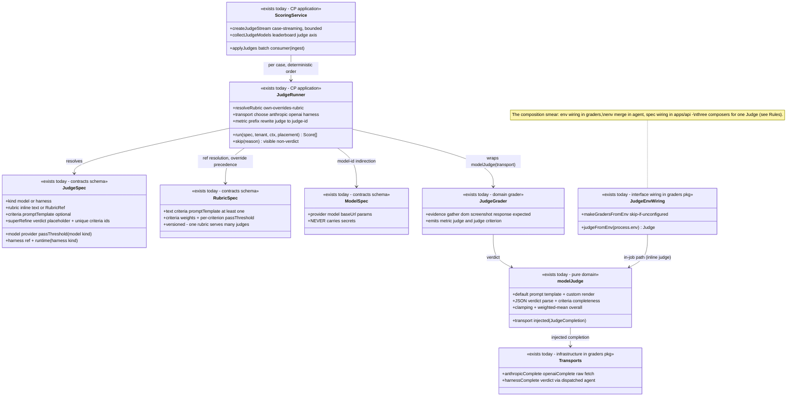
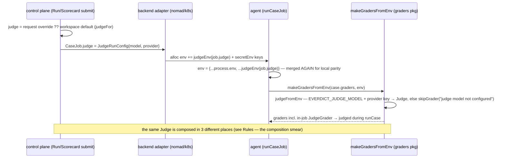

# Judge (+ rubric + model) — collaboration model

> Agent Judges: registrable verdict renderers over traces/observations, plus the Rubric and Model
> entities they reference. Companion to `../00-target-architecture.md` (§4 `domain/judge`, §9).
> Status: PROPOSED — review artifact, no code moves.

## Purpose & language

A **Judge** is a registered, versioned verdict renderer: `model` (direct LLM/VLM call with the
tenant's key) or `harness` (delegate the verdict to a dispatched agent; verdict parsed from its
trace). A **Rubric** is HOW to judge — freeform text and/or weighted criteria and/or a custom
prompt template — versioned separately so one rubric serves many judges. A **Model** is a
registered inference target (provider/model/baseUrl, never secrets) so "which model judged" is a
first-class comparable axis. Judge scores land in the `judge:<judge-id>[:criterion-id]` metric
namespace and are **auxiliary by verdict authority** — they can never override ground truth (see
`scorecard.md`).

Language rules worth pinning:
- *inline judge* vs *Agent Judge* — two systems today: the per-run `JudgeRunConfig` (model name +
  provider riding `CaseJob.judge` → env → the **in-job** judge grader) vs registered `JudgeSpec`s
  applied **control-plane-side** after the run. Both are real; the target must name them.
- *skip score* — an unrunnable judge never silently vanishes: it emits a visible
  `pass: undefined` score with the reason in `detail`.
- *co-locate* — a harness judge without `spec.runtime` inherits the producing run's placement
  (judge next to the observations); explicit `spec.runtime` overrides
  (`docs/architecture/judge-placement-locality.md` D1/D2).
- *observation delivery* — how the judged evidence travels: `reference` (store fetch, default) |
  `sentinel` (inline in the result channel) | `egress` (pushed to a sink) — declared on the
  harness target (D3).
- *verdict instruction* — the `{verdict_instruction}` placeholder every custom prompt template
  MUST carry; it expands to the JSON verdict contract the parser relies on.

## Aggregates & policies



Target placement (00 §4): judge/rubric/model semantics (prompt build, verdict parse, rubric
override precedence, metric naming, skip semantics) → `domain/judge`; `JudgeRunner`/
`ScoringService` → `application/execution` scoring composition (ONE composer);
`anthropicComplete`/`openaiComplete`/`harnessComplete` → infrastructure adapters behind a
`JudgeCompletion` port; the env wiring dissolves into the agent composition root.

## Lifecycle

No state machine — judge/rubric/model are immutable registry versions (register → resolve →
soft-delete tombstone), shared with all versioned entities (see `registry` handling in 00 §4).
The runtime artifact is the **skip-or-score** outcome per (judge, case), not a lifecycle.

## Key collaborations

### Control-plane judge pass (registered Agent Judges, case-streaming)

```mermaid
sequenceDiagram
    participant B as ScorecardBatchService.track
    participant SC as ScoringService
    participant JR as JudgeRunner
    participant RR as RubricRegistry / ModelRegistry
    participant SS as SecretStore (secretsFor)
    participant T as transport (anthropic/openai fetch)

    B->>SC: createJudgeStream(tenant, dataset, judges, runtime)
    SC->>SC: resolveJudges — pre-resolve specs once (missing judge silently skipped)
    loop per completed case (bounded, case-axis parallel)
        B->>SC: push(result) — fired the moment the case settles
        SC->>JR: run(spec, tenant, {case, trace, snapshot}, runPlacement)
        JR->>RR: resolveRubric — ref → registry (owner + _shared); judge's own criteria/promptTemplate override
        JR->>SS: secretsFor(tenant) — decryption failure = visible skip, NEVER an empty-map fallback
        JR->>RR: models.get(spec.model) — registered id → provider/model/baseUrl, else raw string
        JR->>T: JudgeGrader(modelJudge(complete)).grade(ctx)
        T-->>JR: Score[] with metric judge / judge:criterion
        JR->>JR: rewrite prefix → judge:<id> / judge:<id>:<criterion>; passThreshold re-decides OVERALL only
        JR-->>SC: Score[] (or skip score with reason)
        SC->>SC: append to result.scores — deterministic order within a case
    end
    B->>SC: settle() — join, rethrow first error
```

### Harness judge dispatch (placement + co-locate)

```mermaid
sequenceDiagram
    participant JR as JudgeRunner
    participant D as dispatch (same Dispatcher as a run)
    participant AG as judge agent (dispatched harness)

    JR->>JR: placement = spec.runtime ? {target: spec.runtime} : producing run's placement (co-locate)
    JR->>D: CaseJob{evalCase: judge-<spec.id>-<case.id>, task = judging prompt, graders: [], placement}
    D->>AG: dispatch onto the chosen runtime
    AG-->>D: CaseResult (the judge agent's own trace)
    D-->>JR: trace → harnessComplete extracts the final answer text
    JR->>JR: modelJudge parse — same verdict contract as a model judge
    Note over JR,AG: unregistered runtime → dispatcher throws → visible skip; the judging prompt IS the task
```

### In-job inline judge (the second system — dispatch path)



## Inbound use-cases

From the apps-api survey catalog (§1.6, #64–67):

| # | Operation | Transport | Implementation | Notes |
|---|---|---|---|---|
| 64 | Register judge | `POST /judges` · `create_judge` | `JudgeRegistry.register` | model \| harness spec; boundary superRefine |
| 65a | Validate judge | `POST /judges/validate` · `validate_judge` | schema dry-run | placeholder + unique-criteria checks |
| 65b | List judges | `GET /judges` · `list_judges` | registry.list | tenant + `_shared` |
| 65c | Get judge version | `GET /judges/:id/versions/:version` · `get_judge` | registry.get | |
| 65d | Judge version tags | `PUT /judges/…/tags` · `set_judge_version_tags` | common `setVersionTags` | off-spec mutable labels |
| 66 | Rubrics (register/validate/list/get/tags) | `/rubrics*` · `create/validate/list/get_rubric`, `set_rubric_version_tags` | `RubricRegistry` | referenced by judges as `{id, version}` |
| 67 | Models (register/validate/list/get) | `/models*` · `create/validate/list/get_model` | `ModelRegistry` | resolved by JudgeRunner AND `ModelResolvingDispatcher` (`{{model}}`) |
| — | Judge application | inside scorecard track / ingest | `ScoringService` → `JudgeRunner` | no own transport; selected per scorecard submit |

## Outbound ports

| Port | Why needed | Today's adapter |
|---|---|---|
| `JudgeRegistry` / `RubricRegistry` / `ModelRegistry` | resolve specs (owner + `_shared`) | `@everdict/registry` |
| `secretsFor(tenant)` | provider API keys (`ANTHROPIC_API_KEY`/`OPENAI_API_KEY`/`OPENAI_BASE_URL` names) | lambda over `SecretStore` (main.ts) |
| `dispatch` (`(CaseJob) → CaseResult`) | harness judge = an agent run | the same Dispatcher chain as runs |
| `JudgeCompletion` (transport port) | provider-agnostic verdict call | `anthropicComplete`/`openaiComplete` (raw fetch, in `packages/graders/src/model-judge.ts`), `harnessComplete` |
| `HarnessInstanceRegistry` | resolve the judge's referenced harness | `@everdict/registry` |
| `fetchImpl` / provider baseUrls | test injection + LiteLLM proxy | ctor deps |

## Rules: today → target

| Rule | Today (evidence) | Target |
|---|---|---|
| **Judge composition** (config → Judge instance) | **3 composers**: ① `packages/graders/src/judge-env.ts` (`judgeFromEnv`/`makeGradersFromEnv` — reads `process.env` **by default inside a library**); ② `packages/job-runner/src/run.ts:100-103` (merges `judgeEnv(job.judge)` over `process.env`, then calls ①); ③ `apps/api/src/core/execution/judge-runner.ts:119-234` (`defaultJudgeRunner`: spec → transport → `JudgeGrader`). Plus a 4th consumer of ① in a placement adapter: `packages/topology/src/service-backend.ts:203` | ONE judge-composition function in `application/execution`; the agent and CP both call it; env parsing happens only in composition roots |
| Judge env wire contract | env names live in the dependency root: `packages/core/src/execution/agent-job.ts:15-21` (`JUDGE_MODEL_ENV`/`JUDGE_PROVIDER_ENV` + `judgeEnv`); injected by backend adapters `packages/backends/src/orchestrators/nomad.ts:131` and `k8s.ts:314` (copy-adapted comment included) | env mapping becomes part of the job envelope in `contracts` (god-DTO split); adapters stop knowing judge semantics |
| Metric-prefix naming rule | **split across two packages**: `packages/graders/src/judge.ts:68-69,102,115` emits `judge` / `judge:<criterion>` with the comment "the judge runner rewrites the prefix"; the rewrite lives in `apps/api/src/core/execution/judge-runner.ts:217-227` | one `domain/judge` naming function (`judgeMetric(judgeId, criterionId?)`) used by both the grader and the runner |
| Skip-score philosophy | **2 implementations**: `skip()` in `judge-runner.ts:36-38` and `skipGrader()` in `packages/graders/src/judge-env.ts:33-40` — same rule ("a chosen judge never silently vanishes"), two shapes | one `domain/judge` skip-score constructor |
| Provider transports co-located with pure verdict logic | `packages/graders/src/model-judge.ts` holds `modelJudge` (pure prompt/parse) AND `anthropicComplete`/`openaiComplete` (raw HTTP, header formats, vision payloads) in one file/barrel (engine survey §5) | `modelJudge` → `domain/judge`; transports → `infrastructure` adapters behind the `JudgeCompletion` port |
| Two judge systems (inline vs registered) | inline `JudgeRunConfig` (`packages/core/src/execution/agent-job.ts:8-12`, per-run/workspace-default via `judgeFor`, judged **in-job**) vs registered `JudgeSpec` (judged **CP-side post-run**); both surface in scorecards (`judgeModels` collects from both — `scoring-service.ts:113-131`) | keep both capabilities but define them in one vocabulary: inline judge = an anonymous model-judge spec; one domain type, two application entry points |
| Rubric override precedence (judge's own criteria/promptTemplate beat the rubric's) | ONE owner: `judge-runner.ts:65-101` (`resolveRubric`) — clean | moves to `domain/judge` verbatim |
| Verdict-placeholder + unique-criteria boundary validation | duplicated superRefine blocks in `packages/core/src/harness/judge-spec.ts:57-75` and `rubric-spec.ts:33-56` (same two checks, twice) | one shared refinement helper in `contracts` |
| Screenshot evidence resolution | judge evidence path is copy #3 of the base64 trick: `resolveScreenshot` in `packages/graders/src/judge.ts` duplicates run-case `materializeScreenshot` and environments' os-use snapshot embed (engine survey cross-obs 2) | one `application/execution` observation-materialization step; `JudgeGrader` consumes the materialized evidence |
| Scoring executes in 3 places | run-case (in-job graders incl. inline judge), topology `ServiceTopologyBackend` (placement adapter grading via `makeGradersFromEnv`), CP `ScoringService`/`JudgeRunner` | scoring composition collapses into `application/execution` (00 §4); placement adapters stop scoring |
| Judge placement + locality | designed and shipped per `docs/architecture/judge-placement-locality.md`: D1 `JudgeSpec.runtime` → `placement.target`; D2 co-locate = inherit producing-run placement (threaded, NOT read off `ctx.case` — the doc's "co-location gotcha"); D3 delivery `reference\|sentinel\|egress` on the harness target | semantics move to `domain/judge` + `domain/trace` (delivery); the dispatch threading stays application |

## Invariants

| Invariant | Owner | Pinned how |
|---|---|---|
| A custom `promptTemplate` always carries `{verdict_instruction}` | **contracts** — schema superRefine (judge + rubric) | boundary parse tests; registration 400 |
| Criteria ids are unique (each becomes a metric suffix) | **contracts** — schema superRefine | boundary parse tests |
| A selected judge never silently vanishes (skip score with stated reason) | **domain** — skip constructors; **application** — every unrunnable branch returns it (no key, no dispatch, rubric unresolved, decryption failure, grade throw) | `judge-runner.test.ts` pins each reason string |
| Secret-decryption failure is NEVER conflated with "not configured" | **application** — `judge-runner.ts:159-167` explicit catch, no empty-map fallback | regression test (shipped with the fix) |
| The judge can never override ground truth | **domain (scorecard)** — verdict authority ranking | suite tests (see `scorecard.md`) |
| `passThreshold` re-decides the OVERALL score only; criteria keep their own thresholds | **application** — `judge-runner.ts:216-227`; **domain** — criterion threshold in `modelJudge` | runner tests |
| Multiple judges stay distinct in one scorecard (`judge:<id>` namespace) | **application** — prefix rewrite (target: domain naming fn) | scoring tests |
| Model judges run in-process and ignore `runtime`; harness judge placement = `spec.runtime` > inherit > default | **application** — `judge-runner.ts:137` | placement-locality tests (D1/D2 slices) |
| `ModelSpec` never carries secrets (keys resolved per provider from SecretStore) | **contracts** — schema comment + shape; **application** — key lookup by fixed names | schema review + runner tests |
| Judge application order within a case is deterministic (selection order); parallelism is case-axis only, bounded (default 4) | **application** — `ScoringService` limiter | scoring-service tests |
| Ingest judging has no producing run → no placement inheritance | **application** — `applyJudgesToCase(runtime: undefined)` | ingest tests |

## Open questions

1. Unify the inline `JudgeRunConfig` with registered judges now (an inline judge becomes an
   anonymous `ModelJudgeSpec`), or keep the two systems and only unify the domain vocabulary?
   The inline judge is load-bearing in every dispatch path (backends inject its env).
2. Judge cost attribution: model-judge calls use the tenant's key but their tokens/cost are not
   metered into `UsageMeter` (only harness-judge runs produce a trace with cost). Should the
   target meter CP-side judge calls (see `billing.md`)?
3. `harnessComplete` extracts the verdict from the judge agent's trace via `traceToText` — a
   fragile "last answer wins" parse. Should the harness-judge contract require the sentinel
   delivery mode (D3) for its verdict instead?
4. `ScoringService.resolveJudges` silently skips a missing judge (vs the skip-score philosophy
   everywhere else). Make missing-at-resolve a visible skip score too?
5. Affinity-tag locality scoring stays a deliberate non-goal (placement-locality doc §7) — carry
   that decision into the target docs, or revisit once runtimes are multi-region?
