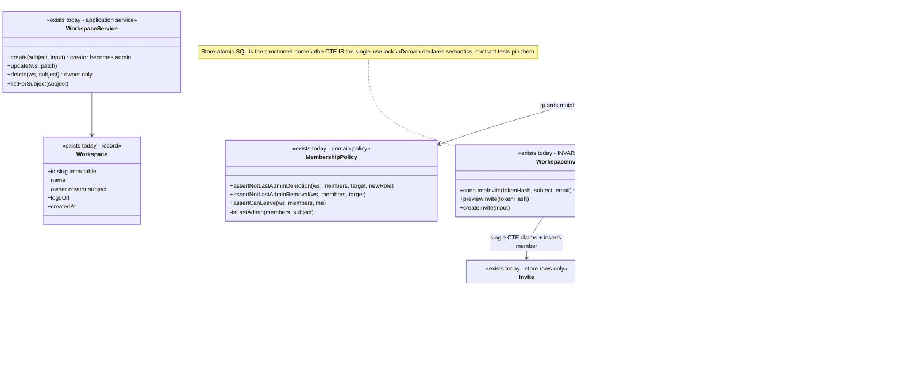
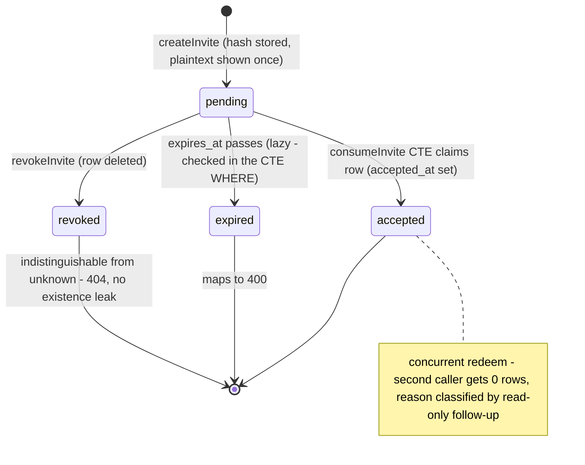
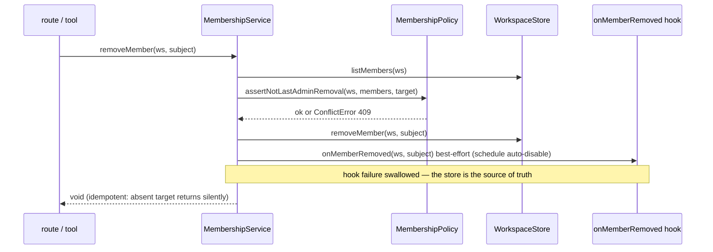

# Member — collaboration model

> Workspace + membership + invite. Companion to `../00-target-architecture.md` (§4 `domain/member`,
> §9). Status: PROPOSED — review artifact, no code moves.

## Purpose & language

The tenancy backbone: **Workspace** (= tenant = trust zone; slug is the tenant key), **Member**
(subject × workspace × role, roles `viewer|member|admin` cumulative), **Invite** (a hash-only,
expiring, single-use join secret), **active workspace** (per-request selection of one membership),
and **Profile** (display-only enrichment: name/avatar/email — never an authz input). Owner
(workspace creator) is a distinct concept from the admin role: owner-only actions (workspace
delete) bypass the role matrix entirely.

Language rules worth pinning:
- *last admin* — the invariant subject: a workspace must always keep ≥1 admin.
- *bootstrap* — lazily promoting a token/dev default workspace into a membership row.
- *consume* — atomic invite redemption (claim + membership creation in one statement).

## Aggregates & policies



Target placement (00 §4): `MembershipPolicy` + invite-outcome semantics + the workspace slug/owner
rules move to `@everdict/domain` `member/`; `MembershipService`/`WorkspaceService` become
`application/control` use-cases; the invite CTE and `ensureMembership` SQL stay in
`infrastructure/persistence-pg` as the invariant owner.

## Lifecycle

Invite lifecycle (the only real state machine in this domain):



Workspace: `created (creator=admin, exactly once via ON CONFLICT DO NOTHING)` → mutable display
fields → `deleted (owner-only hard delete)`. Membership has no state machine; role is a mutable
attribute guarded by `MembershipPolicy`.

## Key collaborations

### Invite accept (the mandated sequence — store as invariant owner)

```mermaid
sequenceDiagram
    participant T as HTTP route / MCP tool
    participant S as MembershipService
    participant ST as WorkspaceInviteStore (Pg)
    participant M as everdict_workspace_members

    T->>S: acceptInvite(principal, token)
    S->>S: reject via != oidc (machine keys cannot join)
    S->>S: hashKey(token)
    S->>ST: consumeInvite(tokenHash, subject, email)
    Note over ST,M: ONE CTE: UPDATE invites SET accepted_at WHERE accepted_at IS NULL AND unexpired RETURNING → INSERT member ON CONFLICT DO UPDATE SET email=COALESCE(...) — role never clobbered
    ST-->>S: ConsumeOutcome ok | unknown | expired | accepted
    alt ok
        S-->>T: workspace + role (actual role read back, not the invite role)
    else accepted
        S-->>T: ConflictError 409
    else expired
        S-->>T: BadRequestError 400
    else unknown (revoked folds in)
        S-->>T: NotFoundError 404 (no existence leak)
    end
    Note over T: target: reply = InviteAcceptResponse.from(result) (contracts/wire); today the route sends the service result verbatim
```

### Member removal with cleanup hook



## Inbound use-cases

From the apps-api survey catalog (§1.9, #83–96):

| # | Operation | Transport | Implementation | Notes |
|---|---|---|---|---|
| 83 | List members | `GET /members` · `list_members` | `MembershipService.listMembers` | profile join (name/avatar) in service |
| 84 | Set member role | `PATCH /members/:subject` · `set_member_role` | `setRole` + `MembershipPolicy` | last-admin demotion 409 |
| 85 | Remove member | `DELETE /members/:subject` · `remove_member` | `removeMember` | idempotent; fires `onMemberRemoved` |
| 86 | Leave workspace | `DELETE /members/me` · `leave_workspace` | `leaveWorkspace` | self-serve, no role gate; last admin 409 |
| 87 | Create invite | `POST /invites` · `create_invite` | `createInvite` | plaintext once; hash+prefix stored |
| 88 | List / revoke invites | `GET /invites` · `DELETE /invites/:id` | store passthrough | meta only, never token_hash |
| 89 | Accept invite | `POST /invites/accept` · `accept_invite` | `acceptInvite` | OIDC-only; CTE consume |
| 90 | Preview invite | `GET /invites/preview` | `previewInvite` | non-consuming; token IS the auth |
| 91 | List my workspaces | `GET /workspaces` · `list_workspaces` | `WorkspaceService.listForSubject` | self-serve |
| 92 | Create workspace | `POST /workspaces` · `create_workspace` | `create` | slug + collision suffix; creator=admin |
| 93 | Get / update workspace | `GET/PATCH /workspace` | `get` / `update` | name/logo; slug immutable |
| 94 | Delete workspace | `DELETE /workspace` · `delete_workspace` | `delete` | **owner-only**, not in role matrix |
| 95 | Who am I | `GET /me` · `get_profile` | route composes list + profile | composite read |
| 96 | Update profile | `PATCH /me/profile` · `update_profile` | `ProfileService.update` | display metadata only |
| — | Active-workspace resolution | every request | `applyActiveWorkspace` (route-context) | bootstrap + header switch + fallback |

## Outbound ports

| Port | Today | Target owner |
|---|---|---|
| `WorkspaceStore` (workspaces + members, `ensureMembership`, `roleFor`) | `@everdict/db` interface | `application/control` port; Pg impl in `persistence-pg` |
| `WorkspaceInviteStore` (`consumeInvite` CTE, `previewInvite`) | `@everdict/db` | same — store stays the single-use invariant owner |
| `UserProfileStore` (`getMany` join) | `@everdict/db` | port |
| `onMemberRemoved(ws, subject)` hook | late-bound closure in `main.ts` (→ `ScheduleService.disableByCreator`) | typed domain-event port (`MemberRemoved`) |
| Token primitives: `generateInviteToken` (`inv_`), `hashKey` | values exported from `@everdict/db` | `domain/member` (issuance recipe) over a hash contract in `contracts` |
| `validateImageRef` (workspace logo) | `apps/api/src/common/image-ref.ts` | `domain/image` |

## Rules: today → target

| Rule | Today (evidence) | Target |
|---|---|---|
| Last-admin invariant | ONE owner already: `apps/api/src/core/member/membership-policy.ts` (3 intent-named guards over a passed-in member list) | moves verbatim to `domain/member` — the model example of a policy object |
| Last-admin race | acknowledged read-modify-write race, `apps/api/src/core/member/membership-service.ts:49` ("admin counts are small, allowed for v1") | either keep + document, or add a store-atomic guard (`UPDATE … WHERE (SELECT count(*) FROM members WHERE role='admin' AND …) > 1`) — decide in review |
| Invite single-use + role preservation | `packages/db/src/workspace/workspace-invites.ts:202-232` (`PgWorkspaceInviteStore.consumeInvite` CTE) **and** re-implemented in TS in `InMemoryWorkspaceInviteStore.consumeInvite` (:116-127) | store-atomic SQL is the sanctioned home; the InMemory copy becomes the contract-test double, pinned by a shared contract-test suite |
| Membership bootstrap + active-workspace switch | `apps/api/src/api/route-context.ts:201-237` `applyActiveWorkspace` — auth-domain policy in the transport-shared module (rule-sanctioned single owner today), incl. the role-capping rule (OIDC join to an existing workspace capped to `member`, :217-226) | `application/control` request-context resolver (one use-case decorator), consumed by HTTP + MCP identically; the capping rule is `domain/member` policy |
| Creator-admin exactly once + no role clobber | `packages/db/src/workspace/workspace-store.ts:226-232, 289-297` (`ON CONFLICT DO NOTHING` / email `COALESCE`) duplicated in the InMemory impl | store-atomic; semantics declared in `domain/member`, pinned by contract tests |
| Owner-only workspace delete | `apps/api/src/core/workspace/workspace-service.ts:55-65` — deliberately **not** in the role matrix (`.claude/rules/auth.md`) | stays a domain rule (`Workspace.assertOwner`) in `domain/member`; never enters the matrix |
| Slug generation + collision suffix | `workspace-service.ts:11-18, 69-94` | `domain/member` pure function (`workspaceSlug`) |
| Token hygiene recipe (hash-only, prefix hint, plaintext once) | three parallel implementations: `generateInviteToken` (`workspace-invites.ts:53`), `generateKey`/`issueKey` (`tenant-auth.ts:158-177`), `generateRunnerToken` — same recipe, three copies | ONE `domain` credential-issuance recipe parameterized by prefix (`inv_`/`ak_`/`rnr_`) — shared with the secret-key and runner domains |
| Role matrix mirror in web | `apps/web/src/shared/auth/can.ts` re-types actions/roles for UI gating | web imports `contracts/wire` types; per-resource `allowedActions` served in DTOs deletes the mirror |
| Profile enrichment | `membership-service.ts:32-46` (join of two stores) | stays an application read-model concern; response DTO (`MemberResponse.from`) carries the joined shape |

## Invariants

| Invariant | Owner | Pinned how |
|---|---|---|
| A workspace always keeps ≥1 admin (demotion / removal / self-leave) | **domain** — `MembershipPolicy` (3 guards, one predicate) | unit tests pin the three messages; known benign race documented |
| An invite token redeems at most once | **store-atomic SQL** — CTE `UPDATE … WHERE accepted_at IS NULL … RETURNING` | contract test: concurrent consume, second gets `{ok:false}`; InMemory double must match |
| Redeeming never changes an existing member's role | **store-atomic SQL** — member insert `ON CONFLICT DO UPDATE SET email = COALESCE(...)` only | contract test: pre-existing admin accepts a viewer invite → stays admin (service also reads the actual role back) |
| Creator becomes admin exactly once; re-bootstrap never demotes | **store-atomic SQL** — `ON CONFLICT DO NOTHING` | contract test on double-create |
| Plaintext invite/API tokens are never stored or listed | **store discipline** — hash-only columns; list queries never select `token_hash` | code review rule + tests asserting meta shape |
| Failure reasons never leak invite existence (revoked ≡ unknown → 404) | **domain** — `acceptInvite` outcome mapping | route tests pin status codes |
| `via ∈ {runner, github-actions}` principals never gain a member row | **application** — `applyActiveWorkspace` early return (`route-context.ts:206`) | tests in the auth suite |

## Open questions

1. Harden the last-admin race with a store-atomic count guard now, or keep the documented v1
   stance? (The CTE-consume pattern shows the shape it would take.)
2. Where exactly does `applyActiveWorkspace` land — an `application/control` context resolver
   (proposed) or interface-kit middleware? It mixes identity (auth domain) with membership
   (member domain).
3. Should `onMemberRemoved` become a general domain-event bus (member-removed also interests
   runner/CI-link domains) or stay a single typed hook?
4. Workspace hard-delete today deletes the workspace row; scoped data cleanup across 17 stores is
   implicit. Does the target want an explicit cascade contract (per-store `deleteTenant`)?
5. Invite expiry is lazy (checked at consume/preview). Is a sweeper needed, or is lazy expiry a
   pinned semantic?
