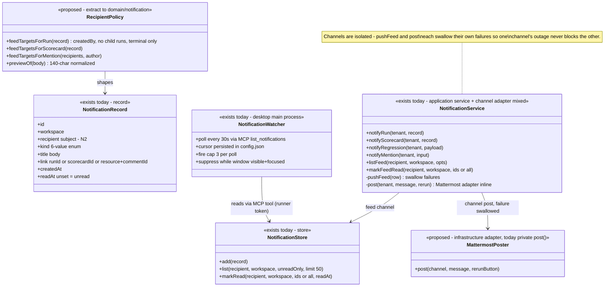

# Notification — collaboration model

> "The work I asked for is done" — the personal feed + its delivery fan-out. Companion to
> `../00-target-architecture.md` (§4, §9). Design SSOT today:
> `docs/architecture/notifications.md` (N1–N6). Status: PROPOSED — review artifact, no code moves.

## Purpose & language

One completion/mention/regression event fans out to **independent channels**: the **personal feed**
(store-backed bell inbox, `recipient = the subject who asked for the work`), the **workspace
Mattermost channel** (bot-token post, workspace-integration-gated), **web-native browser
notifications** (bell widget fires only when the tab is hidden), and **desktop OS notifications**
(an Electron main-process watcher polling the feed over MCP with the runner pairing token — zero
web session needed). The feed store is the source of truth; every delivery is fire-and-forget.

Language rules worth pinning:
- *recipient rule* — feed rows target exactly the initiator (`createdBy`); there is no
  subscription model.
- *child-run exclusion* — scorecard child runs never notify; the batch entry represents them
  (flood prevention).
- *kind* — the closed 6-value enum: `run_completed|run_failed|scorecard_completed|
  scorecard_failed|schedule_regression|comment_mention`.
- *cursor* — the desktop watcher's high-water mark (`createdAt`); read state (`readAt`) belongs
  to the feed, not the watcher.
- *yield* — exactly one surface fires natively: web yields to the desktop watcher when the
  desktop is paired; the desktop suppresses while the window is visible+focused.

## Aggregates & policies



Target placement (00 §4): the recipient rules + preview normalization + kind vocabulary move to
`@everdict/domain` `notification/`; `NotificationService` becomes an `application/control`
use-case over two ports (`NotificationStore`, `ChannelPoster`); the inline Mattermost HTTP call
(`post`) moves to `infrastructure/integrations` (it is the only raw `fetch` inside a core service
today). The deep-link vocabulary becomes a wire contract (see Rules — the desktop currently
hardcodes web route paths).

## Lifecycle

A feed row has one transition:

```mermaid
stateDiagram-v2
    [*] --> unread : pushFeed (recipient = initiator; add() failure swallowed)
    unread --> read : markFeedRead(ids or "all") sets readAt
    read --> [*]
    note right of unread : the desktop watcher's cursor is independent of readAt - firing an OS notification does not mark the row read
```



Channel posts (Mattermost, OS notifications) are transient — no persisted state.

## Key collaborations

### Completion fan-out (recipient rule + channel isolation)

```mermaid
sequenceDiagram
    participant RS as RunService / ScorecardService (onComplete)
    participant NS as NotificationService
    participant F as NotificationStore (feed)
    participant MM as Mattermost /api/v4/posts

    RS->>NS: notifyRun(tenant, record)
    NS->>NS: feed gate: createdBy set AND no parentScorecardId AND status terminal
    alt gate passes
        NS->>F: add({recipient: record.createdBy, kind: run_completed|run_failed, link: {runId}})
        Note over NS,F: try/catch — feed failure never affects the run result
    end
    NS->>NS: resolve settings.mattermost + botTokenSecretName via secretsFor
    alt channel configured
        NS->>MM: POST post (icon + status line; Rerun button only when commandToken + apiPublicUrl)
        Note over NS,MM: try/catch — channel failure never affects the run result
    end
    Note over RS,NS: scorecard path identical minus the child-run gate; regression path adds the schedule creator feed row + a channel warning
```

### Desktop OS notifications (N6 — web-session-independent path)

```mermaid
sequenceDiagram
    participant W as NotificationWatcher (Electron main)
    participant M as MCP /mcp (runner rnr_ token)
    participant NS as NotificationService
    participant OS as OS notification

    loop every 30s
        W->>M: list_notifications
        M->>NS: listFeed(recipient = runner owner subject, workspace)
        NS-->>W: rows (limit 50)
        W->>W: fresh = rows.createdAt > cursor (first poll with backlog: set cursor only, no flood)
        alt window not visible+focused
            W->>OS: fire (cap 3 per poll)
            Note over W,OS: click loads webUrl + "/{workspace}/runs/{id}" — web paths hardcoded in desktop main
        end
        W->>W: advance + persist cursor (failed save at worst re-fires once)
    end
    Note over W: the web bell (25s poll via BFF /api/notifications) yields native firing while the desktop is paired; browser-native fires only when document.hidden
```

## Inbound use-cases

From the apps-api survey catalog (§1.14, #123–125):

| # | Operation | Transport | Implementation | Notes |
|---|---|---|---|---|
| 123 | List feed | `GET /notifications` · `list_notifications` | `NotificationService.listFeed` | self-scoped (recipient = subject), **no role gate**; `unreadOnly`, limit default 50 |
| 124 | Mark read | `POST /notifications/read` · `read_notifications` | `markFeedRead` | ids or `"all"`; sets `readAt`; returns count |
| 125 | Fan-out on completion / regression / mention | `[B]` no transport | `notifyRun` / `notifyScorecard` / `notifyRegression` / `notifyMention` | called by RunService.onComplete, ScorecardService.onComplete, ScheduleService.finalize, CommentService (via main.ts closure) |

Browser consumers: web bell widget (25s poll through the BFF proxy `app/api/notifications`),
desktop watcher (30s MCP poll, runner token — works with zero web session).

## Outbound ports

| Port | Today | Target owner |
|---|---|---|
| `NotificationStore` (add/list/markRead) | `@everdict/db` (`packages/db/src/activity/notification-store.ts`, mig 0037; run recipient basis mig 0036 `createdBy`) | `application/control` port; Pg impl in `persistence-pg` |
| `settingsFor(tenant)` (Mattermost config read) | `WorkspaceSettingsStore` injected as a lambda | integrations read port (shared with `integrations.md`) |
| `secretsFor(tenant)` (bot-token + command-token value resolve) | workspace-tier SecretStore closure from `main.ts` | secret-resolution port (see `secret-key.md`) |
| Mattermost post (raw `fetch` POST `/api/v4/posts`) | **inline in the service** — `notification-service.ts:166-206` | `infrastructure/integrations` `MattermostPoster` adapter |
| `apiPublicUrl` (Rerun button post-back base) | config field | composition config |
| id / clock | ctor defaults | `clock/id` port |

## Rules: today → target

| Rule | Today (evidence) | Target |
|---|---|---|
| Recipient = initiator (`createdBy`) | `apps/api/src/core/notification/notification-service.ts:38,64,138-139` — feed rows only when `createdBy` is known | `domain/notification` `RecipientPolicy` — the single place a future subscription model would extend |
| Child-run exclusion (flood prevention) | `notification-service.ts:38` (`!record.parentScorecardId`); mirrored by the batch representing children | `domain/notification` rule, tested against a child-run record |
| Terminal-status gate | `:38,64` — only `succeeded|failed` reach the feed; Mattermost posts any status with a neutral icon | make the asymmetry explicit in the policy (feed = terminal-only, channel = any) or unify — decide in review |
| Delivery isolation (channel failures swallowed independently) | `pushFeed` (:118-125) and `post` (:203-205) each own a try/catch | application-level delivery contract: every `ChannelPoster.deliver` is best-effort; pinned by tests with throwing ports |
| Mention preview normalization (whitespace-collapse, 140 chars) | `:103` | `domain/notification` pure function |
| Rerun button precondition | `:175-193` — only when `commandTokenSecretName` + `apiPublicUrl` (the button must be verifiable + reachable) | stays with the Mattermost adapter config; the *decision* (attach interactive context) is application policy |
| Kind vocabulary | enum in the **db package** (`packages/db/src/activity/notification-store.ts:7-14`) | `contracts` (wire + record share one enum; today wire DTO reuses the db schema — fine, but the home is persistence-flavored) |
| Deep-link mapping | THREE knowledge sites: record `link` shape (db), web bell mapping type→path, desktop `notifyPathOf` **hardcoding** `/{workspace}/runs/{id}` + `/scorecards/{id}` (`apps/desktop/src/notification-watcher.ts` / interfaces survey §4-7) | serve a resolved `href` (or a route-token) in the wire DTO from `contracts/wire` — deletes the desktop path mirror; a web route rename stops silently breaking desktop clicks |
| Exactly-one-native-surface (yield protocol) | web bell: fires only `document.hidden` + yields when desktop paired (`apps/web/src/widgets/notification-bell/ui/notification-bell.tsx:73-91`); desktop: suppresses while visible+focused | keep as an interface-layer convention; document as a UX invariant, not domain |
| Backlog protection on first poll | watcher pins cursor without firing (`notification-watcher.ts:70-81`) | interface concern (desktop), pinned by its unit tests |
| Regression alert composition | `ScheduleService.finalize` diffs vs previous fire then calls `notifyRegression` (survey #32) | stays a schedule-domain use-case emitting a typed event; notification domain only formats/delivers |

## Invariants

| Invariant | Owner | Pinned how |
|---|---|---|
| Notification failure never affects the run/scorecard/comment result | **application** — every channel write wrapped | service tests with throwing store/fetch |
| Feed rows target only the initiator; child runs are silent | **domain** — recipient policy | unit tests (child-run record → no row) |
| Feed reads/writes are self-scoped (recipient = caller subject) | **store** — `WHERE recipient` + route passes `principal.subject`; no role gate | route tests: another subject's rows invisible |
| Channels are mutually independent | **application** — separate try/catch per channel | test: feed down, Mattermost still posts (and vice versa) |
| Bot token is a SecretStore name-ref, resolved only at post time, never on the record | **integration pattern** (see `integrations.md`) | code review + view-shape tests |
| Mattermost inbound context token rides only inside the button payload it verifies | **application** — same token the slash-command inbound checks | command-service tests |
| Desktop firing never marks rows read (cursor ≠ readAt) | **interface** — watcher owns cursor only | watcher unit tests |
| 6-kind enum is closed; unknown kinds fail Zod at the boundary | **contracts** | schema test |

## Open questions

1. Polling everywhere (web 25s, desktop 30s) — does the target add a push channel (SSE on the
   feed, like run logs) or is poll-scale acceptable for v1 SaaS?
2. Recipient model: `createdBy`-only is deliberate today. Do we want watchers/subscriptions
   (e.g. notify on *any* schedule regression in my workspace) — and if so, that is exactly the
   `RecipientPolicy` extension point.
3. Per-user notification preferences (mute kinds, mute channels) — nothing exists; would need a
   preferences record + policy input.
4. Should Mattermost completion posts move behind the same typed `ChannelPoster` port as a
   future Slack/Teams adapter (the current `post()` is Mattermost-specific inline code)?
5. Feed retention: rows accumulate unbounded (list caps at 50). Sweep policy or archive?
