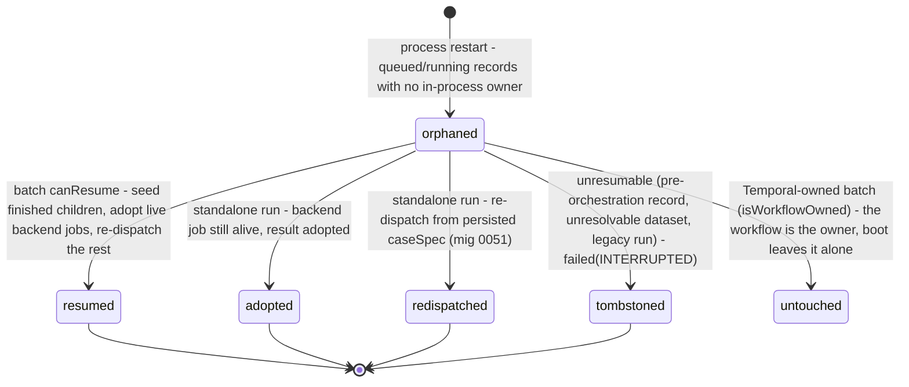

# Ops — collaboration model

> Queue visibility · internal Temporal-bridge surface · metrics · resilience policies
> (spillover / OOM boost / speculation / adaptive width / boot recovery / autoscale / fairness
> dials). Companion to `../00-target-architecture.md` (§4 `domain/placement` + `domain/failure`,
> §9). Design SSOTs today: `docs/architecture/work-queue.md`,
> `docs/architecture/batch-resilience.md`, `docs/architecture/temporal-batch-orchestration.md`,
> `docs/execution-backends.md`. Status: PROPOSED — review artifact, no code moves.

## Purpose & language

"Ops" is not one aggregate — it is the **operator/observability plane** plus the **application
policies layered over the domain's failure + placement rules**:

1. **Queue view** — a pure read model answering "what runs/waits where, and what fires next",
   organized in **runtime lanes** with a scheduler **admission slice** per lane.
2. **Internal bridge** — the `x-internal-token`-guarded `/internal/**` surface Temporal workers
   call back into: batch `plan|case|finalize`, schedule `fire|finalize|status`, scheduling
   dials, machine tenant keys. The workflow owns *durability of the driver loop*; the control
   plane owns *execution and scoring*.
3. **Metrics** — a hand-rolled Prometheus registry instrumented at the dispatch seam.
4. **Resilience policies** — pure decision modules (`core/ops/*`) that wrap `executeCase`:
   they are *application policy over domain facts* (`classifyFailure` taxonomy, placement
   targets), not domain rules themselves.

Language rules worth pinning:
- *lane* — the queue's unit of placement: `""` = default backend, `self:<runnerId>` = a
  personal runner's lease queue, otherwise a registered runtime id. Scheduler backends register
  as `rt:<tenant>:<id>@<version>` — the lane↔backend-name mapping is a naming convention.
- *batch = 1 item* — a scorecard appears once with `progress {done, active, total}`; its child
  runs are folded in (never listed as items — the double-count guard).
- *admission slice* — the per-lane scheduler view (in-flight, memory/cpu envelope, circuit
  state) that makes the fairness/envelope dials non-blind.
- *spill / boost / speculate* — the three case-level recoveries: move on runtime failure,
  double memory on OOM, duplicate at the slow tail.
- *adopt vs re-dispatch vs tombstone* — boot recovery's three outcomes for orphaned work.

## Aggregates & policies

```mermaid
classDiagram
    class QueueService {
        <<exists today - read model, multi-store fan-in>>
        +snapshot(tenant, subject) QueueSnapshot
        -progressOf batch child counts + subset denominator
        -laneMatches cross-tenant filter INSIDE the service
    }
    class QueueSnapshot {
        <<exists today - DTO>>
        +totals scheduler slice
        +workspace lanes - default + registered runtimes
        +personal lanes - my self runners only
    }
    class Metrics {
        <<exists today - zero-dep Prometheus text registry>>
        +counter observe gauge
        +render text exposition
    }
    class SpilloverPolicy {
        <<exists today - core/ops pure fn>>
        +executeWithSpillover(run, job, opts)
    }
    class OomBoostPolicy {
        <<exists today - core/ops pure fn>>
        +executeWithOomBoost(run, job, opts)
        +OOM_ESCALATION_CAP_MB 16384
    }
    class SpeculationController {
        <<exists today - core/ops>>
        +onDispatch onComplete - tail duplicate, first wins
    }
    class AdaptiveConcurrencyGate {
        <<exists today - core/ops>>
        +acquire release
        +effective = max(1, base x pressure)
    }
    class StartupRecovery {
        <<exists today - core/ops fn>>
        +recoverInterrupted resume or adopt or tombstone
    }
    class SchedulingControl {
        <<exists today - ad-hoc object in main.ts>>
        +effective set - live quota/weight overrides over env
    }
    class PlacementKernel {
        <<exists in backends pkg - target domain/placement>>
        +Scheduler WFQ + envelopes
        +CircuitBreaker
        +Autoscaler
    }
    class FailureKernel {
        <<exists in core - target domain/failure>>
        +classifyFailure class + retryable
        +OOM_KILLED
    }
    class InternalGate {
        <<proposed - one guard, today copy-pasted 9x>>
        +requireInternalToken(req) constant-time, fail-closed
    }
    QueueService --> PlacementKernel : stats closures
    SpilloverPolicy --> FailureKernel : infra + retryable only
    SpilloverPolicy --> PlacementKernel : breaker keyed tenant colon runtime
    OomBoostPolicy --> FailureKernel : OOM_KILLED detection
    SpeculationController --> PlacementKernel : skip open circuits
    Metrics --> PlacementKernel : gauges sampled at scrape
    note for SpilloverPolicy "Policies are invoked only from the\n1283-line ScorecardBatchService today -\nthe composition, not the policies,\nis the decomposition target."
```



Target placement (00 §4): `Scheduler`/`CircuitBreaker`/`Autoscaler`/admission math →
`domain/placement`; `classifyFailure` + OOM rules → `domain/failure` (single owner); the
`executeWith*` wrappers + `SpeculationController` + `AdaptiveConcurrencyGate` compose in
`application/execution` (they orchestrate ports around a run function); `QueueService` stays an
`application/control` read model; `Metrics` is infrastructure; the internal bridge becomes typed
`application/control` entry points behind one `InternalGate`.

## Lifecycle

Orphaned-work reclamation at boot (`recoverInterrupted`) — the record-level state machine:



## Key collaborations

### Queue snapshot (fan-in + tenant isolation at the service boundary)

```mermaid
sequenceDiagram
    participant T as GET /queue · get_queue
    participant Q as QueueService
    participant ST as ScorecardStore + RunStore + ScheduleService + RuntimeRegistry + RunnerService
    participant SC as Scheduler.stats / CircuitBreaker.stats (live objects)

    T->>Q: snapshot(tenant, subject)
    Q->>ST: parallel reads (active cards, runs, schedules, runtimes, my runners)
    Q->>ST: child runs per running batch → progress {done, active, total}
    Note over Q: denominator rule — a subset run's total is the SELECTED size, never the full dataset (9/601 misreads as 1%)
    Q->>SC: schedulerStats() / circuitStats() — raw, cross-tenant maps
    Q->>Q: laneMatches: lane "" = bare global backends; else name == lane OR name startsWith "rt:tenant:lane@"
    Note over Q: cross-tenant filtering happens HERE — only this tenant's derived numbers (or the shared global aggregate) leave the service
    Q->>Q: scope split — workspace lanes ("" + registered) vs personal lanes (my self:<id> only); others' personal items invisible, excluded from totals
    Q-->>T: QueueSnapshot {totals, scheduler slice, workspace[], personal[]}
    Note over T: target: QueueResponse.from(snapshot) (contracts/wire); today the DTO is already purpose-built — the closest thing to a wire contract in the app
```

### Temporal batch bridge (durable workflow ↔ control-plane activities)

```mermaid
sequenceDiagram
    participant W as Temporal workflow (batch, task queue everdict-eval)
    participant A as worker activity
    participant I as POST /internal/batches/:id/*
    participant S as ScorecardService (batch collaborator)

    W->>A: plan
    A->>I: /plan (x-internal-token, constant-time, fail-closed 404 when unset)
    I->>S: planBatch(id) — idempotent; batchContexts cache
    S-->>W: caseIds[]
    loop per case (workflow-owned durability, retries via Temporal)
        W->>A: case(caseId)
        A->>I: /case {caseId}
        I->>S: runBatchCase(id, caseId) — executeCase + policies + judge stream (CP owns execution/scoring)
    end
    W->>A: finalize
    A->>I: /finalize
    I->>S: finalizeBatch(id) — settle summary/export/notify via domain transitions
    Note over W,S: worker kill / CP kill mid-batch → workflow replays; activities are idempotent (live-verified W1/W2, zero loss)
```

### Resilient case dispatch (policies composed around executeCase)

```mermaid
sequenceDiagram
    participant B as ScorecardBatchService (track loop)
    participant G as AdaptiveConcurrencyGate
    participant SP as SpeculationController
    participant OB as executeWithOomBoost
    participant SV as executeWithSpillover
    participant D as executeCase → Dispatcher

    B->>G: acquire — effective = max(1, base × pressure(circuit, queue depth))
    B->>OB: run case
    OB->>SV: attempt (current memoryMb)
    SV->>D: dispatch to assigned shard runtime
    alt infra + retryable failure
        SV->>SV: breaker.failure(tenant:runtime); next healthy runtime in the USER-SELECTED list only
        SV->>D: re-dispatch (placement.target swapped)
    else OOM_KILLED
        OB->>OB: double resources.memoryMb (job-only, never the registry spec) up to 16384
        OB->>SV: re-run
    end
    B->>SP: onDispatch/onComplete — pure tail: elapsed > 2×median → ONE duplicate on a healthy runtime, first result wins, loser's queued dispatch cancelled
    B->>G: release
    Note over B,D: every decision input is a domain fact — classifyFailure class/retryable, OOM code, placement target list; the wrappers are application policy
```

## Inbound use-cases

From the apps-api survey catalog (§1.16 + §1.2 #26, §1.3 #31–33):

| # | Operation | Transport | Implementation | Notes |
|---|---|---|---|---|
| 127 | Work-queue snapshot | `GET /queue` · `get_queue` | `QueueService.snapshot` | viewer+; lanes + admission + upcoming fires + personal scope |
| 128 | Prometheus metrics | `GET /metrics` (**unauthenticated**) | `Metrics.render` | counters/histograms at dispatch seam; gauges sampled at scrape |
| 131 | Scheduling dials | `GET/PUT /internal/scheduling` | `schedulingControl.effective/set` (main.ts object) | live per-tenant quota/weight overrides layered over env; restart falls back to env |
| 26 | Temporal batch bridge | `[I] POST /internal/batches/:id/plan\|case\|finalize` | `ScorecardService.planBatch/runBatchCase/finalizeBatch` | idempotent activities; workflow owns loop durability |
| 31–33 | Schedule fire / finalize / status | `[I] POST /internal/schedules/:id/fire\|finalize` · `GET …/scorecard-status/:id` | `ScheduleService` | schedule-domain use-cases riding the internal transport |
| 102 | Machine tenant key | `[I] POST /internal/tenant-keys` | `issueKey` | secret-key domain, internal transport |
| 134 | Boot recovery sweep | `[B]` | `recoverInterrupted` | resume/adopt/re-dispatch/tombstone; Temporal-owned left alone |
| 135 | Autoscaler | `[B]` | `Autoscaler` + `MutableSlots` | `EVERDICT_AUTOSCALE min:max[:intervalMs]`; global env backends only |

## Outbound ports

| Port | Today | Target owner |
|---|---|---|
| Queue read fan-in: `ScorecardStore`, `RunStore`, `schedules.list`, `runtimes.list`, `myRunners`, `caseCountFor`, `runtimeEnvelopeFor` | typed lambda deps on `QueueServiceDeps` (`apps/api/src/core/queue/queue-service.ts:68-96`) | `application/control` read-model ports (already the cleanest port bag in the app) |
| `schedulerStats` / `circuitStats` / `tenantQuotaFor` | closures over the live `Scheduler`/`CircuitBreaker` built in `main.ts` | observability port on `domain/placement` components |
| Dispatch instrumentation | `meteredDispatcher` wrapper (`main.ts:813`) + `onOrchestrationEvent` → metrics mapping (`main.ts:322`) | `application/execution` decorator over the Dispatcher port |
| `internalToken` | env + per-handler compare | one `InternalGate` in interface-kit |
| Temporal drivers (`TemporalBatchDriver`, `TemporalScheduleDriver`) | `@everdict/orchestrator` client side, injected into scorecard/schedule services | `infrastructure/temporal` (00 §4) |
| `Autoscaler` + `MutableSlots` + `parseAutoscale`/`parseTenantMap` | `@everdict/backends` + `core/ops/scheduling-config.ts` (malformed env fails boot loudly) | policy → `domain/placement`; env parsing → composition root |

## Rules: today → target

| Rule | Today (evidence) | Target |
|---|---|---|
| Internal-token guard | copy-pasted **9×** — every handler in `apps/api/src/api/ops/internal.routes.ts` re-does feature-gate + header check + `constantTimeEq` (`:13-18,29-34,38-43,55-63,71-79,89-97,107-115,127-135,159-167`) | ONE `InternalGate` decorator (interface-kit); handlers become ≤10-line drivers |
| Cross-tenant isolation of scheduler numbers | INSIDE `QueueService.snapshot` — `laneMatches` + per-tenant slice (`queue-service.ts:203-240,279-287`); raw stats maps never leave | keep and name it: the read model is the tenancy boundary for observability; contract-tested with two tenants |
| Lane identity convention | stringly triple: `""` default · `self:<id>` lease lanes · `rt:<tenant>:<id>@<ver>` scheduler backends — parsed in QueueService (`:211-214`) and produced by `RuntimeDispatcher` | a `Lane`/backend-name value type in `domain/placement` (one codec, two consumers) |
| Batch = 1 item + child folding + subset denominator | `queue-service.ts:5-6,119-139` (denominator = `subset.selected` first — the "9/601" misread guard) | `domain/scorecard` progress derivation (it is a batch semantic, not a queue one) |
| Personal-lane privacy | `queue-service.ts:56-66,189-201,268-277` — another member's `self:*` items in neither scope nor totals | visibility rule → `domain/runner` (runner-ownership model), applied by the read model |
| Spillover bounds | `core/ops/runtime-spillover.ts:16-21,56-63` — user-selected targets only; only `infra`+`retryable` moves; breaker keyed `tenant:runtimeId`; open circuits sink to the end but still probe | policy moves to `application/execution`; the class/retryable taxonomy it consumes is `domain/failure` (00 §4 single owner) |
| OOM boost bounds | `core/ops/oom-boost.ts:7,32-40` — opt-in; command harnesses only; job-only doubling to `OOM_ESCALATION_CAP_MB` 16 384; registry spec never mutated | cap + doubling rule → `domain/failure` (shared with retry-failed compounding); wrapper stays application |
| Speculation bounds | `core/ops/speculation.ts:5-33` — pure tail only (all dispatched), `2×median` threshold (seeded by history), ONE duplicate, never onto an open circuit, first wins, `cancelQueued` reclaim | same split: thresholds/eligibility = policy object; timer/dispatch = application |
| Adaptive width | `core/ops/adaptive-concurrency.ts` — `effective = max(1, round(base × factor))`, factor sampled per acquire/release, no timer, floor 1 = recovery probe | `application/execution` gate; pressure factor composition (circuit + queue depth) declared in one place |
| Boot recovery | `core/ops/startup-recovery.ts:2-14` — resume-not-tombstone; single-control-plane assumption documented ("also reclaims another's in-flight work") | recovery guards (`canResume`/`canAdopt`) already live in the domain models; the sweep is an application boot use-case; the multi-replica question is open (below) |
| Fairness dials | env baseline (`EVERDICT_TENANT_QUOTAS/WEIGHTS`, fail-loud parse — `core/ops/scheduling-config.ts:4-9`) + live override object (`main.ts:611`) reachable only via `/internal/scheduling` | typed `SchedulingControl` application service; env parsing stays composition; overrides remain process-local by design (restart = env) |
| Metrics as a dispatch decorator | `meteredDispatcher` + `onOrchestrationEvent` mapping in **main.ts** (`:813,322`) — real behavior in the composition root (survey §5 smell) | a named `application/execution` decorator; main.ts only binds it |
| Policies invoked only from the 1 283-line `ScorecardBatchService` | survey §2 + §5 ("the next decomposition target"; `track(…)` takes 12 positional params) | the batch driver in `application/control` composes the policy set through a typed options object — the policies themselves move unchanged |

## Invariants

| Invariant | Owner | Pinned how |
|---|---|---|
| Another tenant's scheduler/queue numbers never appear in a snapshot | **application read model** — filtering inside `QueueService` | two-tenant unit test on `snapshot` |
| Another member's personal (`self:*`) lanes/items/totals are invisible | **application** over the runner-ownership rule | unit tests (`queue-service.test.ts`) |
| A batch's children never appear as queue items (no double count) | **read model** — standalone-only run list + progress folding | unit test |
| Progress denominator = selected subset size when a subset ran | **domain/scorecard** derivation (today in QueueService) | unit test pins the 9/601 case |
| `/internal/**` is fail-closed: unset token → 404, mismatch → constant-time reject | **interface guard** (target: `InternalGate`) | route tests per handler |
| Temporal bridge activities are idempotent (safe under workflow replay) | **application** — `planBatch`/`runBatchCase`/`finalizeBatch` | live-verified (worker-kill/CP-kill runs, 24/24 no loss); regression scenario tests |
| Spillover never dispatches to a runtime outside the user's shard list | **policy** | `runtime-spillover.test.ts` |
| OOM boost never mutates the registered harness spec (job-only) | **policy** | `oom-boost` tests |
| At most one speculative duplicate per case; only at the pure tail | **policy** | `speculation.test.ts` |
| Effective concurrency never drops below 1 (recovery probe survives) | **policy** | `adaptive-concurrency.test.ts` |
| Boot recovery never re-runs finished children; Temporal-owned batches are left alone | **application** over domain guards (`canResume`, `isWorkflowOwned`) | `startup-recovery.test.ts` + batch resume tests |
| Breaker state is shared across spillover / queue view / metrics (one truth per `tenant:runtime`) | **composition** — single `CircuitBreaker` instance injected 3× | wiring test / review |

## Open questions

1. **Multi-replica control plane**: the named single-process state (scheduler queues, breaker,
   `batchContexts`, in-flight abort map, lease hub) + recovery's "reclaims another's work"
   caveat. Does the target externalize this state (store/Temporal) or explicitly pin the
   single-control-plane deployment model? This decides how much of `domain/placement` needs a
   persistence port.
2. **Queue control**: the view is read-only; kill/cancel/reprioritize from the queue screen is
   a named follow-up (work-queue memory). Do control verbs land as queue-domain use-cases or as
   run/scorecard use-cases the queue screen merely links to?
3. `GET /metrics` is unauthenticated by convention (scrape-friendly). Acceptable for SaaS, or
   does the target gate it (network policy vs token)?
4. Should the Temporal→CP bridge stay HTTP loopback (`/internal/batches/*`) or become in-process
   application ports on the worker side once `application/control` exists as a package the
   worker can import? (HTTP keeps the worker thin; ports delete the guard + serialization.)
5. The dials (`quotas`/`weights` overrides) are process-local and lost on restart by design. Is
   an operator-persisted scheduling config wanted, or is env-as-baseline a pinned semantic?
6. Lane identity (`rt:<tenant>:<id>@<ver>`) doubles as the breaker key scope and the metrics
   label — confirm the single `Lane` codec should own all three renderings.
