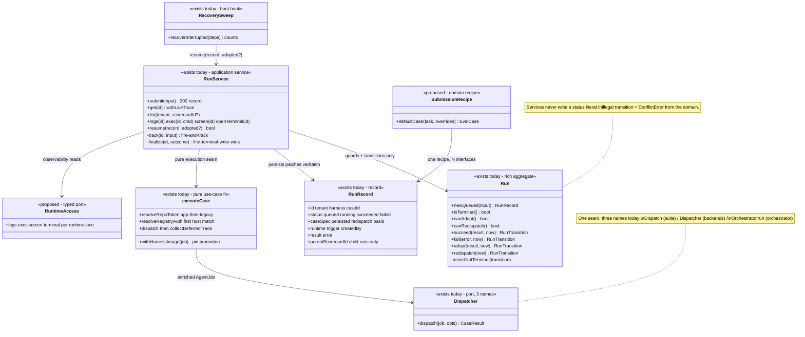
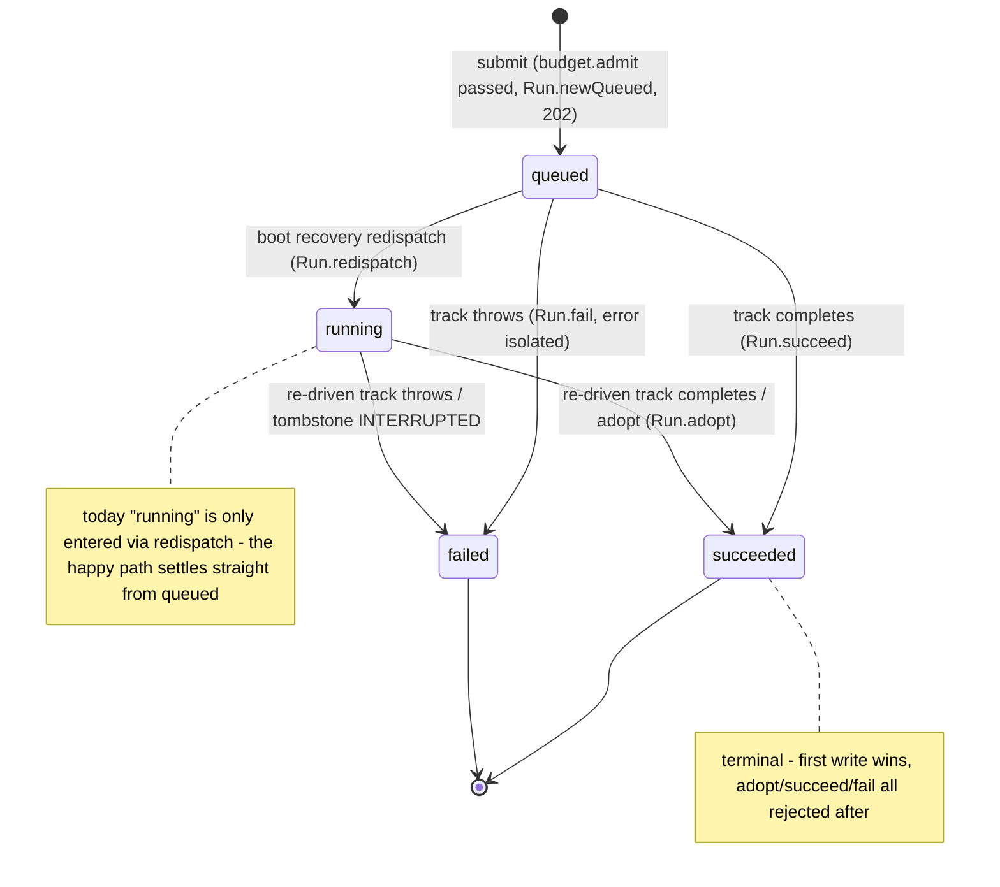

# Run — collaboration model

> The core execution primitive: one eval case, dispatched, settled once. Companion to
> `../00-target-architecture.md` (§4 `domain/run`, §9). Status: PROPOSED — review artifact, no code moves.

## Purpose & language

A **Run** is the unit of execution: one `EvalCase` against one harness version, dispatched to a
backend, settled exactly once (`queued → running → succeeded | failed`). It is the primitive that
everything else composes — a scorecard is orchestration over child runs
(`docs/architecture/run-as-primitive.md`). The **Run aggregate already exists**
(`apps/api/src/core/run/run.ts`): guard methods are the SSOT for legality, transitions return store
patches, illegal transitions throw from the domain. The service (`RunService`) orchestrates: budget
admission, placement injection, dispatch via `executeCase`, first-terminal-write-wins settlement,
notification/webhook fan-out.

Language rules worth pinning:
- *first terminal write wins* — a settled record is never rewritten; late trackers and raced
  boot-recovery adoptions are skipped, not merged.
- *adopt* — boot recovery settling a run with a result harvested from the still-alive backend job
  (zero re-run).
- *redispatch* — boot recovery re-driving a run from its persisted `caseSpec` (mig 0051).
- *correlation runId* — `evd-run-<id>` / `evd-<batch>-<caseId>[-t<n>]`, minted by the control plane
  at dispatch, **derivable from the record alone** (live observers need no lookup).
- *interactive priority* — a person waits on a single run; it jumps ahead of batch fan-out.

## Aggregates & policies



Target placement (00 §4): the `Run` aggregate moves verbatim to `@everdict/domain` `run/`;
`RunService`/`executeCase`/`recoverInterrupted` become `application/control` use-cases; the
`(AgentJob) → CaseResult` seam is named **once** as an application port; the submit recipe
(default graders/timeout) becomes a domain function served to all interfaces; the four
observability closures become one typed `RuntimeAccess` port.

## Lifecycle



Note the asymmetry: the happy path never writes `running` (the tracker holds the promise in-process
and settles straight to terminal); `running` is a recovery-path status. Whether the target model
should stamp `running` at dispatch is an open question (§Open questions).

## Key collaborations

### Submit → dispatch → finalize (the primary sequence)

```mermaid
sequenceDiagram
    participant T as HTTP route / MCP tool / web action
    participant S as RunService
    participant D as Run (domain)
    participant ST as RunStore
    participant E as executeCase
    participant DP as Dispatcher (Scheduler chain)
    participant B as BudgetTracker

    T->>S: submit({tenant, harness, case, runtime, trigger})
    S->>S: assertRuntimeTarget (400 if no runtime/self target)
    S->>B: admit(tenant) — PaymentRequiredError 402, no record created
    S->>S: inject runtime as case.placement.target
    S->>D: Run.newQueued(input) — the only queued-record assembly point
    S->>ST: create(record)
    S-->>T: 202 record (fire-and-track; target: RunResponse.from(record))
    S->>S: track — resolveHarness, meterUsageFor, judgeFor, scopedSecretsFor → resolveHarnessSecrets
    S->>E: executeCase(deps, owner, job{runId: evd-run-<id>, priority: interactive})
    E->>E: withHarnessImage — promote command-harness image pin to evalCase.image
    E->>E: resolveRepoToken (GitHub App first, legacy connection fallback) + resolveRegistryAuth
    E->>DP: dispatch(enriched job)
    DP-->>E: CaseResult
    E->>E: collectDeferredTrace — complete a traceRef result (2-phase collect)
    E-->>S: complete CaseResult
    S->>B: settle(billingTenant(result, tenant), costOf(result))
    S->>S: offloadSnapshot (best-effort, base64 kept on failure)
    S->>ST: finalize — re-read; skip if terminal; else update(id, run.succeed(result))
    S->>S: onComplete + webhook (both swallowed — store is the source of truth)
```

### Boot recovery (adopt-first, redispatch fallback)

```mermaid
sequenceDiagram
    participant R as recoverInterrupted (boot)
    participant A as adoptCase closure (Backend.adopt, isRecoverable)
    participant S as RunService
    participant D as Run (domain)
    participant ST as RunStore

    R->>ST: list() → filter queued|running
    loop each orphaned standalone run
        R->>A: adopt(caseId) — AdoptOutcome adopted | absent | unknown
        alt adopted (job still alive, result harvested)
            R->>S: resume(record, adoptedResult)
            S->>D: canAdopt()? — false when already terminal
            S->>ST: update(id, run.adopt(result)) — zero re-run
        else absent (safe to re-dispatch)
            R->>S: resume(record)
            S->>D: canRedispatch()? — requires persisted caseSpec
            S->>ST: update(id, run.redispatch()) → running
            S->>S: track(id, {case: record.caseSpec, …}) — placement.target persisted, same runtime
        else unknown / legacy record without caseSpec
            R->>ST: update(id, {status: failed, error: INTERRUPTED}) — tombstone
        end
    end
    Note over R,ST: batches are swept FIRST (ScorecardService.resume); child runs are reclaimed via their parent
```

## Inbound use-cases

From the apps-api survey catalog (§1.1, #1–11):

| # | Operation | Transport | Implementation | Notes |
|---|---|---|---|---|
| 1 | Submit run | `POST /runs` · `submit_run` | `RunService.submit` | 202; budget admit sync; runtime → placement.target |
| 2 | Get run | `GET /runs/:id` · `get_run` | `get` + `withLiveTrace` | live-trace deep-link derived, never stored |
| 3 | List runs | `GET /runs` · `list_runs` | `list` | standalone default; `?scorecardId=` child drilldown |
| 4 | Logs snapshot | `GET /runs/:id/logs` · `get_run_logs` | `logs` → `readCaseLogs` closure | best-effort; record still authorizes |
| 5 | Logs SSE tail | `GET /runs/:id/logs/stream` | transport loop over `logs` | 2s poll, heartbeat comments |
| 6 | Exec in sandbox | `POST /runs/:id/exec` · `exec_in_run` | `exec` → `execInSandbox` closure | creator-or-admin (route-inline today) |
| 7 | Live screen | `GET /runs/:id/screen` | `screen` | browser→CDP by runId; os-use→scrot exec |
| 8 | Terminal ticket | `POST /runs/:id/terminal-ticket` | route + `TerminalTicketStore.issue` | short-lived single-use WS auth |
| 9 | Interactive terminal | `WS /runs/:id/terminal?ticket=` | `openTerminal` → `Backend.execStream` | ticket consumed at upgrade |
| 10 | Resume interrupted | boot hook | `resume` guarded by `canAdopt`/`canRedispatch` | via `recoverInterrupted` |
| 11 | Front-door callback | `POST /frontdoor-callback/:runId` | `CallbackSink.deliver` (`StoreCallbackRendezvous`) | callback completion model, multi-replica claim |

## Outbound ports

| Port | Why needed | Today's adapter |
|---|---|---|
| `RunStore` | record persistence, list scoping | `@everdict/db` InMemory/Pg |
| `Dispatcher` (`(AgentJob) → CaseResult`) | the execution seam | Scheduler → RuntimeDispatcher → BackendRegistry chain (main.ts) |
| `BudgetTracker` (admit/settle) | 402 admission + cost attribution | `@everdict/billing` via `persistentBudget` (apps/api/src/common) |
| `resolveHarness` | embed declarative spec in the job | lambda over `HarnessInstanceRegistry` (main.ts) |
| `scopedSecretsFor` / `secretsFor` | `{secretRef}` resolve (2-tier) / traceRef auth | lambdas over `SecretStore` (main.ts) |
| `meterUsageFor` / `judgeFor` | workspace policy defaults | lambdas over `WorkspaceSettingsStore` |
| `installationTokenFor` / `repoTokenFor` | private-repo seed token | `GithubAppService` / legacy connection |
| `registryAuthsFor` | BYO-registry pull auth | `ImageRegistryService.pullAuths` |
| `buildTraceSource` | deferred trace collection | `@everdict/trace` |
| `readCaseLogs` / `execInSandbox` / `openTerminalStream` / `captureBrowserScreen` | live observability | 4 lambda closures over `eachRuntimeBackend` (main.ts) — the de-facto RuntimeAccessService |
| `adoptCase` | boot recovery harvest | lambda over `Backend.adopt` (isRecoverable) |
| `onComplete` | notification fan-out | `NotificationService` closure |
| `artifacts` (`ArtifactStore`) | screenshot offload | `@everdict/storage` S3ArtifactStore |
| `fetch` (webhook) | completion webhook | global fetch |

## Rules: today → target

| Rule | Today (evidence) | Target |
|---|---|---|
| Run-submission recipe (default graders `steps`/`cost`/`latency`, `timeoutSec: 300`, empty `{files:{}}` seed, interface-tagged case id) | **3 copies**: CLI `apps/cli/src/main.ts:74-96` (`buildJob`, + `tests-pass` when `--test`), web `apps/web/src/features/submit-run/api/submit-run.ts:41-53` (`submitRunAction`), MCP `apps/api/src/api/run/run.mcp.ts:82-89` (`submit_run` tool) | ONE `domain/run` recipe function; the submit use-case applies it server-side; interfaces send only task + overrides |
| Correlation runId derivation (`evd-run-<id>` / `evd-<batch>-<caseId>[-t<n>]`) | mint: `run-service.ts:288`, `scorecard-batch-service.ts:447,905`; re-derivation: `run-service.ts:170` (withLiveTrace), `run-service.ts:203` (screen); contract stated only as a comment `packages/core/src/execution/agent-job.ts:63` | `domain/trace` correlation value object (`runIdFor(record)`) — see `trace.md`; run/scorecard call it, never format strings |
| First-terminal-write-wins | single owner: `RunService.finalize` (`run-service.ts:333-339`, read-then-skip-if-terminal) + `Run.assertNotTerminal`; acknowledged non-atomic read-then-update (single-process assumption stated in the comment) | domain guard stays; the write becomes store-atomic (`UPDATE … WHERE status NOT IN ('succeeded','failed')`) when multi-process lands — contract test pins "late tracker loses" |
| Adopt/redispatch legality | ONE owner already: `apps/api/src/core/run/run.ts:53-60` (`canAdopt`/`canRedispatch`) — the model example of guards; `AdoptOutcome` tri-state (adopted/absent/unknown) decided in backend adapters (`packages/backends/src/orchestrators/{nomad,k8s}.ts`) | aggregate moves verbatim to `domain/run`; adopt-outcome semantics become a domain function the placement adapters call (00 §3-3) |
| Creator-or-admin gate for exec/terminal/screen | **3 route-inline copies**: `apps/api/src/api/run/run-observability.routes.ts:42, :68, :93` — contradicts the repo's own rule ("creator-override lives in the service, never the route") | one `domain/run` policy (`Run.assertObservableBy(principal)`), called by the use-case; routes stay 6-step |
| Tenancy read-guard placement | route-side for run: `apps/api/src/api/run/run.routes.ts:35` + `run-observability.routes.ts:16,39,66,91` (`record.tenant !== principal.workspace → 404`) vs service-side for schedule/view — inconsistent ownership | workspace scoping becomes a property of the use-case context, once (survey §5 cross-cutting 2) |
| Failure → CaseResult synthesis | 3 hand-rolled copies incl. this domain's dispatch path — see `failure.md` Rules for the full evidence | one `domain/failure` synthesizer |
| Harness-image pin promotion (`evalCase.image ??= harnessSpec.image`, case wins) | one owner: `apps/api/src/core/execution/execute-case.ts:72-76` (`withHarnessImage`) — but it is a domain rule living in an app-local function | `domain/harness` pin-identity rule; `executeCase` (application) calls it |
| One dispatch seam, three names | `Dispatch` (`packages/suite/src/run-suite.ts`), `Dispatcher` (`packages/backends/src/backend.ts`), `Orchestrator.run` (`packages/orchestrator/src/orchestrator.ts`) + the runner loop's `runJob` | one named application port (`CaseExecutionPort`); durable/fair/scheduled variants layer behind it |
| Live-trace deep-link derivation | `run-service.ts:155-172` reads harness spec's trace coordinates (copy #N of the coordinates smear — see `trace.md`) | served field on the wire DTO (`RunResponse.liveTrace`), computed from `domain/trace` coordinates |

## Invariants

| Invariant | Owner | Pinned how |
|---|---|---|
| A terminal record is never rewritten (succeed/fail/adopt all rejected after settle) | **domain** — `Run.assertNotTerminal` + `canAdopt`; **application** — `finalize` re-read-and-skip | `run.test.ts` unit tests; race window documented (single-process); target adds store-atomic contract test |
| Budget admission precedes record creation (402 ⇒ no run row exists) | **application** — `submit` order (`admit` before `store.create`) | service tests; billing domain owns the 402 semantics (see `billing.md`) |
| The chosen runtime is persisted as `case.placement.target` before dispatch, so resume re-routes to the same runtime | **application** — `submit` placement injection + `caseSpec` persistence (mig 0051) | recovery tests: redispatch routes to the persisted target |
| Correlation runId is derivable from the record alone (no lookup for observers) | **convention today** (comment in `agent-job.ts:63`) — target: `domain/trace` function | today: greps + live-observability e2e; target: unit-pinned pure function |
| `repoToken` / `registryAuth` are transient job fields — never persisted to record or case | **application** — `executeCase` enrichment happens after `Run.newQueued` persisted the case | store tests assert record shape carries no tokens |
| Cost is attributed by the payer rule (managed = tenant; ws-runner = workspace; personal runner = own-pays, not settled) | **domain (billing)** — `billingTenant(result, tenant)` (see `billing.md`) | billing unit tests |
| Child runs are reclaimed via their parent batch, never double-swept | **application** — `recoverInterrupted` sweeps batches first, standalone list excludes children | `startup-recovery.test.ts` |
| A ticket admits exactly one WS terminal attach | **store** — `TerminalTicketStore.issue/consume` (single-use) | transport tests |

## Open questions

1. Should the happy path stamp `running` at dispatch? Today `running` is recovery-only; the queue
   view compensates by reading in-flight state from the Scheduler. A `running` write would make the
   record self-describing but adds a non-terminal write per run.
2. `finalize`'s read-then-update is safe only single-process. Does the target mandate the
   store-atomic terminal write now (cheap, mirrors the invite-consume CTE pattern) or defer to the
   multi-process phase?
3. Where does `executeCase` land? It is control-plane-only (secrets, registry auth, deferred
   collect) → `application/control`; but `withHarnessImage` and the first-host-match registry rule
   are domain decisions that should be extracted first.
4. The webhook is fire-and-forget with no retry or signature. Keep as-is (store is the source of
   truth) or fold into a general notification/event port?
5. `AgentJob.registryAuth` is singular — mixing images from two BYO registries in one job
   authenticates only the first match (documented limitation, `execute-case.ts:38-46`). Does the
   target make it plural?
