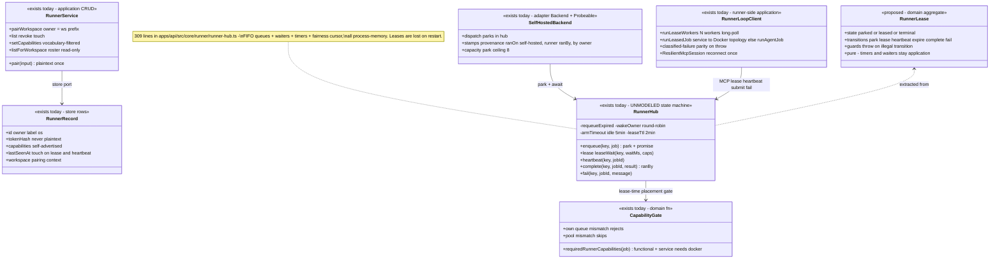
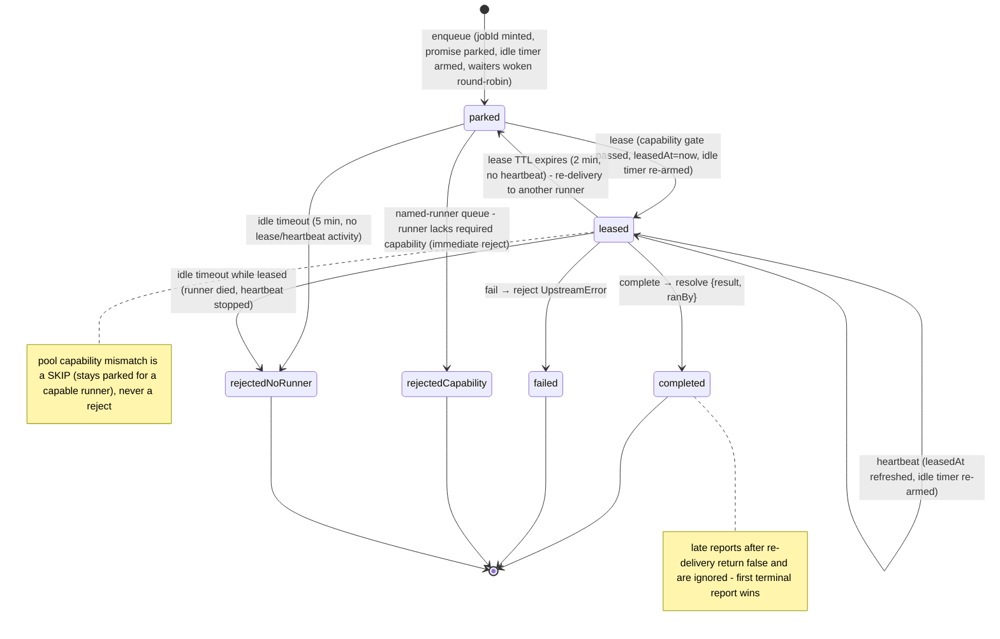

# Runner — collaboration model

> Pairing + personal/workspace tiers + the lease state machine (push→pull). Companion to
> `../00-target-architecture.md` (§4 `domain/runner`, §9). Status: PROPOSED — review artifact, no
> code moves.

## Purpose & language

A **runner** is a user-controlled machine paired to the control plane with an `rnr_` token and
driven **pull-style**: the control plane never reaches into the machine — `SelfHostedBackend.dispatch`
**parks** a job as a promise, and the runner **leases** it over MCP, heartbeats while running, and
submits the result. Two ownership tiers share one mechanism: **personal** (owner = the pairing
subject; own-pays) and **workspace-shared** (owner = `ws:<workspace>`; any member targets it;
workspace-pays). The lease machine lives inline in `RunnerHub` today (in-memory, timers, single
process); the target names it as a **RunnerLease** aggregate.

Language rules worth pinning:
- *pairing* — device registration; the token is plaintext exactly once, only its hash is stored.
- *owner* — `subject` or `ws:<workspace>`. The queue key is `(owner, runnerId)`; the **workspace is
  deliberately NOT in the key** — one runner drains jobs from all of its owner's workspaces, and
  the job carries its own tenant.
- *pool* — the `POOL_RUNNER = "*"` sentinel runnerId: a job targeted at `self` / `self:ws` parks
  under the owner's pool and **any capable runner** of that owner leases it.
- *park / lease / heartbeat* — enqueue with promise; take (sets `leasedAt`); liveness renewal
  (lease TTL 2 min default, idle timeout 5 min default).
- *re-delivery* — an expired lease clears `leasedAt`; another (or the reconnected) runner takes the
  job again. At-least-once; the first terminal report wins.
- *ranBy* — the real id of the completing runner (a pool job's key says `*`); provenance is stamped
  by the control plane, never runner-self-reported.
- *reject vs skip* — a capability mismatch on a **named-runner** job is an immediate rejection (the
  runner was explicitly chosen — never run in the wrong environment); on a **pool** job it is a
  skip (another runner may be capable).

## Aggregates & policies



Target placement (00 §4): the lease legality (states, TTL/idle semantics, reject-vs-skip,
first-report-wins) becomes a pure `RunnerLease` aggregate + `LeasePolicy` in `@everdict/domain`
`runner/`; the hub (promise parking, long-poll waiters, timers, round-robin wake) becomes an
`application/control` service over it; the MCP tool shapes become a typed lease-protocol contract
in `contracts` (today stringly-shared with `packages/self-hosted-runner`); the `rnr_` issuance
recipe merges into the ONE credential recipe shared with `ak_`/`inv_` (see `member.md`).

## Lifecycle

One parked job's life in the hub (`runner-hub.ts` semantics, drawn as the target aggregate):



Runner (device) lifecycle is flat: `paired → touched (lastSeenAt on lease/heartbeat) → revoked
(row deleted; token dead)`. No state machine — presence is inferred, not tracked (pull model).

## Key collaborations

### Pairing (personal and workspace tiers)

```mermaid
sequenceDiagram
    participant T as POST /runners · pair_runner (or /workspace/runners, admin)
    participant S as RunnerService
    participant ST as RunnerStore (Pg)

    T->>S: pair({owner: principal.subject, workspace, label, os}) — owner never from the body
    Note over S: workspace tier: pairWorkspace derives owner = "ws:" + workspace (admin-gated route)
    S->>ST: pair(input)
    ST->>ST: token = generateRunnerToken() "rnr_…"; store hashKey(token) ONLY
    ST-->>S: PairedRunner {id, token plaintext}
    S-->>T: token shown exactly once — never listable again
    Note over T: desktop one-click pairing consumes this via the origin-gated bridge; headless = API key → POST /runners
```

### Lease → heartbeat → submit result (the mandated sequence)

```mermaid
sequenceDiagram
    participant W as runner worker (runLeaseWorkers)
    participant M as MCP /mcp (rnr_ bearer → runnerAuthenticator → roles [runner])
    participant H as RunnerHub
    participant B as SelfHostedBackend (parked dispatch)
    participant BIL as billing (billingTenant)

    B->>H: enqueue({owner, runnerId | *}, job) — promise parked, waiters woken (round-robin per owner)
    W->>M: lease_job(waitMs, capabilities[]) — long-poll + self-advertisement
    M->>H: leaseWait(key, waitMs, caps)
    H->>H: requeueExpired → own queue first (mismatch = reject) → owner pool (mismatch = skip)
    H-->>W: LeasedJob {jobId, job} (AgentJobSchema re-validated runner-side)
    loop while running
        W->>M: heartbeat_job(jobId) — leasedAt refresh + idle re-arm + RunnerService.touch
    end
    W->>W: runLeasedJob — service kind → Docker topology; else runAgentJob (containerize when case.image + docker)
    alt success or eval failure
        W->>M: submit_job_result(jobId, CaseResult) — a throwing job submits a CLASSIFIED failed CaseResult (parity with the agent sentinel path)
        M->>H: complete(key, jobId, result)
        H->>B: resolve({result, ranBy: key.runnerId})
        B->>B: stamp provenance {ranOn: "self-hosted", runner: ranBy, by: owner} — control plane, not runner-reported
        B->>BIL: billingTenant: owner "ws:…" → workspace pays; personal → undefined (own-pays, no settle)
    else unparseable job
        W->>M: fail_job(jobId, message) → H reject UpstreamError
    end
    Note over M: today the tool shapes are untyped record conventions; target: LeaseProtocol types in contracts/wire
```

## Inbound use-cases

From the apps-api survey catalog (§1.8, #72–82):

| # | Operation | Transport | Implementation | Notes |
|---|---|---|---|---|
| 72 | Pair personal runner | `POST /runners` · `pair_runner` | `RunnerService.pair` | `rnr_` plaintext once |
| 73 | List my runners | `GET /runners` · `list_runners` | `list(subject)` | self-scoped, cross-workspace |
| 74 | Revoke runner | `DELETE /runners/:id` · `revoke_runner` | `revoke` | token dead immediately |
| 75 | Workspace roster | `GET /workspace/runners` · `list_workspace_runners` | `listForWorkspace` | member-paired metadata, no tokens |
| 76 | Pair workspace runner | `POST /workspace/runners` · `pair_workspace_runner` | `pairWorkspace` (owner=`ws:<tenant>`) | admin |
| 77 | List / revoke workspace-owned | `GET /workspace/runners/owned` · `DELETE /workspace/runners/:id` | `listWorkspaceOwned` / `revokeWorkspaceRunner` | 2 ops |
| 78 | GitHub Actions self-install | `POST /workspace/runners/github-install` · `github_install_workspace_runner` | `installGithubWorkspaceRunner` | pairs ws-runner + mints GH registration token + install script |
| 79 | Lease job | `lease_job` (MCP, runner token only) | `RunnerHub.leaseWait` + `touch`/`setCapabilities` | long-poll; capability gate |
| 80 | Submit result | `submit_job_result` | `RunnerHub.complete` | ranBy provenance |
| 81 | Fail job | `fail_job` | `RunnerHub.fail` | reserved for unparseable jobs |
| 82 | Heartbeat | `heartbeat_job` | `RunnerHub.heartbeat` + touch | lease renewal + idle re-arm |

## Outbound ports

| Port | Today | Target owner |
|---|---|---|
| `RunnerStore` (pair/list/revoke/touch/setCapabilities/resolveByToken) | `@everdict/db` interface (InMemory + Pg) | `application/control` port; auth's runner authenticator consumes `resolveByToken` (port repatriated per 00 §4 auth row) |
| Token primitives (`generateRunnerToken` `rnr_`, `hashKey`) | values in `@everdict/db` (`runner-store.ts:52-54`, `tenant-auth.ts`) | ONE `domain` credential-issuance recipe (prefix-parameterized, shared with `ak_`/`inv_`) |
| `RunnerHub` lease machine | `apps/api/src/core/runner/runner-hub.ts` in-memory singleton | `domain/runner` RunnerLease + application hub (persistence: open question 1) |
| Lease protocol (tool names + shapes) | stringly shared with `packages/self-hosted-runner` (only `AgentJobSchema` validated) | typed `contracts` lease-protocol module |
| GitHub registration token mint | `CiLinkService.mintRunnerToken` → `GithubAppService.runnerRegistrationToken` | integrations domain port |
| Runner-side execution (`runAgentJob`, `DockerTopologyRuntime`) | `@everdict/self-hosted-runner` → `@everdict/agent`/`topology` | `application/execution` consumer (00 §8 Q3 keeps the package) |

## Rules: today → target

| Rule | Today (evidence) | Target |
|---|---|---|
| Token hygiene (hash-only, plaintext once, `rnr_` prefix) | `packages/db/src/workspace/runner-store.ts:9,52-54,87-88` — third copy of the issuance recipe (with `ak_`, `inv_`) | ONE `domain` credential recipe; store keeps hash-only discipline |
| Queue identity = `(owner, runnerId)`, workspace excluded | `runner-hub.ts:4-10` (SelfHostedKey comment) | `domain/runner` value object; the cross-workspace queue rule is documented as an aggregate invariant |
| Pool sentinel + "any capable runner drains" | `runner-hub.ts:12-18` (`POOL_RUNNER = "*"`), lease pool scan `:203-220` | typed key variant (`{kind:"named"} | {kind:"pool"}`) instead of a magic string |
| Reject-vs-skip capability semantics | `runner-hub.ts:169-221` (own queue rejects `:184-198`, pool skips `:215`) + `requiredRunnerCapabilities` `:29-35` (service→docker) | `domain/runner` LeasePolicy — pure decision fn `(job, caps, queueKind) → take | skip | reject` |
| Idle timeout (activity-based) vs lease TTL (heartbeat-renewed) | `runner-hub.ts:59-66,82-83,139-167,223-228` — two clocks, timers embedded in the service | timing *semantics* → `domain/runner` (pure, injectable clock); timer plumbing stays application |
| Round-robin pool wake fairness | `runner-hub.ts:119-137` (`wakeOwner` cursor — prevents one runner monopolizing the pool) | `domain/runner` fairness policy (same family as placement's FairQueue — consider sharing) |
| Re-delivery + first-report-wins | `runner-hub.ts:223-228` (`requeueExpired`) + `complete`/`fail` returning `false` for unknown jobId `:278-296` | RunnerLease transitions; at-least-once semantics pinned by contract tests |
| Provenance stamped by control plane | `apps/api/src/core/execution/self-hosted-backend.ts:29-33` (`ranOn/runner/by`) | application rule on the dispatch use-case; feeds `billingTenant` |
| Owner `ws:<workspace>` derivation (membership = access; billing = workspace-pays) | `runner-service.ts:51-53` + `runtime-dispatcher.ts:58,94` + billing's `billingTenant` prefix-parse — a stringly cross-package contract | typed `RunnerOwner` value object in `domain` shared by runner/placement/billing |
| Capability vocabulary filtering of self-advertisement | `runner-service.ts:39-42` (`setCapabilities` drops unknown names) | keep; vocabulary lives in `domain/runtime` |
| Classified-failure parity on the runner path | `packages/self-hosted-runner/src/runner-loop.ts` (throw → classified failed CaseResult; `fail_job` reserved for unparseable) — 3rd copy of failure synthesis (with `runSuite`, agent `failureResult`) | ONE `domain/failure` CaseResult-synthesis fn used by all three |
| Lease machine is process-local; leases lost on restart | `runner-hub.ts` (apps-api survey: "biggest single-process coupling") | decide in review: store-backed lease rows (SKIP LOCKED claim, like CallbackStore) vs process-local + boot re-park |

## Invariants

| Invariant | Owner | Pinned how |
|---|---|---|
| A pairing token is never stored or listed in plaintext | **store discipline** — hash column only | store tests; list shapes never carry hashes |
| A parked job settles exactly once (complete xor fail xor timeout) | **application today → RunnerLease aggregate target** — `remove` + `clearTimeout` before resolve/reject | hub tests (double-complete returns false) |
| A named-runner job never executes on a runner lacking a required functional capability | **domain** — lease gate (reject) + dispatcher pre-gate (service→docker 400) | hub + dispatcher tests |
| A pool job is only skipped, never rejected, on capability mismatch | **domain** — pool scan semantics | hub tests |
| An actively heartbeating long job is never requeued or timed out | **domain timing semantics** — heartbeat re-arms both clocks | injectable-clock tests |
| A dead runner's lease re-delivers within `leaseTtlMs`; late reports are ignored | **domain** — requeueExpired + first-report-wins | hub tests |
| Provenance (`ranOn`/`runner`/`by`) is control-plane-stamped, never client-supplied | **application** — SelfHostedBackend | backend tests |
| Personal-runner results never draw the workspace budget (own-pays) | **domain/billing** — `billingTenant` → undefined | billing tests |
| Pool wake order rotates (no runner monopolizes) | **application fairness** — wakeCursor | hub fairness test |
| Runner principals never bootstrap workspace membership | **auth domain** — `applyActiveWorkspace` early return for `via: "runner"` | auth suite (see `auth.md`) |

## Open questions

1. **Lease persistence**: RunnerLease as a store-backed aggregate (survives control-plane restart;
   `FOR UPDATE SKIP LOCKED` claim like CallbackStore, enables multi-replica) vs staying
   process-local with the batch-resume path re-dispatching parked jobs? The re-dispatch basis
   (`RunRecord.caseSpec`, mig 0051) already exists.
2. After TTL re-delivery the original runner may still be executing (double compute; first report
   wins). Accept at-least-once, or add a lease **epoch/fencing token** so a superseded runner's
   heartbeat/submit is refused deterministically?
3. A busy-but-alive runner can idle-timeout jobs parked *behind* its current job (no per-job
   activity while queued > 5 min). Should queued-but-unleased jobs use a different clock than
   leased ones, or should `pending` depth gate parking?
4. The lease protocol contract (tool names, `LeasedJob`, heartbeat/complete/fail shapes): does it
   live in `contracts/wire` (it is an interface contract of the MCP surface) or a dedicated
   `contracts/lease-protocol` module consumed by both apps/api and self-hosted-runner?
5. Presence: `Probeable` on SelfHostedBackend can only report queue depth (pull model). Is
   `lastSeenAt` + web "runner presence" enough, or does the target want a real presence model
   (long-poll registration = presence)?
6. Should the pool wake fairness and placement's FairQueue converge into one `domain/placement`
   fairness module (they solve the same starvation problem at different grains)?
