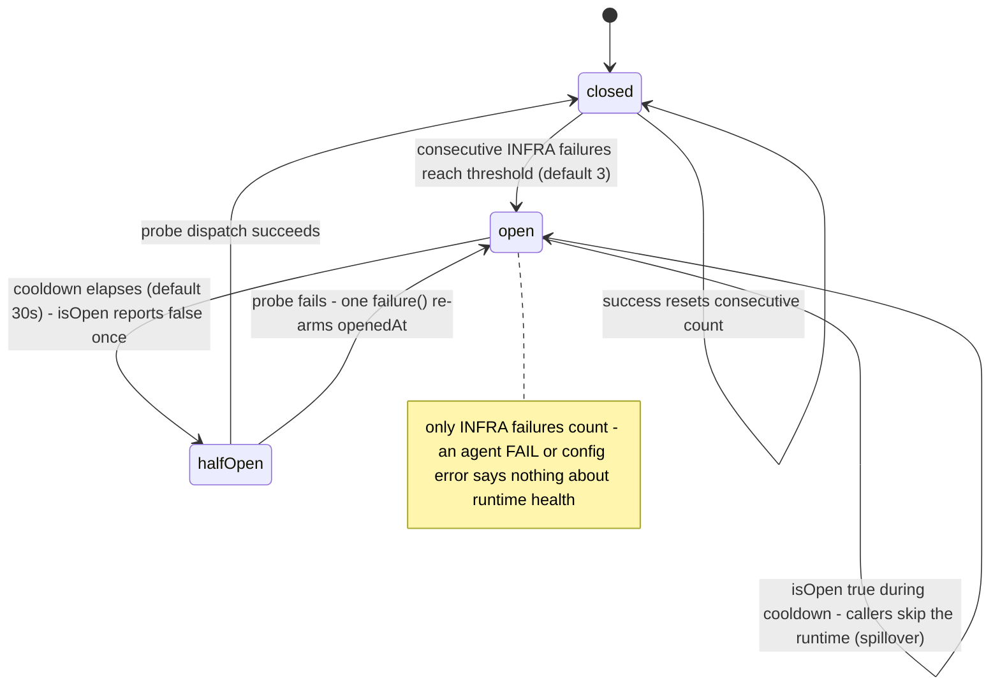

# Runtime — collaboration model

> Registered execution infra + the capability model + the placement policy suite. Companion to
> `../00-target-architecture.md` (§4 `domain/runtime` + `domain/placement`, §9). Status: PROPOSED —
> review artifact, no code moves.

## Purpose & language

Two tightly-coupled concerns share this domain. **Runtime**: a tenant-registered execution
infrastructure (`RuntimeSpec`, kind `local | nomad | k8s`, no secrets in the spec) that the control
plane resolves into a live `Backend` per dispatch. **Capability**: the one-vocabulary SSOT
describing what a runtime/runner *can run*, where the capability's **kind decides its enforcement
layer** — `functional` → placement gate, `security` → trust zone (label ≠ enforcement), `auth` →
budget/payer. **Placement policy**: the pure decision suite (fairness, admission, health, scaling,
isolation) that today hides inside `@everdict/backends` and moves to `domain/placement`.

Language rules worth pinning:
- *self-labeling* — nobody types capabilities by hand: runners probe their machine
  (`detectCapabilities`), registered runtimes are auto-labeled from the spec
  (`defaultRuntimeCapabilities`).
- *derive → gate* — a case's requirements are derived from its data (`requiredCapabilities`:
  image→docker, repo-git→git, browser→browser, os-use→computer-use, isolation→sandbox), then gated
  by the kind's layer.
- *admission envelope* — a backend's declared budget (`maxConcurrent` / `memoryBudgetMb` /
  `cpuBudget`) that harness-declared resources must fit into.
- *spillover* — circuit-breaker-informed automatic re-target of a sharded batch's cases from a dead
  runtime to a healthy one.
- *trust zone* — `tenant → {isolationRuntime, namespace, network, trusted}`; untrusted ⇒ hardened
  runtime, always.
- *`rt:<tenant>:<id>@<version>`* — the backend-registry name a resolved tenant runtime is cached
  under; `self`, `self:ws`, `self:<runnerId>`, `self:ws:<runnerId>` are the runner-tier sibling
  targets (see `runner.md`).

## Aggregates & policies

```mermaid
classDiagram
    class RuntimeSpec {
        <<exists today - contract>>
        +kind local or nomad or k8s
        +addr datacenters or context runtimeClass
        +authSecret kubeconfigSecret name-refs
        +admission envelope maxConcurrent memoryBudgetMb cpuBudget
        +capabilities optional self-label
        +traceSource topology-capable marker
    }
    class CapabilityVocabulary {
        <<exists today - domain SSOT in core>>
        +CAPABILITY_DEFS 8 names x 3 kinds
        +capabilityKind partitionCapabilities
        +functionalGate(required, advertised) pure subset
        +runtimeSatisfies(caps, required) UNWIRED today
    }
    class CapabilityDerivation {
        <<exists today - domain fns in core>>
        +requiredCapabilities(case) from case data
        +defaultRuntimeCapabilities(spec) auto-label UNWIRED server-side
    }
    class CapabilityProbes {
        <<exists today - runner infra>>
        +detectCapabilities git docker browser kvm logins
        +label is a hint, never enforcement
    }
    class RuntimeDispatcher {
        <<exists today - application adapter>>
        +resolve self pools and self runnerId targets
        +resolve tenant RuntimeSpec to rt name
        +bake secretEnv + registryAuth once per runtime
        +service harness needs docker gate
    }
    class Scheduler {
        <<exists today - MIXED policy + pump>>
        +budget admit 402, queue depth 429
        +priority interactive over batch + aging
        +envelope admission mem cpu slots quota
        +Admission ledger reserve release lockstep
    }
    class FairQueue {
        <<exists today - pure domain>>
        +WFQ virtual finish time
        +idle tenants accrue no credit
    }
    class PlacementPolicy {
        <<exists today - pure domain>>
        +leastLoadedPolicy spread
        +binPackPolicy pack
        +deterministic tie-breaks
    }
    class CircuitBreaker {
        <<exists today - pure domain>>
        +consecutive infra failures open
        +cooldown then half-open probe
        +keys tenant colon runtimeId
    }
    class Autoscaler {
        <<exists today - domain + actuator>>
        +desiredCapacity pure clamp
        +downscale hysteresis
        +ScalingTarget MutableSlots
    }
    class TrustZonePolicy {
        <<exists today - pure domain>>
        +perTenantTrustZones runsc + namespace + deny-cross-tenant
        +assertHardenedIsolation enforced 3+ sites
    }
    RuntimeDispatcher --> RuntimeSpec : registry resolve
    RuntimeDispatcher --> Scheduler : delegates fairness budget capacity
    Scheduler --> FairQueue : tenant-fair drain
    Scheduler --> PlacementPolicy : choose backend
    Scheduler --> CircuitBreaker : shared with spillover + queue view
    Autoscaler --> Scheduler : reads stats
    CapabilityDerivation --> CapabilityVocabulary : kinds route enforcement
    CapabilityProbes --> CapabilityVocabulary : advertises subset
    TrustZonePolicy --> RuntimeSpec : zone applied at dispatch
    note for Scheduler "Survey verdict: policy + async pump + budget IO\nfused in one class. Target: policies to\ndomain/placement, the pump stays application."
```



Target placement (00 §4): `FairQueue`, admission rules (quota/backpressure/aging/envelope),
`PlacementPolicy`, `CircuitBreaker`, `desiredCapacity`, `TrustZonePolicy` move to
`@everdict/domain` `placement/` as pure policy; the capability vocabulary + derivations move to
`domain/runtime`; the Scheduler pump, `RuntimeDispatcher`, and `buildRuntimeBackend` composition
become `application/control`; Nomad/K8s/local adapters go to `infrastructure/placement-*` with
their embedded rules (OOM classification, adopt semantics) extracted to `domain/failure`.

## Lifecycle

The one true state machine here is the circuit (per `tenant:runtimeId` key):



Runtime *versions* follow the shared registry lifecycle (immutable, tags; runtimes have tags but no
tombstone — a known feature drift). A built backend instance lives as long as the process
(registered once per `rt:<tenant>:<id>@<version>`, reused).

## Key collaborations

### Dispatch through the policy chain (the mandated sequence)

```mermaid
sequenceDiagram
    participant U as RunService / ScorecardBatchService
    participant M as meteredDispatcher → ModelResolvingDispatcher
    participant RD as RuntimeDispatcher
    participant RR as RuntimeRegistry + SecretStore
    participant S as Scheduler (policy chain)
    participant B as Backend adapter (Nomad / K8s / topology / self-hosted)

    U->>M: dispatch(AgentJob) — target already validated non-empty at submit (requireRuntime)
    M->>RD: dispatch (metrics wrapped, {{model}} resolved)
    alt target = self / self:ws / self:runnerId
        RD->>RD: derive owner (ws:tenant | submittedBy); ownership miss → 404, service-harness w/o docker cap → 400
        RD->>RD: register SelfHostedBackend under pool/runner name
    else target = tenant runtime id
        RD->>RR: runtimes.get(tenant, target) + secretsFor(tenant) + registryAuthsFor(tenant)
        RD->>RD: buildBackend(spec, {secretEnv, registryAuth}) → register rt:tenant:id@version (once, reused)
    end
    RD->>S: dispatch(job with rewritten placement.target)
    S->>S: budget.admit(tenant) — over cap → 402 PaymentRequired
    S->>S: tenant queue-depth + global maxQueueDepth — over → 429 RateLimit
    S->>S: FairQueue enqueue (WFQ by tenant weight); priority: interactive first, aged batch promoted (agingMs)
    S->>S: drain: eligible backends → envelope admission (slots, memFreeMb, cpuFree vs harness resources, tenant quota)
    S->>S: PlacementPolicy.choose (leastLoaded | binPack, deterministic) → Admission.reserve
    S->>B: backend.dispatch(job, {signal}) — trust zone applied, assertHardenedIsolation
    B-->>S: CaseResult (or classified failure; OOM = infra)
    S->>S: settle cost (billing) + Admission.release + re-pump
    S-->>U: CaseResult
    Note over U,B: CircuitBreaker records infra failures per tenant:runtimeId — the batch layer consults it for spillover BEFORE re-dispatching to a dead runtime
```

### Capability flow: self-label → derive → gate (kind-routed enforcement)

```mermaid
sequenceDiagram
    participant R as runner / web register form
    participant CP as control plane
    participant C as case (submit)
    participant G as gates (3 layers)

    R->>R: detectCapabilities() probes — git, docker, browser, kvm/runsc, login files
    R->>CP: advertise capabilities[] (lease_job) / RuntimeSpec.capabilities (register)
    Note over R,CP: registered runtimes: the WEB form auto-labels (runtimeCaps mirror); core defaultRuntimeCapabilities is unwired server-side today
    C->>CP: requiredCapabilities(evalCase) — image→docker, repo-git→git, browser, os-use→computer-use, isolation→sandbox
    CP->>G: partitionCapabilities routes by kind
    G->>G: functional → placement gate (runner-hub lease reject/skip; RuntimeDispatcher service→docker 400)
    G->>G: security (sandbox) → TrustZonePolicy + assertHardenedIsolation (the label is only a hint)
    G->>G: auth (codex/claude login) → billingTenant payer decision (own-pays vs workspace-pays)
```

## Inbound use-cases

From the apps-api survey catalog (§1.7 + §1.16):

| # | Operation | Transport | Implementation | Notes |
|---|---|---|---|---|
| 68 | Register runtime | `POST /runtimes` · `create_runtime` | RuntimeRegistry.register | capabilities self-labeled client-side today |
| 69 | Validate runtime | `POST /runtimes/validate` · `validate_runtime` | schema dry-run | |
| 70 | Probe runtime | `POST /runtimes/probe` · `probe_runtime` | `makeRuntimeProber` → `Backend.probe` (isProbeable) | reachability/auth without a job |
| 71 | List / get / tags | `GET /runtimes…` · `list/get_runtime`, `set_runtime_version_tags` | RuntimeRegistry | tags but no tombstone |
| — | runtime:"auto" expansion + comma sharding | inside `POST /scorecards` | ScorecardService.submit + `runtimesFor` | shard-weighted round-robin |
| — | Spillover + OOM boost + speculation | `[B]` batch loop | core/ops/* over the shared CircuitBreaker | policy modules, invoked by ScorecardBatchService |
| 127 | Queue snapshot (admission/circuit slice) | `GET /queue` · `get_queue` | QueueService → Scheduler.stats + CircuitBreaker.stats | read model |
| 131 | Scheduling dials | `[I] GET+PUT /internal/scheduling` | schedulingControl closure (main.ts) | per-tenant quota/weight overrides |
| 135 | Autoscaler | `[B]` boot | Autoscaler + MutableSlots (main.ts) | queue-depth elastic slots |

## Outbound ports

| Port | Today | Target owner |
|---|---|---|
| `RuntimeRegistry` (versioned SSOT) | `@everdict/registry` | `application/control` port over generic VersionedStore |
| `secretsFor(tenant)` / `registryAuthsFor(tenant)` | main.ts closures over `SecretStore` / `ImageRegistryService` | typed ports on the placement use-case |
| `BackendRegistry` + `Backend` (+ capability interfaces `Recoverable/Observable/Shellable/ScreenCapturable/Probeable`) | `@everdict/backends` (contracts co-habit with adapters) | contracts → `contracts` or application-owned ports; adapters → `infrastructure/placement-*` |
| `buildRuntimeBackend(spec, {secretEnv})` / injected `buildBackend` (topology cycle-break) | `@everdict/backends` + apps/api injection | `application/control` composition |
| `BudgetTracker` (admit/settle) | `@everdict/billing` via Scheduler | `domain/billing` policy, application invokes |
| `CircuitBreaker` (shared instance: batch spillover + queue view + metrics) | `@everdict/backends`, singleton in main.ts | `domain/placement` policy object; instance owned by application |
| `ScalingTarget` actuation | `MutableSlots` in-memory (main.ts) | `infrastructure` actuator behind a port |

## Rules: today → target

| Rule | Today (evidence) | Target |
|---|---|---|
| Capability vocabulary + kind→enforcement routing | `packages/core/src/infra/capability.ts:17-53` (`CAPABILITY_DEFS`, `functionalGate`, `partitionCapabilities`) | `domain/runtime/capability.ts` verbatim — already pure |
| Case-requirement derivation | `packages/core/src/infra/capability-requirements.ts:10-23` (`requiredCapabilities`) | `domain/runtime`; consumed by runner-hub lease gate + future registered-runtime gate |
| Runtime auto-label | `capability-requirements.ts:29-38` (`defaultRuntimeCapabilities`) — **no live server consumer** (grep: doc comments only); the WEB re-implements it (`apps/web/src/features/register-runtime/ui/register-runtime-form.tsx:93,120` `runtimeCaps`) — a domain-rule mirror | server computes labels at register (application), serves them in the DTO; web mirror deleted |
| Registered-runtime functional gate | `capability.ts:58-64` (`runtimeSatisfies`) — **unwired** (exported, no consumer); enforced gates today: runner lease (`runner-hub.ts:29-30` via `requiredCapabilities`) + `runtime-dispatcher.ts:104-110` (service→docker 400) | wire `runtimeSatisfies` into RuntimeDispatcher/submit validation, or delete it (00 "no hypothetical surface") — decide in review |
| WFQ fairness (idle tenants accrue no credit) | `packages/backends/src/scheduling/fair-queue.ts` (virtual-finish-time clock) | `domain/placement/fair-queue.ts` verbatim |
| Admission: tenant quota, queue-depth 429, budget 402, priority + aging, mem/cpu envelope | `packages/backends/src/scheduling/scheduler.ts:58-120+` (options + `Admission` ledger) — policy fused with the async pump | pure admission rules → `domain/placement/admission.ts`; the pump loop (probe-once-per-drain, re-pump, cancelQueued, poke) stays `application/control` |
| Deterministic placement choice | `scheduler.ts:31-47` (`leastLoadedPolicy`/`binPackPolicy`) | `domain/placement` verbatim |
| Circuit health policy (infra-only failures) | `packages/backends/src/scheduling/circuit-breaker.ts` (threshold→open→cooldown→half-open) | `domain/placement/circuit-breaker.ts` verbatim; "callers report infra failures only" becomes a typed contract (failure class enum, not convention) |
| Autoscale demand policy + hysteresis | `packages/backends/src/scheduling/autoscaler.ts` (`desiredCapacity` pure clamp) | pure fn → `domain/placement`; `Autoscaler` loop + `MutableSlots` → application + infrastructure |
| Tenant trust zones (hardened default, per-tenant namespace, deny-cross-tenant) | `packages/backends/src/policy/trust-zone.ts:17-43` + `assertHardenedIsolation` called in each backend adapter AND `ServiceTopologyBackend` (3+ sites, topology survey smell 6) | `domain/placement/trust-zone.ts`; enforcement at ONE choke point in the dispatch use-case, adapters receive the resolved zone |
| Cluster-API credential ≠ agent env | `packages/backends/src/placement/build-runtime-backend.ts` (`authSecret`/`kubeconfigSecret` → `withoutKeys` strip from alloc env; per-dispatch 0600 kubeconfig) | rule declared in `domain/placement` (credential-role separation), applied by `infrastructure/placement-*` adapters; contract test pins the strip |
| Self/pool target resolution + ownership 404 + owner derivation `ws:<tenant>` | `apps/api/src/core/execution/runtime-dispatcher.ts:53-122` | `application/control` placement-resolution use-case; the `"ws:"` prefix convention becomes a typed `RunnerOwner` value object (shared with billing's `billingTenant` — today a stringly cross-package contract) |
| One backend per `rt:<tenant>:<id>@<version>`, first-job registryAuth bake | `runtime-dispatcher.ts:126-143` (documented single-value limit) | keep; the limit becomes an explicit decision or per-dispatch auth resolution |
| OOM = infra failure, never agent | duplicated in `packages/backends/src/orchestrators/nomad.ts` + `k8s.ts` (alloc events / pod termination reason → `OOM_KILLED`) | `domain/failure` single owner; adapters map platform events to it |
| `BackendConfigSchema` vs `RuntimeSpec` near-duplication | `packages/backends/src/config.ts` (comment admits it) | one runtime vocabulary in `contracts`; config file parses into it |
| No silent local fallback | `assertRuntimeTarget` at submit (`.claude/rules/backends.md`; `requireRuntime` in scorecard-shared.ts:281-283) | stays an application submit guard; pinned by route tests |

## Invariants

| Invariant | Owner | Pinned how |
|---|---|---|
| No tenant starves another (WFQ; weights honored; idle ≠ credit) | **domain** — FairQueue | unit tests on virtual-finish ordering |
| Backpressure and budget rejections are explicit (429 / 402), never silent drops | **domain admission + billing** | scheduler tests pin both errors |
| A batch entry older than `agingMs` cannot be starved by interactive floods | **domain** — aging promotion | injectable-clock tests |
| reserve/release stay in lockstep across slots/mem/cpu/tenant dims | **application** — the `Admission` ledger (one object, one call site pair) | scheduler tests; the ledger class is the guard |
| An untrusted tenant NEVER runs on a shared-kernel runtime | **domain** — `assertHardenedIsolation` over TrustZonePolicy | tests + (target) single choke point |
| Warm pools are never shared across tenants (zone-keyed identity) | **domain** — pool key `(spec, version, zone.id)` | topology tests |
| Cluster-API credentials never reach the alloc/pod env | **infrastructure discipline** — `withoutKeys` strip, per-dispatch kubeconfig removed in `finally` | contract tests on built job specs |
| Security capability labels are hints; enforcement is the trust zone | **domain** — kind routing | doc + the sandbox probe comment; tests on `partitionCapabilities` |
| Circuit state only moves on infra-classified failures | **caller contract today → typed in target** | breaker tests + failure-class typing |
| A dispatch with no execution target fails at submit (400), not at placement | **application** — submit guard | route tests |
| A runner/runtime lacking a required functional capability never receives the job | **application gates** — lease gate (reject/skip), RuntimeDispatcher docker gate | runner-hub + dispatcher tests |

## Open questions

1. `runtimeSatisfies` + `defaultRuntimeCapabilities` are exported but server-unwired (web mirrors
   the label rule). Wire the registered-runtime capability gate into submit/RuntimeDispatcher, or
   delete both under "no hypothetical surface"? (Wiring also deletes the web mirror.)
2. The Scheduler's queue/admission/breaker state is process-memory (survey: "single-process
   assumptions concentrated"). Does the target explicitly own this as process-local (boot recovery
   compensates) or externalize it for a multi-instance control plane? 00 §1 names "durable,
   multi-process future" for the control plane.
3. `Backend` + capability interfaces live in `backends` next to adapters, forcing topology's
   type-only dependency. Do they land in `contracts` (proposed by survey #3) or as
   application-owned ports (00 §3-3)?
4. The topology backend is injected into RuntimeDispatcher to break a package cycle
   (`buildBackend` fallback). After the teardown, `infrastructure/topology-runtimes` and
   `infrastructure/placement-*` are siblings — does the cycle disappear naturally, and who
   composes `buildBackend`?
5. Priority classes (`interactive`/`batch`) + tenant quota/weight dials are env + internal-route
   overrides today. Do the dials become a persisted per-tenant policy record (store) in the target?
6. Runtimes have version tags but no tombstone (drift vs datasets/harnesses). Level up via the
   generic VersionedStore migration?
