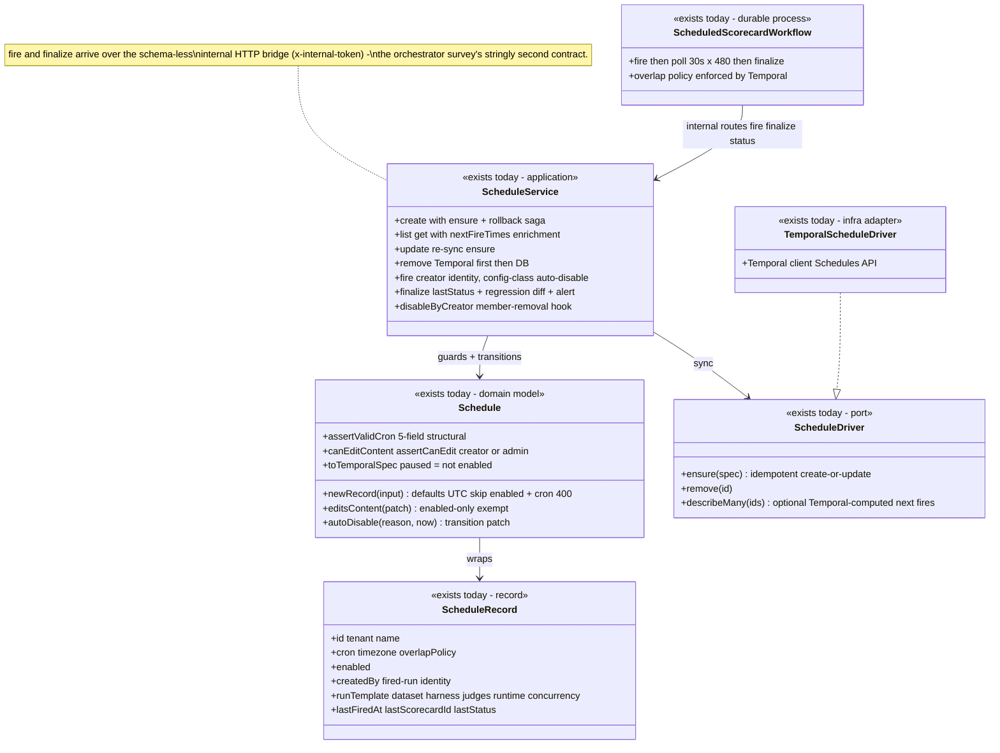
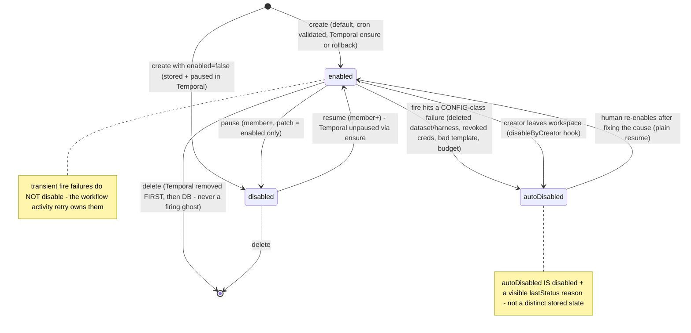
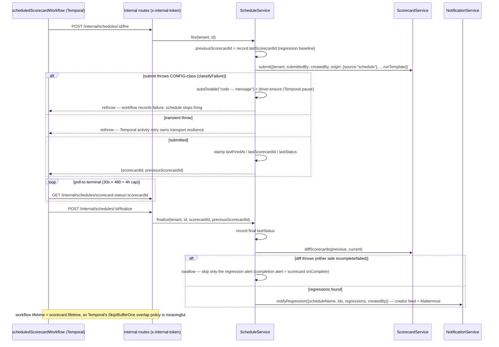

# Schedule — collaboration model

> Cron scorecards: DB SSOT + Temporal Schedules as the firing mechanism. Companion to
> `../00-target-architecture.md` (§4 `domain/schedule`, §9). Status: PROPOSED — review artifact, no
> code moves.

## Purpose & language

A **Schedule** fires a scorecard on a cron. The **store record is the SSOT**; the Temporal Schedule
is a *mechanism* kept in sync (`ensure` = idempotent create-or-update, reflecting `paused`). The
domain model already exists (`Schedule` in `apps/api/src/core/schedule/schedule.ts`) and
deliberately has **no status state machine** — `enabled` toggles freely; the model owns only the
real rules: cron validity, the content-edit permission, `paused = !enabled`, and the auto-disable
transition.

Language rules worth pinning:
- *content edit vs pause* — changing any field other than `enabled` is a content edit
  (creator-or-admin: the fired run uses the creator's identity); pause/resume is member+.
- *fire* — the Temporal workflow calls the internal route; the service submits the run template
  **under the creator's identity** with `origin.source = "schedule"`.
- *finalize* — after poll-to-terminal: record `lastStatus`, diff against the previous fire,
  regression alert to the creator's feed + Mattermost.
- *auto-disable* — `enabled=false` + a visible `"Auto-disabled: <reason>"` `lastStatus` (≤300
  chars). Two triggers: the creator left the workspace; a **config-class** fire failure
  (deterministic — firing on is pure noise).
- *rollbackFailed* — the create-path saga marker: Temporal `ensure` failed AND the DB rollback
  failed → the record is orphaned (stored but never fires); surfaced on the original error, never
  swallowed.
- *overlap policy* — `skip | bufferOne`, meaningful because the workflow's lifetime IS the
  scorecard's lifetime (fire → poll → finalize in one durable execution).

## Aggregates & policies



Target placement (00 §4): the `Schedule` model moves to `@everdict/domain` `schedule/` (it is
already the right shape — one of the 4 rich aggregates named in 00 §2-2); `ScheduleService` becomes
`application/control` use-cases; the fire/finalize/status internal-route trio becomes a typed
activity contract shared with `application/control`'s Temporal workflow contracts;
`TemporalScheduleDriver` goes to `infrastructure/temporal`.

## Lifecycle

Deliberately no status machine — `enabled` is a freely-toggled attribute. The transitions worth
drawing are who flips it and why:



## Key collaborations

### Create with Temporal sync (the rollback saga + rollbackFailed surfacing)

```mermaid
sequenceDiagram
    participant T as POST /schedules · create_schedule
    participant S as ScheduleService
    participant D as Schedule (domain)
    participant ST as ScheduleStore
    participant TD as ScheduleDriver (Temporal)

    T->>S: create({tenant, createdBy, name, cron, runTemplate, …})
    S->>D: Schedule.newRecord — cron 400, defaults UTC/skip/enabled
    S->>ST: create(record) — DB is the SSOT
    S->>TD: ensure(toTemporalSpec()) — idempotent, reflects paused
    alt ensure succeeds
        S-->>T: record
    else ensure fails
        S->>ST: remove(tenant, id) — roll back (no schedule that exists but never fires)
        alt rollback also fails
            S-->>T: ORIGINAL ensure error + {rollbackFailed:true, rollbackError} in the envelope data — orphan is loud, never .catch(() => {})
        else rollback ok
            S-->>T: original ensure error (same class → same status)
        end
    end
    Note over T: today the route sends the record verbatim; target: ScheduleResponse.from(record) with nextFireTimes served
```

### Fire → scorecard submit → finalize with regression alert (the durable loop)



## Inbound use-cases

From the apps-api survey catalog (§1.3, #27–34):

| # | Operation | Transport | Implementation | Notes |
|---|---|---|---|---|
| 27 | Create schedule | `POST /schedules` · `create_schedule` | `ScheduleService.create` | domain defaults + cron 400; ensure/rollback saga |
| 28 | List / get | `GET /schedules(/:id)` · `list/get_schedule` | `list`/`get` + `attachNextFires` | Temporal-computed nextFireTimes (enabled only, batch describe) |
| 29 | Update | `PATCH /schedules/:id` · `update_schedule` | `update` + `Schedule.assertCanEdit` | pause=member+; content=creator-or-admin; re-ensure |
| 30 | Delete | `DELETE /schedules/:id` · `delete_schedule` | `remove` | Temporal removal first |
| 31 | Fire | `[I] POST /internal/schedules/:id/fire` | `fire` | creator identity; config-class auto-disable |
| 32 | Finalize + alert | `[I] POST /internal/schedules/:id/finalize` | `finalize` | diff vs previous; alert swallow-if-incomparable |
| 33 | Status poll | `[I] GET /internal/schedules/scorecard-status/:id` | `scorecardStatus` | workflow poll-to-terminal |
| 34 | Auto-disable on member removal | `[B]` hook | `disableByCreator` ← `onMemberRemoved` (main.ts closure) | see `member.md` removal sequence |

## Outbound ports

| Port | Today | Target owner |
|---|---|---|
| `ScheduleStore` | `@everdict/db` interface | `application/control` port; Pg impl in `persistence-pg` |
| `ScheduleDriver` (`ensure`/`remove`/`describeMany?`) | interface in `schedule-service.ts:32-38`; impl `TemporalScheduleDriver` (apps/api → `@everdict/orchestrator` client) | port stays application-owned (already correct); impl → `infrastructure/temporal` |
| `submitScorecard` | lambda port (main.ts → `ScorecardService.submit`) | typed use-case dependency (`RunScorecardBatch`) |
| `scorecardStatus` / `diffScorecards` | lambda ports (main.ts closures) | typed ports on the schedule use-case bag |
| `notifyRegression` | lambda port → `NotificationService` | typed notification port |
| Failure taxonomy (`classifyFailure`) | `@everdict/core` | `domain/failure` (single owner per 00 §4) |

## Rules: today → target

| Rule | Today (evidence) | Target |
|---|---|---|
| Cron structural validation (5-field; Temporal owns precise semantics) | `apps/api/src/core/schedule/schedule.ts:14-18,61-64` (`isValidCron`, `assertValidCron` — shared 400 for create+update) | `domain/schedule` verbatim; the "structural here / semantic in Temporal" split stays documented |
| Record assembly + defaults (UTC / skip / enabled) | `schedule.ts:67-82` (`newRecord` — "the only place a schedule record is assembled") | `domain/schedule` factory — already the rich-domain pattern |
| Content-edit vs pause permission | `schedule.ts:86-108` (`editsContent` — any key ≠ `enabled`; `canEditContent`; no actor = internal call passes) | `domain/schedule` policy; actor injection stays the boundary's job |
| `paused = !enabled` projection | `schedule.ts:112-121` (`toTemporalSpec`) | `domain/schedule` |
| Auto-disable transition (reason visible, ≤300 chars, idempotent) | `schedule.ts:126-128` | `domain/schedule` transition |
| Config-class fire failure ⇒ auto-disable; transient ⇒ rethrow to activity retry | `schedule-service.ts:208-222` (`classifyFailure(err, "dispatch")` → `failure.class === "config"`) | `application/control` fire use-case over `domain/failure`; the retry-stratification split (workflow=transport, CP=semantic) stays documented |
| Create rollback saga + `rollbackFailed` surfacing | `schedule-service.ts:98-113` + `markRollbackFailed:267-288` (AppError rebuild carrying `{rollbackFailed, rollbackError}`; original error class preserved) | application saga; the error-enrichment trick becomes a shared `AppError.withExtra` helper instead of a constructor rebuild |
| Remove: Temporal first, then DB | `schedule-service.ts:163-167` | application ordering rule; pinned by test |
| `nextFireTimes` enrichment (Temporal authoritative; enabled-only; batch; failure → skip) | `schedule-service.ts:136-143` (`attachNextFires`) — the web keeps a cron-approximation fallback (a soft mirror) | served DTO field via `ScheduleResponse.from`; web fallback kept ONLY for the driverless dev path (documented) |
| Fire identity = creator; provenance stamped | `schedule-service.ts:198-207` (`submittedBy: schedule.createdBy`, `origin: {source:"schedule"}`) | application rule; the reason `disableByCreator` exists (identity can no longer be trusted after the creator leaves) |
| Regression alert only when comparable | `schedule-service.ts:244-250` (diff throw swallowed, alert skipped; completion alert owned by scorecard onComplete) | application rule; keep the ownership split |
| Creator-left bulk disable | `schedule-service.ts:172-185` (`disableByCreator` — enabled+createdBy filter, autoDisable + Temporal pause per row) | application; triggered by the typed `MemberRemoved` domain event (member.md open Q3) |
| fire/finalize/status internal bridge is schema-less | orchestrator `activities.ts` HTTP bridge + 3 internal routes (stringly URLs both sides; orchestrator survey smell 1) | typed activity contract in `application/control` (00 §4 orchestrator row); Zod-validated at both ends |

## Invariants

| Invariant | Owner | Pinned how |
|---|---|---|
| A stored, enabled schedule is ensured in Temporal; a disabled one is paused | **application** — every create/update/auto-disable calls `driver.ensure` with the projected spec | service tests with a fake driver |
| Create never leaves "fires but no record" (ensure-fail → rollback) and never *silently* leaves "record but never fires" (rollbackFailed surfaced) | **application saga** | tests pin both branches + the envelope data |
| Delete removes Temporal FIRST — no firing ghost after a 200 | **application ordering** | test: driver.remove failure leaves the DB row |
| A fired run always carries the creator's identity + `origin.source="schedule"` | **application** — fire | fire tests assert submit input |
| A config-class fire failure never fires again without human action | **application over domain/failure** — auto-disable + Temporal pause | fire tests per failure class |
| Pause/resume is never creator-gated; content edits always are | **domain** — `assertCanEdit` | unit tests pin the 403 |
| `lastStatus` after auto-disable always explains why (≤300 chars) | **domain** — `autoDisable` | unit test |
| A regression alert fires only when both scorecards are terminal-and-comparable | **application** — finalize swallow rule | finalize tests |
| Internal fire/finalize/status are unreachable without `x-internal-token` | **transport guard** (copy-pasted 9× today — survey §4) | route tests; target: one internal-guard middleware |

## Open questions

1. **Update-path drift**: `update` re-ensures but has NO rollback (`schedule-service.ts:159` — an
   ensure failure after `store.update` leaves the record newer than Temporal). Accept-and-document
   (next update heals it) or extend the create saga pattern / add a reconciliation sweep at boot?
2. **Fire idempotency**: if Temporal retries the `fire` activity after `submitScorecard` succeeded
   but before the response landed, a second scorecard is submitted. The batch trio is designed
   idempotent; fire is not. Add an idempotency key (`scheduleId + scheduledFireTime`) in the
   target?
3. The `lastFiredAt/lastScorecardId/lastStatus` bookkeeping writes stay literal in the service
   (deliberate per the model's header comment). Keep that stance in `domain/schedule`, or fold
   them into transitions for uniformity?
4. `nextFireTimes`: should the web's cron-approximation fallback survive once the DTO serves
   Temporal-computed times (driverless dev is the only consumer), or is one more mirror worth
   deleting?
5. The poll-to-terminal cap (30s × 480 ≈ 4h) silently ends the workflow for longer batches —
   finalize then records a non-terminal status. Is the cap a schedule-domain constant (target:
   named in `domain/schedule`) or a workflow implementation detail?
