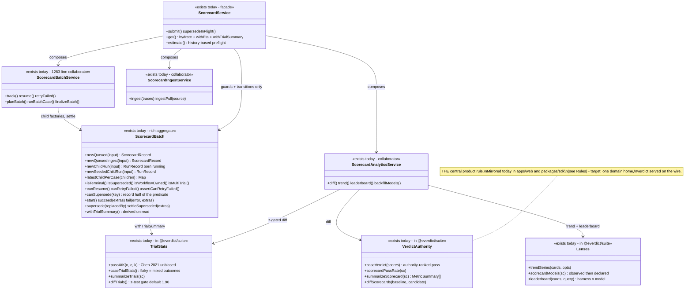
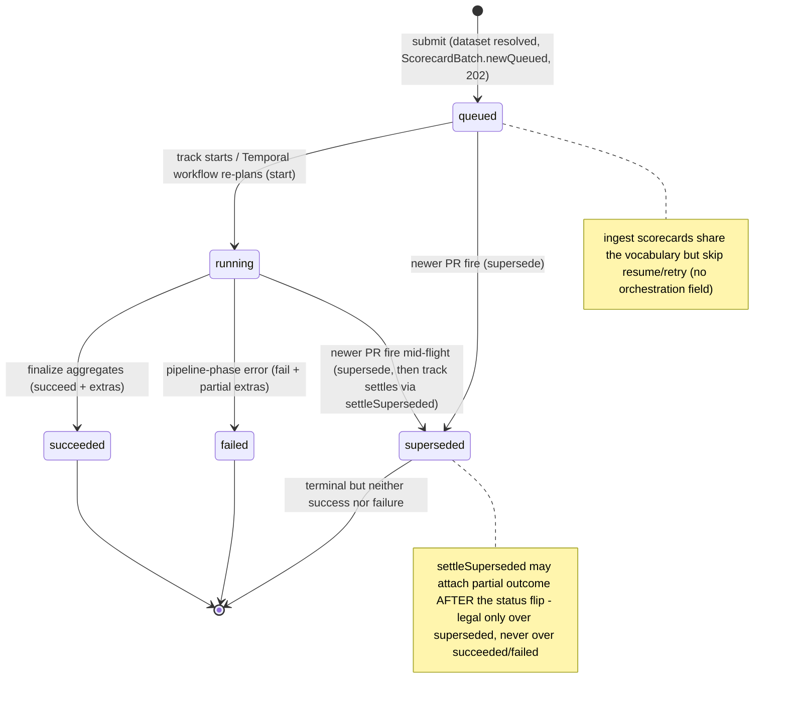
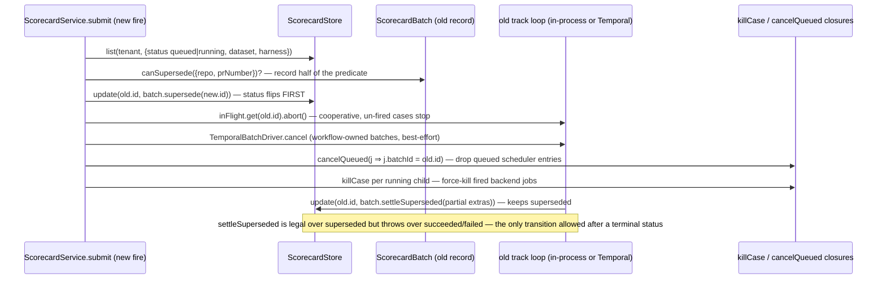
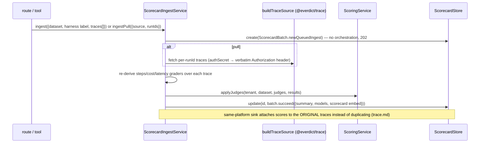

# Scorecard — collaboration model

> Batch eval + verdict authority + trials + regression analytics. Companion to
> `../00-target-architecture.md` (§4 `domain/scorecard`, §9). Status: PROPOSED — review artifact,
> no code moves.

## Purpose & language

A **ScorecardBatch** is orchestration over child runs: one dataset × one harness version, fanned
out per case (× N trials), judged, aggregated into a summary, and settled once
(`queued → running → succeeded | failed | superseded`). The **aggregate already exists**
(`apps/api/src/core/scorecard/scorecard-batch.ts`); the *evaluation math* — **verdict authority**
(`caseVerdict`), pass@k, flakiness, z-gated trial diff, trend, leaderboard — lives in
`@everdict/suite` (the purest domain code in the repo) and moves into `domain/scorecard` alongside
it. The service layer is a facade over three lifecycle collaborators (batch / ingest / analytics)
plus the `ScoringService` seam.

Language rules worth pinning:
- *verdict authority* — ground-truth metrics (`state`, `tests_pass`) > objective metrics
  (`answer_match`, `url_matches`, `dom_contains`, all must pass) > `judge` (only when no objective
  grader exists) > all-with-pass fallback. **The judge can never override ground truth.**
- *supersede* — a newer fire of the same `(repo, prNumber, harness, dataset)` reclaims an
  unsettled batch; terminal but neither success nor failure, so baselines/leaderboards stay clean.
- *trial* — one `(case, trial)` execution; `trials > 1` enables pass@k and flake detection.
- *ingest* — a scorecard scored from externally-produced traces (push upload or pull from the
  tenant's platform); deliberately carries no orchestration (not resumable/retryable).
- *hydration* — a dispatched batch stores `runIds`, not results; `get` reassembles the embedded
  scorecard from child-run results (storage dedup, wire shape unchanged).
- *seeded child* — a carried-over pass materialized as an already-succeeded child run
  (retry-failed), so idempotent planning skips it and finalize aggregates it.

## Aggregates & policies



Target placement (00 §4): `ScorecardBatch` moves verbatim to `domain/scorecard`; the suite's
verdict/trials/trend/models/leaderboard modules move next to it (same package, one owner);
`runSuite` and the facade/collaborators become `application/control` use-cases; the web/sdk
mirrors are deleted by serving computed fields (`verdict`, `headlinePassRate`) on the wire DTO.

## Lifecycle



## Key collaborations

### Batch submit → track → finalize (in-process path; the Temporal path drives the same ports via idempotent activities)

```mermaid
sequenceDiagram
    participant T as HTTP route / MCP tool
    participant F as ScorecardService (facade)
    participant D as ScorecardBatch (domain)
    participant B as ScorecardBatchService
    participant E as executeCase (+ spillover/OOM-boost/speculation wrappers)
    participant SC as ScoringService (judge stream)
    participant X as TraceSinkService (export stream)
    participant ST as ScorecardStore / RunStore

    T->>F: submit({tenant, dataset, harness+pins, judges, trials, runtime, traceSink, …})
    F->>F: assertRuntimeTarget; runtime "auto" → expand to all registered runtimes
    F->>F: resolve dataset (404) → subset + grading plan; resolveWithPins (ephemeral, no new version)
    F->>D: ScorecardBatch.newQueued — orchestration persisted (resume/retry basis)
    F->>ST: create(record); 202 → caller (target: ScorecardResponse.from)
    F->>F: supersedeInFlight (see next sequence) · TemporalBatchDriver.start or degrade in-process
    F->>B: track(id, …12 positional params…)
    B->>ST: update(id, batch.start())
    loop per (case, trial) — shard-weighted round-robin, AdaptiveConcurrencyGate
        B->>D: newChildRun (born running) → RunStore.create
        B->>E: dispatch job {runId: evd-<batch>-<caseId>[-t<n>], batchId, priority: batch}
        E-->>B: CaseResult (failures classified, retry by class)
        B->>SC: judgeStream.push(result) — case-streaming, no batch barrier
        B->>X: exportStream.push(judged) — D5 sink streaming
        B->>ST: child run settle (Run.succeed/fail patch)
    end
    B->>B: aggregate summary/models via suite summarizeScorecard/scorecardModels
    B->>ST: update(id, batch.succeed({summary, models, runIds, steps, export}))
    B->>B: settle budget/usage, notify onComplete
```

### Supersede race (newer PR fire reclaims an in-flight batch)



### Ingest (push) / pull-ingest — scoring without execution



## Inbound use-cases

From the apps-api survey catalog (§1.2, #12–26):

| # | Operation | Transport | Implementation | Notes |
|---|---|---|---|---|
| 12 | Submit batch | `POST /scorecards` · `run_scorecard` | `ScorecardService.submit` | 202; runtime "auto"; subset; grading plan; ephemeral pins; trials/retries/traceSink/oomAutoBoost |
| 13 | Track loop | boot/async | `ScorecardBatchService.track` | in-process path; spillover/OOM-boost/speculation/adaptive gate |
| 14 | Supersede | inside submit | `supersedeInFlight` + `canSupersede` | abort + cancelQueued + killCase + Temporal cancel |
| 15 | Retry failed | `POST /scorecards/:id/retry?class=` · `retry_scorecard` | `retryFailed` (guard `assertCanRetryFailed`) | NEW scorecard; passes seeded; OOM boost compounded; `origin.retryOf` |
| 16 | Push ingest | `POST /scorecards/ingest` · `ingest_scorecard` | `ScorecardIngestService.ingest` | score uploaded `TraceEvent[]` |
| 17 | Pull ingest | `POST /scorecards/ingest/pull` · `pull_scorecard` | `ingestPull` | 5 source kinds; attach-mode on matching sink |
| 18 | List | `GET /scorecards` · `list_scorecards` | `list` | light rows (no per-case results) |
| 19 | Get | `GET /scorecards/:id` · `get_scorecard` | `get` | hydrate + ETA + trial roll-up (all derived on read) |
| 20 | Estimate | `GET /scorecards/estimate` · `estimate_scorecard` | `estimate` | history medians; honest-empty |
| 21 | Diff | `GET /scorecards/diff` · `diff_scorecards` | `analytics.diff` | suite `diffScorecards` + z-gated `diffTrials` |
| 22 | Trend | `GET /scorecards/trend` | `analytics.trend` | suite `trendSeries` |
| 23 | Leaderboard | `GET /scorecards/leaderboard` · `leaderboard_scorecards` | `analytics.leaderboard` | (harness × model), judge-model filter |
| 24 | Backfill models | `POST /scorecards/backfill-models` · `backfill_scorecard_models` | `analytics.backfillModels` | idempotent |
| 25 | Resume | boot hook | `ScorecardBatchService.resume` (guard `canResume`) | seed finished children, adopt in-flight, re-dispatch rest; Temporal-owned left alone; multi-trial → tombstone |
| 26 | Temporal bridge | `POST /internal/batches/:id/plan\|case\|finalize` | `planBatch`/`runBatchCase`/`finalizeBatch` | idempotent activities; batchContexts cache |

## Outbound ports

| Port | Why needed | Today's adapter |
|---|---|---|
| `ScorecardStore` / `RunStore` | record + child-run persistence | `@everdict/db` InMemory/Pg |
| `DatasetRegistry` / `HarnessInstanceRegistry` | resolve dataset, harness (+`resolveWithPins`) | `@everdict/registry` |
| `Dispatcher` via `executeCase` | per-case execution | Scheduler chain (see `run.md`) |
| `TemporalBatchDriver` (start/cancel/workflowIdFor) | durable batch ownership | `apps/api/src/core/scorecard/temporal-batch-driver.ts` → `@everdict/orchestrator` client |
| `ScoringService` (judge stream) | sanctioned service→service seam | `apps/api/src/core/execution/scoring-service.ts` (see `judge.md`) |
| `exportStreamFor` / `exportResults` | trace-sink export after judging | `TraceSinkService` → `buildTraceSink` |
| `buildTraceSource` + `secretsFor` | pull ingest + deferred collect | `@everdict/trace` |
| `runtimesFor` / `sinkExists` / `judgeFor` | submit-time expansion + validation + defaults | lambdas over registries/settings (main.ts) |
| `cancelQueued` / `killCase` | supersede reclamation | Scheduler / `Backend.kill` closures |
| `BudgetTracker` / `UsageMeter` | admission + settle + metering | `@everdict/billing` via `apps/api/src/common` (see `billing.md`) |
| `CircuitBreaker` (shared instance) | spillover health memory | `@everdict/backends` |
| ops policies (spillover, OOM boost, speculation, shard weights, adaptive gate) | batch resilience decisions | `apps/api/src/core/ops/*` (pure, already isolated) |
| `onComplete` / notifications | completion + regression alerts | `NotificationService` closures |

## Rules: today → target

| Rule | Today (evidence) | Target |
|---|---|---|
| **Verdict authority ranking** (ground-truth > objective > judge) | **3 implementations**: ① original `packages/suite/src/scorecard.ts:6-20` (`AUTHORITATIVE_METRICS = ["state","tests_pass"]`, `OBJECTIVE_METRICS`, `caseVerdict`); ② web mirror `apps/web/src/entities/scorecard/model/verdict.ts:6-23` (re-typed, comment admits "mirror of the control plane"); ③ sdk re-encoding `packages/sdk/src/client.ts:34` (`PASS_RATE_METRICS = ["tests_pass","state",…]`) + `:45-52` (`headlinePassRate`, comment: "mirrors the server's caseVerdict ranking"). Note the sdk's order **already drifted** (`tests_pass` before `state` vs suite's `state` first) — exactly the drift class this redesign exists to kill | ONE `domain/scorecard` module; wire DTO serves `verdict` per case and `headlinePassRate` per record; web mirror deleted, sdk reads the served field |
| Metric/trial/models summary shapes | 3 structural copies: `packages/suite/src/scorecard.ts:35-40` (`MetricSummary`) ↔ `packages/db/src/results/scorecard-store.ts:17-41` (comment: "isomorphic … mirror just the shape here") ↔ web zod mirrors in `apps/web/src/entities/scorecard/model/schema.ts` | shapes live once in `contracts` (record schema) + `contracts/wire`; suite functions type against them |
| Supersede predicate | split in half: record half `scorecard-batch.ts:199-205` (`canSupersede`) + query/orchestration half `scorecard-service.ts:231-262` (`supersedeInFlight`: store query, abort, cancelQueued, killCase, Temporal cancel) | keep the split but name it: domain predicate + one application use-case (`SupersedeInFlightBatches`); the kill/cancel fan-out stays application |
| Trial statistics (pass@k, flake, z-gate) | ONE owner already: `packages/suite/src/trials.ts` (`passAtK` Chen 2021 estimator `:12-35`, `flaky` `:41,55`, `diffTrials` two-proportion z-test, 1.96 default) — pure and exemplary | moves verbatim to `domain/scorecard`; nothing else changes |
| Scorecard entity: 3 shapes for one concept | core in-memory `Scorecard` (`packages/core/src/execution/eval-case.ts` — suiteId+results), db `ScorecardRecord` (`packages/db/src/results/scorecard-store.ts`), sdk `ScorecardRecord` (`packages/sdk/src/types.ts`, loose `[k: string]: unknown`) | record schema in `contracts`, wire DTO in `contracts/wire`, sdk regenerated over wire types (00 §4 sdk row) |
| Batch driving loop | `ScorecardBatchService` = **1283 lines** mixing dispatch loop, ops-policy invocation, progress-step logging, Temporal bridge (`batchContexts` in-memory cache), write-back — and `track(…)` takes **12 positional parameters** (`scorecard-batch-service.ts:822`) | `application/control` use-case with a typed command object; ops policies stay `domain/placement`-adjacent pure modules; the Temporal activity trio remains the idempotent bridge |
| Retry ownership | 3 layers today: `runSuite` linear backoff (`packages/suite/src/run-suite.ts`), CP retry classes (`orchestration.retries` + failure-class filter in `runBatchCase`/`retryFailed`), Temporal activity retry (transport-only by design) | one documented stratification in `domain/failure` + application retry policy; `runSuite`'s own retry loop is subsumed by the CP/Temporal owners |
| Scoring executes in 3 places | agent `runCase`, topology `ServiceTopologyBackend.dispatch` (a *placement adapter* that grades), CP `ScoringService` — placement survey cross-obs 2 | scoring composition collapses into `application/execution`; placement adapters stop scoring (00 §4) — detailed in `judge.md` |
| Batch failure → CaseResult synthesis | `runSuite.failedCaseResult` (`packages/suite/src/run-suite.ts`) — one of the 3 hand-rolled copies; full evidence in `failure.md` | one `domain/failure` synthesizer |
| Tenancy read-guard | route-side for scorecards (`apps/api/src/api/scorecard/scorecard.routes.ts` `record.tenant !==` check) vs service-side elsewhere | use-case context owns workspace scoping once |
| Correlation runId mint | `scorecard-batch-service.ts:447` (Temporal path) and `:905` (in-process path, `evd-<id>-<caseId>[-t<n>]`) — two format-string sites in one file | `domain/trace` `runIdFor` (see `trace.md`) |

## Invariants

| Invariant | Owner | Pinned how |
|---|---|---|
| A terminal batch is never rewritten; `settleSuperseded` is the ONLY post-terminal transition and only over `superseded` | **domain** — `assertNotTerminal` + `settleSuperseded` guard (`scorecard-batch.ts:248-256`) | `scorecard-batch.test.ts`; the supersede race sequence above is the scenario test |
| The persisted harness version is concrete (never `latest`) | **application** — `submit` resolves before `newQueued` (`scorecard-service.ts:109-132`) | service tests; record assertion |
| Ephemeral pins never create a version but are always recorded (`origin.pinOverrides`) | **application** — `resolveWithPins` no-fallback + origin overlay (`scorecard-service.ts:110-138`) | submit tests; reproducibility evidence pinned |
| `orchestration` persisted at submit is the complete resume/retry basis | **domain factory** — `newQueued` requires it; `canResume` requires it | resume tests (pre-mig records tombstone) |
| A child run is born `running`, never persists `caseSpec`, trigger fixed `scorecard` | **domain** — `newChildRun` (deliberately NOT `Run.newQueued`, `scorecard-batch.ts:48-59`) | unit tests; boot recovery reclaims children only via the parent |
| Multi-resume convergence: newest child per case wins | **domain** — `latestChildPerCase` (`scorecard-batch.ts:138-145`) | unit tests |
| Superseded batches never enter baseline/diff/leaderboard denominators | **domain (suite lenses)** — status filters in trend/leaderboard; supersede status is not `succeeded` | suite tests |
| Multi-trial batches are not resumable / not retryable / not Temporal-driven | **domain** — `canResume` path tombstones, `assertCanRetryFailed`, facade `trials <= 1` gate (`scorecard-service.ts:182`) | guard tests; documented in `trial-based-verdict.md` |
| Temporal-owned batches are left alone by boot recovery | **domain** — `isWorkflowOwned` (`orchestration.workflowId`) | recovery tests |
| A failed Temporal START degrades to the in-process loop (never a silent hang) | **application** — `submit` strip-claim fallback (`scorecard-service.ts:188-198`) | facade tests |
| Ingest scorecards carry no orchestration/runtime/subset | **domain factory** — `newQueuedIngest` shape | factory tests |
| ETA / trial summary / hydrated scorecard are derived on read, never stored | **domain + service reads** — `withTrialSummary`, `withEta`, `get` hydration | read tests pin response shape |

## Open questions

1. `caseVerdict`'s authority tiers are **hardcoded metric-name whitelists** — invisible to grader
   authors. Should the target let a grader declare its authority tier in `GraderSpec` (making the
   verdict data-driven), or is the fixed vocabulary a product decision worth pinning?
2. The sdk's `headlinePassRate` operates on `MetricSummary` (per-metric), not per-case scores — a
   *different projection* of the same rule. Does the wire DTO serve both `verdict` per case and a
   record-level `headlinePassRate`, or only the latter?
3. `track`'s in-process `inFlight`/`batchContexts` maps and the shared `CircuitBreaker` are
   single-process state. Which of these does the multi-process target externalize (store/Temporal)
   vs declare process-local (per-replica health memory is arguably correct for a breaker)?
4. Multi-trial batches: the Temporal driver keys by `caseId` and would collapse trials, and child
   records don't persist a trial axis. Is the target fix "persist trial on the child run" (making
   multi-trial resumable/retryable/durable) — and does that change `latestChildPerCase` keying?
5. Two durable-batch models coexist (`suiteWorkflow` fan-out vs `scorecardBatchWorkflow` CP
   bridge — placement survey §2 smell 4). Confirm the former is legacy and delete it in P2?
6. Should `estimate`/`withEta` (history medians) move to the analytics read-model service
   entirely, so the facade is submit/supersede only?
