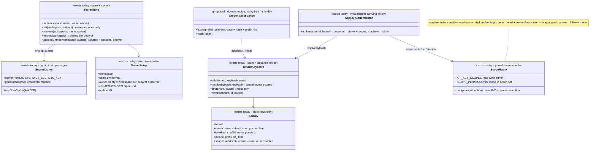

# Secret + API key — collaboration model

> Two-tier secrets and personal API keys — the workspace's credential plane. Companion to
> `../00-target-architecture.md` (§4 `domain/auth` + the credential-issuance recipe, §9).
> Status: PROPOSED — review artifact, no code moves.

## Purpose & language

Two sibling credential families with one hygiene discipline:

- **Secret** — a named value (env-format name) the platform *injects on the tenant's behalf*
  (model/provider keys, integration tokens, registry passwords). **Two tiers**: `workspace`
  scope (`owner=""`, shared, admin-managed) and `user` scope (`owner=subject`, personal,
  self-managed, invisible to everyone else). Values are AES-256-GCM encrypted at rest and
  **never read back** through any API — list returns names+scopes only; only the injection
  paths (`entries`/`scopedEntries`) decrypt.
- **API key** — an `ak_` bearer credential that *acts as its issuer*. Personal keys
  (`owner=subject`) resolve to the issuer's identity and are upgraded to the issuer's
  **membership role** per request; **per-key scopes** (`read|write|admin`) further narrow the
  role by **intersection** — a key can never exceed its issuer's role. Machine keys
  (`owner=""`, internal issuance) are the legacy workspace-admin credential.

Language rules worth pinning:
- *plaintext once* — token plaintext exists only in the issuance response; only the SHA-256
  hash is stored (`hashKey`); the `prefix` (first 12 chars) is a list-identification hint.
- *name-ref* — integrations store secret *names*, never values (see `integrations.md`);
  resolution happens at use time.
- *scope intersection* — `can() = roleOk ∧ (no scopes ∨ ∃scope granting the action)`;
  unset scopes = unrestricted-within-role (legacy/Full-Access).
- *scoped resolve* — `scopedEntries(workspace, subject)` = shared tier + that subject's
  personal tier; personal wins on merge where callers overlay (`{...workspace, ...user}`).

## Aggregates & policies



Target placement (00 §4): `ScopeMatrix` (`authz.ts`) moves verbatim to `domain/auth`; the
**issuance recipe** (`generateKey`/`issueKey`/`hashKey` + the `inv_`/`ak_`/`rnr_` triplets)
becomes ONE parameterized `domain` credential recipe (shared with member/runner — see member.md
Rules); `SecretCipher` moves to `infrastructure/persistence-pg` (crypto is an at-rest concern);
`TenantKeyStore`/`SecretStore` port *definitions* repatriate to `application/control` (today auth
consumes ports owned by db — the inverted edge named in the data-infra survey §3 smell 1).

## Lifecycle

```mermaid
stateDiagram-v2
    state "API key" as K {
        [*] --> active : issueKey (plaintext returned once, hash+prefix+scopes stored)
        active --> revoked : DELETE /keys/:id (self-only; others' keys = silent no-op, no existence leak)
        revoked --> [*]
    }
    state "Secret" as S {
        [*] --> present : PUT /secrets/:name (value encrypted, never returned again)
        present --> present : overwrite (same name+scope upsert)
        present --> removed : DELETE /secrets/:name?scope=
        removed --> [*]
    }
```

No expiry on either today (open question 1).

## Key collaborations

### Scoped personal key → the issuer's membership role (the mandated sequence)

```mermaid
sequenceDiagram
    participant C as caller (MCP agent / CI script)
    participant A as apiKeyAuthenticator
    participant KS as TenantKeyStore
    participant AW as applyActiveWorkspace (route-context)
    participant WS as WorkspaceStore
    participant Z as authz.can()

    C->>A: Bearer ak_… (key issued by alice with scopes ["write"])
    A->>KS: resolveByHash(sha256(bearer))
    KS-->>A: {tenant, owner: "alice", scopes: ["write"]}
    A-->>AW: Principal{subject: alice, workspace, roles: ["viewer"], scopes, via: "api-key"}
    Note over A: personal key starts as VIEWER — no privilege before membership is consulted
    AW->>WS: roleFor(workspace, alice)
    WS-->>AW: "member"
    AW-->>Z: Principal{roles: ["member"], scopes: ["write"]}
    Note over AW: membership role wins; a non-member issuer stays viewer (no escalation)
    C->>Z: can(principal, "datasets:write")?
    Z->>Z: member grants datasets:write ✓ AND "write" scope grants it ✓ → allow
    C->>Z: can(principal, "secrets:write")?
    Z->>Z: member lacks it ✗ → deny (role first — scope can only narrow, never widen)
```

### Secret write + injection resolve (two tiers)

```mermaid
sequenceDiagram
    participant T as route / tool
    participant ST as SecretStore
    participant UC as consumer (executeCase / judge / integration)

    T->>T: PUT /secrets/OPENAI_API_KEY {scope: "workspace"} → gate(secrets:write) admin
    T->>ST: set(workspace, name, value, owner="")
    T->>T: PUT /secrets/HF_TOKEN {scope: "user"} → self-serve, no gate
    T->>ST: set(workspace, name, value, owner=subject)
    Note over ST: value AES-GCM encrypted; 204, never echoed
    UC->>ST: scopedEntries(workspace, submitter)
    ST-->>UC: {workspace: {...shared}, user: {...submitter's}}
    Note over UC: harness env {secretRef} resolves personal-first overlay; judge/model keys use the shared tier; GET /secrets returns names only (workspace names admin-gated)
```

## Inbound use-cases

From the apps-api survey catalog (§1.10, #98–102):

| # | Operation | Transport | Implementation | Notes |
|---|---|---|---|---|
| 98 | List secrets | `GET /secrets` · `list_secrets` | `SecretStore.list` direct (sanctioned trivial CRUD) | names+scopes only; workspace names filtered unless `can(secrets:read)`; user tier always self-only |
| 99 | Set secret | `PUT /secrets/:name` · `set_secret` | `SecretStore.set` | name must match `^[A-Z_][A-Z0-9_]*$`; workspace scope gated `secrets:write`, user scope self-serve; 204, value never read back |
| 100 | Delete secret | `DELETE /secrets/:name?scope=` · `delete_secret` | `SecretStore.remove` | same gate split by scope |
| 101 | List / Create / Revoke API keys | `GET/POST /keys` · `DELETE /keys/:id` · `list/create/revoke_api_key` | `issueKey` + `TenantKeyStore` direct | self-serve, no role gate; scopes default `["admin"]` (Full Access); owner=subject; revoke is self-only silent no-op otherwise |
| 102 | Issue machine tenant key | `[I] POST /internal/tenant-keys` | `issueKey(store, workspace)` (no owner/scopes) | x-internal-token; legacy workspace-admin credential |
| — | Injection resolve | every dispatch/judge/integration | `secretsFor` / `scopedSecretsFor` closures (`main.ts:560,770`) | see Outbound ports |

## Outbound ports

| Port | Today | Target owner |
|---|---|---|
| `SecretStore` (2-tier set/list/remove/entries/scopedEntries) | interface in `@everdict/db` (`packages/db/src/workspace/secret-store.ts`) | `application/control` port; Pg impl + cipher in `persistence-pg` |
| `TenantKeyStore` (add/resolveByHash/list/revoke) | interface in `@everdict/db` (`packages/db/src/workspace/tenant-auth.ts:28-34`), **consumed by `@everdict/auth`** (inverted ownership) | port owned by `application` (auth's credential-resolution seam); db implements |
| `SecretCipher` (`aesGcmCipher`/`cipherFromEnv`/`generatedCipher`) | `packages/db/src/workspace/secret-cipher.ts` — KEK from `EVERDICT_SECRETS_KEY`, ephemeral fallback for dev | `infrastructure/persistence-pg`; KMS/Vault swap point |
| `secretsFor(tenant)` (shared tier) / `scopedSecretsFor(tenant, subject)` | lambda closures in `apps/api/src/main.ts:560,770`; personal-first merge for HF at `:429-432` | typed `SecretResolution` port in the `application/control` port bag |
| Consumers of the resolve ports | run/scorecard dispatch (harness env `{secretRef}`), judge model keys, trace collect `authSecret`, GitHub App PEM, Mattermost tokens, trace-sink auth, registry pull/push, HF_TOKEN | unchanged — all stay name-ref consumers |

## Rules: today → target

| Rule | Today (evidence) | Target |
|---|---|---|
| Token hygiene recipe (hash-only, `ak_` prefix hint, plaintext once) | `generateKey`/`issueKey`/`hashKey` in `packages/db/src/workspace/tenant-auth.ts:153-177` — one of THREE parallel copies (`inv_` invites, `rnr_` runner tokens; member.md Rules) | ONE `domain` credential-issuance recipe parameterized by prefix, over a hash contract in `contracts` |
| Scope intersection (`can`) | `packages/auth/src/authz.ts:126-172` — `API_KEY_SCOPES`, `SCOPE_READ_ACTIONS` (excludes secrets/keys/settings reads), `SCOPE_WRITE_ACTIONS` (adds content mutation + `images:push`), `admin` = role-matrix union; `can` = role ∧ scope | moves verbatim to `domain/auth` — already pure; the matrix is the SSOT the wire's `allowedActions` will be computed from |
| Personal key = issuer identity, membership role wins | `packages/auth/src/api-key.ts:14-26` (viewer default) + `apps/api/src/api/route-context.ts:202-238` (`applyActiveWorkspace` role promotion; machine-key bootstrap uses the token role) | credential→initial-role mapping is policy embedded in the adapter (data-infra survey auth smell 4) — extract ONE credential-policy table to `domain/auth`; the membership-resolution decorator lands with member.md open question 2 |
| Scope default at issuance = `["admin"]` (Full Access) | `apps/api/src/api/api-key/api-key.routes.ts:33` — deliberately the *caller's* decision; `issueKey` stores unset = unrestricted (`tenant-auth.ts:163`) | keep the boundary-owns-default split, but declare it in the use-case (`CreateApiKey` command default), not the route |
| Workspace secret names are admin-visible only | route-side filter `apps/api/src/api/secret/secret.routes.ts:20` (`can(secrets:read)` else user-tier only) — visibility logic in the transport (survey §4 leak list) | move the visibility filter into the use-case; route returns the served list |
| Scope-dependent write gate | `secret.routes.ts:43,60` — `gate(secrets:write)` only for workspace scope; user scope self-serve | use-case guard keyed by scope; same behavior |
| Secret name = env format | `SecretNameSchema` (`^[A-Z_][A-Z0-9_]*$`), `apps/api/src/api/secret/request/secret-name.js` | `contracts` schema (the name IS an env-injection contract) |
| Values never read back | store interface shape: `list` has no values; only `entries`/`scopedEntries` decrypt (`secret-store.ts:6,27-28`) | pinned as an interface-shape invariant in the port definition + contract tests |
| Machine key (owner="") = admin | `api-key.ts:23` + internal issuance route | mark legacy; target decides deprecation (open question 4) |
| Crypto lives in "db" | `secret-cipher.ts` in the persistence package (data-infra §1 smell 6: "db" hosts crypto+token formats) | cipher → `infrastructure`; issuance recipe → `domain`; the package rename fixes the undersell |

## Invariants

| Invariant | Owner | Pinned how |
|---|---|---|
| Plaintext tokens/values are never stored or listed (hash / ciphertext at rest) | **store discipline** — hash-only + AES-GCM columns; list queries select neither | code-review rule + tests asserting list/meta shapes |
| A secret value never leaves through any read API | **port shape** — no read-back method exists | contract test: set → list shows name only |
| A scoped key never exceeds its issuer's role | **domain** — `can` intersection (role checked first) | authz unit tests per scope×role |
| A personal key acts as its issuer (membership role, not blanket admin) | **application** — viewer default + `applyActiveWorkspace` promotion | auth-suite tests incl. non-member issuer stays viewer |
| User-tier secrets are invisible to other subjects (list AND resolve) | **store** — owner scoping in `list`/`scopedEntries` | contract test with two subjects |
| Workspace-tier writes are admin-only; user-tier is self-serve | **use-case guard** (today route) | route tests pin 403 |
| Key revocation is self-only and leaks no existence | **store** — `revoke(tenant, id, owner)` no-op mismatch, always 204 | route test |
| Missing KEK never silently persists plaintext | **infrastructure** — `cipherFromEnv` → `generatedCipher` fallback (ephemeral); Pg production requires the env key | boot contract + deploy rule |

## Open questions

1. Key/secret expiry and rotation: nothing expires today (`inv_` invites do). Add optional
   `expiresAt` to API keys + a rotation flow, or pin "revoke-and-reissue" as the model?
2. Last-used telemetry on keys (Linear shows it) — needs a write on the auth hot path; worth it?
3. Should `scopedEntries`'s personal-first overlay become an explicit, documented precedence
   rule in `domain` (it is currently a caller convention — HF merge at `main.ts:429` vs harness
   env resolution)?
4. Machine keys (`owner=""` → admin) exist for internal/bootstrap issuance. Deprecate in favor
   of scoped personal keys + the `ci` federation role, or keep as the operator escape hatch?
5. Per-key workspace pinning: a personal key is bound to the issuing workspace today
   (`tenant` column) — should a key optionally follow the issuer across workspaces
   (header-switch like OIDC), or is single-workspace binding a security feature to pin?
