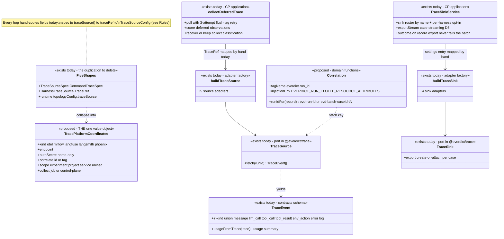
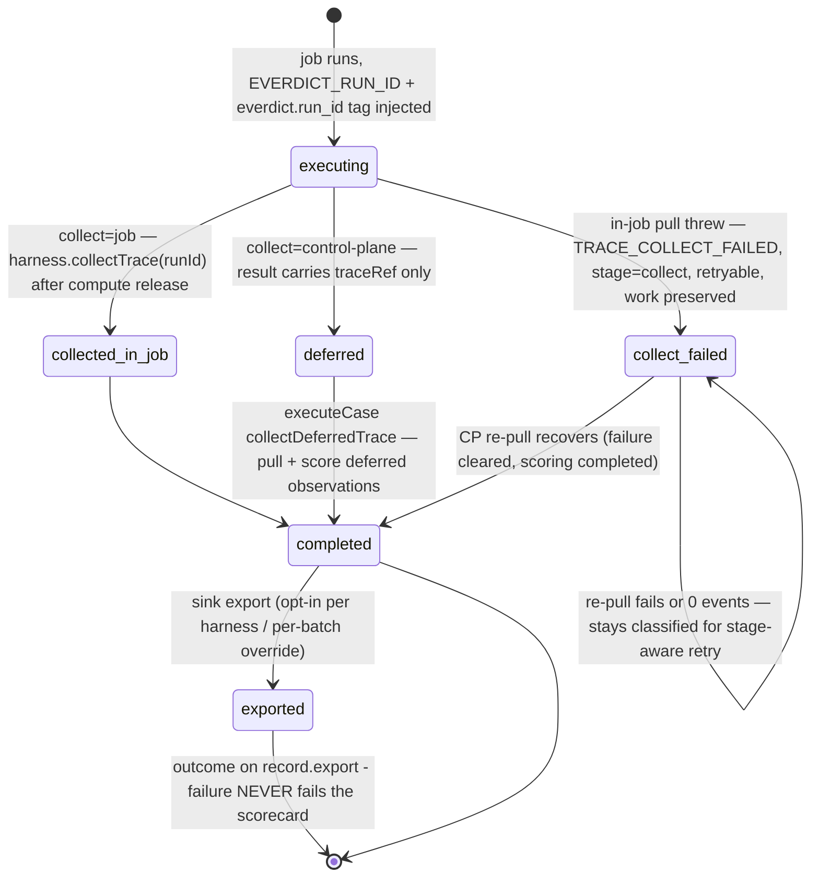

# Trace — collaboration model

> Normalized trace events, platform coordinates, correlation, sources (pull) and sinks (export).
> Companion to `../00-target-architecture.md` (§4 `domain/trace`, §9). Status: PROPOSED — review
> artifact, no code moves.

## Purpose & language

The trace domain owns three things: (1) the **normalized `TraceEvent`** vocabulary (7-kind union in
contracts) every harness's native output is mapped into; (2) **platform coordinates** — where a
trace lives on the tenant's observability platform (kind/endpoint/auth/correlation/scope) — today
smeared across **~5 near-duplicate shapes** with hand-written field copying at every hop; and (3)
**correlation** — the control-plane-minted run id (`evd-run-<id>` / `evd-<batch>-<caseId>[-t<n>]`)
that ties a run record to its platform trace with zero coordination. Sources (5 kinds: otel,
mlflow, langfuse, langsmith, phoenix) pull traces in; sinks (4 kinds: mlflow, langfuse, langsmith,
phoenix) export judged results out. The target replaces the shape smear with **ONE
`TracePlatformCoordinates` value object** in `domain/trace`, with sources/sinks as
`infrastructure/trace-adapters`.

Language rules worth pinning:
- *correlation runId* — minted BY THE CONTROL PLANE at dispatch, derivable from the record alone;
  injected into the job as `EVERDICT_RUN_ID` and `OTEL_RESOURCE_ATTRIBUTES=everdict.run_id=<runId>`.
- *correlate mode* — `id` (the runId IS the platform trace id, pull-ingest convention) vs `tag`
  (search the `everdict.run_id` tag the instrumented agent left; mlflow requires `experiment`,
  otel requires `service` as the Jaeger search scope).
- *collect mode* — `job` (default: pull in-job after compute release) vs `control-plane` (defer:
  the job carries only `CaseResult.traceRef`; `executeCase` completes it).
- *name-only auth discipline* — specs and `traceRef` carry the SecretStore **name**
  (`authSecret`); the value is resolved at use time and never persisted; the header name is owned
  by the adapter per platform convention (otel/mlflow/langfuse/phoenix: verbatim `Authorization`;
  langsmith: `x-api-key`).
- *attach mode* — when a pull-ingest's source kind matches the export sink's platform, scores
  attach to the ORIGINAL traces instead of duplicating them.

## Aggregates & policies



Target placement (00 §4): coordinates + correlation semantics → `domain/trace`; the 5 source + 4
sink adapters → `infrastructure/trace-adapters`; `collectDeferredTrace` → `application/execution`
(the collect phase); `TraceSinkService` → `application/control`; the usage proxy (metering) is a
billing concern that happens to live in `packages/trace` today (see `billing.md`).

## Lifecycle

Not a state machine — but the **two-phase collection contract** is the domain's temporal shape:



## Key collaborations

### Two-phase collection (command harness, collect="control-plane")

```mermaid
sequenceDiagram
    participant CP as control plane (executeCase)
    participant AG as agent (runCase)
    participant H as CommandHarness
    participant P as tenant platform (mlflow/otel/…)
    participant SS as SecretStore

    CP->>AG: AgentJob{runId: evd-…} — minted, derivable from the record
    AG->>H: run(compute, task, {runId})
    H->>H: env += EVERDICT_RUN_ID + OTEL_RESOURCE_ATTRIBUTES=everdict.run_id=<runId>
    H->>P: the agent-under-test exports its own trace (tenant instrumentation)
    AG->>AG: release compute; source = harness.traceSource() — spec → HarnessTraceSource (hand-copy hop 1)
    AG-->>CP: CaseResult{traceRef} — HarnessTraceSource → TraceRef (hand-copy hop 2), authSecret NAME only
    CP->>SS: secretsFor(tenant)[traceRef.authSecret] → verbatim Authorization value
    CP->>P: buildTraceSource(TraceRef → TraceSourceConfig — hand-copy hop 3).fetch(runId)
    Note over CP,P: 3 attempts × 2s — flush-latency absorption; experiment ?? project → project convergence
    CP->>CP: score deferred observation graders (needsCompute=false); inline judge → visible skip
    CP-->>CP: complete CaseResult — judge stream and costOf see the collected trace
    Note over CP: pull failure / 0-event recovery keeps {collect, infra, retryable} — stage-aware retry re-pulls, never re-runs the agent
```

### Sink export with attach mode (D5 case-streaming)

```mermaid
sequenceDiagram
    participant B as ScorecardBatchService
    participant J as JudgeStream (ScoringService)
    participant X as TraceSinkService.exportStream
    participant K as buildTraceSink adapter
    participant P as team platform (mlflow/…)

    B->>J: push(result) — the moment a case settles
    J-->>B: judged (per-case promise)
    B->>X: push(judged result) — chained on the judge promise, no batch barrier
    X->>K: sink = buildTraceSink(settings entry → TraceSinkConfig; authSecretName → value)
    alt pull-ingest whose source kind == sink platform
        K->>P: ATTACH scores to the original trace (no duplicate)
    else normal batch case
        K->>P: CREATE trace + scores (+ MLflow best-effort OTLP spans)
    end
    K-->>X: per-case external id / link
    X->>B: outcome aggregated onto record.export (status/link/ids, mig 0048)
    Note over X,B: export failure degrades the export outcome only — the scorecard result is untouched
```

## Inbound use-cases

The trace domain has no resource of its own today — it serves other domains' use-cases (survey refs):

| Survey # | Operation | Transport | Trace-domain role |
|---|---|---|---|
| 2 | Get run (live trace deep-link) | `GET /runs/:id` | derive `LiveTraceRef` from harness spec coordinates + runId (yet another mini-shape — see Rules) |
| 12 | Submit batch (`traceSink` override) | `POST /scorecards` | validate sink name (`sinkExists`); "none" suppresses export |
| 16/17 | Push / pull ingest | `POST /scorecards/ingest(/pull)` | `buildTraceSource` per-runId pull; authSecret → verbatim header |
| 43 | Assign trace sink to harness | `PUT /harnesses/:id/trace-sink` · `assign_harness_trace_sink` | per-harness opt-in selection (no selection = no export) |
| 112 | List/Upsert/Remove workspace trace sinks | `GET+PUT /workspace/trace-sinks` · `DELETE …/:name` | named sink roster in WorkspaceSettings; remove cleans dangling harness assignments |
| 113 | Export scorecard to sink | boot/async | `exportStream`/`exportScorecard` after judging |
| — | Deferred collect / collect recovery | inside `executeCase` | `collectDeferredTrace` (also the stage-aware-retry collect stage) |
| — | Usage metering proxy | inside `CommandHarness` | `startUsageProxy` — a billing concern hosted in this package (see `billing.md`) |

## Outbound ports

| Port | Why needed | Today's adapter |
|---|---|---|
| `TraceSource.fetch(runId)` | pull a normalized trace by correlation key | 5 adapters in `packages/trace/src/sources/` (otel Jaeger query, mlflow 3.x `/api/3.0/.../traces`, langfuse, langsmith, phoenix) |
| `TraceSink` (create-or-attach export) | export judged detail to the team platform | 4 adapters in `packages/trace/src/sinks/` (+ MLflow best-effort OTLP spans) |
| `secretsFor(tenant)` | resolve `authSecret`/`authSecretName` names to header values | lambda over `SecretStore` |
| `sleep` | flush-latency retry backoff | injected timer |
| `WorkspaceSettingsStore` | sink roster + per-harness selection persistence | `@everdict/db` (jsonb bag) |
| `fetchImpl` | all platform HTTP | global fetch, test-injectable |

## Rules: today → target

| Rule | Today (evidence) | Target |
|---|---|---|
| **Platform trace coordinates — the ~5-shape smear** | ① `TraceSourceSpecSchema` `packages/core/src/harness/harness-spec.ts:4-8` (otel\|mlflow, kind+endpoint — the service-harness `traceSource` field `:208`); ② `CommandTraceSpecSchema` `harness-spec.ts:225-255` (none + 5 kinds, endpoint/authSecret/collect/correlate/experiment/project/service); ③ `HarnessTraceSource` `packages/core/src/harness/harness.ts:17-26` (5 kinds + collect + authSecret + correlate/experiment/project/service); ④ `TraceRefSchema` `packages/core/src/execution/eval-case.ts:53-65` (same fields + runId); ⑤ `topologyConfig.traceSource` `packages/core/src/infra/runtime-spec.ts:41-44` (otel\|mlflow kind+endpoint on nomad/k8s runtimes) | ONE `TracePlatformCoordinates` value object in `domain/trace`; the five schemas become views/refinements of it (spec-side adds `collect`, result-side adds `runId`) |
| Extended smear — adapter/settings shapes | ⑥ `TraceSourceConfig` `packages/trace/src/sources/build-source.ts:8-19` (headers/auth split, `project` doubles as mlflow experiment); ⑦ `TraceSinkConfig` `packages/trace/src/sinks/trace-sink.ts:51-58`; ⑧ workspace sink roster entry `packages/db/src/workspace/workspace-settings.ts:78-89` (authSecretName/project/webUrl); ⑨ `LiveTraceRef` `apps/api/src/core/run/run-service.ts:22-27` | ⑥/⑦ become the adapters' ctor params derived FROM the value object; ⑧ persists the value object + name; ⑨ becomes a served wire field |
| Hand-copied field routing at every hop | hop 1: `CommandHarness.traceSource()` `packages/harnesses/src/command.ts:72-86` (spec→③; mlflow `experiment` vs phoenix `project` routed by kind); hop 2: `runCase` traceRef assembly `packages/run-case/src/run-case.ts:135-146` (③→④); hop 3: `collectDeferredTrace` `apps/api/src/core/execution/collect-trace.ts:70-80` (④→⑥; `experiment ?? project → project` convergence comment); hop 4: `RunService.withLiveTrace` `run-service.ts:155-172` (spec→⑨) | hops disappear — one object flows through; per-kind scope naming (`experiment`/`project`/`service`) is normalized once at the domain boundary |
| Correlation id mint + derivation | format strings in 5 sites: `run-service.ts:170,203,288`, `scorecard-batch-service.ts:447,905`; the contract exists only as a comment `packages/core/src/execution/agent-job.ts:63` | `domain/trace` `runIdFor(record)` + `caseRunIdFor(batchId, caseId, trial?)`; all minters/derivers call it |
| Correlation injection env | `packages/harnesses/src/command.ts:132-133` (`EVERDICT_RUN_ID`, `OTEL_RESOURCE_ATTRIBUTES=everdict.run_id=…`) — the tag name `everdict.run_id` also appears in each source adapter's search logic and in spec comments | tag + env names become `domain/trace` constants consumed by harness adapter and source adapters |
| Auth header conventions per platform | adapter-owned, stated in three comment blocks: `build-source.ts:12-13`, `trace-sink.ts:49-50`, `collect-trace.ts:61` (+ pull-ingest route docs) — consistent but only by convention | the value object carries `authSecret` (name); each adapter declares its header materialization; a contract test pins the per-kind header |
| Collect failure classification (`TRACE_COLLECT_FAILED`, stage=collect, retryable, work preserved) | 2 implementations: job-side `run-case.ts:101-115` and CP-side `collect-trace.ts:106-118` — deliberately symmetric ("both collection modes fail identically"), maintained by hand | one `domain/failure` classification + one shared "keep the work, defer observation scoring" policy in `application/execution` |
| Deferred-observation scoring parity (needsCompute=false only; inline judge → visible skip) | agent rule in `run-case.ts:117-123` mirrored CP-side in `collect-trace.ts:120-142` (`skipScore` is yet another skip-constructor copy — see `judge.md`) | one scoring-composition function in `application/execution` used by both phases |
| CommandHarness value-drags the whole trace package into the agent image | `packages/harnesses/src/command.ts` value-imports `buildTraceSource` + `startUsageProxy` → agent image carries all 5 sources + 4 sinks + the metering HTTP proxy (engine survey §4 smell 1, §7 smell 6) | sources split from sinks in `infrastructure/trace-adapters`; the agent cone imports only the source side it needs; the usage proxy moves with billing |
| Trace normalization (native → `TraceEvent`) | `mapClaudeStreamJson` `packages/harnesses/src/map-claude-stream-json.ts` (pure, well-isolated); trace:none stdout/stderr fallback in `CommandHarness` | stays a pure domain mapper (anti-corruption layer) under `domain/trace` or with the harness adapter — decide in review |

## Invariants

| Invariant | Owner | Pinned how |
|---|---|---|
| The correlation runId is minted by the control plane and derivable from the record alone | **application** (mint) + **domain target** (`runIdFor`) | live-observability e2e; target: pure-function unit tests |
| Secret VALUES never ride specs, `traceRef`, or persisted results — names only | **contracts** — schema comments + shapes; **application** — resolution at use time only | store tests assert persisted shapes carry no values |
| Collect failure preserves execution work (compute-bound scores + snapshot kept; observation scoring deferred, never against an incomplete trace) | **application** — both collect phases | `run-case` + `collect-trace` tests; live stage-aware-retry scenario |
| A recovered collect sheds its `{collect}` classification; an unrecovered one keeps it retryable | **application** — `collect-trace.ts:144-149` | recovery tests |
| 0 events after retry is SOFT for defer-mode but never recovers a failed case | **application** — `collect-trace.ts:52-58,108` | tests pin the asymmetry |
| Export failure never fails the scorecard (outcome degrades to `record.export` only) | **application** — `TraceSinkService` | trace-sink tests + live MLflow e2e |
| Attach mode fires only when pull-source kind == sink platform | **application** — ingest/export matching | trace-sink tests |
| No sink selection = no export (per-harness opt-in); per-batch `traceSink:"none"` suppresses | **application** — assignment + submit validation | scorecard submit tests |
| Every source adapter returns normalized `TraceEvent[]` validated at the boundary | **contracts** — `TraceEventSchema`; adapters parse | per-adapter tests + live e2e (mlflow 3.11/3.14, phoenix, otel/Jaeger) |
| Tag correlation requires its scope (mlflow: experiment; otel: service) | **contracts today** — spec schema comments/refinements | boundary validation tests |

## Open questions

1. Shape ⑤ (`topologyConfig.traceSource`) is 2-kind (otel|mlflow) while the rest are 5-kind. Is
   that a real capability restriction of topology runtimes, or historical accident to fix during
   the collapse?
2. The unified value object needs a per-kind scope story: today `project` means "phoenix project
   OR mlflow experiment id" in ⑥ but they are separate fields in ③/④. One `scope` field with
   per-kind meaning, or keep discriminated per-kind coordinate variants?
3. Where does `mapClaudeStreamJson` (and future native-format mappers) live — `domain/trace`
   (normalization is a domain rule) or beside each harness adapter in `infrastructure/compute`?
4. `LiveTraceRef` derivation reads the harness spec on every `GET /runs/:id`. Should coordinates
   be denormalized onto the record at dispatch (they are immutable per run) instead of re-resolved?
5. Does the sink roster entry adopt the value object verbatim (breaking the settings jsonb shape —
   needs a migration) or map at the settings boundary?
