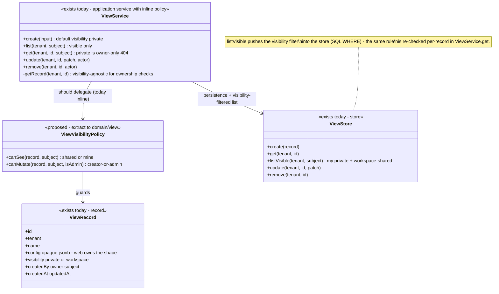
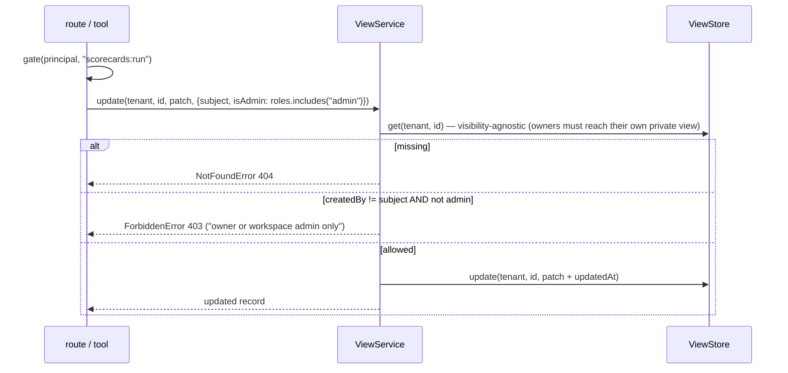

# View — collaboration model

> Saved scorecard-analysis lenses. Companion to `../00-target-architecture.md` (§4, §9). Design
> SSOT today: `docs/architecture/scorecard-analysis-views.md`. Status: PROPOSED — review
> artifact, no code moves.

## Purpose & language

A **View** is a *saved question*, not saved data: a named, workspace-scoped record holding an
opaque `AnalysisConfig` (the web's 4-lens analysis dashboard state — pivot axes, filters,
lens choice). Opening a view **re-runs the analysis live** over the current `listScorecards`
data — a view never snapshots results, so it can never go stale (and never "protects" a number
from later runs). Visibility is two-valued: `private` (owner-only; invisible to everyone else —
404, no existence leak) or `workspace` (any member sees it). Mutation is **creator-or-admin**.
AuthZ deliberately **reuses the scorecard actions** (`scorecards:read` to view, `scorecards:run`
to create/edit/delete) — a view is a lens over scorecards, so no new action was minted.

Language rules worth pinning:
- *live re-run* — the config is the persisted artifact; the numbers are recomputed on open.
- *opaque config* — the control plane stores `config` as unvalidated jsonb; the web owns the
  shape (deliberate: lens evolution must not require API migrations).
- *creator-or-admin* — the same creator-override pattern as comment delete / schedule edit /
  version delete; never in the role matrix.

## Aggregates & policies



Target placement (00 §4): the visibility + creator-override predicates move to
`@everdict/domain` `view/` (or a shared `ResourceOwnershipPolicy` — see comment.md open
question 4); `ViewService` becomes an `application/control` use-case; `config` opacity is kept
as a declared contract (`contracts/wire` types it `unknown`).

## Lifecycle

No state machine. A view is a mutable named record: `created (visibility defaults private)` →
`renamed / re-configured / re-shared (visibility flips both ways)` → `deleted (hard)`. The
interesting semantics live in reads (visibility) and in the fact that the *analysis result*
has no lifecycle at all — it is recomputed per open.

## Key collaborations

### Open a saved view (live re-run — the defining behavior)

```mermaid
sequenceDiagram
    participant W as web analyze page
    participant T as HTTP route / MCP tool
    participant S as ViewService
    participant ST as ViewStore
    participant SC as ScorecardAnalyticsService / listScorecards

    W->>T: GET /views/:id
    T->>T: gate(principal, "scorecards:read") — reused action, no views:* in the matrix
    T->>S: get(tenant, id, subject)
    S->>ST: get(tenant, id)
    alt missing OR (private AND createdBy != subject)
        S-->>T: NotFoundError 404 (no existence leak)
    else visible
        S-->>T: ViewRecord (config verbatim)
    end
    T-->>W: record — target: ViewResponse.from(record) (contracts/wire)
    W->>T: GET /scorecards?… (driven by config — the live re-run)
    T->>SC: list/diff/leaderboard per the lens
    Note over W,SC: the view carries the QUESTION; the data is always current — no snapshot to invalidate
```

### Edit with creator-override



## Inbound use-cases

From the apps-api survey catalog (§1.15, #126):

| # | Operation | Transport | Implementation | Gate | Notes |
|---|---|---|---|---|---|
| 126a | Create view | `POST /views` · `create_view` | `ViewService.create` | `scorecards:run` | visibility defaults `private` |
| 126b | List visible views | `GET /views` · `list_views` | `list` → `store.listVisible` | `scorecards:read` | shared + my private only |
| 126c | Get view | `GET /views/:id` · `get_view` | `get` | `scorecards:read` | private → owner-only, else 404 |
| 126d | Update view | `PATCH /views/:id` · `update_view` | `update` | `scorecards:run` | creator-or-admin in the service |
| 126e | Delete view | `DELETE /views/:id` · `delete_view` | `remove` | `scorecards:run` | creator-or-admin in the service |

Web consumer: `features/analyze-scorecards` + `SavedViewsBar` (save/open/share lenses).
Views are also a comment target (`resourceType: "view"` — see `comment.md`).

## Outbound ports

| Port | Today | Target owner |
|---|---|---|
| `ViewStore` (create/get/listVisible/update/remove) | `@everdict/db` (`packages/db/src/results/view-store.ts`, mig 0038) | `application/control` port; Pg impl in `persistence-pg` |
| id / clock | ctor defaults in `ViewService` | `clock/id` port |

(No other ports — the live re-run happens client-side today: the web fires the scorecard
queries the config describes. The control plane never executes a view.)

## Rules: today → target

| Rule | Today (evidence) | Target |
|---|---|---|
| Private views are invisible (404, no existence leak) | `apps/api/src/core/view/view-service.ts:57-62` (`get`), duplicated as a SQL filter in `ViewStore.listVisible` (`packages/db/src/results/view-store.ts:27,44,119`) | predicate declared once in `domain/view` (`canSee`); the store keeps the SQL filter as the list-shape implementation, pinned by a shared contract test |
| Creator-or-admin edit/delete | `view-service.ts:71-76,84-89`; route derives `isAdmin: principal.roles.includes("admin")` (`apps/api/src/api/view/view.routes.ts:88,108`) — deliberately NOT in the role matrix | `domain/view` `canMutate` (candidate shared `ResourceOwnershipPolicy`) |
| AuthZ reuses scorecard actions — no `views:*` action | routes gate `scorecards:read` (list/get, `view.routes.ts:46,58`) and `scorecards:run` (create/update/delete, `:16,74,101`); **but** the 403 payloads name pseudo-actions `views:edit`/`views:delete` that exist nowhere in the matrix (`view-service.ts:74,87`) | keep the reuse (a view = a scorecard lens); fix the error metadata to name the real reused action, or mint `views:*` — decide in review (drift hazard: a client switching on `data.action` sees an action the matrix cannot grant) |
| Opaque config (no server-side shape) | `config: unknown` in service input; `ViewRecordSchema` types it as passthrough jsonb; web owns `AnalysisConfig` | pinned as a deliberate contract in `contracts/wire` (`config: unknown`); an optional versioned envelope (`{v, lens, …}`) is an open question |
| Live re-run (no snapshot) | by construction — no result fields on the record; the web re-queries on open | document as a domain semantic ("a View stores a question"); if server-computed analysis lands (open Q4), the use-case executes the config and the invariant becomes "never persist the answer" |
| Visibility defaults private | `view-service.ts:42` (`?? "private"`) | `domain/view` factory default |
| Tenant scoping in service (not route) | `ViewService` takes `tenant` and the store scopes every query — one of the *service-side* tenancy examples (survey §4 notes run/scorecard check in routes instead) | unchanged; becomes uniform once tenancy moves into the use-case context (survey cross-cutting smell 2) |

## Invariants

| Invariant | Owner | Pinned how |
|---|---|---|
| A private view is readable only by its creator; others get 404 (never 403 — no existence leak) | **domain** — visibility predicate (today in `ViewService.get` + store filter) | route tests pin 404 for non-owner; contract test on `listVisible` |
| Only the creator or an admin mutates/deletes | **domain** — creator-override policy | service tests pin the 403 message |
| The list surface never returns another subject's private views | **store** — `listVisible` WHERE clause | contract test, InMemory double must match |
| A view never stores analysis results — config only | **contracts** — record shape has no result fields | schema review; wire DTO carries no data fields |
| Opening a view always reflects current scorecard data | **by construction** — client-side re-run | web e2e; becomes a use-case test if execution moves server-side |
| No new authz action: view access ≡ scorecard access | **interface** — route gates reuse `scorecards:*` | route tests pin gate actions |
| Views are workspace-scoped; cross-tenant id is 404 | **store** — tenant in every WHERE | route tests |

## Open questions

1. The 403 metadata names pseudo-actions (`views:edit`/`views:delete`) that the matrix does not
   contain — clean up to the reused action, or promote real `views:*` actions now that MCP agents
   read error payloads programmatically?
2. Config opacity vs. minimal envelope: should the target at least version the config
   (`{v: 1, …}`) so the web can migrate lenses without guessing shapes?
3. `visibility` is two-valued. Is a third tier ever wanted (e.g. org/`_shared` templates of
   common lenses), or do we pin `private|workspace` as final?
4. Should the *analysis execution* move server-side (the use-case runs the config and returns
   computed lens data as served fields)? That is the path that deletes the web's
   `caseVerdict`-class logic mirrors for the analyze page (00 §5), at the cost of the control
   plane learning the lens vocabulary.
5. Deleting a view leaves its comments dangling (`resourceType: "view"` — comment.md open
   question 1); same answer should govern both.
